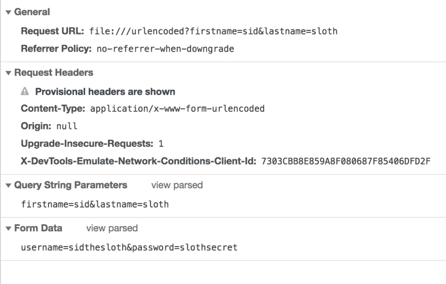
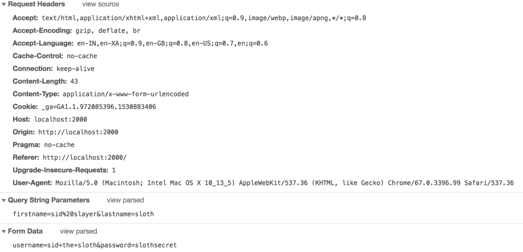
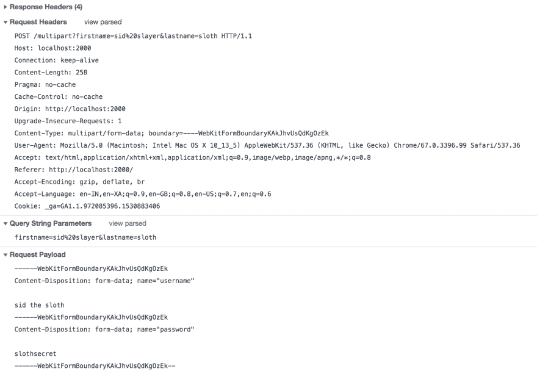

# 了解 HTML 表单编码:URL 编码和多部分表单

> 原文：<https://dev.to/sidthesloth92/understanding-html-form-encoding-url-encoded-and-multipart-forms-3lpa>

前几天我试图在 [Go](https://golang.org/) 中编写一个 REST 端点，它将浏览器中提交的表单内容上传到另一个 REST 端点，换句话说，

`Form in Browser ----> My GO Rest API ----> Another REST API`

在此过程中，我最终学到了 HTML 表单如何工作的一些基础知识。所以我想分享一下我所学到的东西，从而分享这篇文章，这可能是一件好事..:)

表单的编码类型由属性`enctype`决定。它可以有三个值，

*   `application/x-www-form-urlencoded` -表示 URL 编码形式。如果`enctype`属性未设置为任何值，这是默认值。

*   `multipart/form-data` -表示多部分形式。这种类型的表单在用户想要上传文件时使用

*   `text/plain`——html 5 中引入的一种新的表单类型，顾名思义，它只是发送数据而不进行任何编码

现在，让我们通过一个例子来看看每种表单类型，以便更好地理解它们。

# URL 编码形式

顾名思义，使用这种类型的表单提交的数据是 URL 端编码的。采取以下形式，

```
<form action="/urlencoded?firstname=sid&lastname=sloth" method="POST" enctype="application/x-www-form-urlencoded">
    <input type="text" name="username" value="sidthesloth"/>
    <input type="text" name="password" value="slothsecret"/>
    <input type="submit" value="Submit" />
</form> 
```

Enter fullscreen mode Exit fullscreen mode

在这里，您可以看到表单是使用 POST 请求提交给服务器的，这意味着它有一个主体。但是正文是如何格式化的呢？它是 URL 编码的。基本上，创建了一长串`(name, value)`对。每个`(name, value)`对通过一个`& (ampersand)`符号彼此分开，对于每个`(name, value)`对，`name`通过一个`= (equals)`符号与`value`分开，比如说，

`key1=value1&key2=value2`

对于上面的表格，应该是，
`username=sidthesloth&password=slothsecret`

另外，请注意，我们在动作 URL 中传递了一些查询参数，`/urlencoded?firstname=sid&lastname=sloth`。

URL 编码的主体和动作 URL 中传递的查询参数看起来不是非常相似吗？是因为他们相似。它们共享上面讨论的相同格式。

尝试用上面的代码创建一个 HTML 文件，看看它是如何在开发工具中提交的。这是一张快照，

[T2】](https://res.cloudinary.com/practicaldev/image/fetch/s--MuvkO3GC--/c_limit%2Cf_auto%2Cfl_progressive%2Cq_auto%2Cw_880/https://thepracticaldev.s3.amazonaws.com/i/coe8u0vt3iryp70e1rdv.png)

这里要注意的是写着`application/x-www-form-urlencoded`的`Content-Type`头，查询字符串和表单字段以上面讨论的格式传输到服务器。

> **注意:**不要被屏幕截图中的术语“表单数据”所迷惑。这就是 Google Chrome 表示表单域的方式。

一切都很好，但是编码过程还有点复杂。让我们在提交的值中引入一些空格，如下表所示，该表与上一表相同，但将`firstname`值从`sid`更改为`sid slayer`，将`username`值从`sidthesloth`更改为`sid the sloth`。

```
<form action="/urlencoded?firstname=sid slayer&lastname=sloth" method="POST" enctype="application/x-www-form-urlencoded">
    <input type="text" name="username" value="sid the sloth"/>
    <input type="text" name="password" value="slothsecret"/>
    <input type="submit" value="Submit" />
</form> 
```

Enter fullscreen mode Exit fullscreen mode

现在尝试提交表单，看看表单字段是如何在开发工具中转移的。这是 Chrome 中的一个开发工具插件。

[T2】](https://res.cloudinary.com/practicaldev/image/fetch/s--O6YhIZZI--/c_limit%2Cf_auto%2Cfl_progressive%2Cq_auto%2Cw_880/https://thepracticaldev.s3.amazonaws.com/i/kzk72y3ui5r7iwz4g1r6.png)

显然，您可以看到空格被替换为“%20”或“+”。对于查询参数和表单主体都是如此。

看[这个](https://stackoverflow.com/questions/2678551/when-to-encode-space-to-plus-or-20)就明白+和%20 什么时候能用了。这包括 URL 编码过程。

# 多部分形式

多部分表单通常用于用户需要将文件上传到服务器的环境中。然而，我们将只关注简单的基于文本字段的表单，这样就足以理解它们是如何工作的了。

要将上面的表单转换成多部分表单，您所要做的就是将表单标签的属性从`application/x-www-form-urlencoded`更改为`multipart/form-data`。

```
<form action="/multipart?firstname=sid slayer&lastname=sloth" method="POST" enctype="multipart/form-data">
    <input type="text" name="username" value="sid the sloth"/>
    <input type="text" name="password" value="slothsecret"/>
    <input type="submit" value="Submit" />
</form> 
```

Enter fullscreen mode Exit fullscreen mode

让我们继续并提交它，看看它如何出现在开发工具中。

[T2】](https://res.cloudinary.com/practicaldev/image/fetch/s--wt6Q4uEV--/c_limit%2Cf_auto%2Cfl_progressive%2Cq_auto%2Cw_880/https://thepracticaldev.s3.amazonaws.com/i/8bqopft22lv9fhlqr4k2.png)

这里有两件事需要注意，表单请求的`Content-Type`头和有效负载。让我们一个一个地看。

## 内容型表头

`Content-Type`头的值明显是`multipart/form-data`。但它还有另一个价值，`boundary`。在上面的例子中，这个值是由浏览器生成的，但是用户也可以很好地定义它，比如说`boundary=sidtheslothboundary`。我们将在下一节看到它是如何有用的。

## 请求体

请求负载包含表单字段本身。每个`(name, value)`对被转换成以下格式的 MIME 消息部分，

`--<<boundary_value>>`
T1】

`<<field_value>>`

对每个`(name, value)`对重复上述格式。

最后，整个有效载荷由后缀为`--`的`boundary`值终止。所以整个请求看起来像是，

`--<<boundary_value>>`
T1】

`<<field_value>>`
`--<<boundary_value>>`
T2】

`<<field_value>>`
T1】

现在，我们看看边界值是如何使用的。

在使用`application/x-www-form-urlencoded`表单的情况下，`&`号起到了每个`(name, value)`对之间的分隔符的作用，使服务器能够理解参数值开始和结束的时间和位置。

`username=sidthelsloth&password=slothsecret`

在`multipart/form-data`表单的情况下，边界值用于此目的。假设边界值是`XXX`，请求有效负载看起来像这样，

`--XXX`
T1】

`sidthesloth`
`--XXX`
T2】

`slothsecret`
T1】

连字符本身不是边界值的一部分，而是请求格式的一部分。上述请求的`Content-Type`头应该是，

`Content-Type: multipart/form-data; boundary=XXX`

这允许浏览器了解每个字段开始和结束的时间和位置。

# 文本/普通表格

这些表单与 URL 编码的表单非常相似，只是表单字段在发送到服务器时不是 URL 编码的。这些通常不会被广泛使用，但是它们已经作为 HTML 5 规范的一部分被引入。

避免使用它们，因为它们意味着人类的理解，而不是机器。

引用自[规格](https://www.w3.org/TR/html5/sec-forms.html#text-plain-encoding-algorithm)，

> 使用文本/纯文本格式的有效载荷旨在让人可读。它们不能被计算机可靠地解释，因为格式是不明确的(例如，没有办法区分值中的文字换行符和值末尾的换行符)。

霍普，我已经清楚地解释了我所学到的东西..下次再见，伙计们..和平..:)

在我的[网站](https://dineshbalaji.in)上了解更多关于我的信息..✨