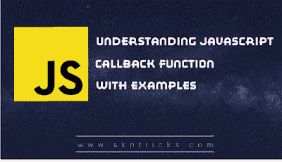

# 理解 Javascript 回调函数

> 原文：<https://dev.to/skptricks/understanding-javascript-callback-function-1m6b>

帖子链接:[了解 Javascript 回调函数](https://www.skptricks.com/2018/11/understanding-javascript-callback-function.html)

本教程解释了 javascript 回调函数的基本实现，以及它在实时场景中的工作。简单地说，你可以说回调是一个函数在另一个函数完成执行后被执行，因此我们称之为“回调”。

理解 Javascript 回调函数

什么是回调函数？当一个函数简单地接受另一个函数作为参数时，这个被包含的函数被称为回调函数。回调函数是一个核心的函数式编程概念，您可以在大多数 JavaScript 代码中找到它们。示例:- setInterval

为什么我们需要复试？回调是一种确保某个代码在其他代码完成执行之前不会执行的方法。
JavaScript 回调函数可以同步使用，也可以异步使用。

让我们看看下面的例子，理解 javascript 的执行流程。
function first(){
console . log(1)；
}
函数 second(){
console . log(2)；
}
first()；
秒()；

[了解 Javascript 回调函数](https://www.skptricks.com/2018/11/understanding-javascript-callback-function.html)

[T2】](https://res.cloudinary.com/practicaldev/image/fetch/s--AsqwEKgi--/c_limit%2Cf_auto%2Cfl_progressive%2Cq_auto%2Cw_880/https://3.bp.blogspot.com/-nOAH00N3evQ/W_BMXldORAI/AAAAAAAACJc/8tx17uHRyBg0U3ZBuKolo-GTIH4fYr_8ACLcBGAs/s400/callback.png)

[阅读更多....](https://www.skptricks.com/2018/11/understanding-javascript-callback-function.html)