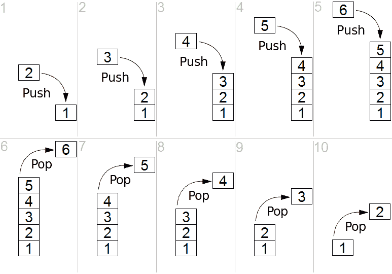
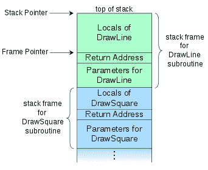

# 理解:程序堆栈和递归

> 原文：<https://dev.to/jcharliegarciam/understanding-program-stack--recursion-2ii>

最近，我在 C++的“高级主题”方面做了很多研究，我对内存管理和优化之类的东西非常感兴趣(我目前正在阅读“算法导论”以提高我的技能)。

在我的研究中，我发现了递归这个话题。我在大学的“数据结构”课上研究了这个主题，但我想深入了解计算机如何处理递归，以及如何用它来代替循环。

在这篇文章中，我将解释我如何理解堆栈在递归中的作用，以及如何在线性代数中应用递归来获得矩阵的行列式。

## 如此...栈是什么？

堆栈是 LIFO 数据结构(后进先出)。它实际上就是你所想象的:当你“推送”数据时，这个数据将进入堆栈，它将位于最后一个被推送的元素之上，在新的“顶部”元素中进行自我转换。每次将数据“推入”堆栈时，都会重复这个过程。

当你想从栈中读取一个元素时，你可以“弹出”栈顶的元素。这就是为什么推入堆栈的最后一个元素是从堆栈中取出的第一个元素。

[](https://res.cloudinary.com/practicaldev/image/fetch/s--c_TlRzE7--/c_limit%2Cf_auto%2Cfl_progressive%2Cq_auto%2Cw_880/https://upload.wikimedia.org/wikipedia/commons/b/b4/Lifo_stack.png) 
[图片来源](https://upload.wikimedia.org/wikipedia/commons/b/b4/Lifo_stack.png)

## 堆栈与递归的关系

嗯，当你运行一个代码(比如说一个 C++代码)时，语言的运行时管理“程序栈”，这个栈是用来存储你的代码中使用的变量和你在代码中调用的不同函数的结构。

(使用“new”操作符创建的动态内存空间存储在“堆”中，这是一种与程序堆栈不同的结构)

用堆栈跟踪函数调用使得传递参数、返回值，当然还有递归成为可能。

每次在代码中调用函数时，运行时都会将一个“堆栈帧”推入堆栈。堆栈帧是包含子例程信息的信息块。这些信息包括:函数的参数、返回地址和局部变量。

当你使用递归时，每次你的函数调用它自己时，你都在推一个堆栈帧。调用堆栈(或前面提到的“程序堆栈”)在每次程序运行时都有一个有限的大小(大小是在程序执行之前计算的)，这可能会导致一种危险的情况，因为您实际上可能会超过堆栈所能容纳的信息量:这就是著名的“堆栈溢出”。

[](https://res.cloudinary.com/practicaldev/image/fetch/s--UJmGbf2i--/c_limit%2Cf_auto%2Cfl_progressive%2Cq_auto%2Cw_880/https://upload.wikimedia.org/wikipedia/commons/thumb/d/d3/Call_stack_layout.svg/342px-Call_stack_layout.svg.png) 
[图片来源](https://upload.wikimedia.org/wikipedia/commons/thumb/d/d3/Call_stack_layout.svg/342px-Call_stack_layout.svg.png)

但是不要控制自己，运行时不会一直将堆栈帧推送到堆栈。当你使用“Return”参数或者当函数终止执行时，程序将返回到“返回地址”,堆栈帧将弹出堆栈。

这就是为什么有一个递归的基本情况是如此重要。基本情况是函数不会调用自身，而是返回一个特定值给之前的调用。

基本情况向我们保证，在递归的某个点上，函数将开始“回滚”,这将开始从堆栈中弹出递归的堆栈帧。

如果没有基例，肯定会造成堆栈溢出。

## 用递归得到矩阵的行列式。

因此，在下一部分，我将尝试演示如何使用递归来获得矩阵的行列式。(此代码是初稿，因此有改进的空间，请随时对代码提出建议)。

这段代码将使用“标准方法”来求解行列式，如果你不知道它是如何工作的，你可以在这里找到如何做。

现在让我们看看代码:

```
 //We will pass the matrix and the size n of the matrix(nxn)
int determinant(int** matrix, int size){
    if(size == 2){
        /*This one is the base case! 
        This case will return the result for the smallest sub-matrix (2x2)*/
        return (matrix[0][0] * matrix[1][1]) - (matrix[0][1] * matrix[1][0]);
    } else {
        //This bool is used for the additions of determinants of the sub-matrices. 
        //Remember that we will add in a pattern of (+ - + - ...)
        bool isNegativeAddition = false; 
        int determinantResult = 0;

        for(int x = 0; x < size; x++){
            int i = 0;
            //This is a temporary place to store the values for the new matrix
            int *numbersForNewRecursiveCall = new int[(size - 1) * (size - 1)];

            //We fill the temp with the values of the new sub-matrix
            for(int sy = 0; sy < size; sy++){
                for(int sx = 0; sx < size; sx++){
                    if(sy != 0 && sx != x){
                        numbersForNewRecursiveCall[i] = matrix[sy][sx];
                        i++;
                    }
                }
            }

            //Then we fill an Array[][]
            i = 0;
            int **subMatrix = declareArray(size-1);
            for(int sy = 0; sy < size-1; sy++){
                for(int sx = 0; sx < size-1; sx++){
                    subMatrix[sy][sx] = numbersForNewRecursiveCall[i];
                    i++;
                }
            }

            /*This is the important part:
            The if is to determine when we will add or when we will rest 
            the determinants of the sub-matrix
            We will add the value of the previous determinant results with 
            the multiplication of the value that determines the sub-matrix and 
            the determinant of that particular sub-matrix*/
            if(isNegativeAddition == true){
                determinantResult = determinantResult + (matrix[0][x] * determinant(subMatrix, size-1) * -1);
                isNegativeAddition = false;
            } else {
                determinantResult = determinantResult + (matrix[0][x] * determinant(subMatrix, size-1));
                isNegativeAddition = true;
            }

        }
        return determinantResult;
    }
} 
```

Enter fullscreen mode Exit fullscreen mode

正如我们在这里看到的，递归帮助我们找到方法中可能的最小矩阵，得到它的行列式(基本情况),然后一路向上，将最大(nxn)矩阵的 n 个子矩阵的不同行列式相加。

这是我第二次尝试向社区反馈一些知识，所以我会感谢你们给我的所有反馈。此外，我想提一下，这样做的目的不是编写行列式求解的最佳方法，而是解释堆栈和递归是如何工作的。

非常感谢你看了这个帖子~