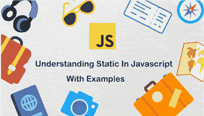

# 通过示例理解 Javascript 中的静态

> 原文：<https://dev.to/skptricks/understanding-static-in-javascript-with-examples-jfm>

帖子链接:[理解 Javascript 中的静态并举例](https://www.skptricks.com/2018/11/understanding-static-in-javascript-with-examples.html)

这篇文章解释了如何在 Javascript 函数中使用静态变量。JavaScript 不支持静态变量。它不提供静态关键字。但是使用一个小技巧，我们可以在 JavaScript 中实现函数静态变量，并将它们用于我们的目的。

[理解 Javascript 中的静态并举例](https://www.skptricks.com/2018/11/understanding-static-in-javascript-with-examples.html)

[T2】](https://res.cloudinary.com/practicaldev/image/fetch/s--oRSiG6qn--/c_limit%2Cf_auto%2Cfl_progressive%2Cq_auto%2Cw_880/https://3.bp.blogspot.com/-Emv_Ek-RjXk/W-pOuioRyyI/AAAAAAAACIM/xbVXiRbKsR88r6S2p47k8XTWoXg70c2DACLcBGAs/s400/static.png)