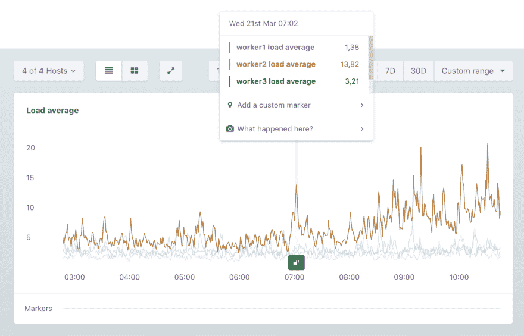

# 了解系统负载和平均负载

> 原文：<https://dev.to/appsignal/understanding-system-load-and-load-averages-ca>

像`top`、`uptime`、`w`和 [AppSignal 的主机指标](https://docs.appsignal.com/metrics/host.html?utm_source=DevTo&utm_medium=DevToBlogPost&utm_campaign=DevToContentPosting_SystemLoad)这样的工具报告一个叫做*负载平均*的指标。这个指标告诉您系统在多个时间段内的平均负载。

```
$ uptime
10:14:14 up 60 days, 17:42,  1 user,  load average: 0.44, 0.28, 0.25 
```

Enter fullscreen mode Exit fullscreen mode

负载平均值通常显示为三个数字，就像上面`uptime`的例子一样。结果末尾的三个数字显示了最后一分钟(`0.44`)、最后五分钟(`0.28`)和最后十五分钟(`0.25`)的平均负载。

[T2】](https://res.cloudinary.com/practicaldev/image/fetch/s--NhnUf6eS--/c_limit%2Cf_auto%2Cfl_progressive%2Cq_auto%2Cw_880/https://blog.appsignal.cimg/blog/2018-03/load-appsignal.jpg)

在 AppSignal 上，过去八个小时的平均负载以分钟为单位显示，更长时间的平均负载以小时为单位显示。

## 系统负载

为了理解这些平均负载告诉我们什么(以及什么时候应该报警)，我们首先需要理解*系统负载*意味着什么，以及它是如何计算的。

系统的负载实质上是在任何给定时间活动的进程的数量。空闲时，负载为 0。当一个进程开始时，负载增加 1。终止进程将负载减 1。除了正在运行的进程之外，任何排队的进程也会被计算在内。因此，当一个进程正在使用 CPU，而两个进程正在等待轮到它们时，负载是 3。

由于进程的寿命很短，负载波动很快，可以在几毫秒内从 0 跳到 5，下一个瞬间又跳回来。由于这种波动性，查看一段时间内的平均负载会更有用，这可以更好地概述系统所承受的负载。

## 负荷平均值

现在我们知道了系统负载是如何计算的，我们可以看看平均负载。正如我们所见，系统的负载通常显示为一段时间内的平均值。

一般单核 CPU 一次可以处理一个进程。平均负载为 1.0 意味着一个内核 100%的时间都很忙。如果平均负载降至 0.5，则 CPU 有 50%的时间处于空闲状态。

如果平均负载上升到 1.5，则 CPU 一直很忙，而(平均)有一个其他进程在等待 50%的时间，这给 CPU 带来了超出其处理能力的工作。

## 逻辑处理器

一般的经验法则是平均负载不应该超过机器中处理器的数量。如果处理器的数量是四个，负载通常应该保持在 4.0 以下。

请记住，这与*逻辑处理器*有关，而不是 CPU 上的实际物理处理器。由于像[超线程](https://en.wikipedia.org/wiki/Hyper-threading)这样的软件抽象，逻辑处理器或处理线程的数量可以高于物理处理器内核的数量。

要检查 Linux 上的逻辑处理器数量，请计算`/proc/cpuinfo`或`grep processor /proc/cpuinfo | wc -l`中列出的处理器数量，这将自动打印出处理器行数。

在 mac 上，可以使用`sysctl -n hw.ncpu`直接向`sysctl`询问逻辑处理器的数量。

对于具有多个逻辑处理器的系统，平均负载可能会更高，因为它可以运行更多的并发进程。在具有两个 CPU 内核的机器上，平均负载为 2.0 意味着两个 CPU 都被 100%利用，同时平均有两个进程处于活动状态。

## 读取负载平均值

因为它是进程绝对数量的平均值，所以似乎很难确定什么是合适的平均负载，以及何时应该发出警报。一般来说，由于每个 CPU 内核一次可以处理一个进程，所以系统不会过载，直到每个逻辑处理器超过 1.0。在双核系统(没有超线程)上，这将是 2.0。

通常，如果在最后一分钟平均负载超过每个内核 1.0，这是正常的，但是在五分钟或十五分钟平均负载的增加可能表明有问题。

*提示* : AppSignal 的[异常检测](https://docs.appsignal.com/application/anomaly-detection/?utm_source=DevTo&utm_medium=DevToBlogPost&utm_campaign=DevToContentPosting_SystemLoad)可用于在您的平均负载超过某个值一段时间时向您发出警报。例如，使用预热设置，当您的负荷保持在 1.5 以上 15 分钟时，我们会向您发送消息。

我们回答了你关于平均负载的问题了吗，还是有些地方还不太清楚？请不要犹豫，通过 [@AppSignal](https://twitter.com/appsignal) 告诉我们。当然，我们很想知道您对这篇文章的看法，或者您是否有其他想了解更多的话题。