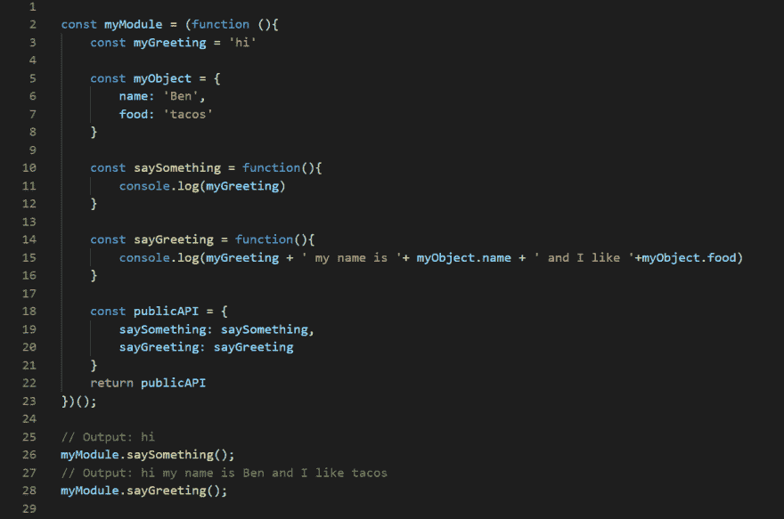

# 了解模块模式的基础

> 原文：<https://dev.to/trilemaestro92/understanding-the-basic-of-module-pattern--4oab>

怎么了！各位程序员。

快速声明:我参加编码训练营已经一个月了，但是我相信这可以帮助像我一样的其他人从初学者的角度理解模块模式。

让我们开始吧。

## 什么是模块

首先，要理解模块模式(MP ),您需要理解什么是模块。

模块是任何大型应用程序架构不可或缺的一部分，通常有助于保持项目代码单元的清晰分离和组织。

在 JavaScript 中，有几种方法可以实现一个模块，比如对象文字符号、AMD 模块和 CommonJS 模块等等。但是在这篇文章中，我将关注模块模式。

## 好的......你能给我举个例子吗？

是的。但是首先

模块模式(MP)最初被定义为一种为软件工程中的类提供私有和公共环境的方法。

在 JavaScript 中，MP 进一步强化了这个概念。我们能够在单个对象中包含公共/私有方法和变量，从而将特定部分从全局范围中屏蔽掉。在这种模式下，只返回一个公共 API，闭包内的其他内容都是私有的。这种隐私模式有时可以利用立即调用的函数表达式(IIFE ),其中返回一个对象。

你的理解应该是“模块模式是一种使用模块来保存特定代码、变量、函数等的方法。在单个对象内部，所以不会污染全局范围。从而保持我们的代码整洁有序”

酷豆

让我们来看一个模块模式的例子，并对其进行分解。

[T2】](https://res.cloudinary.com/practicaldev/image/fetch/s--zkztmKfU--/c_limit%2Cf_auto%2Cfl_progressive%2Cq_auto%2Cw_880/https://thepracticaldev.s3.amazonaws.com/i/fxtoaqzvbbnqd25tthnd.PNG)

## 击穿

1.  我用一个生命做了一个模块，并把它叫做“我的模块”。

2.  在模块内部，我声明了一个变量 **myGreeting** ，一个名为 **myObject** 的对象和两个函数 **saySomething** 和 **sayGreeting** 。

3.  在我的函数中，我可以在两个函数中引用像 **myGreeting** 这样的变量，甚至可以引用一个对象的属性——来自 **myObject** 的名称和食物。

4.  然后你可以从第 18-22 行看到我做了一个名为 public API 的变量来引用我的模块中的 2 函数并返回它们。

5.  最后，由于公共 API 和我返回函数的能力，我现在可以在第 26 和 28 行调用 2 函数。

因此，使 *myModule* 成为一个模块模式的是我如何能够从全局范围将内部的所有东西都变成私有的。因此，返回内部函数的唯一方法是使用引用它们的公共 API。

## 好听的胡言乱语但是有什么意义呢？？？

当然，我的例子非常简单，但是想象一下，在有多个开发人员参与的大型项目中处理大量代码时，这种方法是多么重要。模块模式可以保持全局范围的整洁和组织，并防止重复变量相互覆盖。