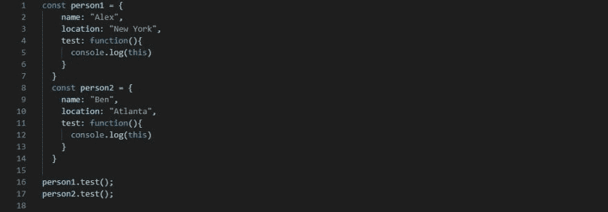
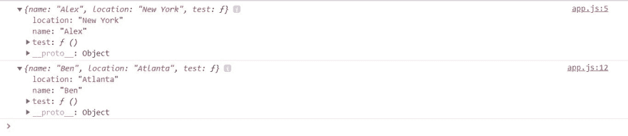
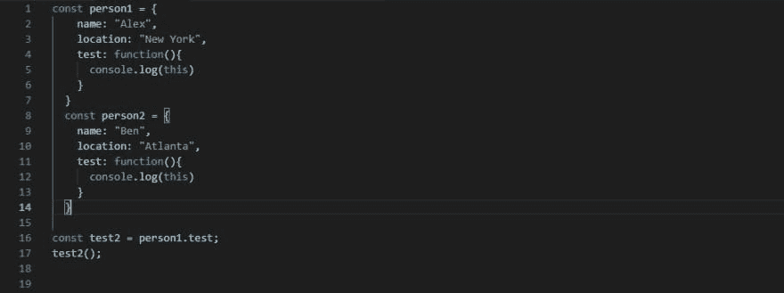
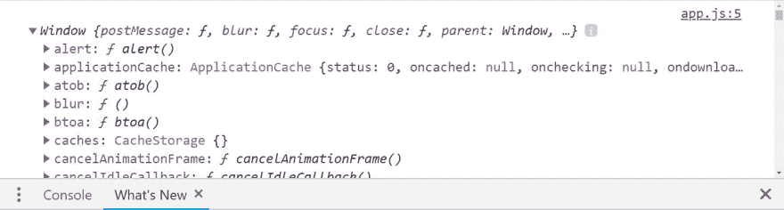
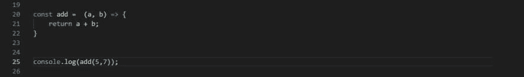
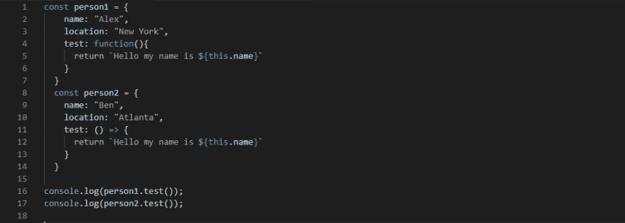
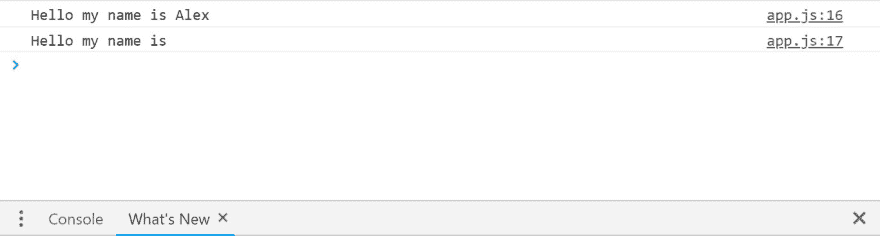
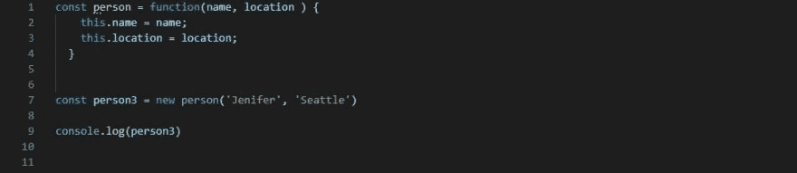

# 理解这个关键词

> 原文：<https://dev.to/trilemaestro92/understanding-this-keyword-go9>

问候程序员伙伴。
谢谢你来看我关于分解 JavaScript 上*这个*关键词的博客。我将详细介绍它是什么，如何使用它，以及您需要知道的一些规则。

# *这个*是什么？

**这个**，是一个 JavaScript 关键字，指的是它所属的对象。

在下面的例子中，你可以看到在“test”方法中，两个不同的对象 person1(第 5 行)和 person2(第 12 行)引用了这个关键字。我主要是想通过控制台记录来查看*这个*的值。

为了调用测试函数，我必须引用拥有这个空间的对象。因此有了 *person1.test()和 person2.test()* 。当使用*这个*时，这是一个更重要的概念，因为它的值将由调用点决定。从而触发了被称为**的规则之一的隐式绑定**。

[T2】](https://res.cloudinary.com/practicaldev/image/fetch/s--x8SCNOtT--/c_limit%2Cf_auto%2Cfl_progressive%2Cq_auto%2Cw_880/https://thepracticaldev.s3.amazonaws.com/i/808l7ihkl5fojp438dem.JPG)

## 隐含绑定规则

像这样调用时:person1.test()这个内部测试的值将是 person1 对象，或者像这样调用时:person2.test()这个内部 foo 的值将是 person2 对象。

让我们看看会发生什么

[T2】](https://res.cloudinary.com/practicaldev/image/fetch/s--zk2g6b4x--/c_limit%2Cf_auto%2Cfl_progressive%2Cq_auto%2Cw_880/https://thepracticaldev.s3.amazonaws.com/i/lnknw68v38ycck8bsna8.JPG)

在控制台上，您可以看到显示的 2 个对象，其中显示了所有人员 1 和人员 2 属性名称位置和测试方法。更简单地说， *this* 关键字基本上是用 *this* 替换对象名 person1 & person2。因此，在我的代码的第 5 行和第 12 行，我可以编写 console.log(person1 ),它会有相同的结果。这很有效，因为在我的调用点(第 16-17 行)我使用了隐式绑定。

(接下来我会展示如果你不引用这个所属的对象会发生什么。)

## 默认规则

当我以正常方式或者不使用隐式绑定调用一个函数(使用了 *this* )时。该对象中 this 的值将是全局对象(或者在严格模式下未定义)

例如:

[T2】](https://res.cloudinary.com/practicaldev/image/fetch/s--YSjRRkSv--/c_limit%2Cf_auto%2Cfl_progressive%2Cq_auto%2Cw_880/https://thepracticaldev.s3.amazonaws.com/i/8ylxndzh0iw33nh1ixwa.JPG)

在第 16 行，我刚刚将 person1 的测试函数作为变量保存到了 **test2** 中。
然后在下一行，我调用变量 **test2** 作为函数。

让我们看看结果。

[T2】](https://res.cloudinary.com/practicaldev/image/fetch/s--fqmPB0Dy--/c_limit%2Cf_auto%2Cfl_progressive%2Cq_auto%2Cw_880/https://thepracticaldev.s3.amazonaws.com/i/yb1mz6762ya6y9m97qjy.JPG)

你现在看到的是这个全局对象。因为我们调用函数的方式是一个未修饰的独立函数(第 17 行)，所以 *this* 的值变成了全局对象，这与我们使用隐式绑定调用函数时不同。

概括地说，我已经解释了使用 **this** 关键字时更简单的基本规则 2(默认和隐式绑定)。我现在将详细阐述箭头函数和“new”关键字如何影响**这个**的值。

# 箭头功能规则

首先，如果你不熟悉什么是箭头功能，这里有一个简单的例子。

[T2】](https://res.cloudinary.com/practicaldev/image/fetch/s--K12_GXHm--/c_limit%2Cf_auto%2Cfl_progressive%2Cq_auto%2Cw_880/https://thepracticaldev.s3.amazonaws.com/i/d9ej7f7fzgmrf6hjuppv.JPG)

箭头函数是编写函数的另一种方法，它包括参数、名称、变量、功能等。(对于多动症患者，控制台日志是 12)

接下来，使用上面的例子，我将把 person2 的测试函数改为 arrow 函数，而将 person1 保持为普通函数。在这两个测试中，我只想返回一个引用两个对象名称问候。

[T2】](https://res.cloudinary.com/practicaldev/image/fetch/s--k4Mvuv5C--/c_limit%2Cf_auto%2Cfl_progressive%2Cq_auto%2Cw_880/https://thepracticaldev.s3.amazonaws.com/i/n7lxy58dal7uzn0miuos.JPG)

结果是:

[T2】](https://res.cloudinary.com/practicaldev/image/fetch/s--cbq279u0--/c_limit%2Cf_auto%2Cfl_progressive%2Cq_auto%2Cw_880/https://thepracticaldev.s3.amazonaws.com/i/93zxce9ydslbn7iojhsi.JPG)

从控制台日志结果来看，person1 能够成功引用其对象名，而 person2 对象名未定义。

这就是**箭头功能**规则发挥作用的地方。基本上，当你使用一个箭头函数时，没有什么是绑定的。既没有争论也没有*这个*关键词，它们都是自由的。

因此，在 person2 arrow 函数中，当您编写“this . name”*时，this* 指的是“test”函数，因此您实际上是在编写“test.name ”,这当然是未定义的。

同时 person1 你可以看到，当“test”方法是一个普通函数时，*这个*被绑定到全局对象或者父对象。在本例中是对象 person1。

接下来，我将回顾一下**新的**关键字以及它如何影响**这个**关键字。

## *新增*关键词规则

**new** 关键字用于调用任何函数。当你使用 **new** 关键字调用一个函数时，它会创建一个名为“this”的空对象，然后自动返回这个对象。

因此你不需要使用 return 关键字从函数中返回这个。

让我们看一个例子。

[T2】](https://res.cloudinary.com/practicaldev/image/fetch/s--CB7nS1p1--/c_limit%2Cf_auto%2Cfl_progressive%2Cq_auto%2Cw_880/https://thepracticaldev.s3.amazonaws.com/i/t7o1ryj30mcl3s7pm7ha.JPG)

在这里，我做了一个函数叫做“人”。在函数内部，我告诉它设置两个属性(名称和位置),并使它等于我的两个参数。(注意我没有在函数中使用 return 来获取 *this* 的值)

然后，我将使用 **new** 关键字调用“person”函数(第 7 行)。用“詹妮弗”和“西雅图”的论调。然后控制台日志记录人员 3。

完全没问题！

让我们看看会发生什么...

[T2】](https://res.cloudinary.com/practicaldev/image/fetch/s--ib9YRtYW--/c_limit%2Cf_auto%2Cfl_progressive%2Cq_auto%2Cw_880/https://thepracticaldev.s3.amazonaws.com/i/n58umc9o6bgj6wgu6ssg.JPG)

因为**新的**关键字规则再次声明 1。)任何函数都可以用 **new** 2 调用。)然后它将返回这个对象

我可以调用 person 函数并传递函数参数中的参数。然后它返回给我一个对象(在这里我指定了两个属性来等于我的两个参数)

一个很好的类比是，将 **new** 关键字想象成一个工厂，它使用“person”函数作为模型，使用 person 模型生产尽可能多的其他函数。

这就是了。

我们已经到了我向你们讲述这个关键字的基础的文章的结尾，希望这篇文章是有帮助的。

感谢你阅读我！