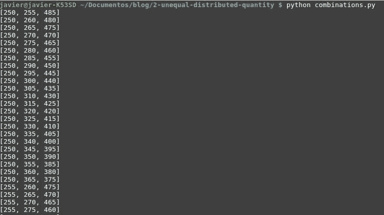

# 不均匀分布的数量

> 原文：<https://dev.to/devmarchan/unequeally-distributed-quantity-34n5>

假设你必须将一个量分成或分配成三份(可能是租金)，但你想不平等地做这件事。

这或多或少可以在心理上实现，但我想快速拥有所有的可能性，并决定写一些代码来实现它。

我在心里思考这是怎么做到的。例如，将 990 个单位分成 3 部分:

1.  你有三个 330 的部分
2.  一减五，再加一
3.  重复一遍，你得到不同的可能性来划分初始数量

## 翻译成代码。

这个问题的第一步是确定每个人要支付的最低金额。我们就说 250 英镑吧。250×3= 750，所以还剩下 240 个单位来分摊。

我希望粒度为 5 个单位，因此实际上有 24/5=48 个项目(5 个单位)要共享。

对我来说，提出这个问题并不简单，直到我意识到这与一些我不记得的著名组合问题相匹配。经过搜索，我找到了我要找的东西: [Start 和 bars](https://en.wikipedia.org/wiki/Stars_and_bars_(combinatorics))
**它可以用来解决许多简单的计数问题，例如有多少种方法可以将 n 个不可区分的球放入 k 个可区分的箱子中。**

使用[组合函数](https://docs.python.org/2/library/itertools.html#itertools.combinations)
，Python 可以轻松做到这一点

```
 import itertools

def combinations(n, k):
    return itertools.combinations(range(n), k)

def calculate_rent(n, k):
    for c in combinations(n, k):
        if sum(c)==n:
            yield c 
```

*组合(n，k)* 返回来自输入可迭代 n 的元素的 *r* 长度子序列

只留下写一些辅助代码以便打印列表。由于我们所获得的是将 n 个不可区分的球(48)放入 k 个可区分的箱(3)中的方法列表，有必要将每个球乘以我们的粒度(5)并对最小值求和。

```
total = 990
minimum = 250
people = 3
granularity = 5
remain = total - minimum*people
rent_combinations = calculate_rent(remain/granularity,people)
for rents in rent_combinations:
    print([5*i+minimum for i in rents]) 
```

下面显示了输出中总共 192 个元素的部分屏幕截图。

[T2】](https://res.cloudinary.com/practicaldev/image/fetch/s--LjAm1Qlz--/c_limit%2Cf_auto%2Cfl_progressive%2Cq_auto%2Cw_880/https://i1.wp.com/myram.xyz/wp-content/uploads/2018/10/output-1.jpg%3Fw%3D760%26ssl%3D1)

[迈拉姆的原始帖子](https://myram.xyz/unequally-distributed-divide-quantity-python/)