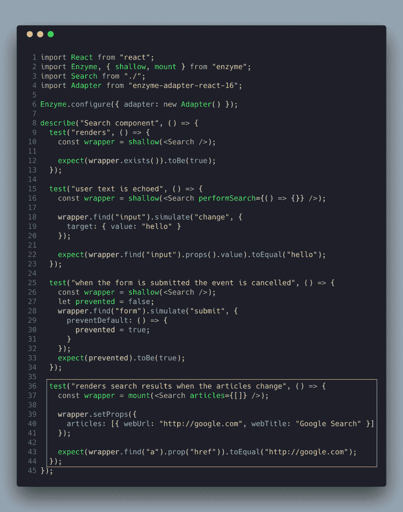

# 单元测试比你想象的更重要

> 原文：<https://dev.to/shakil/unit-testing-is-more-important-than-you-think-k81>

[T2】](https://res.cloudinary.com/practicaldev/image/fetch/s--FMAOYY2v--/c_limit%2Cf_auto%2Cfl_progressive%2Cq_auto%2Cw_880/https://shakil.me/conteimg/2021/02/1_TOL3mutcAV7gEEnIH0DVmg.png)

单元测试给我的最重要的好处是能够做出改变，而不用担心事情会因为哪怕是很小的改变而变得一团糟。软件开发的整个过程都在处理复杂性，其中每一个新的步骤都会在已经存在的一堆该死的三明治中产生一个全新的混乱。

对于较小的项目，您可能不需要编写单元测试。但是在一个有不止一个开发人员参与的大型项目中，如果你想保持头脑清醒，这是必须的。

[T2】](https://i.giphy.com/media/MVgLEacpr9KVK172Ne/giphy.gif)

作为工程师，我们所做的就是制造减少人力的东西。那么，为什么要伤脑筋去思考你当前的改变是否会破坏另一个特性呢？留给软件去测试。单元测试是将你的功能作为整个应用的一个小单元来测试。除了确保您的功能正常工作，这种做法还有一些有益的副作用。

**卓越的错误处理**

好软件和坏软件的区别在于前者对错误的处理更好。当您在编写代码时考虑到测试，您知道会有提供无效数据的测试用例，或者使用不正确的参数调用函数并期望它抛出某些错误。牢记测试将自动迫使你写更好的代码，并以适当的方式处理不同类型的错误。

帮助您更好地处理错误的另一种方式是，您可以从开源项目中复制类似特性的测试用例。例如，如果您的代码处理 http 请求，您可以找到网络请求中常用的测试用例，并将它们添加到您的代码中。为什么要重新发明轮子？

在我看来，测试驱动开发总体上是一种更好的软件开发策略。用这种方法来思考您的代码会给出一个更清晰的画面。