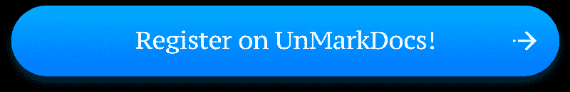

# UnMarkDocs:更好的文档降价

> 原文：<https://dev.to/m1guelpf/unmarkdocs-better-markdown-for-your-documentation-4ap7>

👋嗨！我是 [Miguel Piedrafita](https://miguelpiedrafita.com) ，一名 16 岁的软件开发人员，我已经花了一年的时间来改善您的项目文档体验。

结果叫做 UnMarkDocs。

* * *

# 文档化的问题

一年前，我注意到有两种类型的文档:一种是你因为别无选择而不断返回的文档，另一种是你宁愿放弃的文档。而且并不总是取决于内容。

让我们看一些例子:

<figure> 

<figcaption>条纹文档</figcaption>

</figure>

Stripe 的文档即使不是最好的，也是最好的之一。他们的文档不仅有用，而且美观，使用起来很愉快。绝对是我解决条纹问题的最佳选择。

<figure> 

<figcaption>自举日期选择器文档</figcaption>

</figure>

另一方面，Bootstrap Datepicker 文档很难使用，尽管它们可能有很好的文档记录，还是请求我退出页面。我可能会检查他们的说明，但我会准备好 alt-tab 到 StackOverflow 来解决我遇到的任何问题。

> 好吧，我们这样不公平。我们正在比较一个风投资助的跨国公司的文档和一个开源项目的文档。让我们试试另一个例子。

<figure> 

<figcaption>拉腊维尔文档</figcaption>

</figure>

我发现的另一个最好的文档页面是 Laravel 的，不仅仅是因为用户贡献的内容(整个文档都是开源的)。很高兴浏览这个网站。

有什么区别？**他们关心他们的文档体验**。

> 但是我正在做一个开源项目！我不能负担得起雇用一个开发团队来为我的项目开发一个自定义文档 CMS！

嗯，这就是我能帮你的地方:)

* * *

# 那么，什么是 UnMarkDocs 呢？

想象一个理想的世界。您将文档放在 GitHub repo 上，用户可以提交 Pull 请求来修复错别字或改进您的措辞。然后你点击一个按钮，一切都被转换成一个你可以从`docs.yourproject.com`进入的美丽网站。UnMarkDocs 是类固醇上神奇按钮。

还是回到现实吧。您创建一个 UnMarkDocs 帐户，链接您的 GitHub docs 存储库并配置一个自定义域。嘣，搞定！

它甚至可以在每次 git 推送时自动更新！

# 更好的降价

还记得标题承诺更好的降价吗？嗯，我们在 UnMarkDocs 使用的减价和你通常使用的不同。这并不意味着你必须重新学习 Markdown。事实上，如果你使用现有的文件，你不会注意到区别。但是我们在 Markdown 中加入了一些新的东西来增强你的文档。

我们特殊的 Markdown 风格在现有语法的基础上提供了新的语法，允许您嵌入视频、gists 甚至可编辑的 CodePen 等媒体，添加警报、面板和其他方式来吸引用户的注意，或者在每个页面的底部添加 CTA(号召行动)。最棒的是，一切都可以从 markdown 文件本身定制。

# 把美女带进来

好的，我们有一个自动更新的文档，用户可以在上面合作，我们也有降价的超能力。但是我们还缺少一样东西来达到 Laravel Docs 的水平:漂亮的页面。

当然，UnMarkDocs 也可以帮助你。

<figure> 

<figcaption>示例 UnMarkDocs-powered 文档</figcaption>

</figure>

这里你可以看到一个非 MarkDocs 支持的页面的例子。白色部分是直接从你的 markdown 文件中渲染出来的，所以你可以精确地控制它的显示内容。灰色部分？是的，你也可以从你的仪表板定制。如果你对它的外观不满意，你可以通过 CSS 添加你自己的样式。

# 还有一件事

UnMarkDocs 从您的 GitHub 存储库和当前页面的锚自动生成导航，以简化导航。它还包括一个链接到 GitHub 当前页面编辑窗口的按钮，使社区协作比以往任何时候都更容易。如果你不喜欢这些东西，你可以很容易地删除它们。

* * *

# 免费开源

为了感谢每一个为开源做出贡献的人，我决定提供一个免费计划，包括几乎所有的 UnMarkDocs 特性。如果你想使用自定义域或私有库，你可以使用我们的咖啡价格的保费计划。厉害吧。

# 奖励:第一个月享受五折优惠

目前的价格并不贵(`$5`)，但是为了感谢您一直阅读到最后，并补偿您在迁移过程中花费的 30 秒，使用优惠券`AUTOMETALOGOLEX`可以获得您的第一个月的 UnMarkDocs Premium，价格仅为`$2.5`。不到一杯星巴克咖啡。

[T2】](https://unmarkdocs.co/subscription?code=AUTOMETALOGOLEX)

* * *

# 关闭

这是我的第一个产品发布会，如果你能与你的朋友、同事和猫分享 UnMarkDocs，那就太棒了。此外，如果你想谈论 UnMarkDocs，我正在做的其他项目或者只是关于一般的生活，请随时给我发电子邮件。