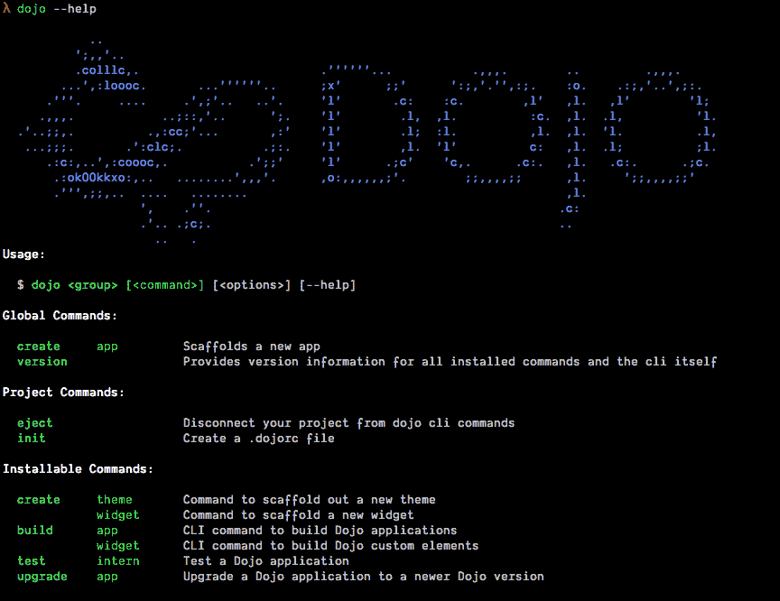
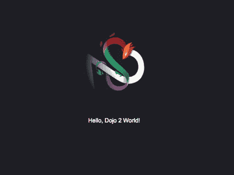

# 使用@dojo/cli 启动和运行

> 原文：<https://dev.to/odoenet/up-and-running-with-dojocli-242e>

如果你没听说，[道场](https://dojo.io/)升级了！dojo 的最新版本有一些非常棒的特性，不仅仅是构建小部件，它还包括一个健壮的 [i18n](https://dojo.io/docs/index.html#doc--dojo__framework__v3_0_0__src__i18n__README_md) 包来满足您的国际化需求，一个精选的[开箱即用小部件](https://dojo.io/tutorials/005_form_widgets/)和一个非常好的方式[主题化您的应用程序](https://dojo.io/tutorials/007_theming/)。

dojo 提供的一个关键工具是 [@dojo/cli](https://dojo.io/tutorials/000_local_installation/) 。

首先，您需要使用 npm 在全球范围内安装它。

```
npm install -g @dojo/cli @dojo/cli-create-app 
```

Enter fullscreen mode Exit fullscreen mode

安装完成后，您可以在命令行中键入`dojo --help`,您应该会得到这个漂亮的帮助消息。

[T2】](https://res.cloudinary.com/practicaldev/image/fetch/s--JgInsk3I--/c_limit%2Cf_auto%2Cfl_progressive%2Cq_auto%2Cw_880/https://thepracticaldev.s3.amazonaws.com/i/ev6jj7cp46m3cvj3xp98.png)

*好看*

你离统治世界又近了一步。

现在您想要实际创建一个应用程序，您可以使用下面的代码。

```
dojo create app --name awesome-dojo-app 
```

Enter fullscreen mode Exit fullscreen mode

创建应用程序目录并安装 scaffold 应用程序的所有依赖项大约需要一分钟左右的时间。

一旦完成，您就进入您的应用程序目录并使用下面的命令来运行它。

```
dojo build --mode dev --watch --serve 
```

Enter fullscreen mode Exit fullscreen mode

在引擎盖下，`@dojo/cli`正在使用 [webpack](https://webpack.js.org/) 来构建和捆绑你的应用程序。我们在这里做的是:

*   `build` -构建应用程序的命令
*   `--mode dev` -使用`dev`模式，使构建更快，而不是生产优化
*   `--watch` -观察任何文件变化并重新编译
*   `--serve` -在本地服务器上为我们提供应用程序

您应该能够打开浏览器到`http://localhost:9999/`，您会看到以下内容

[T2】](https://res.cloudinary.com/practicaldev/image/fetch/s--qGr-Ae9n--/c_limit%2Cf_auto%2Cfl_progressive%2Cq_66%2Cw_880/https://thepracticaldev.s3.amazonaws.com/i/7x2o5di47ks8df1qfkd6.gif)

*成功*

我将让您仔细阅读所提供的应用程序，但是让我们快速地看一下小部件代码。

```
// src/widgets/HelloWorld.ts
import WidgetBase from '@dojo/framework/widget-core/WidgetBase';
import { v } from '@dojo/framework/widget-core/d';

import * as css from './styles/helloWorld.m.css';

const logo = require('./../img/logo.svg');

export class HelloWorld extends WidgetBase {
    protected render() {
        return v('div', { classes: css.root }, [
            v('img', { src: logo, classes: css.logo }),
            v('div', { classes: css.label }, ['Hello, Dojo 2 World!'])
        ]);
    }
}

export default HelloWorld; 
```

Enter fullscreen mode Exit fullscreen mode

你可能不会马上注意到，但这都是[打字稿](http://www.typescriptlang.org/)。注意，在这个小部件中没有定义类型或接口，这是因为它是由 TypeScript 编译器*推断*的，以确保它是有效的。打字稿的*力量！*

Dojo 拥有自己的虚拟 dom 引擎来构建小部件，并使用 *hyperscript* 作为创建应用程序的默认引擎。如果你熟悉 [React](https://reactjs.org/) ，那么 hyperscript 就像是在没有 JSX 的情况下编写的[。但是出于开发目的，`v`方法要短得多。](https://reactjs.org/docs/react-without-jsx.html)

我真的很喜欢用这种方式编写我的小部件，并且我不会在构建小部件上涉及太多的细节，我将在另一篇文章中介绍这一点，你可以在 dojo 教程中阅读更多的[。](https://dojo.io/tutorials/003_creating_widgets/)

但我确实意识到，有些人真的很喜欢他们的 JSX，所以不要担心，如果你愿意，你仍然可以使用 JSX。

只需将文件扩展名`.ts`更改为`.tsx`，并将 hyperscript 转换为 JSX，如下所示。

```
// src/widgets/HelloWorld.tsx
import WidgetBase from '@dojo/framework/widget-core/WidgetBase';
// tslint:disable-next-line
import { tsx } from "@dojo/framework/widget-core/tsx";
import * as css from './styles/helloWorld.m.css';

const logo = require('./../img/logo.svg');

export class HelloWorld extends WidgetBase {
    protected render() {
        return (
            <div classes={css.root}>
                </img>
                <div classes={css.label}>Hello Dojo!</div>
            </div>
        );
    }
}

export default HelloWorld; 
```

Enter fullscreen mode Exit fullscreen mode

我们需要导入`tsx`模块，这样 JSX 就可以被编译，默认的`tslint`不喜欢未使用的模块，所以你还需要为`tslint`添加一个注释来忽略那一行。

但是，您仍然在您的 Dojo 小部件中使用 JSX！

一定要查看道场教程以获得更多精彩课程，如果你真的想深入了解，也可以查看[文档](https://dojo.io/docs.html)！