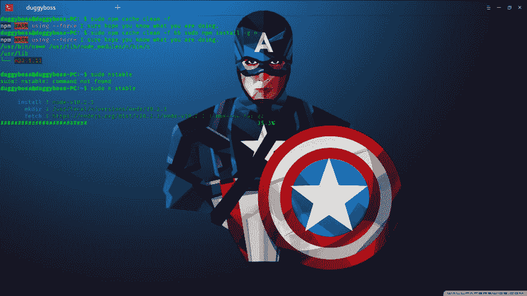

# 更新 npm 和节点

> 原文：<https://dev.to/slumboy/update-npm--node-mbp>

### `i'm use deepin os`

#### `1.sudo npm cache clean -f && npm install -g n`

#### `2.sudo n stable`

#### `3.wait a minute`

#### `4\. Check node -v && npm -v`

* * *

**奖金**

### 可以查看环境节点和 npm

#### npm 医生

[T2】](https://res.cloudinary.com/practicaldev/image/fetch/s--czddVycx--/c_limit%2Cf_auto%2Cfl_progressive%2Cq_auto%2Cw_880/https://thepracticaldev.s3.amazonaws.com/i/hkkyy23lkodv59vrc3nd.png)