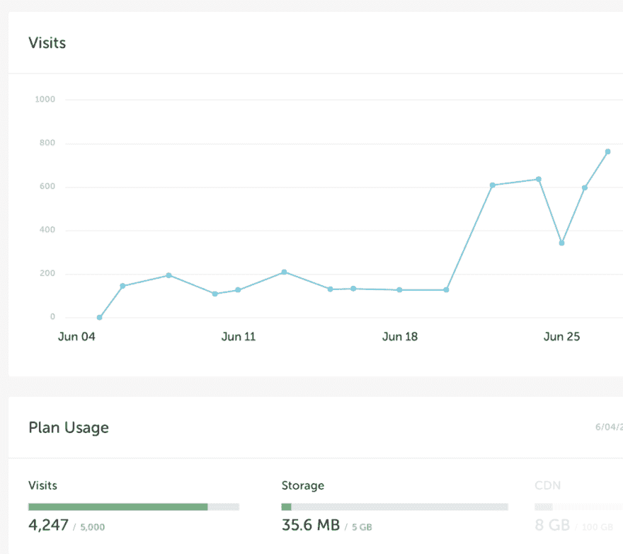

# Ruby 和 Rails 学习体验的更新

> 原文：<https://dev.to/cseeman/update-on-ruby-and-rails-learning-experience-49ji>

尽管我可能不会写这方面的东西，但我会继续深入研究 Ruby 这个词。在工作中，我主要关注 Rails。我的 app 是 Rails，我正在做的票是 Rails(里面扔了一些 haml 和 SCS，耶为了学习一些前端开发！).目前，我已经能够变得半生产，但还没有能够完成我自己的票，这是一个谦卑的经验。我们正在进行为期一周的冲刺，所以我确实试图用一张指定的票来蒙混过关。但是因为时间紧迫，你需要尽快给女人打电话寻求帮助。当时间允许的时候，我仍然在学习一个 Rails 教程。

晚上，我仍然在艰难地学习 Ruby，并坚持锻炼 15 分钟左右。到目前为止，这些都很容易，但是我有一种感觉，它很快就会加快速度，我不想跳过一些可能很重要的东西。这周我出轨了，因为[的课程之一](https://learnrubythehardway.org/book/ex14.html)是致力于接受用户输入，并建议查找 [Zork](https://en.wikipedia.org/wiki/Zork) ，所以我晚上剩下的时间就是[玩那个](http://textadventures.co.uk/games/view/5zyoqrsugeopel3ffhz_vq/zork)。这让我想起了 Vim，如果你能记住关键词，那会很有趣，但如果不能，你就只能呆在一个黑暗的房间里(终端)。

另一个有趣的消息是，有人访问我的网站！嗯，谢谢，我真的不知道有人会读这篇文章，通过我在 Flyweel 上的便捷仪表盘，我可以看到我有访客。谁知道 _(ツ)_/有多少垃圾邮件机器人

[T2】](https://res.cloudinary.com/practicaldev/image/fetch/s--q6Ej4gRR--/c_limit%2Cf_auto%2Cfl_progressive%2Cq_auto%2Cw_880/http://christine-seeman.com/wp-content/uploads/2018/06/Screen-Shot-2018-06-28-at-11.44.58-AM-1024x911.png)

旁注:如果有人知道为什么当我运行我的 rails 服务器时，我每隔一段时间就会得到“MiniProfiler 存储故障:连接丢失(ECONNRESET)”的消息，他们可以分享一下吗，那太棒了。一切都启动并运行，但我只是经常看到弹出。