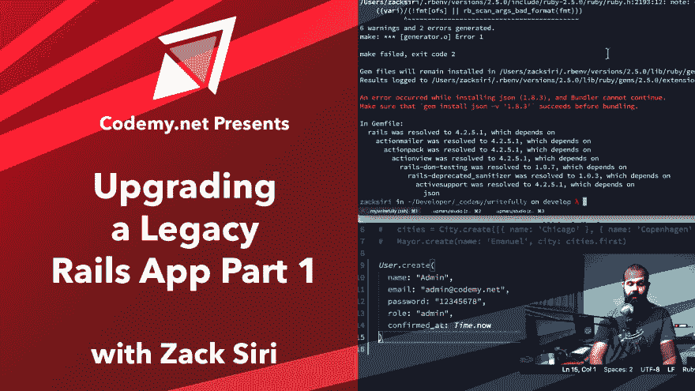

# 升级传统 Rails 应用指南

> 原文：<https://dev.to/codemy/upgrading-legacy-rails-app-guide-28d>

 
[升级遗留 rails 应用第 1 部分](https://www.codemy.net/posts/rails-upgrading-a-legacy-rails-app-part-1)——升级遗留 rails 应用是每个 Rails 开发者的苦差事。知道正确的策略可以节省你很多时间。在这一集里，我们将向你展示如何去做！

 
[升级传统 Rails 应用第二部分](https://www.codemy.net/posts/rails-upgrading-a-legacy-rails-app-part-2)——我们继续上一集的升级过程。现在我们的应用程序运行在 4.2.10 的稳定版本上。我们可以开始升级到 5.2.1 的过程。我们将广泛使用 railsdiff.org 来指导我们完成升级过程。

 
[升级一个遗留的 Rails 应用第 3 部分](https://www.codemy.net/posts/rails-upgrading-a-legacy-rails-app-part-3)——我们通过修补几个文件来完成升级过程。一旦所有的更改都就绪，我们应该能够运行 bundle update rails 了