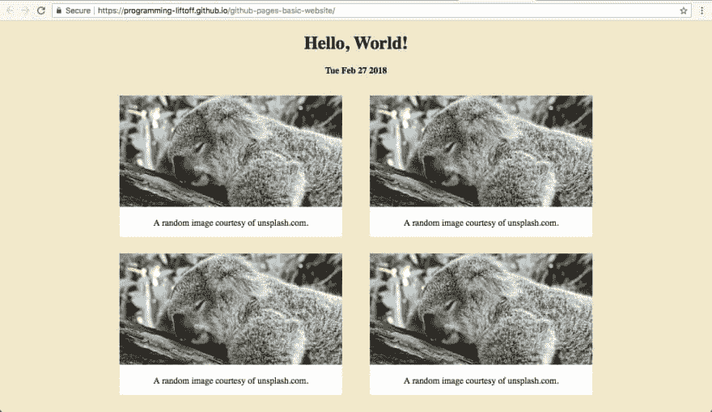

# 将网站上传到 GitHub 页面

> 原文：<https://dev.to/programliftoff/upload-a-website-to-github-pages--3k11>

*本文最初发表于[programmingliftoff.com](http://programmingliftoff.com/)作为[上传网站到 GitHub 页面](http://programmingliftoff.com/upload-website-github-pages/)。*

[T2】](https://res.cloudinary.com/practicaldev/image/fetch/s--nCyvGomA--/c_limit%2Cf_auto%2Cfl_progressive%2Cq_auto%2Cw_880/https://thepracticaldev.s3.amazonaws.com/i/kx8jtwu695e1sj0eivf3.png)

注意:在执行这些步骤之前，您应该已经在本地机器上创建了一个网站。如果你还没有网站，完成教程[用 CSS 和 JavaScript 创建一个基本的网页](http://programmingliftoff.com/create-basic-webpage-css-javascript/)来创建一个网站，然后回到这个教程。

宁愿看这个教程也不看？点击[这里](https://www.youtube.com/watch?v=hAsDjEo9Oqw)。

你需要在你的电脑上安装`git`来上传你的网站到 GitHub。如果你还没有安装，请访问[这个网站](https://git-scm.com/book/en/v2/Getting-Started-Installing-Git)，按照你的操作系统的说明进行操作。注意，如果你用的是 Windows，我推荐你安装 [GitHub for Windows](https://desktop.github.com/) 。

然后，要设置 git，在终端(或 Windows 上的 Git Bash)中键入以下内容，用您的姓名和电子邮件替换<name>和【T1:</name> 

```
git config --global user.name <name>
git config --global user.email <email> 
```

Enter fullscreen mode Exit fullscreen mode

安装和配置 git 之后，登录 GitHub 并创建一个新的存储库。不要选中使用自述文件初始化存储库的框。然后，GitHub 将在命令行上向您展示创建新存储库的说明。

接下来，打开终端(或者 Windows 中的‘Git Bash’程序)。然后使用`cd`命令导航到您的网站所在的文件夹。进入文件夹后，键入 GitHub 在最后一步创建新的存储库后显示的命令。这些命令将类似于下面的命令，只有 GitHub 存储库的 URL 发生了变化:

```
git init
git add .
git commit -m “Upload website”
git remote add origin git@github.com:programming-liftoff/github-pages-first-upload.git
git push -u origin master # If this command fails, click the link in the next section to learn how to setup a SSH key with GitHub. 
```

Enter fullscreen mode Exit fullscreen mode

### 执行`git push -u origin master`时权限被拒绝(publickey)

如果您看到消息“权限被拒绝(publickey)”，您将需要设置一个 SSH 密钥来与 GitHub 一起使用。为此，请阅读 GitHub 的文章[生成新的 SSH 密钥](https://help.github.com/articles/generating-a-new-ssh-key-and-adding-it-to-the-ssh-agent/)。完成所有步骤，当你完成后，确保[将你的 SSH 密钥添加到你的 GitHub 账户](https://help.github.com/articles/adding-a-new-ssh-key-to-your-github-account/)。

现在尝试执行行`git push -u origin master`，它应该工作！

### 最后的步骤

最后，转到 GitHub 存储库的“设置”选项卡，向下滚动到 GitHub 页面部分，选择“主分支”作为源文件，然后单击“保存”。然后，GitHub 页面部分会显示一个 URL。单击该 URL 访问您的网页(注意:网页可能需要几分钟才能显示在 URL 上)。

恭喜你！你现在已经把你的网站上传到网上了！请在下面的评论中发布你网站的网址，这样其他人就可以查看你的甜蜜网站了！

如果你有任何问题，请在 YouTube 上观看视频教程。

感谢阅读！
-安德鲁@编程起飞