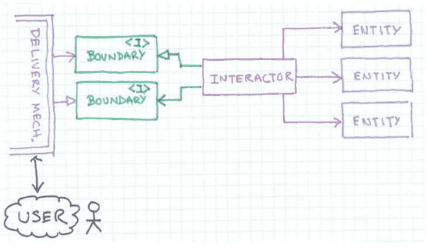
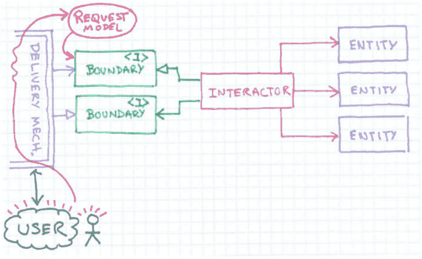
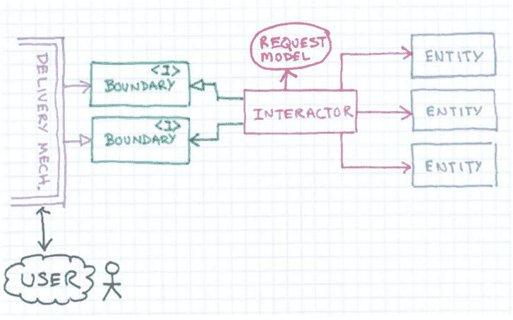
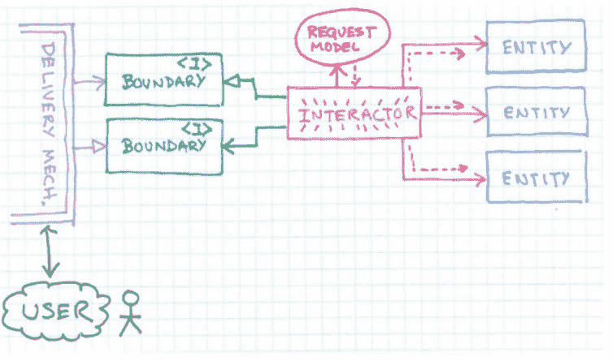
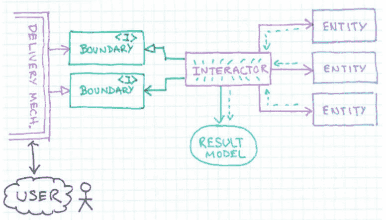
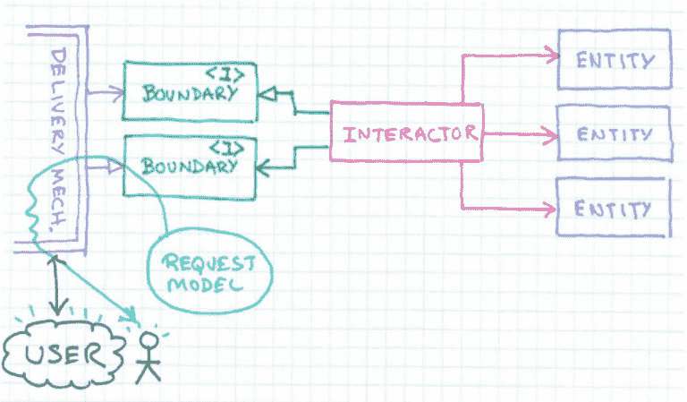
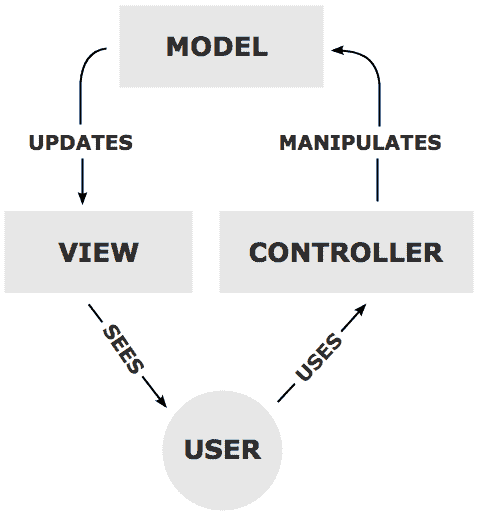
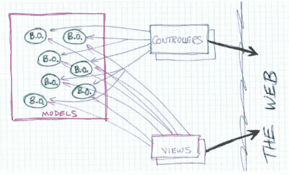
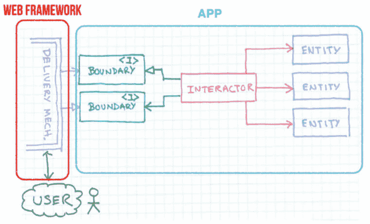
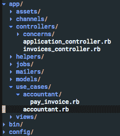

# 面向用例的 rails 应用程序

> 原文：<https://dev.to/lucasprag/use-case-oriented-rails-applications-28jb>

我将为您带来一个使用所谓的干净架构的一些基础来构建 rails 应用程序的可行解决方案。但是，是什么呢？

# 干净的建筑

不讲述问题，很难说出是什么。

问题是，看看你的 rails 应用程序，试着识别它做了什么，打开你的`app`文件夹，再试着识别一次。

我们可以看到一些像控制器，模型，助手之类的文件夹。即使当打开其中一个文件夹时，我们也不能说它是干什么的，但我们只能说该应用程序有什么，比如用户或产品。clean architecture 试图解决这个问题。

我们可以注意到 rails 应用程序的一个特点是它在尖叫`web framework!`。

但是我们永远不能忘记的一点是, **web 是一个交付系统**,不应该主宰我们的代码。

[T2】](https://res.cloudinary.com/practicaldev/image/fetch/s--iKE64iq_--/c_limit%2Cf_auto%2Cfl_progressive%2Cq_auto%2Cw_880/https://thepracticaldev.s3.amazonaws.com/i/aefxxs18lhzhhd12d3ci.png)

# 提议

一张图胜过千言万语，所以让我们来看看 Robert C. Martin 的一些图片，这些图片展示了他对请求应该遵循的路径的建议:

### 用户与系统交互

[T2】](https://res.cloudinary.com/practicaldev/image/fetch/s--x0xEFlmm--/c_limit%2Cf_auto%2Cfl_progressive%2Cq_auto%2Cw_880/https://thepracticaldev.s3.amazonaws.com/i/17p8mdqnjjt88qqq96ys.png)

### 交付机制构建请求模型，并将其传递给边界/接口

[T2】](https://res.cloudinary.com/practicaldev/image/fetch/s--if45oh2M--/c_limit%2Cf_auto%2Cfl_progressive%2Cq_auto%2Cw_880/https://thepracticaldev.s3.amazonaws.com/i/mgwra7e3hesxylpx8cvs.png)

### 接口知道使用哪个交互器，并将请求模型传递给它

### 交互器执行业务规则

[T2】](https://res.cloudinary.com/practicaldev/image/fetch/s--8Kes1aEC--/c_limit%2Cf_auto%2Cfl_progressive%2Cq_auto%2Cw_880/https://thepracticaldev.s3.amazonaws.com/i/bj4vvazl2e89yi8rrag7.png)

### 与实体互动

[T2】](https://res.cloudinary.com/practicaldev/image/fetch/s--2M40YLyt--/c_limit%2Cf_auto%2Cfl_progressive%2Cq_auto%2Cw_880/https://thepracticaldev.s3.amazonaws.com/i/g5n8ynvx60x0jhs0p33g.png)

### 交互器建立一个结果模型，并将其返回给边界/接口

[T2】](https://res.cloudinary.com/practicaldev/image/fetch/s--CSmlKAAu--/c_limit%2Cf_auto%2Cfl_progressive%2Cq_auto%2Cw_880/https://thepracticaldev.s3.amazonaws.com/i/btscyrgoskdpr5nuiawu.png)

### 将其返还给交付机构和用户

[T2】](https://res.cloudinary.com/practicaldev/image/fetch/s--Akli8mdj--/c_limit%2Cf_auto%2Cfl_progressive%2Cq_auto%2Cw_880/https://thepracticaldev.s3.amazonaws.com/i/p3ot6qjf9cb9ruic3s1m.png)

如您所见，框架只是该架构中的一个细节，它是一种交付机制。用户界面可以是一个网站，也可以是一个命令行工具，业务规则放在可以与实体交互的用例上。

# MVC 呢？

MVC(也称为模型视图控制器)是一种架构模式，用户与控制器进行交互，控制器操纵模型，模型更新用户看到结果的视图。我从维基百科上找到这张图片来更好地说明:

[T2】](https://res.cloudinary.com/practicaldev/image/fetch/s--ZdzKPRN6--/c_limit%2Cf_auto%2Cfl_progressive%2Cq_auto%2Cw_880/https://thepracticaldev.s3.amazonaws.com/i/u1q6tvb5x6tzr5p7t8l3.png)

MVC 模式是由 Trygve Reenskaug 在 1979 年创建的，用于图形用户界面(GUI)软件设计的 SmallTalk。

但是当我们使用这种方法构建整个 web 应用程序时会发生什么呢？

[T2】](https://res.cloudinary.com/practicaldev/image/fetch/s--6LbW4-yz--/c_limit%2Cf_auto%2Cfl_progressive%2Cq_auto%2Cw_880/https://thepracticaldev.s3.amazonaws.com/i/d6kxz416rhzx0p1jrmmb.png)

会变得很乱。

我不是说 MVC 不好，我是说它是交付机制的一部分，而不是应用程序架构的一部分。

[T2】](https://res.cloudinary.com/practicaldev/image/fetch/s--6GrfZQl---/c_limit%2Cf_auto%2Cfl_progressive%2Cq_auto%2Cw_880/https://thepracticaldev.s3.amazonaws.com/i/y96c29rykvgrmc9chpvu.png)

# 真实世界用例

## 作为用户，我想支付一张发票

假设您有一个 web 应用程序，您向您的用户发送发票，然后他们支付他们的发票。所以这个用例可以被命名为‘pay _ invoice ’,为了对相关类进行分组，我将创建一个模块调用`Accoutant`。

目标是像这样调用控制器中的用例:

```
class InvoicesController < ApplicationController
  def pay
    if Accountant.pay_invoice(params[:invoice_id], credit_card_params)
      format.html { redirect_to @invoice, notice: 'Invoice was successfully paid.' }
    else
      format.html { redirect_to @invoice, error: 'We got a problem paying that invoice' }
    end
  end
end 
```

Enter fullscreen mode Exit fullscreen mode

为了让这个用例可用，我们需要创建一个类似这样的类:

```
require 'caze'

module Accountant
  class PayInvoice
    include Caze

    attr_accessor :invoice_id, :credit_card

    export :call, as: :pay_invoice

    def initialize(invoice_id, credit_card)
      @invoice_id = invoice_id
      @credit_card = credit_card
    end

    def call
      # register payment thought payment gateway (maybe background job)
      # change invoice status
    end

    private

    def invoice
      @invoice ||= Invoice.find(invoice_id)
    end
  end
end 
```

Enter fullscreen mode Exit fullscreen mode

一些注意事项:

*   只有一个公共实例方法(`call`)
*   这个班级有一个责任
*   易于编写的规格
*   我使用`caze` gem 有一个简单的 DSL 来定义用例，而不是这样做:

```
def self.pay_invoice(invoice_id, credit_card)
  self.new(invoice_id, credit_card).call
end 
```

Enter fullscreen mode Exit fullscreen mode

我们将这个用例添加到`Accountant`模块中，如下所示:

```
require 'caze'

module Accountant
  include Caze

  has_use_case :pay_invoice, PayInvoice
end 
```

Enter fullscreen mode Exit fullscreen mode

现在我们可以说这个应用程序做的一件事就是支付发票。看看这些文件是如何组织的:

[T2】](https://res.cloudinary.com/practicaldev/image/fetch/s--Xv9husQ3--/c_limit%2Cf_auto%2Cfl_progressive%2Cq_auto%2Cw_880/https://thepracticaldev.s3.amazonaws.com/i/71ssjyd36uwnwqqwzbub.png)

你并不真的需要使用`caze`宝石，重要的是:

## 我们把**有什么应用**分离出来

发票、账户等变化不大的模型(稳定)

## 的什么应用**做什么**

随着业务的增长，行为和用例往往会发生很大的变化

## 何时写用例？

当您只需要管理资源时，您可以并且应该使用 rails 方式，它是面向资源的，所以它是有意义的，但是当您有一个特殊的逻辑并且它对您的业务规则非常独特时，您应该编写像上面的代码这样的用例。

# 结论

完成所有这些工作后，我们可以查看我们的应用程序并快速查看它做了什么，而不仅仅是查看它所拥有的资源，您还可以在框架之间移动或创建新的接口来使用您独特的业务规则。

请记住，在编程中没有什么灵丹妙药，但这肯定是一种非常有效的方法，可以让你的用例保持有序，让你的软件架构保持干净。

# 参考文献

*   罗伯特·马丁的清洁建筑
*   罗伯特·马丁的《建筑失落的岁月》
*   [法比亚诺·贝瑟尔加的《轨道上的清洁建筑》](https://medium.com/magnetis-backstage/clean-architecture-on-rails-e5e82e8cd326)
*   [狩猎 gem](https://github.com/magnetis/caze)
*   [用例示例](http://www.gatherspace.com/static/use_case_example.html)
*   [《不错》鲍勃大叔](https://twitter.com/unclebobmartin/status/992073756150558720)