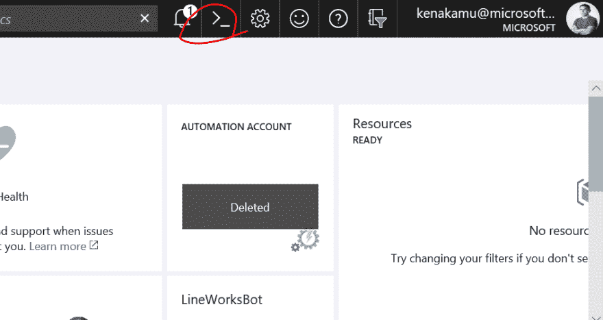
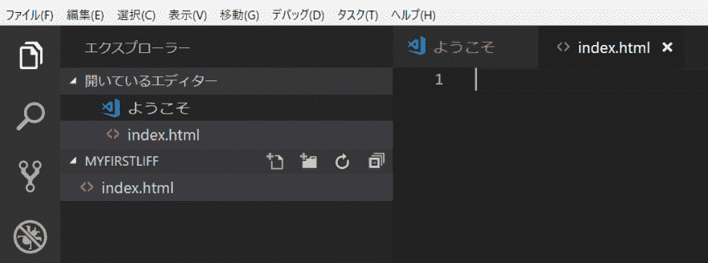

# 使用线前端框架(LIFF)来丰富你的机器人

> 原文：<https://dev.to/kenakamu/use-line-front-end-framework-liff-to-enrich-your-bot-3lkn>

# 概述

在本文中，我将介绍如何使用 Line 前端框架(LIFF) SDK 开发网页并丰富您的 bot，以及如何为 LIFF 使用 CLI too。

我重用了一些来自 [line-liff-starter](https://github.com/line/line-liff-starter) 仓库的代码。
最终版本在的[举行](https://github.com/kenakamu/LINE-LIFF-Sample/)

# LIFF 应用

这只是另一个带有 javascript 和 LIFF SDK 的 html 页面，它是通过使用 LIFF API 注册的，以生成在 LINE app 中使用的唯一 URL。

### 先决条件

*   对 LINE Bot 的基本了解
*   [Visual Studio 代码](https://code.visualstudio.com/)
*   [Azure 订阅](https://azure.microsoft.com/ja-jp/free/)
*   [Azure CLI](https://docs.microsoft.com/en-us/cli/azure/install-azure-cli?view=azure-cli-latest)
*   [去](https://git-scm.com/download)
*   LIFF 气候变化

※尽管我使用 Microsoft Azure 托管我的页面，但你可以在任何地方托管它。

# 先准备环境

### 在 LINE 开发者门户创建“渠道”

在 LINE Developer portal 中创建消息传递 API 通道，并获取通道和令牌密钥。

[T2】](https://res.cloudinary.com/practicaldev/image/fetch/s--zhzKSUwb--/c_limit%2Cf_auto%2Cfl_progressive%2Cq_auto%2Cw_880/https://qiita-image-store.s3.amazonaws.com/0/214116/d63d4afe-08e3-e383-bd53-111dee845ea3.png)

请复制并保留“您的用户 ID”。

[T2】](https://res.cloudinary.com/practicaldev/image/fetch/s--hCOMS1C3--/c_limit%2Cf_auto%2Cfl_progressive%2Cq_auto%2Cw_880/https://qiita-image-store.s3.amazonaws.com/0/214116/fd5fb84a-e0e8-556d-d1bd-f048f8dfaa51.png)

### 在 Azure 门户中创建 WebApps

你可以使用 Azure Portal 创建一个 web 应用程序，但我这次使用 CLI 是为了好玩。

1.安装、 [Azure CLI](https://docs.microsoft.com/en-us/cli/azure/install-azure-cli?view=azure-cli-latest) ,也可以在 [Azure 门户](https://portal.azure.com)上使用“云壳”。

[T2】](https://res.cloudinary.com/practicaldev/image/fetch/s--6hz9PBm_--/c_limit%2Cf_auto%2Cfl_progressive%2Cq_auto%2Cw_880/https://qiita-image-store.s3.amazonaws.com/0/214116/7287ecb7-702d-e17d-351c-2304ccf2bc20.png)

2.如果使用 Cloud Shall，请跳到步骤 4。否则，请按照步骤登录。

```
az login 
```

3.按照屏幕上的说明完成登录。

4.如果你有 Azure 套餐，请确保使用正确的套餐。

```
az account list
az account set -s 'subscription id'
az account show 
```

5.创建资源组。我在东日本创建了“lineliffsample”资源组。

```
az group create -n lineliffsample -l japaneast 
```

6.接下来，创建一个应用服务计划和一个 WebApps 来托管 LIFF 应用。

```
az appservice plan create -n lineliffappplan -g lineliffsample --sku F1
az webapp create -n <unique name for WebApps> -g lineliffsample -p lineliffappplan 
```

7.配置 WebApps 以启用 git deploy。

```
az webapp deployment user set --user-name <username> --password <password>
az webapp deployment source config-local-git -n <your webapp name> -g lineliffsample 
```

### 对现有页面使用 LIFF CLI

你可以把任何页面注册成 LIFF。在这一节中，我将解释如何使用 CLI 工具将页面注册为 LIFF。

1.安装 liff (LIFF CLI 工具)。

```
npm install -g liff 
```

2.运行 liff init 来初始化工具。

```
liff init <Channel Access Token> 
```

3.注册 LIFF 应用程序。我在这里用“高的”,但是你也可以试试“全的”和“紧凑的”。

```
liff add https://linecorp.com/en/ tall 
```

4.获取 LIFF ID 和可访问的 URL。

[T2】](https://res.cloudinary.com/practicaldev/image/fetch/s--M4ydSsGu--/c_limit%2Cf_auto%2Cfl_progressive%2Cq_auto%2Cw_880/https://qiita-image-store.s3.amazonaws.com/0/214116/a9469abf-dcba-5d16-cb43-52982a003b35.png)

5.现在，使用“liff send”命令发送地址，或者你甚至可以通过线路发送给你的朋友。它在机器人之外也能工作。

```
liff send <LIFF ID> <User ID> 
```

[T2】](https://res.cloudinary.com/practicaldev/image/fetch/s--wBQfNZ_a--/c_limit%2Cf_auto%2Cfl_progressive%2Cq_auto%2Cw_880/https://qiita-image-store.s3.amazonaws.com/0/214116/dc22e480-0369-1981-ffb8-63b323c02a74.png)

# 开发 LIFF 应用

在这一节中，我将解释如何使用 LIFF SDK 开发 LIFF 应用程序。

### 创建项目

1.创建 MyFirstLiff 文件夹，并通过 Visual Studio 代码打开它。

```
mkdir MyFirstLiff
cd MyFirstLiff
code . 
```

2.创造 index.html。

[T2】](https://res.cloudinary.com/practicaldev/image/fetch/s--_7aEP78Z--/c_limit%2Cf_auto%2Cfl_progressive%2Cq_auto%2Cw_880/https://qiita-image-store.s3.amazonaws.com/0/214116/865c2a24-cbe8-ba88-7dfc-2e37a081984c.png)

3.将下面的代码复制并粘贴到 index.html。

```
<!DOCTYPE html>
<html lang="en">
<head>
    <meta charset="UTF-8">
    <meta name="viewport" content="width=device-width, initial-scale=1.0">
    <meta http-equiv="X-UA-Compatible" content="ie=edge">
    My First LIFF
</head>
<body>
    <div id="liffdata">
        <h2>LIFF Data</h2>
        <table border="1">
            <tr>
                <th>language</th>
                <td id="languagefield"></td>
            </tr>
            <tr>
                <th>context.viewType</th>
                <td id="viewtypefield"></td>
            </tr>
            <tr>
                <th>context.userId</th>
                <td id="useridfield"></td>
            </tr>
            <tr>
                <th>context.utouId</th>
                <td id="utouidfield"></td>
            </tr>
            <tr>
                <th>context.roomId</th>
                <td id="roomidfield"></td>
            </tr>
            <tr>
                <th>context.groupId</th>
                <td id="groupidfield"></td>
            </tr>
        </table>
    </div>

    <!-- Load LIFF SDK -->
    <script src="https://d.line-scdn.net/liff/1.0/sdk.js"></script>
    <script src="liff.js"></script>
</body>
</html> 
```

4.将 liff.js 添加到同一个目录中，并粘贴以下代码。

```
window.onload = function (e) {
    // initialize and get basic information
    // https://developers.line.me/en/reference/liff/#initialize-liff-app
    liff.init(function (data) {
        initializeApp(data);
    });
};

function initializeApp(data) {
    document.getElementById('languagefield').textContent = data.language;
    document.getElementById('viewtypefield').textContent = data.context.viewType;
    document.getElementById('useridfield').textContent = data.context.userId;
    document.getElementById('utouidfield').textContent = data.context.utouId;
    document.getElementById('roomidfield').textContent = data.context.roomId;
    document.getElementById('groupidfield').textContent = data.context.groupId;
} 
```

5.全部保存。

### 部署 LIFF 应用。

1.初始化 git。打开“集成终端”并运行 git init。

```
git init 
```

2.添加您在上面创建 WebApps 时获得的 remote。

```
git remote add origin <remote git address of your WebApps> 
```

3.全部添加并提交。

```
git add .
git commit -m "initial" 
```

4.推动部署。

```
git push -u origin master 
```

5.使用 LIFF CLI 注册。

```
liff add <WebApps address> tall 
```

6.现在你可以用 LIFF 地址来测试。确保你有自己的用户名和语言。

[T2】](https://res.cloudinary.com/practicaldev/image/fetch/s--EjZdW6-j--/c_limit%2Cf_auto%2Cfl_progressive%2Cq_auto%2Cw_880/https://qiita-image-store.s3.amazonaws.com/0/214116/75a77a89-fc54-2a99-6dfc-d1d6e670925f.png)

### 获取用户资料

1.将以下代码替换为 index.html。

```
<!DOCTYPE html>
<html lang="en">
<head>
    <meta charset="UTF-8">
    <meta name="viewport" content="width=device-width, initial-scale=1.0">
    <meta http-equiv="X-UA-Compatible" content="ie=edge">
    My First LIFF
</head>
<body>   
    <div id="profileinfo">
        <h2>Profile</h2>
        <div id="profilepicturediv">
        </div>
        <table border="1">
            <tr>
                <th>userId</th>
                <td id="useridprofilefield"></td>
            </tr>
            <tr>
                <th>displayName</th>
                <td id="displaynamefield"></td>
            </tr>
            <tr>
                <th>statusMessage</th>
                <td id="statusmessagefield"></td>
            </tr>
        </table>
    </div>

    <div id="liffdata">
        <h2>LIFF Data</h2>
        <table border="1">
            <tr>
                <th>language</th>
                <td id="languagefield"></td>
            </tr>
            <tr>
                <th>context.viewType</th>
                <td id="viewtypefield"></td>
            </tr>
            <tr>
                <th>context.userId</th>
                <td id="useridfield"></td>
            </tr>
            <tr>
                <th>context.utouId</th>
                <td id="utouidfield"></td>
            </tr>
            <tr>
                <th>context.roomId</th>
                <td id="roomidfield"></td>
            </tr>
            <tr>
                <th>context.groupId</th>
                <td id="groupidfield"></td>
            </tr>
        </table>
    </div>

    <!-- Load LIFF SDK -->
    <script src="https://d.line-scdn.net/liff/1.0/sdk.js"></script>
    <script src="liff.js"></script>
</body>
</html> 
```

2.替换 liff.js 中的代码

```
window.onload = function (e) {
    // initialize and get basic information
    // https://developers.line.me/en/reference/liff/#initialize-liff-app
    liff.init(function (data) {
        getProfile();
        initializeApp(data);
    });
};

// Get profile and display
function getProfile(){
    // https://developers.line.me/en/reference/liff/#liffgetprofile()
    liff.getProfile().then(function (profile) {
        document.getElementById('useridprofilefield').textContent = profile.userId;
        document.getElementById('displaynamefield').textContent = profile.displayName;

        var profilePictureDiv = document.getElementById('profilepicturediv');
        if (profilePictureDiv.firstElementChild) {
            profilePictureDiv.removeChild(profilePictureDiv.firstElementChild);
        }
        var img = document.createElement('img');
        img.src = profile.pictureUrl;
        img.alt = "Profile Picture";
        img.width = 200;
        profilePictureDiv.appendChild(img);

        document.getElementById('statusmessagefield').textContent = profile.statusMessage;
    }).catch(function (error) {
        window.alert("Error getting profile: " + error);
    });
}

function initializeApp(data) {
    document.getElementById('languagefield').textContent = data.language;
    document.getElementById('viewtypefield').textContent = data.context.viewType;
    document.getElementById('useridfield').textContent = data.context.userId;
    document.getElementById('utouidfield').textContent = data.context.utouId;
    document.getElementById('roomidfield').textContent = data.context.roomId;
    document.getElementById('groupidfield').textContent = data.context.groupId;
} 
```

3.推动变革。

```
git commit -am "add profile"
git push origin master 
```

4.由于 LIFF 应用程序地址根本没有改变，只需重新打开页面来确认行为。

[T2】](https://res.cloudinary.com/practicaldev/image/fetch/s--2rBhzAYl--/c_limit%2Cf_auto%2Cfl_progressive%2Cq_auto%2Cw_880/https://qiita-image-store.s3.amazonaws.com/0/214116/e0c6842e-e492-3119-9921-23a6afb300d9.png)

### 发自 LIFF 的消息

您可以从 LIFF 应用程序向 LINE bot 发送消息。这是一个伟大的功能，将网页集成到机器人。

详见 [liff.sendMessages()](https://developers.line.me/en/reference/liff/#liffsendmessages())

1.回复 index.html 的代码

```
<!DOCTYPE html>
<html lang="en">
<head>
    <meta charset="UTF-8">
    <meta name="viewport" content="width=device-width, initial-scale=1.0">
    <meta http-equiv="X-UA-Compatible" content="ie=edge">
    My First LIFF
</head>
<body>   
    <button id="sendmessagebutton">Send Message</button>
    <div id="profileinfo">
        <h2>Profile</h2>
        <div id="profilepicturediv">
        </div>
        <table border="1">
            <tr>
                <th>userId</th>
                <td id="useridprofilefield"></td>
            </tr>
            <tr>
                <th>displayName</th>
                <td id="displaynamefield"></td>
            </tr>
            <tr>
                <th>statusMessage</th>
                <td id="statusmessagefield"></td>
            </tr>
        </table>
    </div>

    <div id="liffdata">
        <h2>LIFF Data</h2>
        <table border="1">
            <tr>
                <th>language</th>
                <td id="languagefield"></td>
            </tr>
            <tr>
                <th>context.viewType</th>
                <td id="viewtypefield"></td>
            </tr>
            <tr>
                <th>context.userId</th>
                <td id="useridfield"></td>
            </tr>
            <tr>
                <th>context.utouId</th>
                <td id="utouidfield"></td>
            </tr>
            <tr>
                <th>context.roomId</th>
                <td id="roomidfield"></td>
            </tr>
            <tr>
                <th>context.groupId</th>
                <td id="groupidfield"></td>
            </tr>
        </table>
    </div>

    <!-- Load LIFF SDK -->
    <script src="https://d.line-scdn.net/liff/1.0/sdk.js"></script>
    <script src="liff.js"></script>
</body>
</html> 
```

2.替换 liff.js 的代码

```
window.onload = function (e) {
    // initialize and get basic information
    // https://developers.line.me/en/reference/liff/#initialize-liff-app
    liff.init(function (data) {
        getProfile();
        initializeApp(data);
    });

    // Send message
    document.getElementById('sendmessagebutton').addEventListener('click', function () {
        // https://developers.line.me/en/reference/liff/#liffsendmessages()
        liff.sendMessages([{
            type: 'text',
            text: "Send text message"
        }, {
            type: 'sticker',
            packageId: '2',
            stickerId: '144'
        }]).then(function () {
            window.alert("Sent");
        }).catch(function (error) {
            window.alert("Error sending message: " + error);
        });
    });
};

// Get profile and display
function getProfile(){
    // https://developers.line.me/en/reference/liff/#liffgetprofile()
    liff.getProfile().then(function (profile) {
        document.getElementById('useridprofilefield').textContent = profile.userId;
        document.getElementById('displaynamefield').textContent = profile.displayName;

        var profilePictureDiv = document.getElementById('profilepicturediv');
        if (profilePictureDiv.firstElementChild) {
            profilePictureDiv.removeChild(profilePictureDiv.firstElementChild);
        }
        var img = document.createElement('img');
        img.src = profile.pictureUrl;
        img.alt = "Profile Picture";
        img.width = 200;
        profilePictureDiv.appendChild(img);

        document.getElementById('statusmessagefield').textContent = profile.statusMessage;
    }).catch(function (error) {
        window.alert("Error getting profile: " + error);
    });
}

function initializeApp(data) {
    document.getElementById('languagefield').textContent = data.language;
    document.getElementById('viewtypefield').textContent = data.context.viewType;
    document.getElementById('useridfield').textContent = data.context.userId;
    document.getElementById('utouidfield').textContent = data.context.utouId;
    document.getElementById('roomidfield').textContent = data.context.roomId;
    document.getElementById('groupidfield').textContent = data.context.groupId;
} 
```

3.再用力。

```
git commit -am "add send message"
git push origin master 
```

4.使用相同的 LIFF 地址来确认行为。

[T2】](https://res.cloudinary.com/practicaldev/image/fetch/s--rVDpA3Zy--/c_limit%2Cf_auto%2Cfl_progressive%2Cq_auto%2Cw_880/https://qiita-image-store.s3.amazonaws.com/0/214116/39f5d489-9d11-47d5-2659-60eab4aae102.png)

[T2】](https://res.cloudinary.com/practicaldev/image/fetch/s--qD6r-dLI--/c_limit%2Cf_auto%2Cfl_progressive%2Cq_auto%2Cw_880/https://qiita-image-store.s3.amazonaws.com/0/214116/01f3b06f-c013-3755-3653-5205547c1ad4.png)

[T2】](https://res.cloudinary.com/practicaldev/image/fetch/s--Ke_3aeWL--/c_limit%2Cf_auto%2Cfl_progressive%2Cq_auto%2Cw_880/https://qiita-image-store.s3.amazonaws.com/0/214116/66f8228b-69ce-a59c-585c-0f94d216f931.png)

### 从 LIFF 打开新窗口

你可以打开 LIFF 线内或线外的网址。

1.替换 index.html 代码。

```
<!DOCTYPE html>
<html lang="en">
<head>
    <meta charset="UTF-8">
    <meta name="viewport" content="width=device-width, initial-scale=1.0">
    <meta http-equiv="X-UA-Compatible" content="ie=edge">
    My First LIFF
</head>
<body>   
    <button id="openwindowbutton">Open the window in LINE</button>
    <button id="openwindowexternalbutton">Open the window outside of LINE</button>
    <button id="sendmessagebutton">Send Message</button>
    <div id="profileinfo">
        <h2>Profile</h2>
        <div id="profilepicturediv">
        </div>
        <table border="1">
            <tr>
                <th>userId</th>
                <td id="useridprofilefield"></td>
            </tr>
            <tr>
                <th>displayName</th>
                <td id="displaynamefield"></td>
            </tr>
            <tr>
                <th>statusMessage</th>
                <td id="statusmessagefield"></td>
            </tr>
        </table>
    </div>

    <div id="liffdata">
        <h2>LIFF Data</h2>
        <table border="1">
            <tr>
                <th>language</th>
                <td id="languagefield"></td>
            </tr>
            <tr>
                <th>context.viewType</th>
                <td id="viewtypefield"></td>
            </tr>
            <tr>
                <th>context.userId</th>
                <td id="useridfield"></td>
            </tr>
            <tr>
                <th>context.utouId</th>
                <td id="utouidfield"></td>
            </tr>
            <tr>
                <th>context.roomId</th>
                <td id="roomidfield"></td>
            </tr>
            <tr>
                <th>context.groupId</th>
                <td id="groupidfield"></td>
            </tr>
        </table>
    </div>

    <!-- Load LIFF SDK -->
    <script src="https://d.line-scdn.net/liff/1.0/sdk.js"></script>
    <script src="liff.js"></script>
</body>
</html> 
```

2.替换 liff.js 的代码

```
window.onload = function (e) {
    // initialize and get basic information
    // https://developers.line.me/en/reference/liff/#initialize-liff-app
    liff.init(function (data) {
        getProfile();
        initializeApp(data);
    });

    // Open window
    // https://developers.line.me/en/reference/liff/#liffopenwindow()
    document.getElementById('openwindowbutton').addEventListener('click', function () {
        liff.openWindow({
            url: 'https://line.me'
        });
    });

    document.getElementById('openwindowexternalbutton').addEventListener('click', function () {
        liff.openWindow({
            url: 'https://line.me',
            external: true
        });
    });

    // Send message
    document.getElementById('sendmessagebutton').addEventListener('click', function () {
        // https://developers.line.me/en/reference/liff/#liffsendmessages()
        liff.sendMessages([{
            type: 'text',
            text: "Send text message"
        }, {
            type: 'sticker',
            packageId: '2',
            stickerId: '144'
        }]).then(function () {
            window.alert("Sent");
        }).catch(function (error) {
            window.alert("Error sending message: " + error);
        });
    });
};

// Get profile and display
function getProfile(){
    // https://developers.line.me/en/reference/liff/#liffgetprofile()
    liff.getProfile().then(function (profile) {
        document.getElementById('useridprofilefield').textContent = profile.userId;
        document.getElementById('displaynamefield').textContent = profile.displayName;

        var profilePictureDiv = document.getElementById('profilepicturediv');
        if (profilePictureDiv.firstElementChild) {
            profilePictureDiv.removeChild(profilePictureDiv.firstElementChild);
        }
        var img = document.createElement('img');
        img.src = profile.pictureUrl;
        img.alt = "Profile Picture";
        img.width = 200;
        profilePictureDiv.appendChild(img);

        document.getElementById('statusmessagefield').textContent = profile.statusMessage;
    }).catch(function (error) {
        window.alert("Error getting profile: " + error);
    });
}

function initializeApp(data) {
    document.getElementById('languagefield').textContent = data.language;
    document.getElementById('viewtypefield').textContent = data.context.viewType;
    document.getElementById('useridfield').textContent = data.context.userId;
    document.getElementById('utouidfield').textContent = data.context.utouId;
    document.getElementById('roomidfield').textContent = data.context.roomId;
    document.getElementById('groupidfield').textContent = data.context.groupId;
} 
```

3.再用力。

```
git commit -am "add openwindow"
git push origin master 
```

4.使用相同的 LIFF URL 来确认该行为。

### 关闭 LIFF 应用程序

用户可以通过单击[x]按钮或在 LIFF 区域外点击来关闭 LIFF，但您也可以使用 SDK 来关闭它。

1.替换 index.html 代码。

```
<!DOCTYPE html>
<html lang="en">
<head>
    <meta charset="UTF-8">
    <meta name="viewport" content="width=device-width, initial-scale=1.0">
    <meta http-equiv="X-UA-Compatible" content="ie=edge">
    My First LIFF
</head>
<body>           
    <button id="closewindowbutton">Close LIFF application</button>
    <button id="openwindowbutton">Open the window in LINE</button>
    <button id="openwindowexternalbutton">Open the window outside of LINE</button>
    <button id="sendmessagebutton">Send Message</button>
    <div id="profileinfo">
        <h2>Profile</h2>
        <div id="profilepicturediv">
        </div>
        <table border="1">
            <tr>
                <th>userId</th>
                <td id="useridprofilefield"></td>
            </tr>
            <tr>
                <th>displayName</th>
                <td id="displaynamefield"></td>
            </tr>
            <tr>
                <th>statusMessage</th>
                <td id="statusmessagefield"></td>
            </tr>
        </table>
    </div>

    <div id="liffdata">
        <h2>LIFF Data</h2>
        <table border="1">
            <tr>
                <th>language</th>
                <td id="languagefield"></td>
            </tr>
            <tr>
                <th>context.viewType</th>
                <td id="viewtypefield"></td>
            </tr>
            <tr>
                <th>context.userId</th>
                <td id="useridfield"></td>
            </tr>
            <tr>
                <th>context.utouId</th>
                <td id="utouidfield"></td>
            </tr>
            <tr>
                <th>context.roomId</th>
                <td id="roomidfield"></td>
            </tr>
            <tr>
                <th>context.groupId</th>
                <td id="groupidfield"></td>
            </tr>
        </table>
    </div>

    <!-- Load LIFF SDK -->
    <script src="https://d.line-scdn.net/liff/1.0/sdk.js"></script>
    <script src="liff.js"></script>
</body>
</html> 
```

2.替换 liff.js 的代码

```
window.onload = function (e) {
    // initialize and get basic information
    // https://developers.line.me/en/reference/liff/#initialize-liff-app
    liff.init(function (data) {
        getProfile();
        initializeApp(data);
    });

    // Close LIFF application
    // https://developers.line.me/en/reference/liff/#liffclosewindow()
    document.getElementById('closewindowbutton').addEventListener('click', function () {
        liff.closeWindow();
    });

    // Open window
    // https://developers.line.me/en/reference/liff/#liffopenwindow()
    document.getElementById('openwindowbutton').addEventListener('click', function () {
        liff.openWindow({
            url: 'https://line.me'
        });
    });

    document.getElementById('openwindowexternalbutton').addEventListener('click', function () {
        liff.openWindow({
            url: 'https://line.me',
            external: true
        });
    });

    // Send message
    document.getElementById('sendmessagebutton').addEventListener('click', function () {
        // https://developers.line.me/en/reference/liff/#liffsendmessages()
        liff.sendMessages([{
            type: 'text',
            text: "Send text message"
        }, {
            type: 'sticker',
            packageId: '2',
            stickerId: '144'
        }]).then(function () {
            window.alert("Sent");
        }).catch(function (error) {
            window.alert("Error sending message: " + error);
        });
    });
};

// Get profile and display
function getProfile(){
    // https://developers.line.me/en/reference/liff/#liffgetprofile()
    liff.getProfile().then(function (profile) {
        document.getElementById('useridprofilefield').textContent = profile.userId;
        document.getElementById('displaynamefield').textContent = profile.displayName;

        var profilePictureDiv = document.getElementById('profilepicturediv');
        if (profilePictureDiv.firstElementChild) {
            profilePictureDiv.removeChild(profilePictureDiv.firstElementChild);
        }
        var img = document.createElement('img');
        img.src = profile.pictureUrl;
        img.alt = "Profile Picture";
        img.width = 200;
        profilePictureDiv.appendChild(img);

        document.getElementById('statusmessagefield').textContent = profile.statusMessage;
    }).catch(function (error) {
        window.alert("Error getting profile: " + error);
    });
}

function initializeApp(data) {
    document.getElementById('languagefield').textContent = data.language;
    document.getElementById('viewtypefield').textContent = data.context.viewType;
    document.getElementById('useridfield').textContent = data.context.userId;
    document.getElementById('utouidfield').textContent = data.context.utouId;
    document.getElementById('roomidfield').textContent = data.context.roomId;
    document.getElementById('groupidfield').textContent = data.context.groupId;
} 
```

3.用力。

```
git commit -am "add closewindow"
git push origin master 
```

4.确认行为。

### 更新或删除 LIFF 申请

您可以使用 LIFF CLI 更新已注册的 LIFF 应用程序，也可以删除它们。

更新

```
liff update <liffId> <url> <type:full|tall|compact> 
```

删除

```
liff delete <liffId>
liff deleteAll 
```

享受生活