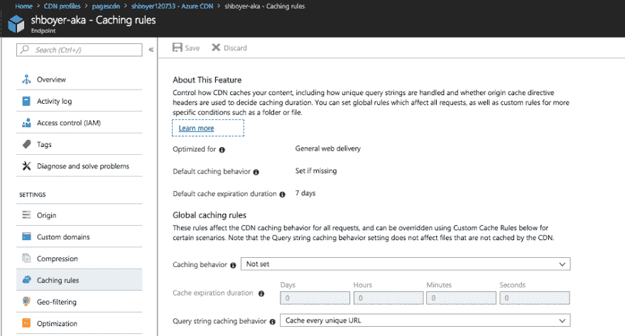
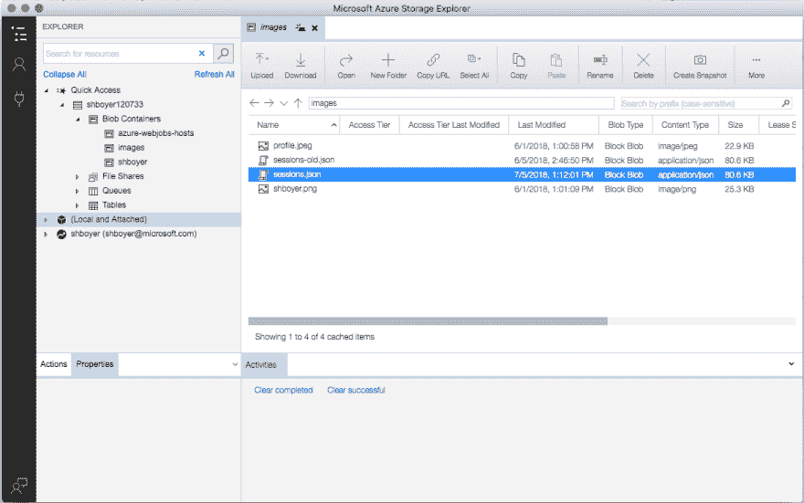
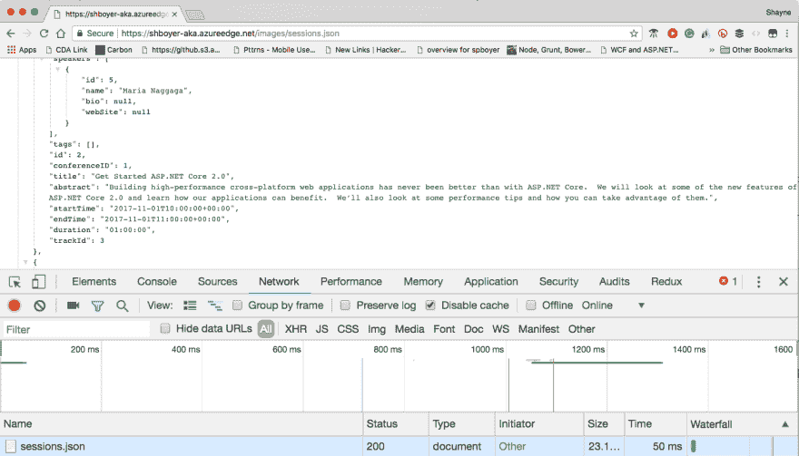

# 使用无服务器功能和 CDN 来加速 API 数据调用

> 原文：<https://dev.to/azure/use-serverless-functions-and-cdn-to-speed-up-api-data-calls-595c>

[T2】](https://res.cloudinary.com/practicaldev/image/fetch/s--LMVNC0a4--/c_limit%2Cf_auto%2Cfl_progressive%2Cq_auto%2Cw_880/http://tattoocoder.com/conteimg/2018/07/pablo--3-.png)

ASP.NET 核心 2.1 增加了一些伟大的功能，使外部 API 调用更容易管理时，有网络故障，或服务本身可能会关闭。Scott Hanselman [有一系列很棒的帖子](https://www.hanselman.com/blog/HttpClientFactoryForTypedHttpClientInstancesInASPNETCore21.aspx)，他更新了这些帖子来利用这些特性。

*   [docs.microsoft.com](https://blogs.msdn.microsoft.com/webdev/2018/02/28/asp-net-core-2-1-preview1-introducing-httpclient-factory/?WT.mc_id=none-devto-shboyer)关于 HttpClientFactory 和[文件的公告](https://docs.microsoft.com/aspnet/core/fundamentals/http-requests?view=aspnetcore-2.1&WT.mc_id=none-devto-shboyer)
*   [下载。网络核心 2.1](https://www.microsoft.com/net/download?WT.mc_id=none-devto-shboyer)

使用 Polly 我们可以建立一个重试策略，规定尝试的次数和间隔。

```
services.AddHttpClient<MyClient>().  
    AddTransientHttpErrorPolicy(policyBuilder => policyBuilder.CircuitBreakerAsync(
            handledEventsAllowedBeforeBreaking: 2,
            durationOfBreak: TimeSpan.FromMinutes(1)
    )); 
```

Enter fullscreen mode Exit fullscreen mode

当我通读[文档](https://docs.microsoft.com/aspnet/core/fundamentals/http-requests?view=aspnetcore-2.1&WT.mc_id=none-devto-shboyer)并对 ASP.NET 核心研讨会进行修改时，我突然想到将这项工作推到云端。

在我们的工坊 app 里；例如，当请求页面时，服务器向 API 发送另一个请求来获取会话数据。尽管这是一个异步请求，应用程序前端仍然在等待数据来呈现视图。

我们可能必须处理的其他问题:

*   API 是否正在运行或可用
*   缓存，我们需要再次命中这些数据，还是每次请求都要命中
*   延迟，是服务还是网络慢

HttpClientFactory 和 Polly 结合起来可以解决大部分或所有这些情况(缓存除外)。

我宁愿为数据选择一个可靠的端点，就像我为 bootstrap 所做的那样。

### 使用 CDN

对于我们的许多网络资源，我们已经信任 CDNs(内容分发网络)。前端资产，如 css、javascript、字体，当然还有图像，都是非常常见的。他们在世界各地都有靠近用户的服务器，他们可以从靠近用户的服务器提供网站的静态内容。所以为什么不把你的数据也放在那里呢，只要它不会经常改变。

我用了不到 5 分钟的时间在 Azure 中创建了一个 [CDN 来存储我的图片，下面是如何完成的视频。](https://docs.microsoft.com/azure/cdn?WT.mc_id=none-devto-shboyer)

[https://www.youtube.com/embed/jYb5YLNY8nk](https://www.youtube.com/embed/jYb5YLNY8nk)

几个设置，以确保缓存是唯一的应用程序正在拉的数据。对于我的应用程序，我将 CDN 设置为缓存每个唯一的 URL。

[T2】](https://res.cloudinary.com/practicaldev/image/fetch/s--r5JGLCoa--/c_limit%2Cf_auto%2Cfl_progressive%2Cq_auto%2Cw_880/http://tattoocoder.com/conteimg/2018/07/Screen-Shot-2018-07-05-at-5.16.45-PM.png)

查看更多关于缓存及其工作原理的。另一个优势是 [Azure CDN 默认情况下也支持 HTTP/2](https://docs.microsoft.com/azure/cdn/cdn-http2?WT.mc_id=none-devto-shboyer) ，无需配置，这是免费的另一个优势。

现在我们的 CDN 和设置已经完成，我们需要在那里获取数据。

### 使用无服务器 Azure 函数获取和上传数据

我决定用一个【Azure 定时器功能】([https://docs . Microsoft . com/en-us/Azure/Azure-functions/functions-create-scheduled-Function？wt . MC \ _ id = none-devto-shboyer](https://docs.microsoft.com/en-us/azure/azure-functions/functions-create-scheduled-function?WT.mc%5C_id=none-devto-shboyer)，并设置为每 2 分钟运行一次。

> 在这个例子中，我使用的是。NET 核心和目标 [Azure 功能 V2 运行时](https://docs.microsoft.com/azure/azure-functions/functions-run-local?WT.mc_id=none-devto-shboyer)。

*   `CloudBlockBlob` -输出流
*   `[Blob("images/sessions.json", FileAccess.Write)]` -绑定我们的存储帐户，这也是 CDN 设置指向的位置。`images`是**文件夹**还是**容器**。

```
using System;  
using System.IO;  
using System.Net.Http;  
using System.Text;  
using System.Threading.Tasks;  
using Microsoft.Azure.WebJobs;  
using Microsoft.Azure.WebJobs.Host;  
using Microsoft.WindowsAzure.Storage.Blob;

namespace Workshop.Function  
{
  public static class cdn_cache_thing
  {
    private static HttpClient client = new HttpClient { BaseAddress = new Uri("https://aspnetcorews-backend.azurewebsites.net") };

    [FunctionName("cdn-cache-thing")]
    public static async Task Run(
        [TimerTrigger("0 */2 * * * *")]TimerInfo myTimer,
        [Blob("images/sessions.json", FileAccess.Write)] CloudBlockBlob sessionFile,
        TraceWriter log)
    {
      using (var response = await client.GetAsync("/api/Sessions"))
      {
        var responseStream = await response.Content.ReadAsStreamAsync();
        sessionFile.Properties.ContentType = "application/json";
        await sessionFile.UploadFromStreamAsync(responseStream);
      }
    }
  }
} 
```

Enter fullscreen mode Exit fullscreen mode

在一个 **local.settings.json** 文件中，设置了一个到我们的存储的连接字符串。在门户中，此连接存储在应用程序设置中。

```
{
    "IsEncrypted": false,
    "Values": {
        "AzureWebJobsStorage": "DefaultEndpointsProtocol=https;AccountName=shboyer... 
```

Enter fullscreen mode Exit fullscreen mode

每 2 分钟触发一次事件，并在存储容器中创建一个文件。使用 [Azure Storage Explorer](https://azure.microsoft.com/features/storage-explorer/?WT.mc_id=none-devto-shboyer) ，我可以看到文件的细节。

[T2】](https://res.cloudinary.com/practicaldev/image/fetch/s--AvmDvamq--/c_limit%2Cf_auto%2Cfl_progressive%2Cq_auto%2Cw_880/http://tattoocoder.com/conteimg/2018/07/Screen-Shot-2018-07-05-at-5.44.07-PM.png)

使用浏览器中的 CDN 端点获取数据。第一次 GET 是 **50ms** ，每增加一次 **GET** 是 **~7ms** 。

[T2】](https://res.cloudinary.com/practicaldev/image/fetch/s--_TlY795p--/c_limit%2Cf_auto%2Cfl_progressive%2Cq_auto%2Cw_880/http://tattoocoder.com/conteimg/2018/07/Screen-Shot-2018-07-05-at-5.47.25-PM.png)

*   [下载存储浏览器](https://azure.microsoft.com/features/storage-explorer/?WT.mc_id=none-devto-shboyer)浏览您的资产。

### 思想？

这是我过去在控制台应用程序中使用的一种模式，将数据推到边缘，减轻后端服务器的工作。

我可以控制缓存、处理错误、处理任何下游服务中的变化(如果 API 发生变化),同时保持我的前端应用程序快速运行。