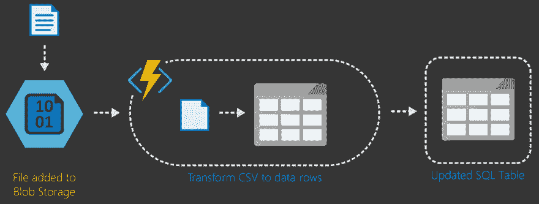

# 将无服务器云用于 ETL 场景

> 原文：<https://dev.to/jeremylikness/use-the-serverless-cloud-for-etl-scenarios-1nad>

#### 利用 Azure 功能的真实场景

*无服务器*的本质是*少服务器*。服务器的细节被抽象出来，开发人员能够专注于代码，而不会陷入基础设施问题。提取、转换和加载(ETL)是企业应用程序中的一个常见场景，无服务器应用程序具有独特的优势。开发人员能够处理文件上传，设置计时器和时间表，并使用无服务器运行转换，而无需接触硬件，安装第三方服务或编写自定义轮询软件。

 

<figcaption>常见的 ETL 场景通过本演练解决</figcaption>

有更好的办法！尽管我很喜欢谈论和写关于无服务器的东西，但我仍然相信了解它是什么以及它的价值的最好方法是亲自动手。为了给你一个完整的端到端场景，我写了一个演练并发布到 GitHub 上。

[JeremyLikness/azure-fn-file-process-hol](https://github.com/JeremyLikness/azure-fn-file-process-hol)

本实验将向您展示与无服务器应用程序开发相关的所有功能和工作流程。您将:

1.  在本地创建一个[无服务器 Azure 函数](https://jlik.me/cac),并使用跨平台函数主机在您的机器上调试它(不需要互联网)
2.  设置一个触发器来自动检测文件何时上传到文件存储——不需要轮询(您还将使用 Azure 存储模拟器在本地测试这一点)
3.  创建一个代表常见场景的本地 SQL 数据库:*遗留本地数据库*
4.  通过解析 CSV 文件和向数据库插入新记录，了解如何在 Azure 函数中使用[实体框架](https://jlik.me/cah)
5.  创建一个云托管的 Azure SQL 数据库，并将本地数据库迁移到云中
6.  将您的本地代码部署到 Azure
7.  完全从云中运行整个流程，无需配置任何硬件，也无需咨询数据库管理员

如果前面的列表包含了您感兴趣并想了解更多的场景，请在您的时间表中抽出一个小时，直接参加的[实践活动！](https://github.com/JeremyLikness/azure-fn-file-process-hol)

[T2】](https://res.cloudinary.com/practicaldev/image/fetch/s--u6zXBAsP--/c_limit%2Cf_auto%2Cfl_progressive%2Cq_66%2Cw_880/https://cdn-images-1.medium.com/max/197/1%2AKwXn3ElS7vnWIk8lNVhBsA.gif)

* * *