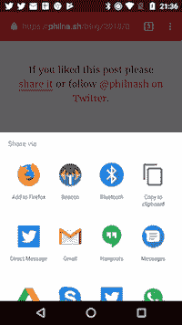

# 通过 web 组件轻松使用 web 共享 API

> 原文：<https://dev.to/philnash/use-the-web-share-api-easily-with-web-components-ido>

我是[网络共享 API](https://developer.mozilla.org/en-US/docs/Web/API/Navigator/share) 的粉丝，但我对[最初实现的 API](/philnash/the-web-share-api) 并不满意。这对于一个非常简单的 API 来说有点复杂。我想要一些更具声明性的、更容易使用的东西，当 share API 不可用时，可以有一个更通用的后备。

在过去的一年里，我一直在断断续续地研究 web 组件，我想看看我是否能开发出一个组件，让 web share API 的使用变得非常简单。我想我已经做到了，我希望你喜欢它。

## `<web-share-wrapper>`

[T2】](https://res.cloudinary.com/practicaldev/image/fetch/s--sUeXQt1G--/c_limit%2Cf_auto%2Cfl_progressive%2Cq_auto%2Cw_880/https://philna.sh/assets/posts/web-share-wrapper/android-example-4bb48334a880f10b9f0785422b8eb73ef843b59288a7d198c56c8eb9a9e44f8d.png)

我已经构建了一个名为`<web-share-wrapper>`的 web 组件。它是一个包装器，因为它旨在包装您可能已经用作各种社交网络的共享按钮的任何现有元素，并用使用 web share API 的单个元素来替换它们。

如果你在 Android 上使用 Chrome(目前唯一支持 web share API 的浏览器),那么你可以查看一下正在运行的`<web-share-wrapper>`。要么滚动到这篇文章的底部并点击分享链接，要么看一看[回购](https://philnash.github.io/web-share-wrapper/)中的例子。

### 使用`<web-share-wrapper>`

GitHub 上的[自述文件中有使用`<web-share-wrapper>`的说明，但这里有一个简单的例子。](https://github.com/philnash/web-share-wrapper/blob/master/README.md) 

```
<web-share-wrapper text="Share" sharetext="Check out the web-share-wrapper web component" shareurl="https://github.com/philnash/web-share-wrapper">
  <a href="https://twitter.com/intent/tweet/?text=Check%20out%20%40philnash's%20web-share-wrapper%20web%20component&amp;url=https%3A%2F%2Fgithub.com%2Fphilnash%2Fweb-share-wrapper">Share on Twitter</a>
</web-share-wrapper> 
```

如果 web share API 不可用，上面的 HTML 将只是一个通过 [Twitter tweet intent](https://dev.twitter.com/web/tweet-button/web-intent) 共享项目的链接。如果 web 共享 API 是可用的，那么 web 组件将会启动，并用一个按钮替换该链接，单击该按钮将会调用 web 共享 API。按钮文本由`text`属性提供，`sharetext`属性设置共享的主体，`shareurl`设置共享的链接。

按钮被注入到常规 DOM 中，而不是[阴影 DOM](https://developer.mozilla.org/en-US/docs/Web/Web_Components/Using_shadow_DOM) ，因此您可以使用常规 CSS 对其进行样式化。

### 喜欢上模板

如果普通按钮不是你的风格，`<web-share-wrapper>`也支持使用 HTML 模板。不使用`text`属性来设置按钮文本，而是使用一个`template`属性来指向页面上一个`<template>`的`id`,`<web-share-wrapper>`将水合那个`<template>`并将其插入到内容的位置。

例如，下面的代码将使用一个`<a>`而不是一个`<button>` :

```
<template id="link">
  <a>Share link</a>
</template>

<web-share-wrapper template="link" sharetext="Check out the web-share-wrapper web component" shareurl="https://github.com/philnash/web-share-wrapper">
  <a href="https://twitter.com/intent/tweet/?text=Check%20out%20%40philnash's%20web-share-wrapper%20web%20component&amp;url=https%3A%2F%2Fgithub.com%2Fphilnash%2Fweb-share-wrapper">Share on Twitter</a>
</web-share-wrapper> 
```

同样，您可以随意设置模板内容的样式。repo 中的[示例显示了一个带有图标](https://philnash.github.io/web-share-wrapper/)的精美按钮。

## 安装`<web-share-wrapper>`

web 组件被发布到 Bower，您可以使用:
将它安装到项目中

```
bower install --save web-share-wrapper 
```

我正在研究发布这个 web 组件的其他方式，虽然 webcomponents.org 似乎倾向于发布给鲍尔，但这似乎不是一个项目的最佳长期计划。支持国家预防机制似乎是最重要的下一步。

## 你怎么看？

现在，您可以声明性地使用 web 共享 API，只需一个 web 组件。我很想知道你对这是如何实现的想法，以及你是否认为这是一个好主意。请通过 Twitter[@ philnash](https://twitter.com/philnash)或 GitHub 回购的[问题通知我。](https://github.com/philnash/web-share-wrapper/issues)

* * *

*[用 web 组件轻松使用 web share API](https://philna.sh/blog/2018/04/25/web-share-api-with-web-components/)原载于[philna . sh](https://philna.sh)2018 年 4 月 25 日。*