# 使用 TypeScript 通过 Express 构建节点 API

> 原文：<https://dev.to/oktadev/use-typescript-to-build-a-node-api-with-express-3g8d>

不管你喜不喜欢，自 1995 年以来，JavaScript 就一直在帮助开发者推动互联网的发展。在这段时间里，JavaScript 的使用已经从小型用户体验增强发展到复杂的全栈应用，在服务器上使用 Node.js，在客户端使用 Angular、React 或 Vue 等许多框架中的一个。

今天，构建大规模的 JavaScript 应用程序仍然是一个挑战。越来越多的团队转向 TypeScript 来补充他们的 JavaScript 项目。

Node.js 服务器应用程序也可以从使用 TypeScript 中受益。本教程的目标是向您展示如何使用 TypeScript 和 Express 构建一个新的 Node.js 应用程序。

## 为打字稿的情况

作为一名 web 开发人员，我很久以前就不再抵制 JavaScript 了，并且越来越欣赏它的灵活性和无处不在。ES2015 及更高版本中添加的语言功能显著提高了其实用性，并减少了编写应用程序时的常见挫折。

然而，更大的 JavaScript 项目需要 ESLint 这样的工具来捕捉常见错误，并且需要更好的训练来用有用的测试来饱和代码库。与任何软件项目一样，包含同行评审过程的健康的团队文化可以提高质量，并防止问题蔓延到项目中。

使用 TypeScript 的主要好处是在错误进入生产之前捕捉更多的错误，并使处理代码库变得更容易。

TypeScript 不是一种不同的语言。它是 JavaScript 的一个灵活的超集，可以描述可选的数据类型。所有“标准”和有效的 JavaScript 也是有效的类型脚本。你想拨多拨少都可以。

一旦您将 TypeScript 编译器或 TypeScript 插件添加到您最喜欢的代码编辑器中，就会立即获得安全和生产率方面的好处。TypeScript 可以提醒您拼写错误的函数和属性，检测向函数传递错误类型或错误数量的参数，并提供更智能的自动完成建议。

## 用 TypeScript 和 Node.js 构建一个吉他库存应用

在吉他手中，有一个每个人都应该理解的笑话。

> 问:“你*需要*几把吉他？”
> 
> 答:“ *n* + 1。永远多一个。”

在本教程中，您将创建一个新的 Node.js 应用程序来跟踪吉他库存。简而言之，本教程使用 [Node.js](https://nodejs.org) 与 [Express](https://expressjs.com/) 、 [EJS](https://github.com/mde/ejs) 和 [PostgreSQL](https://www.postgresql.org/) ，前端使用 [Vue](https://vuejs.org/) 、 [Materialize](https://materializecss.com/) 和 [Axios](https://github.com/axios/axios) ，使用 [Okta](https://developer.okta.com/signup/) 进行帐户注册和授权，使用 [TypeScript](https://www.typescriptlang.org/) 来管理 JavaScripts！

[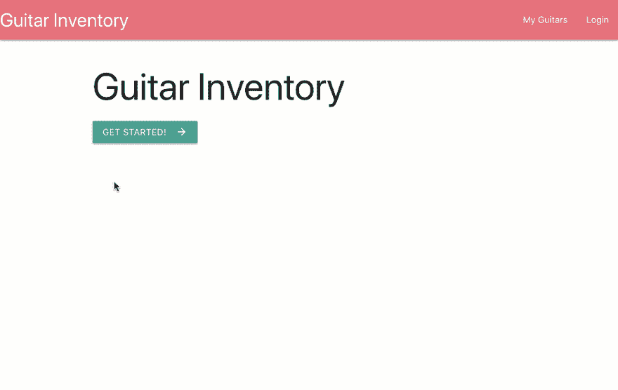T2】](https://res.cloudinary.com/practicaldev/image/fetch/s--lue4O80g--/c_limit%2Cf_auto%2Cfl_progressive%2Cq_66%2Cw_880/https://developer.okta.com/assets-jekyll/blog/node-express-typescript/guitar-inventory-demo-fbf182ae3ad39145b176782b884665be632f944e8715d81c10213fbf5a21f504.gif)

## 创建你的 Node.js 项目

打开终端(Mac/Linux)或命令提示符(Windows)并键入以下命令:

```
node --version 
```

如果你遇到错误，或者你的 Node.js 版本低于 8，你需要安装 Node.js。在 Mac 或 Linux 上，我建议你首先安装 [nvm](https://github.com/creationix/nvm) 并使用 nvm 安装 Node.js。在 Windows 上，我建议你使用 [Chocolatey](https://chocolatey.org/) 。

确保安装了 Node.js 的最新版本后，为您的项目创建一个文件夹。

```
mkdir guitar-inventory
cd guitar-inventory 
```

使用`npm`初始化一个`package.json`文件。

```
npm init -y 
```

### 您好，世界！

在这个示例应用程序中， [Express](https://expressjs.com/) 用于服务网页和实现 API。使用`npm`安装依赖项。使用以下命令将 Express 添加到您的项目中。

```
npm install express 
```

接下来，在您选择的编辑器中打开项目。

> 如果你还没有喜欢的代码编辑器，我使用并推荐 [Visual Studio 代码](https://code.visualstudio.com/)。VS Code 对 JavaScript 和 Node.js 提供了出色的支持，比如智能代码完成和调试，还有社区提供的大量免费扩展库。

创建一个名为`src`的文件夹。在这个文件夹中，创建一个名为`index.js`的文件。打开文件并添加以下 JavaScript。

```
const express = require( "express" );
const app = express();
const port = 8080; // default port to listen

// define a route handler for the default home page
app.get( "/", ( req, res ) => {
    res.send( "Hello world!" );
} );

// start the Express server
app.listen( port, () => {
    console.log( `server started at http://localhost:${ port }` );
} ); 
```

接下来，更新`package.json`来指导`npm`如何运行您的应用程序。将`main`属性值改为指向`src/index.js`，并将`start`脚本添加到`scripts`对象中。

```
 "main":  "src/index.js",  "scripts":  {  "start":  "node .",  "test":  "echo \"Error: no test specified\" && exit 1"  }, 
```

现在，从终端或命令行，您可以启动应用程序。

```
npm run start 
```

如果一切顺利，您应该会看到这条消息被写入控制台。

```
server started at http://localhost:8080 
```

启动浏览器并导航至`http://localhost:8080`。您应该会看到文本“Hello world！”

[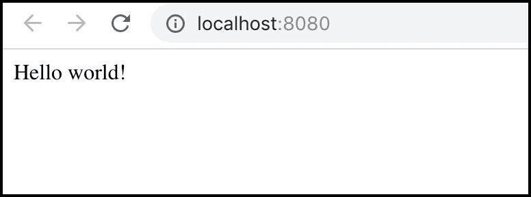T2】](https://res.cloudinary.com/practicaldev/image/fetch/s--waSOVMII--/c_limit%2Cf_auto%2Cfl_progressive%2Cq_auto%2Cw_880/https://developer.okta.com/assets-jekyll/blog/node-express-typescript/hello-world-8ce4cc2733dea3c91e80a673ddd971c6fa0364bc42305096f4c5aa5a4b837704.jpg)

> 注意:要停止 web 应用程序，您可以返回到终端或命令提示符并按下`CTRL+C`。

## 设置 Node.js 项目以使用 TypeScript

第一步是添加 TypeScript 编译器。您可以使用`--save-dev`标志将编译器作为开发人员依赖项进行安装。

```
npm install --save-dev typescript 
```

下一步是添加一个`tsconfig.json`文件。该文件指导 TypeScript 如何将您的 TypeScript 代码编译(转换)成普通的 JavaScript。

在项目的根文件夹中创建一个名为`tsconfig.json`的文件，并添加以下配置。

```
{
    "compilerOptions": {
        "module": "commonjs",
        "esModuleInterop": true,
        "target": "es6",
        "noImplicitAny": true,
        "moduleResolution": "node",
        "sourceMap": true,
        "outDir": "dist",
        "baseUrl": ".",
        "paths": {
            "*": [
                "node_modules/*"
            ]
        }
    },
    "include": [
        "src/**/*"
    ]
} 
```

基于这个`tsconfig.json`文件，TypeScript 编译器将(试图)编译它在`src`文件夹中找到的任何以`.ts`结尾的文件，并将结果存储在名为`dist`的文件夹中。Node.js 使用 CommonJS 模块系统，所以`module`设置的值是`commonjs`。此外，JavaScript 的目标版本是 ES6 (ES2015)，它与 Node.js 的现代版本兼容。

添加`tslint`并创建一个`tslint.json`文件来指导 TypeScript 如何 lint 您的代码也是一个好主意。如果您不熟悉林挺，它是一个代码分析工具，可以提醒您代码中除语法问题以外的潜在问题。

安装`tslint`作为开发者依赖。

```
npm install --save-dev typescript tslint 
```

接下来，在根文件夹中创建一个名为`tslint.json` file 的新文件，并添加以下配置。

```
{
    "defaultSeverity": "error",
    "extends": [
        "tslint:recommended"
    ],
    "jsRules": {},
    "rules": {
        "trailing-comma": [false]
    },
    "rulesDirectory": []
} 
```

接下来，更新您的`package.json`,将`main`改为指向由 TypeScript 编译器创建的新的`dist`文件夹。另外，在启动 Node.js 服务器之前，添加几个脚本来执行 TSLint 和 TypeScript 编译器。

```
 "main": "dist/index.js",
  "scripts": {
    "prebuild": "tslint -c tslint.json -p tsconfig.json --fix",
    "build": "tsc",
    "prestart": "npm run build",
    "start": "node .",
    "test": "echo \"Error: no test specified\" && exit 1"
  }, 
```

最后，将`src/index.js`文件的扩展名从`.js`更改为`.ts`，即 TypeScript 扩展名，并运行启动脚本。

```
npm run start 
```

> 注意:您可以运行 TSLint 和 TypeScript 编译器，而无需使用`npm run build`启动 Node.js 服务器。

### 打字错误

哦不！很快，您可能会看到控制台中记录了一些错误，如下所示。

```
 ERROR: /Users/reverentgeek/Projects/guitar-inventory/src/index.ts[12, 5]: Calls to 'console.log' are not allowed.

src/index.ts:1:17 - error TS2580: Cannot find name 'require'. Do you need to install type definitions for node? Try `npm i @types/node`.

1 const express = require( "express" );
                  ~~~~~~~

src/index.ts:6:17 - error TS7006: Parameter 'req' implicitly has an 'any' type.

6 app.get( "/", ( req, res ) => {
                  ~~~ 
```

您可能会看到的两个最常见的错误是语法错误和缺少类型信息。TSLint 认为使用`console.log`是生产代码的一个问题。最好的解决方案是用诸如 [winston](https://www.npmjs.com/package/winston) 这样的日志框架来代替 console.log 的使用。现在，将下面的注释添加到`src/index.ts`中以禁用该规则。

```
app.listen( port, () => {
    // tslint:disable-next-line:no-console
    console.log( `server started at http://localhost:${ port }` );
} ); 
```

TypeScript 更喜欢使用`import`模块语法而不是`require`，所以您将从把`src/index.ts`中的第一行从
改为
开始

```
const express = require( "express" ); 
```

致:

```
import express from "express"; 
```

### 获取正确的类型

为了帮助 TypeScript 开发人员，库作者和社区贡献者发布了名为 [TypeScript 声明文件](http://www.typescriptlang.org/docs/handbook/declaration-files/consumption.html)的配套库。声明文件被发布到[明确类型化的](https://github.com/DefinitelyTyped/DefinitelyTyped)开源库，或者有时在原始的 JavaScript 库中找到。

更新您的项目，以便 TypeScript 可以使用 Node.js 和 Express 的类型声明。

```
npm install --save-dev @types/node @types/express 
```

接下来，重新运行启动脚本并验证不再有错误。

```
npm run start 
```

## 用物化和 EJS 构建更好的用户界面

您的 Node.js 应用程序有一个很好的开端，但可能还不是最好的。这一步增加了 [Materialize](https://materializecss.com/) ，一个基于谷歌 Material 设计的现代 CSS 框架，以及[嵌入式 JavaScript 模板](https://www.npmjs.com/package/ejs) (EJS)，一种用于 Express 的 HTML 模板语言。物化和 EJS 是一个更好的 UI 的良好基础。

首先，将 EJS 作为一个依赖项安装。

```
npm install ejs 
```

接下来，在`/src`下新建一个文件夹，命名为`views`。在`/src/views`文件夹中，创建一个名为`index.ejs`的文件。将下面的代码添加到`/src/views/index.ejs`中。

```
<!DOCTYPE html>
<html>
<head>
    <meta charset="utf-8" />
    <meta http-equiv="X-UA-Compatible" content="IE=edge">
    Guitar Inventory
    <meta name="viewport" content="width=device-width, initial-scale=1">
    <link rel="stylesheet" href="https://cdnjs.cloudflare.com/ajax/libs/materialize/1.0.0/css/materialize.min.css">
    <link rel="stylesheet" href="https://fonts.googleapis.com/icon?family=Material+Icons">
</head>
<body>
    <div class="container">
        <h1 class="header">Guitar Inventory</h1>
        <a class="btn" href="/guitars"><i class="material-icons right">arrow_forward</i>Get started!</a>
    </div>
</body>
</html> 
```

用以下代码更新`/src/index.ts`。

```
import express from "express";
import path from "path";
const app = express();
const port = 8080; // default port to listen

// Configure Express to use EJS
app.set( "views", path.join( __dirname, "views" ) );
app.set( "view engine", "ejs" );

// define a route handler for the default home page
app.get( "/", ( req, res ) => {
    // render the index template
    res.render( "index" );
} );

// start the express server
app.listen( port, () => {
    // tslint:disable-next-line:no-console
    console.log( `server started at http://localhost:${ port }` );
} ); 
```

### 为 Typescript 添加一个资产构建脚本

TypeScript 编译器负责生成 JavaScript 文件，并将它们复制到`dist`文件夹中。但是，它不会复制项目需要运行的其他类型的文件，例如 EJS 视图样板。为此，创建一个构建脚本，将所有其他文件复制到`dist`文件夹中。

使用这些命令安装所需的模块和 TypeScript 声明。

```
npm install --save-dev ts-node shelljs fs-extra nodemon rimraf npm-run-all
npm install --save-dev @types/fs-extra @types/shelljs 
```

这里是您刚刚安装的模块的快速概述。

| 组件 | 描述 |
| --- | --- |
| [T2`ts-node`](https://www.npmjs.com/package/ts-node) | 用于直接运行 TypeScript 文件。 |
| [shelljs](https://www.npmjs.com/package/shelljs) | 用于执行 shell 命令，如复制文件和删除目录。 |
| [fs-extra](https://www.npmjs.com/package/fs-extra) | 扩展 Node.js 文件系统(`fs`)模块的模块，具有读写 JSON 文件等特性。 |
| [rimraf](https://www.npmjs.com/package/rimraf) | 用于递归删除文件夹。 |
| [NPM-运行-全部](https://www.npmjs.com/package/npm-run-all) | 用于顺序或并行执行多个`npm`脚本。 |
| [节点门](https://www.npmjs.com/package/nodemon) | 在开发环境中运行 Node.js 的便捷工具。Nodemon 监视文件的更改，并在检测到更改时自动重新启动 Node.js 应用程序。不再停止和重新启动 Node.js！ |

在项目的根目录下创建一个名为`tools`的新文件夹。在`tools`文件夹中创建一个名为`copyAssets.ts`的文件。将以下代码复制到该文件中。

```
import * as shell from "shelljs";

// Copy all the view templates
shell.cp( "-R", "src/views", "dist/" ); 
```

### 更新 npm 脚本

将`package.json`中的`scripts`更新为以下代码。

```
 "scripts": {
    "clean": "rimraf dist/*",
    "copy-assets": "ts-node tools/copyAssets",
    "lint": "tslint -c tslint.json -p tsconfig.json --fix",
    "tsc": "tsc",
    "build": "npm-run-all clean lint tsc copy-assets",
    "dev:start": "npm-run-all build start",
    "dev": "nodemon --watch src -e ts,ejs --exec npm run dev:start",
    "start": "node .",
    "test": "echo \"Error: no test specified\" && exit 1"
  }, 
```

> 注意:如果您不熟悉使用`npm`脚本，它们对任何 Node.js 项目都非常强大和有用。脚本可以通过几种方式链接在一起。将脚本链接在一起的一种方法是使用前缀`pre`和`post`。例如，如果您有一个标记为`start`的脚本和另一个标记为`prestart`的脚本，那么在终端执行`npm run start`将首先运行`prestart`，只有在它成功完成后`start`才会运行。

现在运行应用程序并导航到 [http://localhost:8080](http://localhost:8080) 。

```
npm run dev 
```

[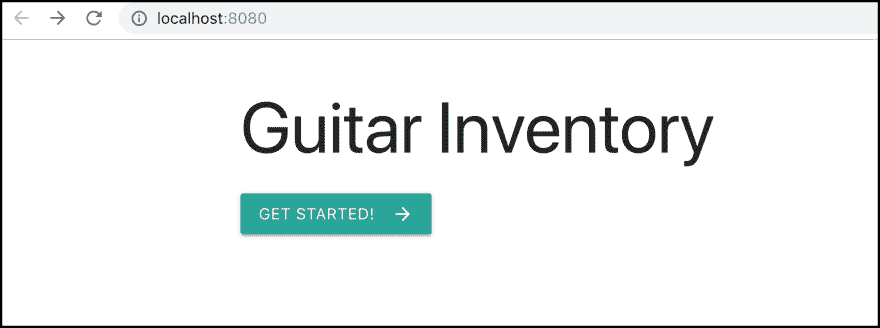T2】](https://res.cloudinary.com/practicaldev/image/fetch/s--C297R6Fx--/c_limit%2Cf_auto%2Cfl_progressive%2Cq_auto%2Cw_880/https://developer.okta.com/assets-jekyll/blog/node-express-typescript/guitar-inventory-home-v2-c1e34ab6f6de0f6a792cbf234675d3d80e14780598cc61b87c9e81b2fecad7a5.jpg)

主页开始好看了！当然，**Get start**按钮会导致一个令人失望的错误消息。别担心！这一问题的解决方案即将推出！

## 管理 Node.js 中配置设置的更好方法

Node.js 应用程序通常使用环境变量进行配置。然而，管理环境变量可能是一件苦差事。管理应用程序配置数据的一个流行模块是 [dotenv](https://www.npmjs.com/package/dotenv) 。

将`dotenv`作为项目依赖项安装。

```
npm install dotenv
npm install --save-dev @types/dotenv 
```

在项目的根文件夹中创建一个名为`.env`的文件，并添加以下代码。

```
# Set to production when deploying to production
NODE_ENV=development

# Node.js server configuration
SERVER_PORT=8080 
```

> 注意:当使用诸如`git`、**的源代码控制系统时，不要**将`.env`文件添加到源代码控制中。每个环境都需要一个定制的`.env`文件。建议您在项目自述文件的`.env`文件或单独的`.env.sample`文件中记录期望值。

现在，更新`src/index.ts`以使用`dotenv`来配置应用服务器端口值。

```
import dotenv from "dotenv";
import express from "express";
import path from "path";

// initialize configuration
dotenv.config();

// port is now available to the Node.js runtime 
// as if it were an environment variable
const port = process.env.SERVER_PORT;

const app = express();

// Configure Express to use EJS
app.set( "views", path.join( __dirname, "views" ) );
app.set( "view engine", "ejs" );

// define a route handler for the default home page
app.get( "/", ( req, res ) => {
    // render the index template
    res.render( "index" );
} );

// start the express server
app.listen( port, () => {
    // tslint:disable-next-line:no-console
    console.log( `server started at http://localhost:${ port }` );
} ); 
```

随着项目的发展，您将使用`.env`获得更多的配置信息。

## 轻松给节点和快递添加认证

向任何应用程序添加用户注册和登录(身份验证)都不是一项简单的任务。好消息是 Okta 让这一步变得非常容易。首先，创建一个免费的 Okta 开发者账户。首先，导航到[developer.okta.com](https://developer.okta.com/)并点击**创建免费账户**按钮，或者点击[注册](https://developer.okta.com/signup/)按钮。

[T2】](https://res.cloudinary.com/practicaldev/image/fetch/s--cHhEseJY--/c_limit%2Cf_auto%2Cfl_progressive%2Cq_auto%2Cw_880/https://developer.okta.com/assets-jekyll/blog/node-express-typescript/add-application-00-cf26225b56ac2e47fdd0a15a4162ce6e830832f0de4ca64248e1f8d14f00bf6d.jpg)

创建您的帐户后，点击顶部的**应用**链接，然后点击**添加应用**。

[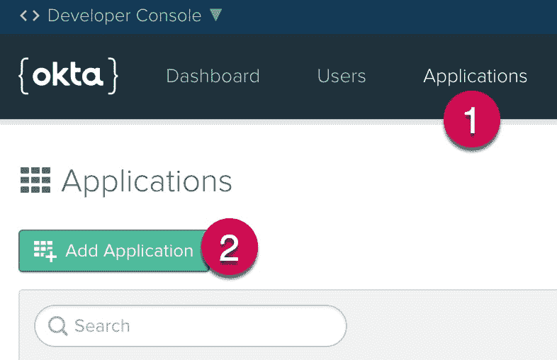T2】](https://res.cloudinary.com/practicaldev/image/fetch/s--14O3CzBK--/c_limit%2Cf_auto%2Cfl_progressive%2Cq_auto%2Cw_880/https://developer.okta.com/assets-jekyll/blog/node-express-typescript/add-application-01-d86e65de962e300f4388ea334bee1e276bf31716148e4037ca312463adeac85e.jpg)

接下来，选择一个**网络应用**，点击**下一步**。

[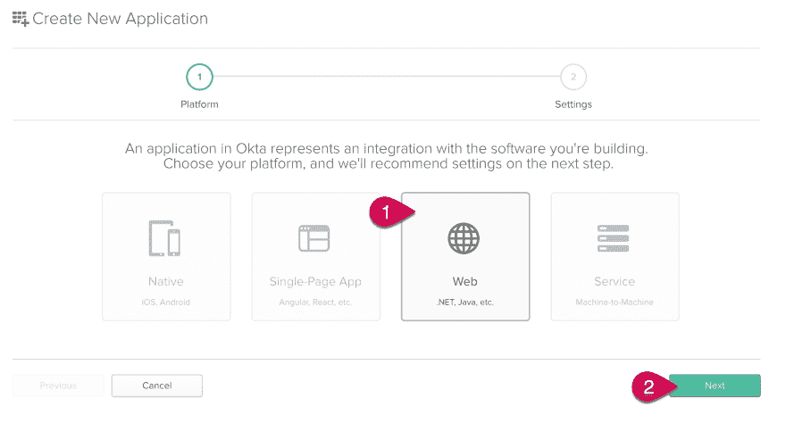T2】](https://res.cloudinary.com/practicaldev/image/fetch/s--4OT17bL4--/c_limit%2Cf_auto%2Cfl_progressive%2Cq_auto%2Cw_880/https://developer.okta.com/assets-jekyll/blog/node-express-typescript/add-application-02-f33bc1ae0379a216ce1e67e2e8a4b892eac8a8c75bdd6f03ff8e7d7818c8d6e2.jpg)

输入应用程序的名称，例如*吉他库存*。验证端口号是否与为本地 web 应用程序配置的端口号相同。然后，点击 **Done** 完成应用程序的创建。

[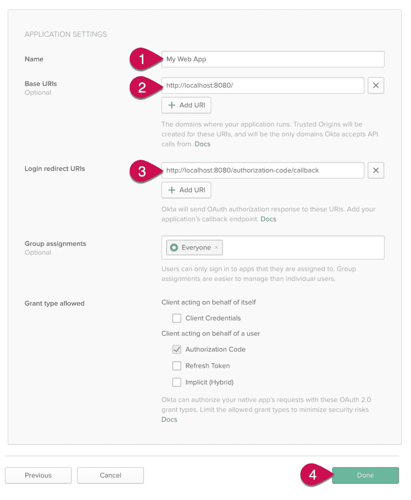T2】](https://res.cloudinary.com/practicaldev/image/fetch/s--c_33Nhxc--/c_limit%2Cf_auto%2Cfl_progressive%2Cq_auto%2Cw_880/https://developer.okta.com/assets-jekyll/blog/node-express-typescript/add-application-03-0cd2f1f09dbeee868c5b696519837b039287d4cbcfb1d0d0acc29c935fb2499a.jpg)

将以下代码复制并粘贴到您的`.env`文件中。

```
# Okta configuration
OKTA_ORG_URL=https://{yourOktaDomain}
OKTA_CLIENT_ID={yourClientId}
OKTA_CLIENT_SECRET={yourClientSecret} 
```

在 Okta 应用程序控制台中，点击新应用程序的 **General** 选项卡，在页面底部找到一个标题为“客户端凭证”的部分复制**客户端 ID** 和**客户端秘密**值，并将其粘贴到您的`.env`文件中，以分别替换`{yourClientId}`和`{yourClientSecret}`。

[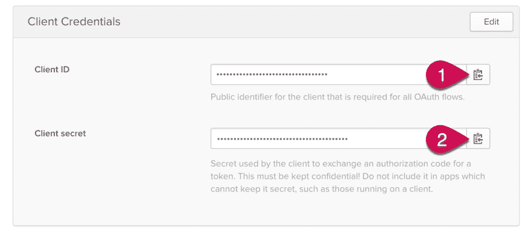T2】](https://res.cloudinary.com/practicaldev/image/fetch/s--tXPOgFH1--/c_limit%2Cf_auto%2Cfl_progressive%2Cq_auto%2Cw_880/https://developer.okta.com/assets-jekyll/blog/node-express-typescript/add-application-04-6cc2fd7e74940d82189de120cfa19db17b78c1183d242379c05ae8b4e669a154.jpg)

### 启用自助注册

Okta 的一个很棒的特性是允许应用程序的用户注册一个帐户。默认情况下，此功能是禁用的，但您可以轻松地启用它。首先，点击**用户**菜单，选择**注册**。

[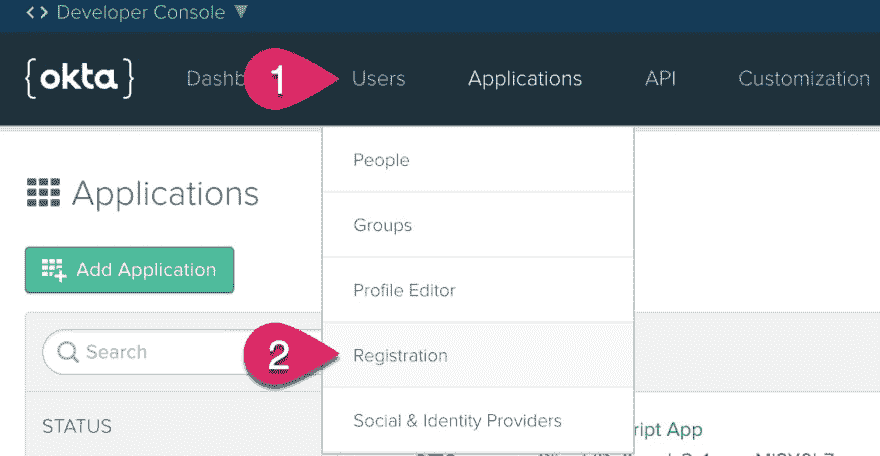T2】](https://res.cloudinary.com/practicaldev/image/fetch/s--jVxzMO88--/c_limit%2Cf_auto%2Cfl_progressive%2Cq_auto%2Cw_880/https://developer.okta.com/assets-jekyll/blog/node-express-typescript/self-service-registration-01-1bfcea8c56976f4c41a28b2ad410e04194db6104ea408ce111c0ffc4f16946c2.jpg)

1.  点击**编辑**按钮。
2.  将**自助登记**改为*启用*。
3.  点击表格底部的**保存**按钮。

[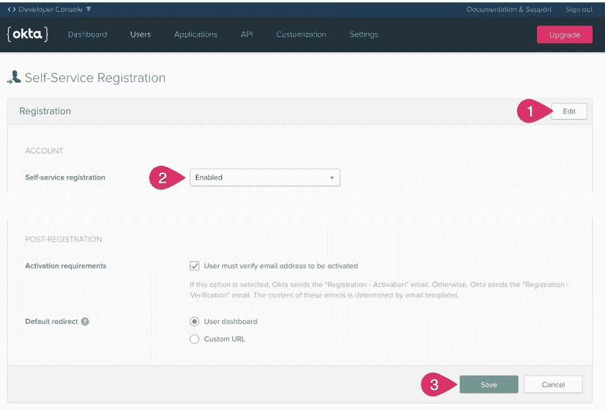T2】](https://res.cloudinary.com/practicaldev/image/fetch/s--xKeLwMAd--/c_limit%2Cf_auto%2Cfl_progressive%2Cq_auto%2Cw_880/https://developer.okta.com/assets-jekyll/blog/node-express-typescript/self-service-registration-02-1bd0c39bb4fceca5f3148bacea52db99aad24503274fc8f2503efa8ea449b2d8.jpg)

### 保护您的 Node.js 应用程序

保护 Node.js 应用程序的最后一步是配置 Express 使用 [Okta OpenId Connect (OIDC)中间件](https://www.npmjs.com/package/@okta/oidc-middleware)。

```
npm install @okta/oidc-middleware express-session
npm install --save-dev @types/express-session 
```

接下来，更新您的`.env`文件，添加一个`HOST_URL`和`SESSION_SECRET`值。您可以将`SESSION_SECRET`值更改为您想要的任何字符串。

```
# Node.js server configuration
SERVER_PORT=8080
HOST_URL=http://localhost:8080
SESSION_SECRET=MySuperCoolAndAwesomeSecretForSigningSessionCookies 
```

在`src`下创建一个名为`middleware`的文件夹。在`src/middleware`文件夹中添加一个名为`sessionAuth.ts`的文件。将下面的代码添加到`src/middleware/sessionAuth.ts`中。

```
import { ExpressOIDC } from "@okta/oidc-middleware";
import session from "express-session";

export const register = ( app: any ) => {
    // Create the OIDC client
    const oidc = new ExpressOIDC( {
        client_id: process.env.OKTA_CLIENT_ID,
        client_secret: process.env.OKTA_CLIENT_SECRET,
        issuer: `${ process.env.OKTA_ORG_URL }/oauth2/default`,
        redirect_uri: `${ process.env.HOST_URL }/authorization-code/callback`,
        scope: "openid profile"
    } );

    // Configure Express to use authentication sessions
    app.use( session( {
        resave: true,
        saveUninitialized: false,
        secret: process.env.SESSION_SECRET
    } ) );

    // Configure Express to use the OIDC client router
    app.use( oidc.router );

    // add the OIDC client to the app.locals
    app.locals.oidc = oidc;
}; 
```

此时，如果你使用的是 VS Code 这样的代码编辑器，你可能会看到 TypeScript 抱怨`@okta/oidc-middleware`模块。在撰写本文时，这个模块还没有正式的 TypeScript 声明文件。现在，在`src`文件夹中创建一个名为`global.d.ts`的文件，并添加以下代码。

```
declare module "@okta/oidc-middleware"; 
```

### 重构路线

随着应用程序的增长，您将添加更多的路由。在项目的一个区域中定义所有路线是一个好主意。在`src`下新建一个文件夹，命名为`routes`。给`src/routes`添加一个新文件，名为`index.ts`。然后，将以下代码添加到这个新文件中。

```
import * as express from "express";

export const register = ( app: express.Application ) => {
    const oidc = app.locals.oidc;

    // define a route handler for the default home page
    app.get( "/", ( req: any, res ) => {
        res.render( "index" );
    } );

    // define a secure route handler for the login page that redirects to /guitars
    app.get( "/login", oidc.ensureAuthenticated(), ( req, res ) => {
        res.redirect( "/guitars" );
    } );

    // define a route to handle logout
    app.get( "/logout", ( req: any, res ) => {
        req.logout();
        res.redirect( "/" );
    } );

    // define a secure route handler for the guitars page
    app.get( "/guitars", oidc.ensureAuthenticated(), ( req: any, res ) => {
        res.render( "guitars" );
    } );
}; 
```

接下来，更新`src/index.ts`以使用您创建的`sessionAuth`和`routes`模块。

```
import dotenv from "dotenv";
import express from "express";
import path from "path";
import * as sessionAuth from "./middleware/sessionAuth";
import * as routes from "./routes";

// initialize configuration
dotenv.config();

// port is now available to the Node.js runtime
// as if it were an environment variable
const port = process.env.SERVER_PORT;

const app = express();

// Configure Express to use EJS
app.set( "views", path.join( __dirname, "views" ) );
app.set( "view engine", "ejs" );

// Configure session auth
sessionAuth.register( app );

// Configure routes
routes.register( app );

// start the express server
app.listen( port, () => {
    // tslint:disable-next-line:no-console
    console.log( `server started at http://localhost:${ port }` );
} ); 
```

接下来，在`src/views/guitars.ejs`为吉他列表视图模板创建一个新文件，并输入以下 HTML。

```
<!DOCTYPE html>
<html>
<head>
    <meta charset="utf-8" />
    <meta http-equiv="X-UA-Compatible" content="IE=edge">
    Guitar Inventory
    <meta name="viewport" content="width=device-width, initial-scale=1">
    <link rel="stylesheet" href="https://cdnjs.cloudflare.com/ajax/libs/materialize/1.0.0/css/materialize.min.css">
    <link rel="stylesheet" href="https://fonts.googleapis.com/icon?family=Material+Icons">
</head>
<body>
    <div class="container">
        <h1 class="header">Guitar Inventory</h1>
        <p>Your future list of guitars!</p>
    </div>
</body>
</html> 
```

最后，运行应用程序。

```
npm run dev 
```

> 注意:要验证身份验证是否按预期工作，请打开新的浏览器或使用私人/匿名浏览器窗口。

点击**开始**按钮。如果一切顺利，用你的 Okta 账号登录，Okta 应该会自动把你重定向回“吉他列表”页面！

[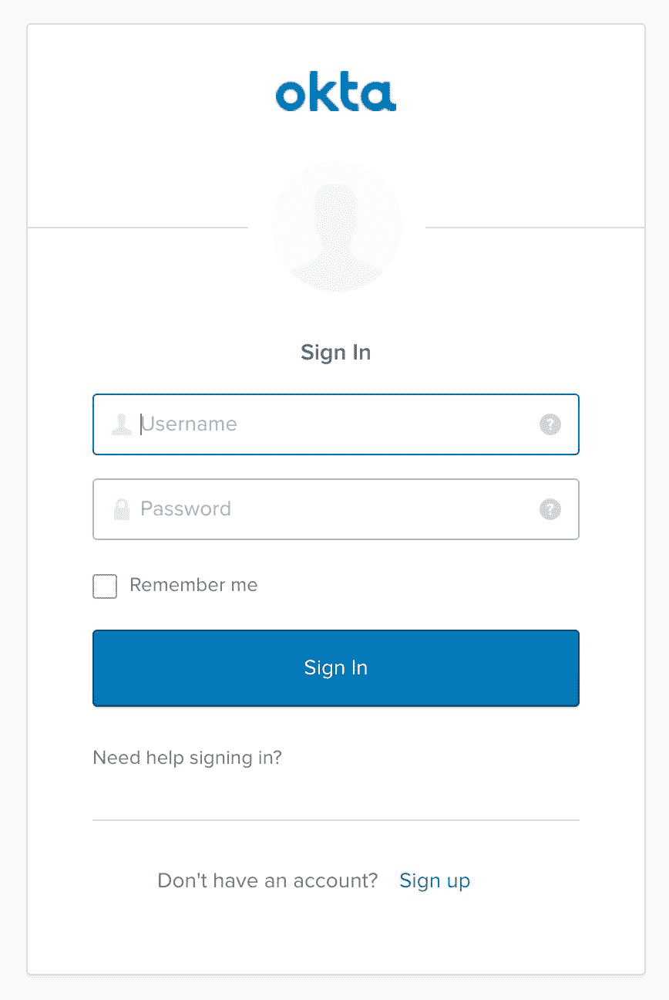T2】](https://res.cloudinary.com/practicaldev/image/fetch/s--9ERq1s7X--/c_limit%2Cf_auto%2Cfl_progressive%2Cq_auto%2Cw_880/https://developer.okta.com/assets-jekyll/blog/node-express-typescript/okta-login-583aabef4fceba1bcc16fe458adf096e631fbb30ff20810b2a458f66a7abdbe3.jpg)

## 给你的 Node + Typescript App 添加导航菜单

使用身份验证，您可以利用从 Okta 返回的用户配置文件信息。OIDC 中间件自动为每个请求附加一个`userContext`对象和一个`isAuthenticated()`函数。这个`userContext`有一个`userinfo`属性，该属性包含类似于以下对象的信息。

```
{ 
  sub: '00abc12defg3hij4k5l6',
  name: 'First Last',
  locale: 'en-US',
  preferred_username: 'account@company.com',
  given_name: 'First',
  family_name: 'Last',
  zoneinfo: 'America/Los_Angeles',
  updated_at: 1539283620 
} 
```

第一步是获取用户配置文件对象，并将其作为数据传递给视图。用以下代码更新`src/routes/index.ts`。

```
import * as express from "express";

export const register = ( app: express.Application ) => {
    const oidc = app.locals.oidc;

    // define a route handler for the default home page
    app.get( "/", ( req: any, res ) => {
        const user = req.userContext ? req.userContext.userinfo : null;
        res.render( "index", { isAuthenticated: req.isAuthenticated(), user } );
    } );

    // define a secure route handler for the login page that redirects to /guitars
    app.get( "/login", oidc.ensureAuthenticated(), ( req, res ) => {
        res.redirect( "/guitars" );
    } );

    // define a route to handle logout
    app.get( "/logout", ( req: any, res ) => {
        req.logout();
        res.redirect( "/" );
    } );

    // define a secure route handler for the guitars page
    app.get( "/guitars", oidc.ensureAuthenticated(), ( req: any, res ) => {
        const user = req.userContext ? req.userContext.userinfo : null;
        res.render( "guitars", { isAuthenticated: req.isAuthenticated(), user } );
    } );
}; 
```

在`src/views`下新建一个文件夹，命名为`partials`。在这个文件夹中创建一个名为`nav.ejs`的新文件。将下面的代码添加到`src/views/partials/nav.ejs`中。

```
<nav>
    <div class="nav-wrapper">
        <a href="/" class="brand-logo"><% if ( user ) { %><%= user.name %>'s <% } %>Guitar Inventory</a>
        <ul id="nav-mobile" class="right hide-on-med-and-down">
            <li><a href="/guitars">My Guitars</a></li>
            <% if ( isAuthenticated ) { %>
            <li><a href="/logout">Logout</a></li>
            <% } %>
            <% if ( !isAuthenticated ) { %>
            <li><a href="/login">Login</a></li>
            <% } %>
        </ul>
    </div>
</nav> 
```

修改`src/views/index.ejs`和`src/views/guitars.ejs`文件。紧跟在`<body>`标签之后，插入下面的代码。

```
<body>
    <% include partials/nav %> 
```

有了这些更改，您的应用程序现在在顶部有了一个导航菜单，它会根据用户的登录状态而变化。

[T2】](https://res.cloudinary.com/practicaldev/image/fetch/s--Wo5KRCZ4--/c_limit%2Cf_auto%2Cfl_progressive%2Cq_auto%2Cw_880/https://developer.okta.com/assets-jekyll/blog/node-express-typescript/navigation-42e6b6e3425a089c4f6d504d85e1c8e17a2ff43e0f6b4a6c00b6a0adcf39b49a.jpg)

## 用 Node 和 PostgreSQL 创建 API

下一步是将 API 添加到吉他库存应用程序中。然而，在继续之前，您需要一种存储数据的方法。

### 创建一个 PostgreSQL 数据库

本教程使用 [PostgreSQL](https://www.postgresql.org/) 。为了使事情变得更简单，使用 [Docker](https://www.docker.com) 来设置 PostgreSQL 的一个实例。如果你还没有安装 Docker，你可以遵循[安装指南](https://docs.docker.com/install/#supported-platforms)。

安装 Docker 后，运行以下命令下载最新的 PostgreSQL 容器。

```
docker pull postgres:latest 
```

现在，运行这个命令来创建一个 PostgreSQL 数据库服务器的实例。请随意更改管理员密码值。

```
docker run -d --name guitar-db -p 5432:5432 -e 'POSTGRES_PASSWORD=p@ssw0rd42' postgres 
```

> 注意:如果您已经在本地安装了 PostgreSQL，您将需要更改`-p`参数，以将端口 5432 映射到一个与您现有的 PostgreSQL 实例不冲突的不同端口。

下面是对之前 Docker 参数的快速解释。

| 参数 | 描述 |
| --- | --- |
| -d | 这将在守护模式下启动容器，因此它在后台运行。 |
| –姓名 | 这为您的 Docker 容器提供了一个友好的名称，这对于停止和启动容器非常有用 |
| -p | 这将主机(您的计算机)端口 5432 映射到容器的端口 5432。默认情况下，PostgreSQL 侦听 TCP 端口 5432 上的连接。 |
| -e | 这将在容器中设置一个环境变量。在本例中，管理员密码是`p@ssw0rd42`。您可以根据需要将该值更改为任何密码。 |
| postgres | 最后一个参数告诉 Docker 使用 postgres 映像。 |

> 注意:如果重新启动计算机，可能需要重新启动 Docker 容器。你可以使用`docker start guitar-db`命令来完成。

使用以下命令安装 PostgreSQL 客户端模块和类型声明。

```
npm install pg pg-promise
npm install --save-dev @types/pg 
```

### 数据库配置设置

将以下设置添加到`.env`文件的末尾。

```
# Postgres configuration
PGHOST=localhost
PGUSER=postgres
PGDATABASE=postgres
PGPASSWORD=p@ssw0rd42
PGPORT=5432 
```

*注意:如果您更改了数据库管理员密码，请确保在该文件中将默认的`p@ssw0rd42`替换为该密码。*

### 添加一个数据库构建脚本

您需要一个构建脚本来初始化 PostgreSQL 数据库。这个脚本应该读入一个`.pgsql`文件，并对本地数据库执行 SQL 命令。

在`tools`文件夹中，创建两个文件:`initdb.ts`和`initdb.pgsql`。将下面的代码复制粘贴到`initdb.ts`中。

```
import dotenv from "dotenv";
import fs from "fs-extra";
import { Client } from "pg";

const init = async () => {
    // read environment variables
    dotenv.config();
    // create an instance of the PostgreSQL client
    const client = new Client();
    try {
        // connect to the local database server
        await client.connect();
        // read the contents of the initdb.pgsql file
        const sql = await fs.readFile( "./tools/initdb.pgsql", { encoding: "UTF-8" } );
        // split the file into separate statements
        const statements = sql.split( /;\s*$/m );
        for ( const statement of statements ) {
            if ( statement.length > 3 ) {
                // execute each of the statements
                await client.query( statement );
            }
        }
    } catch ( err ) {
        console.log( err );
        throw err;
    } finally {
        // close the database client
        await client.end();
    }
};

init().then( () => {
    console.log( "finished" );
} ).catch( () => {
    console.log( "finished with errors" );
} ); 
```

接下来，将下面的代码复制并粘贴到`initdb.pgsql`中。

```
-- Drops guitars table
DROP TABLE IF EXISTS guitars;

-- Creates guitars table
CREATE TABLE IF NOT EXISTS guitars (
    id INT NOT NULL PRIMARY KEY GENERATED ALWAYS AS IDENTITY
    , user_id varchar(50) NOT NULL
    , brand varchar(50) NOT NULL
    , model varchar(50) NOT NULL
    , year smallint NULL 
    , color varchar(50) NULL
); 
```

接下来，向`package.json`添加一个新脚本。

```
 "initdb": "ts-node tools/initdb", 
```

现在，转到终端并运行新脚本。

```
npm run initdb 
```

您应该会在控制台上看到消息`finished`。一个名为`guitars`的新表现在位于您的数据库中！任何时候你想重置你的数据库，只需重新运行脚本。

### 在 Node.js 中添加 API 路由

要完成这个 API，您需要向 Express 添加新的路由来创建、查询、更新和删除吉他。首先，在`src/routes`下创建一个名为`api.ts`的新文件。将以下代码添加到该文件中。

```
import * as express from "express";
import pgPromise from "pg-promise";

export const register = ( app: express.Application ) => {
    const oidc = app.locals.oidc;
    const port = parseInt( process.env.PGPORT || "5432", 10 );
    const config = {
        database: process.env.PGDATABASE || "postgres",
        host: process.env.PGHOST || "localhost",
        port,
        user: process.env.PGUSER || "postgres"
    };

    const pgp = pgPromise();
    const db = pgp( config );

    app.get( `/api/guitars/all`, oidc.ensureAuthenticated(), async ( req: any, res ) => {
        try {
            const userId = req.userContext.userinfo.sub;
            const guitars = await db.any( `
                SELECT
                    id
                    , brand
                    , model
                    , year
                    , color
                FROM guitars
                WHERE user_id = $[userId]
                ORDER BY year, brand, model`, { userId } );
            return res.json( guitars );
        } catch ( err ) {
            // tslint:disable-next-line:no-console
            console.error(err);
            res.json( { error: err.message || err } );
        }
    } );

    app.get( `/api/guitars/total`, oidc.ensureAuthenticated(), async ( req: any, res ) => {
        try {
            const userId = req.userContext.userinfo.sub;
            const total = await db.one( `
            SELECT count(*) AS total
            FROM guitars
            WHERE user_id = $[userId]`, { userId }, ( data: { total: number } ) => {
                return {
                    total: +data.total
                };
            } );
            return res.json( total );
        } catch ( err ) {
            // tslint:disable-next-line:no-console
            console.error(err);
            res.json( { error: err.message || err } );
        }
    } );

    app.get( `/api/guitars/find/:search`, oidc.ensureAuthenticated(), async ( req: any, res ) => {
        try {
            const userId = req.userContext.userinfo.sub;
            const guitars = await db.any( `
                SELECT
                    id
                    , brand
                    , model
                    , year
                    , color
                FROM guitars
                WHERE user_id = $[userId]
                AND ( brand ILIKE $[search] OR model ILIKE $[search] )`,
                { userId, search: `%${ req.params.search }%` } );
            return res.json( guitars );
        } catch ( err ) {
            // tslint:disable-next-line:no-console
            console.error(err);
            res.json( { error: err.message || err } );
        }
    } );

    app.post( `/api/guitars/add`, oidc.ensureAuthenticated(), async ( req: any, res ) => {
        try {
            const userId = req.userContext.userinfo.sub;
            const id = await db.one( `
                INSERT INTO guitars( user_id, brand, model, year, color )
                VALUES( $[userId], $[brand], $[model], $[year], $[color] )
                RETURNING id;`,
                { userId, ...req.body } );
            return res.json( { id } );
        } catch ( err ) {
            // tslint:disable-next-line:no-console
            console.error(err);
            res.json( { error: err.message || err } );
        }
    } );

    app.post( `/api/guitars/update`, oidc.ensureAuthenticated(), async ( req: any, res ) => {
        try {
            const userId = req.userContext.userinfo.sub;
            const id = await db.one( `
                UPDATE guitars
                SET brand = $[brand]
                    , model = $[model]
                    , year = $[year]
                    , color = $[color]
                WHERE
                    id = $[id]
                    AND user_id = $[userId]
                RETURNING
                    id;`,
                { userId, ...req.body } );
            return res.json( { id } );
        } catch ( err ) {
            // tslint:disable-next-line:no-console
            console.error(err);
            res.json( { error: err.message || err } );
        }
    } );

    app.delete( `/api/guitars/remove/:id`, oidc.ensureAuthenticated(), async ( req: any, res ) => {
        try {
            const userId = req.userContext.userinfo.sub;
            const id = await db.result( `
                DELETE
                FROM guitars
                WHERE user_id = $[userId]
                AND id = $[id]`,
                { userId, id: req.params.id }, ( r ) => r.rowCount );
            return res.json( { id } );
        } catch ( err ) {
            // tslint:disable-next-line:no-console
            console.error(err);
            res.json( { error: err.message || err } );
        }
    } );
}; 
```

更新`src/routes/index.ts`以包括新的`api`模块。

```
import * as express from "express";
import * as api from "./api";

export const register = ( app: express.Application ) => {
    const oidc = app.locals.oidc;

    // define a route handler for the default home page
    app.get( "/", ( req: any, res ) => {
        const user = req.userContext ? req.userContext.userinfo : null;
        res.render( "index", { isAuthenticated: req.isAuthenticated(), user } );
    } );

    // define a secure route handler for the login page that redirects to /guitars
    app.get( "/login", oidc.ensureAuthenticated(), ( req, res ) => {
        res.redirect( "/guitars" );
    } );

    // define a route to handle logout
    app.get( "/logout", ( req: any, res ) => {
        req.logout();
        res.redirect( "/" );
    } );

    // define a secure route handler for the guitars page
    app.get( "/guitars", oidc.ensureAuthenticated(), ( req: any, res ) => {
        const user = req.userContext ? req.userContext.userinfo : null;
        res.render( "guitars", { isAuthenticated: req.isAuthenticated(), user } );
    } );

    api.register( app );
}; 
```

最后，更新`src/index.ts`来添加一个新的配置选项，紧跟在创建 Express 应用程序的行之后。这段代码使 Express 能够解析传入的 JSON 数据。

```
const app = express();

// Configure Express to parse incoming JSON data
app.use( express.json() ); 
```

## 用 Vue、Axios 和 Parcel 更新用户界面

API 准备好了。要完成应用程序，您需要向前端添加一些代码来使用 API。您也可以利用 TypeScript 的前端代码。

项目的最后一步使用 [Vue](https://vuejs.org/) 进行前端渲染，使用 [Axios](https://www.npmjs.com/package/axios) 对后端应用编程接口进行 HTTP 调用，以及使用[package](https://www.npmjs.com/package/parcel)来传输文件类型脚本并将所有依赖项捆绑到一个单独的 JavaScript 文件中。

首先，使用以下命令在控制台安装新的依赖项。

```
npm install axios vue materialize-css
npm install --save-dev parcel-bundler @types/axios @types/materialize-css @types/vue 
```

在`src`下新建一个文件夹，命名为`public`。在`src/public`下新建一个文件夹，命名为`js`。在`src/public/js`下创建一个名为`main.ts`的文件，并添加以下代码。

```
import axios from "axios";
import * as M from "materialize-css";
import Vue from "vue";

// tslint:disable-next-line no-unused-expression
new Vue( {
    computed: {
        hazGuitars(): boolean {
            return this.isLoading === false && this.guitars.length > 0;
        },
        noGuitars(): boolean {
            return this.isLoading === false && this.guitars.length === 0;
        }
    },
    data() {
        return {
            brand: "",
            color: "",
            guitars: [],
            isLoading: true,
            model: "",
            selectedGuitar: "",
            selectedGuitarId: 0,
            year: ""
        };
    },
    el: "#app",
    methods: {
        addGuitar() {
            const guitar = {
                brand: this.brand,
                color: this.color,
                model: this.model,
                year: this.year
            };
            axios
                .post( "/api/guitars/add", guitar )
                .then( () => {
                    this.$refs.year.focus();
                    this.brand = "";
                    this.color = "";
                    this.model = "";
                    this.year = "";
                    this.loadGuitars();
                } )
                .catch( ( err: any ) => {
                    // tslint:disable-next-line:no-console
                    console.log( err );
                } );
        },
        confirmDeleteGuitar( id: string ) {
            const guitar = this.guitars.find( ( g ) => g.id === id );
            this.selectedGuitar = `${ guitar.year }  ${ guitar.brand }  ${ guitar.model }`;
            this.selectedGuitarId = guitar.id;
            const dc = this.$refs.deleteConfirm;
            const modal = M.Modal.init( dc );
            modal.open();
        },
        deleteGuitar( id: string ) {
            axios
                .delete( `/api/guitars/remove/${ id }` )
                .then( this.loadGuitars )
                .catch( ( err: any ) => {
                    // tslint:disable-next-line:no-console
                    console.log( err );
                } );
        },
        loadGuitars() {
            axios
                .get( "/api/guitars/all" )
                .then( ( res: any ) => {
                    this.isLoading = false;
                    this.guitars = res.data;
                } )
                .catch( ( err: any ) => {
                    // tslint:disable-next-line:no-console
                    console.log( err );
                } );
        }
    },
    mounted() {
        return this.loadGuitars();
    }
} ); 
```

更新`tsconfig.json`以从后端 Node.js 构建过程中排除`src/public`文件夹。

```
{
    "compilerOptions": {
        "module": "commonjs",
        "esModuleInterop": true,
        "target": "es6",
        "noImplicitAny": true,
        "moduleResolution": "node",
        "sourceMap": true,
        "outDir": "dist",
        "baseUrl": ".",
        "paths": {
            "*": [
                "node_modules/*"
            ]
        }
    },
    "include": [
        "src/**/*"
    ],
    "exclude": [
        "src/public"
    ]
} 
```

在`src/public/js`下创建一个新的`tsconfig.json`文件，并添加以下代码。这个 TypeScript 配置是为了在浏览器中使用而编译`main.ts`。

```
{
    "compilerOptions": {
        "lib": [
            "es6",
            "dom"
        ],
        "noImplicitAny": true,
        "allowJs": true,
        "target": "es5",
        "strict": true,
        "module": "es6",
        "moduleResolution": "node",
        "outDir": "../../../dist/public/js",
        "sourceMap": true
    }
} 
```

接下来，更新`src/index.ts`以配置 Express 来服务来自`public`文件夹的静态文件。在配置 Express 使用`EJS`的代码之后添加这一行。

```
...
// Configure Express to use EJS
app.set( "views", path.join( __dirname, "views" ) );
app.set( "view engine", "ejs" );

// Configure Express to serve static files in the public folder
app.use( express.static( path.join( __dirname, "public" ) ) ); 
```

更新`src/views/guitars.ejs`以添加 Vue 应用程序模板和对`js/main.js`文件的引用。

```
<!DOCTYPE html>
<html>
<head>
    <meta charset="utf-8" />
    <meta http-equiv="X-UA-Compatible" content="IE=edge">
    Guitar Inventory
    <meta name="viewport" content="width=device-width, initial-scale=1">
    <link rel="stylesheet" href="https://cdnjs.cloudflare.com/ajax/libs/materialize/1.0.0/css/materialize.min.css">
    <link rel="stylesheet" href="https://fonts.googleapis.com/icon?family=Material+Icons">
</head>
<body>
    <% include partials/nav %>
    <div class="container">
        <div id="app">
            <div class="row" id="guitarList">
                <h3>Guitar list</h3>
                <table v-if="hazGuitars">
                    <thead>
                        <tr>
                            <th>Year</th>
                            <th>Brand</th>
                            <th>Model</th>
                            <th>Color</th>
                            <th></th>
                        </tr>
                    </thead>
                    <tbody>
                        <tr v-for="guitar in guitars">
                            <td></td>
                            <td></td>
                            <td></td>
                            <td></td>
                            <td>
                                <button id="guitarDelete" @click="confirmDeleteGuitar(guitar.id)" class="btn-small"><i class="material-icons right">delete</i>Delete</button>
                            </td>
                        </tr>
                    </tbody>
                </table>
                <p v-if="noGuitars">No guitars yet!</p>
            </div>
            <div class="row" id="guitarEdit">
                <h3>Add a guitar</h3>
                <form class="col s12" @submit.prevent="addGuitar">
                    <div class="row">
                        <div class="input-field col s6">
                            <input v-model="year" ref="year" placeholder="2005" id="year" type="text" class="validate">
                            <label for="brand">Year</label>
                        </div>
                        <div class="input-field col s6">
                            <input v-model="brand" ref="brand" placeholder="Paul Reed Smith" id="brand" type="text" class="validate">
                            <label for="brand">Brand</label>
                        </div>
                    </div>
                    <div class="row">
                        <div class="input-field col s6">
                            <input v-model="model" ref="model" placeholder="Custom 24" id="model" type="text" class="validate">
                            <label for="model">Model</label>
                        </div>
                        <div class="input-field col s6">
                            <input v-model="color" ref="color" placeholder="Whale Blue" id="color" type="text" class="validate">
                            <label for="model">Color</label>
                        </div>
                    </div>
                    <button id="guitarEditSubmit" class="btn" type="submit"><i class="material-icons right">send</i>Submit</button>
                </form>
            </div>
            <div id="deleteConfirm" ref="deleteConfirm" class="modal">
                <div class="modal-content">
                    <h4>Confirm delete</h4>
                    <p>Delete ?</p>
                </div>
                <div class="modal-footer">
                    <button @click="deleteGuitar(selectedGuitarId)" class="modal-close btn-flat">Ok</button>
                    <button class="modal-close btn-flat">Cancel</button>
                </div>
            </div>
        </div>
    </div>
    <script src="js/main.js"></script></body>
</html> 
```

最后，更新`package.json`以添加新的`parcel`脚本，更新`build`脚本，并为 Vue 添加新的`alias`部分。`alias`部分将包指向正确的 Vue 文件，用`src/public/js/main.ts`进行捆绑。

```
 "scripts": {
    "clean": "rimraf dist/*",
    "copy-assets": "ts-node tools/copyAssets",
    "lint": "tslint -c tslint.json -p tsconfig.json --fix",
    "tsc": "tsc",
    "parcel": "parcel build src/public/js/main.ts -d dist/public/js",
    "build": "npm-run-all clean lint tsc copy-assets parcel",
    "dev:start": "npm-run-all build start",
    "dev": "nodemon --watch src -e ts,ejs --exec npm run dev:start",
    "start": "node .",
    "initdb": "ts-node tools/initdb",
    "test": "echo \"Error: no test specified\" && exit 1"
  },
  "alias": {
    "vue": "./node_modules/vue/dist/vue.common.js"
  }, 
```

现在，重新开始构建，并尝试一下您的新 web 应用程序！

```
npm run dev 
```

[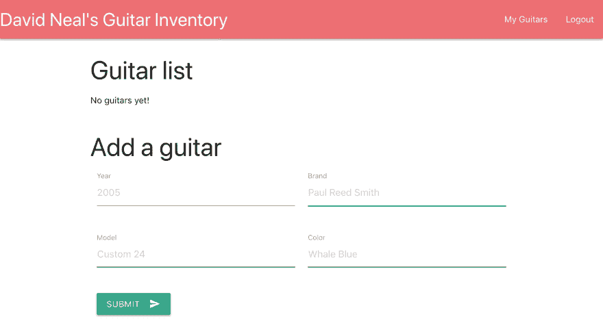T2】](https://res.cloudinary.com/practicaldev/image/fetch/s--3s6nd99a--/c_limit%2Cf_auto%2Cfl_progressive%2Cq_auto%2Cw_880/https://developer.okta.com/assets-jekyll/blog/node-express-typescript/guitar-inventory-empty-01f81fa76b17323e5e8cce52bf85cac0fc66a11686d2c13e893e5a22867ea8c0.jpg)

## 了解更多关于节点和类型脚本的信息

本教程只是触及了 Node.js 和 TypeScript 的皮毛。以下是更多可供探索的资源。

*   [打印学习资源](https://medium.com/@jcreamer898/typescript-learning-resources-b1205a98c47c)作者[乔纳森·克里默](https://twitter.com/jcreamer898)
*   [TypeScript Node Starter](https://github.com/Microsoft/TypeScript-Node-Starter)——微软的一个开源项目
*   [打字稿深度潜水](https://basarat.gitbooks.io/typescript/)—[巴萨拉特·阿里·赛义德](https://twitter.com/basarat)的免费在线书籍
*   [打字稿文档](http://www.typescriptlang.org/docs/home.html)
*   [Vue 类型脚本支持](https://vuejs.org/v2/guide/typescript.html)
*   [简单节点认证](https://dev.to/oktadev/simple-node-authentication-366l-temp-slug-673868)

你可以在 GitHub 上找到已经完成的[吉他库存](https://github.com/oktadeveloper/okta-node-express-typescript-vue-example)项目。

关注我们，了解我们团队的更多精彩内容和更新！你可以在 [Twitter](https://twitter.com/OktaDev) 、[脸书](https://www.facebook.com/oktadevelopers/)和 [LinkedIn](https://www.linkedin.com/company/oktadev/) 上找到我们。有问题吗？请在下面的评论中给我们留言。