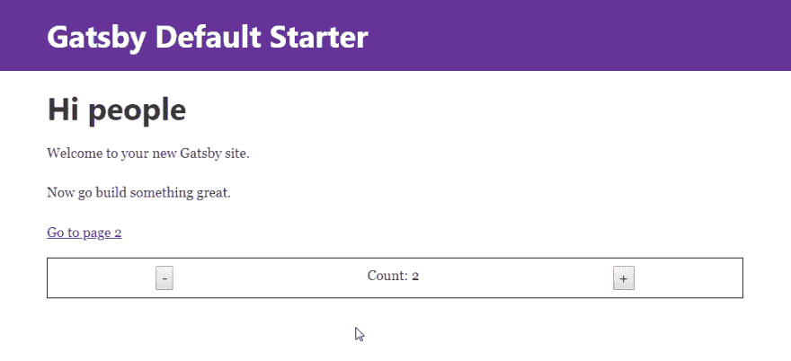

# 使用 Unstated 来管理您的 GatsbyJS 应用程序的状态

> 原文：<https://dev.to/greglobinski/use-unstated-to-manage-the-state-of-your-gatsbyjs-app-143f>

首先你要知道我是[盖茨比](https://www.gatsbyjs.org/)的超级粉丝。我已经用了几个月了。我为它创造了一些[首发](https://github.com/greglobinski?utf8=%E2%9C%93&tab=repositories&q=gatsby-starter&type=&language=)，他们中的一些相当受认可。

对于那些还不知道 GatsbyJS 是什么的人来说，它是 React 的一个静态站点生成器。

如果你已经知道它是什么，你可能也知道重大升级即将到来。盖茨比第二版正在进行中。

因此，几天前我决定熟悉一下即将到来的变化。

有一件事曝光了。

## 布局组件

在**版本 1** 中有`Layout`型组件。如果你的应用程序中只有一个这样的组件，那么它就是整个应用程序的根组件，所有的页面都被渲染成它的`children`。

组件是存储应用程序中心状态的理想位置。

遗憾的是，在**版本 2** 的新架构下，它无法工作。现在`Layouts`都是普通部件。在 v2 中，它们被放在`Page`组件内部，而不是外部。您不能在那里存储中心应用程序状态，因为每次您切换到新页面时，布局组件都会被装载。

这个问题已经被[注意到了](https://github.com/gatsbyjs/gatsby/issues/6127)，我相信很快就会有解决办法。

## 状态容器

但在此之前，我需要一个新的容器来存放我的应用程序的状态。我可以使用 [react-redux](https://github.com/reduxjs/react-redux) ，GatsbyJS [可以很好地使用它](https://github.com/gatsbyjs/gatsby/tree/master/examples/using-redux)。但是我决定寻找新的东西。

毕竟，我只是在玩新的盖茨比，这是一个进一步探索新土地的好机会。

这样就碰到了[未表态的](https://github.com/jamiebuilds/unstated)。

## 未说明

未声明是由 [@jamiebuilds](https://twitter.com/jamiebuilds) 创建的状态容器。

[肯·惠勒](https://twitter.com/ken_wheeler)谈到图书馆时说:

> “当人们说你大多数时候不需要 Redux 时，他们实际上是说你确实需要 Unstated。这就像他妈的马类固醇设置状态"

## GatsbyJS 和 Unstated 在一起

让我们写一些代码。

**注**。每当我使用`yarn`时，如果你愿意，你可以在相应的命令中使用`npm`。

我假设您已经在全球范围内安装了一个 **Gatsby CLI** ，所以您能够使用`gatsby new`命令创建一个 GatsbyJS 网站。如果没有，先读读[这个](https://next.gatsbyjs.org/tutorial/part-one/)。

```
gatsby new gatsby-unstated-example https://github.com/gatsbyjs/gatsby-starter-default.git#v2 
```

Enter fullscreen mode Exit fullscreen mode

请注意 repo url 末尾的`#v2`标志。这意味着我们想要在回购的`v2`分支上安装初始构建。这意味着我们将与 GatsbyJS v2 合作，你应该记得，它仍在**测试版**。

移入新创建的文件夹。

```
cd gatsby-unstated-example 
```

Enter fullscreen mode Exit fullscreen mode

安装`unstated`。

```
yarn add unstated 
```

Enter fullscreen mode Exit fullscreen mode

### 容器

首先，我们必须为我们的状态构建一个容器。在`src/state/`文件夹中创建一个文件`CounterContainer.js`。代码如下。

```
import { Container } from "unstated";

class CounterContainer extends Container {
  state = {
    count: 0
  };

  increment() {
    this.setState({ count: this.state.count + 1 });
  }

  decrement() {
    this.setState({ count: this.state.count - 1 });
  }
}

export default CounterContainer; 
```

Enter fullscreen mode Exit fullscreen mode

类似于什么？它看起来像一个常规的 React 类组件，不是吗？但事实并非如此。

> 在幕后，我们的容器也是事件发射器，我们的应用程序可以订阅更新。当您调用 setState 时，它会触发组件重新呈现，注意不要直接改变这个 setState，否则您的组件将无法重新呈现。

在[文档](https://github.com/jamiebuilds/unstated)中有更多相关信息。

### 提供者

要在 GatsbyJS 站点中使用未声明的**提供者**,您需要挂钩到两个 Gatsby 的扩展点。

一个是`replaceRenderer`，在 Gatsby 的服务器渲染过程中运行。

编辑`gatsby-ssr.js`。

```
import React from "react";
import { Provider } from "unstated";
import { renderToString } from "react-dom/server";

export const replaceRenderer = ({ bodyComponent, replaceBodyHTMLString }) => {
  const ConnectedBody = () => <Provider>{bodyComponent}</Provider>;
  replaceBodyHTMLString(renderToString(<ConnectedBody />));
}; 
```

Enter fullscreen mode Exit fullscreen mode

第二个是`replaceRouterComponent`，它是 Gatsby 浏览器 API 的一部分。编辑`gatsby-browser.js`。

```
import React from "react";
import { Router } from "react-router-dom";
import { Provider } from "unstated";

export const replaceRouterComponent = ({ history }) => {
  const ConnectedRouterWrapper = ({ children }) => (
    <Provider>
      <Router history={history}>{children}</Router>
    </Provider>
  );

  return ConnectedRouterWrapper;
}; 
```

Enter fullscreen mode Exit fullscreen mode

### 订阅

最后一步是订阅状态。

打开`src/components/layout.js`文件，向其中添加两条导入语句。

```
import { Subscribe } from "unstated";
import CounterContainer from "../state/CounterContainer"; 
```

Enter fullscreen mode Exit fullscreen mode

和观察状态的当前值的小界面。

```
<Subscribe to={[CounterContainer]}>
  {counter => (
    <div>
      <button onClick={() => counter.decrement()}>-</button>
      <span> Count: {counter.state.count}</span>
      <button onClick={() => counter.increment()}>+</button>
    </div>
  )}
</Subscribe> 
```

Enter fullscreen mode Exit fullscreen mode

您应该会看到类似这样的内容。

[T2】](https://res.cloudinary.com/practicaldev/image/fetch/s--qpwd9X4k--/c_limit%2Cf_auto%2Cfl_progressive%2Cq_auto%2Cw_880/https://dev.greglobinski.com/static/gatsby-unstated-state-container-d16f54bc6f059b357e1d6f0bdc5f741e-583d6.png)

**Count:** 的值在您切换页面时应该保持不变。

就是这样。你现在有了一个 **GatsbyJS** 应用，它的中央状态由**管理**。