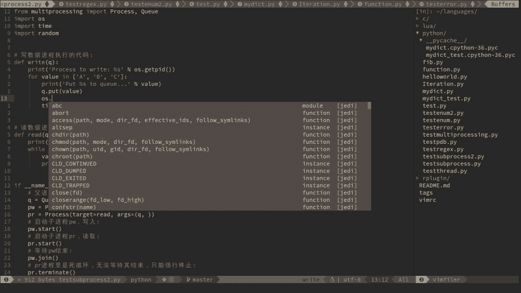
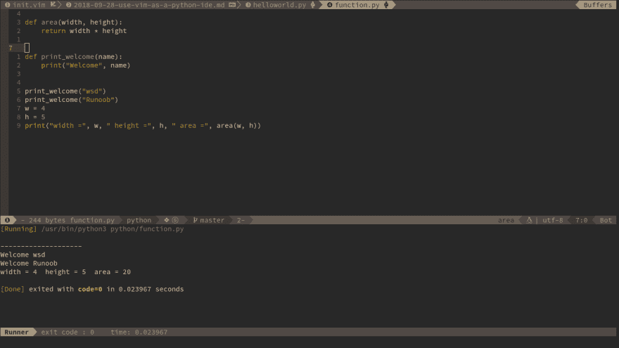
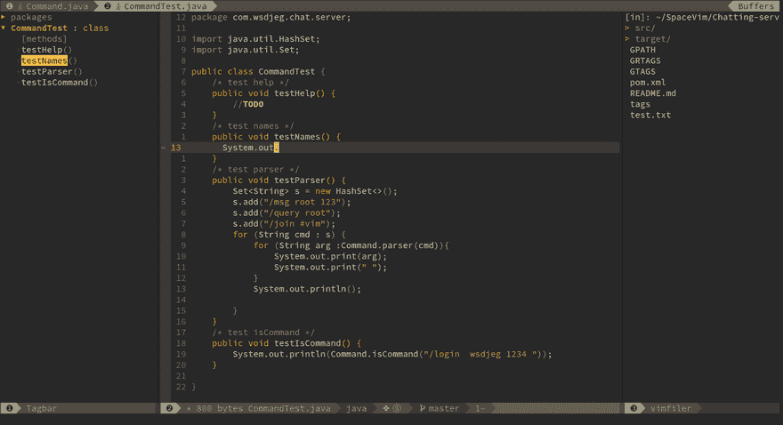

# 将 Vim 用作 Python IDE

> 原文：<https://dev.to/spacevim/use-vim-as-a-python-ide-59n3>

# 使用 Vim 作为 Python IDE

这是将 SpaceVim 用作 python IDE 的通用指南，包括层配置和使用。将涵盖以下每个部分:

*   启用语言层
*   代码完成
*   语法 lint
*   导入包
*   跳转到测试文件
*   运行代码
*   代码格式
*   取代
*   调试 ###启用语言层

要在 SpaceVim 中添加 python 语言支持，需要启用`lang#python`层。只需按`SPC f v d`打开 SpaceVim 配置文件，添加如下配置:

```
[[layers]]
  name = "lang#python" 
```

Enter fullscreen mode Exit fullscreen mode

有关更多信息，您可以阅读 [lang#python](https://spacevim.org/layers/lang/python/) 层文档。

### 代码补全

基于哪个完成引擎被使用，`lang#python`层自动加载 jedi 插件。完成菜单将在您键入时打开。

[T2】](https://res.cloudinary.com/practicaldev/image/fetch/s--aNF9ve0v--/c_limit%2Cf_auto%2Cfl_progressive%2Cq_auto%2Cw_880/https://user-images.githubusercontent.com/13142418/46339650-f5a49280-c665-11e8-86d4-20944ec23098.png)

### 语法线头

1.  neo make-neo Vim/Vim 的异步林挺和 make 框架

我是 neomake 中 javac maker 的维护者，javac maker 支持 maven 项目、gradle 项目或 eclipse 项目。

### 导入包

当编辑 python 文件时，可以自动导入包，移除未使用的包，并格式化包列表。

```
pip install --user isort 
```

Enter fullscreen mode Exit fullscreen mode

### 跳转到测试文件

SpaceVim 使用 vim-project 管理项目中的文件，您可以在项目的根目录下添加一个`.projections.json`，内容如下:

```
{
  "src/*.py": {"alternate": "test/{dirname}/{basename}Test.py"},
  "test/**/Test*.py": {"alternate": "src/{}.py"}
} 
```

Enter fullscreen mode Exit fullscreen mode

通过这种配置，您可以通过命令`:A`在源代码和测试文件之间跳转

### 运行代码

要运行当前脚本，您可以按`SPC l r`，一个分割窗口将被打开，脚本的输出将显示在该窗口中。它异步运行，不会阻塞您的 vim。

[T2】](https://res.cloudinary.com/practicaldev/image/fetch/s--8qMr6BTg--/c_limit%2Cf_auto%2Cfl_progressive%2Cq_auto%2Cw_880/https://user-images.githubusercontent.com/13142418/46293837-1c5fbc00-c5c7-11e8-9f3c-c11504e2e04a.png)

### 代码格式化

1.  一个用于格式化代码的(Neo)vim 插件。

为了格式化 java 代码，你还需要在你的路径中有[不可信](http://astyle.sourceforge.net/)或[样式](http://astyle.sourceforge.net/)。顺便说一句，谷歌的 [java 格式器](https://github.com/google/google-java-format)也能很好地与 neoformat 兼容。

### REPL

您需要安装 jdk9，JDK 9 提供了一个内置工具`jshell`，SpaceVim 使用`jshell`作为默认的下级 REPL 进程:

[T2】](https://res.cloudinary.com/practicaldev/image/fetch/s--_zkiCB71--/c_limit%2Cf_auto%2Cfl_progressive%2Cq_66%2Cw_880/https://user-images.githubusercontent.com/13142418/34159605-758461ba-e48f-11e7-873c-fc358ce59a42.gif)

### 调试