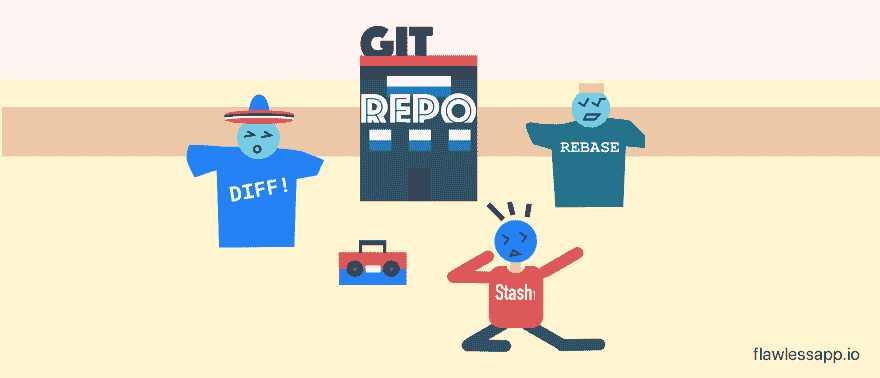

# 日常使用的有用 git 命令！

> 原文：<https://dev.to/onmyway133/useful-git-commands-for-everyday-use-552p>

[T2】](https://res.cloudinary.com/practicaldev/image/fetch/s--491YAudg--/c_limit%2Cf_auto%2Cfl_progressive%2Cq_auto%2Cw_880/https://cdn-images-1.medium.com/max/2000/1%2AXsZZ65pZKM_4FTG4lg_PQA.png)

你知道关于 [git](https://stackoverflow.com/tags/git) 的问题在 StackOverflow 上获得最多的浏览量吗？我在 Google 上搜索了很多如何用 git 执行某些动作，这实际上大大降低了我的速度。有一些动作我们倾向于经常使用，所以学习它们是有好处的。这是我最喜欢的，从朋友和网上学来的，希望对你有用。

在我们开始之前，你应该运行 git - version 来检查你当前的 git 版本，我的版本是 2.12.2。[这里的](https://git-scm.com/)是 git 官方文档，你可以阅读关于 git 命令、参数和 git 新版本的详细信息。

### 目录

*   [有用的命令](https://medium.com/p/e1a4de64037d#b880)

*   [Git alias](https://medium.com/p/e1a4de64037d#ee7f)

*   [图形用户界面客户端](https://medium.com/p/e1a4de64037d#1542)

*   [提交前检查](https://medium.com/p/e1a4de64037d#5916)

*   [何去何从](https://medium.com/p/e1a4de64037d#1fb5)

[T2】](https://res.cloudinary.com/practicaldev/image/fetch/s--oVEgpv_b--/c_limit%2Cf_auto%2Cfl_progressive%2Cq_auto%2Cw_880/https://cdn-images-1.medium.com/max/3000/1%2Akhx4a3vNEcrqLHqh7Ljd0w.png)

## 有用的命令

### 🔍状态

检查工作目录和临时区域的状态:

```
git status 
```

Enter fullscreen mode Exit fullscreen mode

显示头文件和工作目录之间的变化:

```
git diff 
```

Enter fullscreen mode Exit fullscreen mode

以单行格式显示提交列表:

```
git log --oneline 
```

Enter fullscreen mode Exit fullscreen mode

显示添加或删除特定字符串的提交:

```
git log -S 'LoginViewController' 
```

Enter fullscreen mode Exit fullscreen mode

搜索包含日志消息的提交:

```
git log — all — grep=’day of week’ 
```

Enter fullscreen mode Exit fullscreen mode

### 🔍标签

列出所有标签:

```
git tag 
```

Enter fullscreen mode Exit fullscreen mode

标记提交:

```
git tag -a 1.4 -m "my version 1.4" 
```

Enter fullscreen mode Exit fullscreen mode

删除远程标签:

```
git push --delete origin tagname

git push origin :tagname 
```

Enter fullscreen mode Exit fullscreen mode

将标签推至远程:

```
git push origin tagname 
```

Enter fullscreen mode Exit fullscreen mode

重命名标签:

```
git tag new old
git tag -d old
git push origin :refs/tags/old
git push --tags 
```

Enter fullscreen mode Exit fullscreen mode

将标签从一个提交移动到另一个提交:

```
git push origin :refs/tags/<tagname>
git tag -fa tagname
git push origin master --tags 
```

Enter fullscreen mode Exit fullscreen mode

### 🔍遥远的

列出所有遥控器:

```
git remote 
```

Enter fullscreen mode Exit fullscreen mode

重命名遥控器:

```
git remote rename old new 
```

Enter fullscreen mode Exit fullscreen mode

删除过时的远程跟踪分支:

```
git remote prune origin 
```

Enter fullscreen mode Exit fullscreen mode

### 🔍树枝

列出所有分支:

```
git branch 
```

Enter fullscreen mode Exit fullscreen mode

在本地计算机上创建分支，并切换到该分支:

```
git checkout -b branch_name 
```

Enter fullscreen mode Exit fullscreen mode

从提交创建分支:

```
git branch branch_name sha1_of_commit 
```

Enter fullscreen mode Exit fullscreen mode

将分支推到远程:

```
git push origin branch_name 
```

Enter fullscreen mode Exit fullscreen mode

重命名其他分支:

```
git branch -m old new 
```

Enter fullscreen mode Exit fullscreen mode

重命名当前分支:

```
git branch -m new 
```

Enter fullscreen mode Exit fullscreen mode

重命名远程分支:

```
git branch -m old new               # Rename branch locally    
git push origin :old                 # Delete the old branch    
git push --set-upstream origin new   # Push the new branch, set local branch to track the new remote 
```

Enter fullscreen mode Exit fullscreen mode

删除分支:

```
git branch -D the_local_branch

git push origin :the_remote_branch 
```

Enter fullscreen mode Exit fullscreen mode

### 🔍犯罪

撤消上次提交:

```
git reset --hard HEAD~1 
```

Enter fullscreen mode Exit fullscreen mode

将最后 n 次提交压缩为一次提交:

```
git rebase -i HEAD~5

git reset --soft HEAD~5
git add .
git commit -m "Update"
git push -f origin master 
```

Enter fullscreen mode Exit fullscreen mode

将最后一次提交移动到新分支:

```
git branch newbranch
git reset --hard HEAD~3 # Go back 3 commits. You *will* lose uncommitted work.*1
git checkout newbranch 
```

Enter fullscreen mode Exit fullscreen mode

### 🔍做出最佳选择

将一些提交添加到当前分支的顶部:

```
git cherry-pick hash_commit_A hash_commit_B 
```

Enter fullscreen mode Exit fullscreen mode

### 🔍参考日志

显示参考日志:

```
git reflog 
```

Enter fullscreen mode Exit fullscreen mode

获得提交:

```
git reset --hard 0254ea7

git cherry-pick 12944d8 
```

Enter fullscreen mode Exit fullscreen mode

### 🔍归还

恢复以前的提交:

```
git revert HEAD
git commit 
```

Enter fullscreen mode Exit fullscreen mode

恢复前 3 次提交的更改，而不进行提交:

```
git revert --no-commit HEAD~3.. 
```

Enter fullscreen mode Exit fullscreen mode

### 🔍改进

修改以前的提交:

```
git commit --amend

git commit --amend --no-edit

git commit --amend -m "New commit message" 
```

Enter fullscreen mode Exit fullscreen mode

[推送后更改 git 提交消息](http://stackoverflow.com/questions/8981194/changing-git-commit-message-after-push-given-that-no-one-pulled-from-remote):

```
git commit --amend -m "New commit message"
git push --force <repository> <branch> 
```

Enter fullscreen mode Exit fullscreen mode

### 🔍检验

签出标签:

```
git checkout tagname

git checkout -b newbranchname tagname 
```

Enter fullscreen mode Exit fullscreen mode

结帐分行:

```
git checkout destination_branch 
```

Enter fullscreen mode Exit fullscreen mode

如果存在合并冲突，请使用-m:

```
git checkout -m master // from feature branch to master 
```

Enter fullscreen mode Exit fullscreen mode

签出提交:

```
git checkout commit_hash

git checkout -b newbranchname HEAD~4

git checkout -b newbranchname commit_hash

git checkout commit_hash file 
```

Enter fullscreen mode Exit fullscreen mode

签出文件:

```
git checkout c5f567 -- Relative/Path/To/File 
```

Enter fullscreen mode Exit fullscreen mode

### 🔍隐藏物

将更改保存到存储:

```
git stash save "stash name"

git stash 
```

Enter fullscreen mode Exit fullscreen mode

列出所有藏匿点:

```
git stash list 
```

Enter fullscreen mode Exit fullscreen mode

应用存储:

```
git stash pop

git stash apply

git stash apply stash@{2} 
```

Enter fullscreen mode Exit fullscreen mode

### 🔍 Rebase

将当前分支重设为主分支:

```
git rebase master // rebase the current branch onto master 
```

Enter fullscreen mode Exit fullscreen mode

继续重设基础:

```
git rebase --continue 
```

Enter fullscreen mode Exit fullscreen mode

Abort rebase:

```
git rebase --abort 
```

Enter fullscreen mode Exit fullscreen mode

### 🔍。吉蒂尔

取消跟踪刚刚在中声明的文件。gitignore:

```
git rm -r --cached .
git add .
git commit -am "Remove ignored files" 
```

Enter fullscreen mode Exit fullscreen mode

### 🔍索引

删除未跟踪的文件:

```
git clean 
```

Enter fullscreen mode Exit fullscreen mode

从索引中删除文件:

```
git reset file 
```

Enter fullscreen mode Exit fullscreen mode

重置索引以匹配最近的提交:

```
git reset 
```

Enter fullscreen mode Exit fullscreen mode

重置索引和工作目录以匹配最近的提交:

```
git reset --hard 
```

Enter fullscreen mode Exit fullscreen mode

### 🔍混杂的

在 git rebase 期间获取他们的更改:

```
git checkout --ours foo/bar.java
git add foo/bar.java 
```

Enter fullscreen mode Exit fullscreen mode

在 git 合并期间获取它们的更改:

```
git pull -X theirs

git checkout --theirs path/to/the/conflicted_file.php

git checkout --theirs .
git add .

git checkout branchA
git merge -X theirs branchB 
```

Enter fullscreen mode Exit fullscreen mode

将提交从主服务器合并到功能分支:

```
git checkout feature1
git merge --no-ff master 
```

Enter fullscreen mode Exit fullscreen mode

以二叉查找树风格在提交历史中查找 bug:

```
git bisect start

git bisect good

git bisect bad 
```

Enter fullscreen mode Exit fullscreen mode

## Git alias

如果有您经常使用的命令，那么可以考虑使用 git alias。这就是如何为 git 状态创建别名，然后您只需输入 git st:

```
git config — global alias.st status 
```

Enter fullscreen mode Exit fullscreen mode

别名配置存储在中。gitconfig 文件，你可以从 [thoughtbot](https://github.com/thoughtbot/dotfiles/blob/master/gitconfig) 和 [mathiasbynens](https://github.com/mathiasbynens/dotfiles/blob/master/.gitconfig) 那里学到一些很酷的别名。

## GUI 客户端

在命令行里做事很酷，也更快。然而，对于查看分支和提交，我发现使用 GUI 客户端更加直观和舒适。你可以在这里看到所有 GUI 客户端的列表，我自己使用 [SourceTree](https://www.sourcetreeapp.com/) 。

[T2】](https://res.cloudinary.com/practicaldev/image/fetch/s--mMLC-Gb1--/c_limit%2Cf_auto%2Cfl_progressive%2Cq_auto%2Cw_880/https://cdn-images-1.medium.com/max/2900/1%2Ag2NL2JUXNAFWYrPydraqsg.png)

## 提交前检查

我们通常有一些实验代码，我们不希望他们介入我们的提交。我通常用//来标记我的实验，但有时会忘记取消标记。

从 2.9 开始，Git 对其提交钩子进行了改进，这使得它可以全局使用 ***钩子路径。*T3】**

首先，我们需要创建一个名为 pre-commit 文件，并将其放入例如/Users/khoa/hooks:

在您的项目中，运行 git config core . hooks path/Users/khoa/hooks。

每当您使用该模式提交文件时，它都不会让您提交。对于如何在 SourceTree 中实现这一点，请查看:
[**SourceTree 和预提交挂钩**
*预提交文件在终端中可以完美工作，但 SourceTree 似乎忽略了这一点。我同时使用终端和源码树，如…*medium.com](https://medium.com/@onmyway133/sourcetree-and-pre-commit-hook-52545f22fe10)

## 何去何从

这只是 git 功能的皮毛，如果你想了解更多，这里有一些链接。

*   [Atlassian Git 教程](https://www.atlassian.com/git/tutorials/setting-up-a-repository):如何在 Git 版本控制下建立存储库(repo)的概述

*   git 备忘单:Git 备忘单让你不用记住所有的命令。

*   [学足够多的 Git 才危险](http://www.learnenough.com/git-tutorial)

*   [面向专业人员的 Git 工作流:一本好的 Git 指南](http://www.toptal.com/git/git-workflows-for-pros-a-good-git-guide)

*   [由内而外的 Git](https://codewords.recurse.com/issues/two/git-from-the-inside-out):这篇文章主要关注支撑 Git 的图结构

*   [git-game](https://github.com/git-game/git-game) :测试 git 技能的终端游戏

*   [Git 简介—斯科特·沙孔演讲](https://www.youtube.com/watch?v=xbLVvrb2-fY)

*   [Git 教程— Git Fu 带命令行](http://www.raywenderlich.com/74258/git-tutorial-intermediate)

*   沉浸在 Git 中:掌握 Git 最可靠的途径是沉浸在它的实用程序和操作中，亲身体验它

*   [git-Flight-rules](https://github.com/k88hudson/git-flight-rules)git 的飞行规则

*   gitflow Git 扩展为 Vincent Driessen 的分支模型提供高级存储库操作

*   [与众不同的花哨效果](https://github.com/so-fancy/diff-so-fancy)好看的与众不同的突出效果等等

*   github-备忘单 Git 和 GitHub 的酷功能列表

*   [git 提示](https://github.com/git-tips/tips)最常用的 git 提示和技巧

原帖[https://medium . com/无瑕-app-stories/useful-git-commands-for-daily-use-e1a4de 64037d](https://medium.com/flawless-app-stories/useful-git-commands-for-everyday-use-e1a4de64037d)