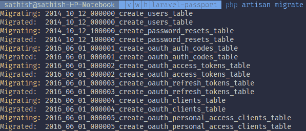
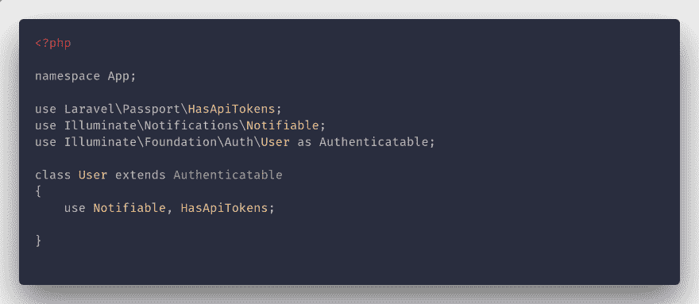
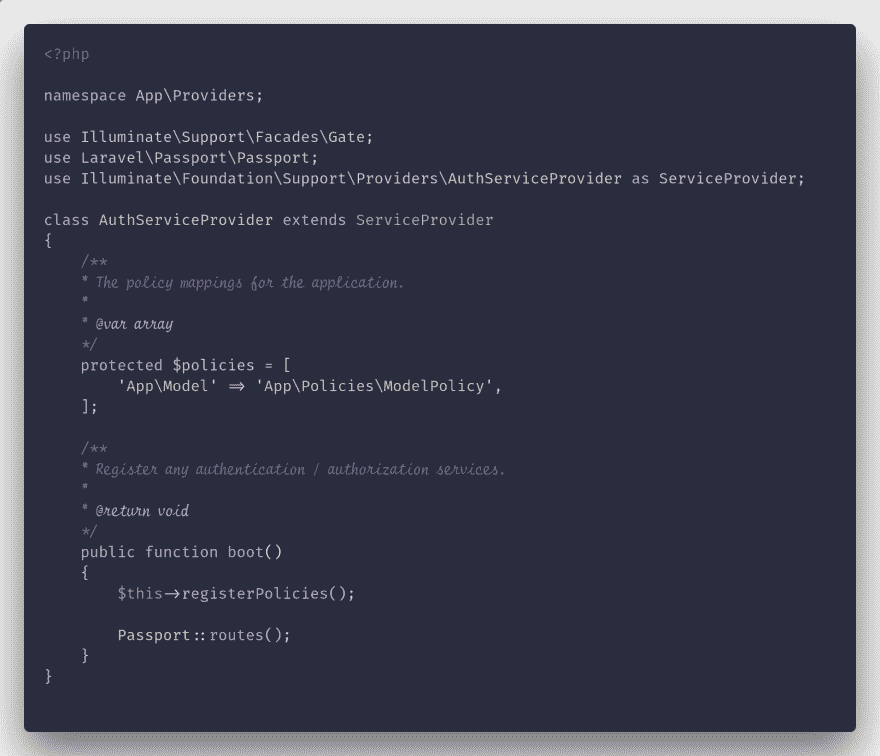
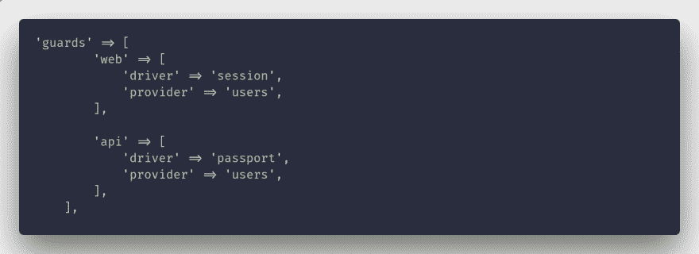
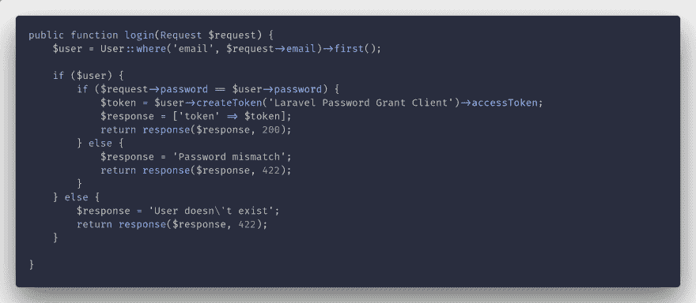
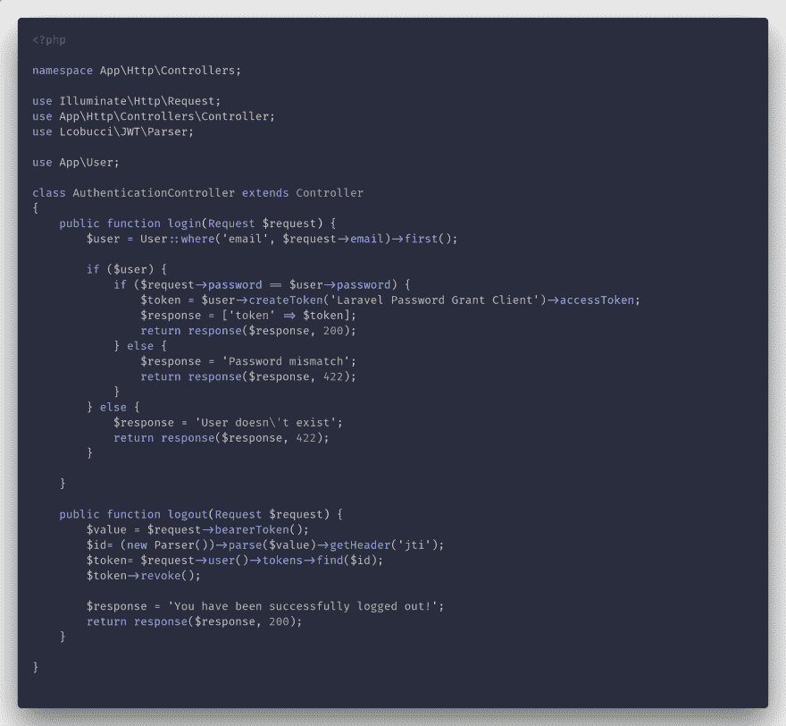
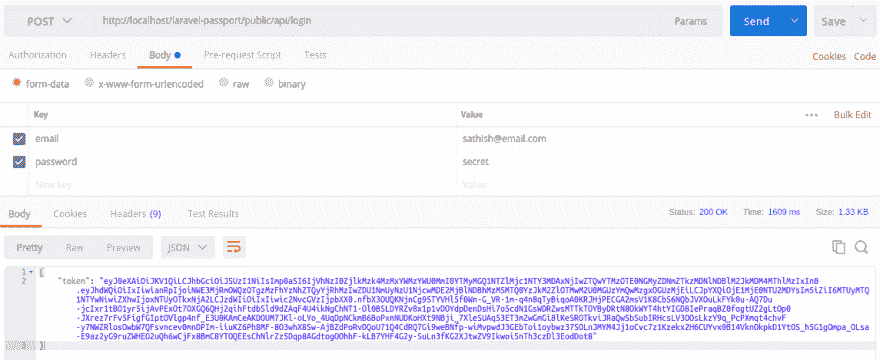
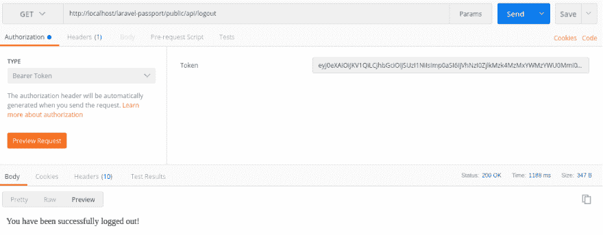

# 使用 Laravel 的 passport 进行用户验证

> 原文：<https://dev.to/sathish/user-authentication-using-laravels-passport-1ebn>

# 首先，我们来回答一个基本问题——什么是用户认证？

用户身份验证是一个允许应用程序验证某人身份的过程。每个用户都需要登录系统才能访问应用程序。用户提供一个帐户的用户名和一个密码(如果该帐户有密码的话)(在一个安全的系统中，所有的帐户要么有密码，要么被无效)。如果密码正确，用户登录到该帐户；用户获得帐户的访问权限和特权。

# 现在，什么是 Laravel 护照？

API 通常使用令牌来验证用户，并且不维护请求之间的会话状态。Laravel 使用 Laravel Passport 使 API 认证变得轻而易举，它在几分钟内为您的 Laravel 应用程序提供了完整的 [OAuth2](https://oauth.net/2/) 服务器实现。Passport 建立在由 Alex Bilbie 维护的[联盟 OAuth2 服务器](https://github.com/thephpleague/oauth2-server)之上。

如果某个特定用户通过了身份验证，那么在登录期间生成的令牌将被存储起来，以便无缝地为用户提供 API 访问，直到该令牌在注销期间被显式撤销。

我们现在将创建一个公共 API 端点`Login`和一个受保护的 API 端点`Logout`，用于在 [Laravel](https://laravel.com) 应用程序中登录和注销用户。

### 什么是公共 API 端点？

公共 API 端点对 web 的任何用户都是可用的。以`Login`为例。为了登录到应用程序，每个人都应该有一个登录名。

### 什么是受保护的 API 端点？

受保护的 API 端点仅对经过身份验证的用户可用。以`Logout`为例。只有合法用户才能注销帐户。

# 让我们来设置应用程序。

在安装 Laravel 之前，确保你已经安装了 Apache 并运行了 MySql 和 PHP V7.2。

我们需要 [Composer](https://getcomposer.org) 在我们的系统中安装 Laravel。Composer 是 PHP 中的依赖管理工具。它允许你声明你的项目所依赖的库，它将为你管理(安装/更新)它们。
Composer 可以根据您的要求进行全球安装或本地安装。我们现在将在本地安装它。

打开一个合适的目录，在您的终端中运行以下命令-

`php -r "copy('https://getcomposer.org/installer', 'composer-setup.php');"`

`php -r "if (hash_file('SHA384', 'composer-setup.php') === '544e09ee996cdf60ece3804abc52599c22b1f40f4323403c44d44fdfdd586475ca9813a858088ffbc1f233e9b180f061') { echo 'Installer verified'; } else { echo 'Installer corrupt'; unlink('composer-setup.php'); } echo PHP_EOL;"`

`php composer-setup.php`

`php -r "unlink('composer-setup.php');"`

这将在您选择的目录中创建一个`composer.phar`文件。现在，让我们使用下面的命令安装我们的 Laravel 应用程序

`php composer.phar create-project --prefer-dist laravel/laravel laravel-passport`

安装后，创建一个数据库，我们将其命名为`passport`，并在您喜欢的编辑器中打开应用程序。我更喜欢[代号](https://code.visualstudio.com/)的❤️.如果您之前已经在本地安装了 composer，请不要忘记在您的项目中再次安装它。

# 环境配置

根据应用程序运行的环境，使用不同的配置值通常会很有帮助。例如，您可能希望在本地使用与在生产服务器上不同的缓存驱动程序。

为了做到这一点，Laravel 使用了由 Vance Lucas 开发的 [DotEnv PHP 库](https://github.com/vlucas/phpdotenv)。在全新的 Laravel 安装中，应用程序的根目录将包含一个`.env.example`文件。如果通过 Composer 安装 Laravel，这个文件会自动重命名为`.env`。否则，您应该手动重命名该文件。

现在，打开`.env`文件并更新以下内容

`APP_URL=http://localhost`->-`APP_URL=http://localhost/laravel-passport/public`

`DB_DATABASE=homestead`->-`DB_DATABASE=your database name here i.e passport`

`DB_USERNAME=homestead`->-`DB_USERNAME=your db username`

`DB_PASSWORD=secret`->-`DB_PASSWORD=your db password`

# 让我们安装 Passport

要开始使用，请通过 Composer 软件包管理器安装 Passport:

`php composer.phar require laravel/passport`

在我们的应用程序中成功安装 Passport 包后，我们需要设置他们的服务提供商。因此，打开您的`config/app.php`文件并在其中添加以下提供者。

[T2】](https://res.cloudinary.com/practicaldev/image/fetch/s--_pn_DbXp--/c_limit%2Cf_auto%2Cfl_progressive%2Cq_auto%2Cw_880/https://i.imgur.com/2KhTSZS.png)

现在，Passport 服务提供者向框架注册了自己的数据库迁移目录，所以您应该在注册提供者之后迁移您的数据库。Passport 迁移将创建应用程序存储客户机和访问令牌所需的表。

### 数据库:迁移

迁移就像数据库的版本控制，允许您的团队轻松地修改和共享应用程序的数据库模式。迁移通常与 Laravel 的 schema builder 配合使用，以轻松构建应用程序的数据库模式。Laravel 附带了一个默认的`users table`迁移。因此，我们不需要为这个应用程序编写任何迁移，因为我们将只使用电子邮件和密码进行身份验证。

要迁移用户和其他 passport 表，请运行以下 artisan 命令:

`php artisan migrate`

[T2】](https://res.cloudinary.com/practicaldev/image/fetch/s--G_2c1R6x--/c_limit%2Cf_auto%2Cfl_progressive%2Cq_auto%2Cw_880/https://i.imgur.com/yKmo2Qx.png)

接下来，您应该运行`passport:install`命令。此命令将创建生成安全访问令牌所需的加密密钥。此外，该命令将创建“个人访问”和“密码授权”客户端，它们将用于生成访问令牌:

`php artisan passport:install`

运行该命令后，将`Laravel\Passport\HasApiTokens`特征添加到您的`App\User(Location - app\User.php)`模型中。这个特性将为您的模型提供一些助手方法，允许您检查经过身份验证的用户的令牌和范围:

[T2】](https://res.cloudinary.com/practicaldev/image/fetch/s--axM11iHu--/c_limit%2Cf_auto%2Cfl_progressive%2Cq_auto%2Cw_880/https://i.imgur.com/8mlxf5c.png)

接下来，您应该在您的`AuthServiceProvider(Location - app\Providers\AuthServiceProvider.php)`的 boot 方法中调用`Passport::routes`方法。此方法将注册颁发访问令牌和撤销访问令牌、客户端和个人访问令牌所需的路由:

[T2】](https://res.cloudinary.com/practicaldev/image/fetch/s--62AG6uLO--/c_limit%2Cf_auto%2Cfl_progressive%2Cq_auto%2Cw_880/https://i.imgur.com/wt89LNw.png)

最后，在您的`config/auth.php`配置文件中，您应该将`api`认证守卫的`driver`选项设置为`passport`。这将指示您的应用程序在验证传入的 API 请求时使用 Passport 的`TokenGuard`:

[T2】](https://res.cloudinary.com/practicaldev/image/fetch/s--fdInKsU1--/c_limit%2Cf_auto%2Cfl_progressive%2Cq_auto%2Cw_880/https://i.imgur.com/DXfBaBw.png)

# 现在，我们来写一个登录和注销的控制器。

运行`php artisan make:controller AuthenticationController`。这将在`app\Http\Controllers`中创建一个`AuthenticationController.php`文件

### 登录

登录背后的基本逻辑是借助请求中的`email`值来查找和检索记录。检索之后，如果请求中的密码与检索到的记录的密码匹配，我们将生成一个令牌，并将其作为带有 200 状态代码的响应发送出去。如果密码不匹配，我们将发送带有 422 状态代码的相应错误消息。

如果没有找到带有请求电子邮件的用户，则遵循与密码不匹配场景相同的过程。

[T2】](https://res.cloudinary.com/practicaldev/image/fetch/s--5Hv0_YxU--/c_limit%2Cf_auto%2Cfl_progressive%2Cq_auto%2Cw_880/https://i.imgur.com/WVgHLqc.png)

### 注销

注销的逻辑是从请求头中检索令牌。那么我们将显式地撤销令牌。

[T2】](https://res.cloudinary.com/practicaldev/image/fetch/s--m0InyDmg--/c_limit%2Cf_auto%2Cfl_progressive%2Cq_auto%2Cw_880/https://i.imgur.com/e0yd7gx.png)

我们的最终控制器将如下所示:

[T2】](https://res.cloudinary.com/practicaldev/image/fetch/s--XDMa5M9J--/c_limit%2Cf_auto%2Cfl_progressive%2Cq_auto%2Cw_880/https://i.imgur.com/2N4WqUi.png)

# 路线

所有的 Laravel 路径都在路径文件中定义，路径文件位于路径目录中。我们将使用`api.php`来定义我们的 API 路线。我们将定义两条路由，即- login 和 logut。记住，登录是公共路由，注销是私有路由。路由文件现在将如下所示:

[T2】](https://res.cloudinary.com/practicaldev/image/fetch/s--zvjcC1Yf--/c_limit%2Cf_auto%2Cfl_progressive%2Cq_auto%2Cw_880/https://i.imgur.com/DwlwAHZ.png)

# 使用 Postman 测试我们的 API

Postman 是一个支持和增强 API 开发的平台。

在测试之前，向用户表中添加一条记录来测试我们的 API。另外，确保应用程序的`storage`和`bootstrap/cache`目录是可写的。

测试登录- `POST http://localhost/laravel-passport/public/api/login`

[T2】](https://res.cloudinary.com/practicaldev/image/fetch/s--X978DjTK--/c_limit%2Cf_auto%2Cfl_progressive%2Cq_auto%2Cw_880/https://i.imgur.com/I92bb1j.png)

测试注销- `GET http://localhost/laravel-passport/public/api/logout`

现在，复制令牌并将其设置为 header。

[T2】](https://res.cloudinary.com/practicaldev/image/fetch/s--7twLyHg1--/c_limit%2Cf_auto%2Cfl_progressive%2Cq_auto%2Cw_880/https://i.imgur.com/OWvcQyn.png)

请随意查看最终的[代码库](https://github.com/TheWebDevel/laravel-passport)