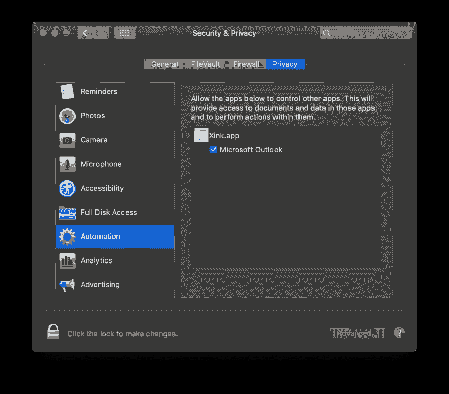
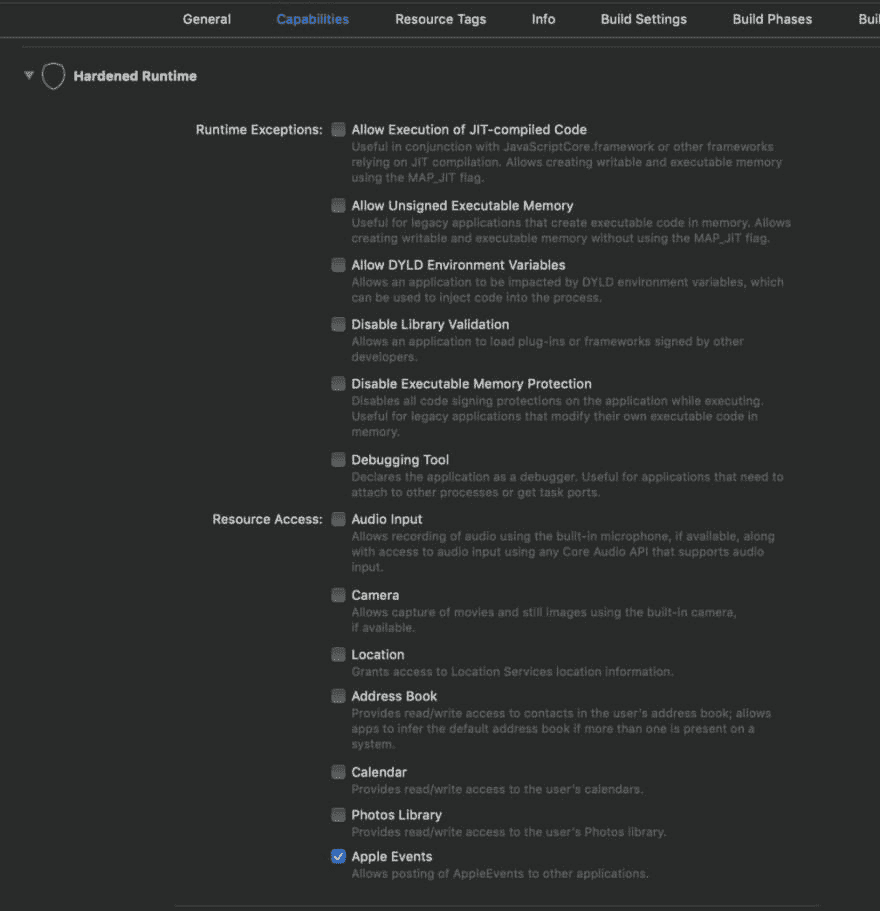

# 用户对 Mojave 应用程序的限制体验不佳

> 原文：<https://dev.to/t4rzsan/users-are-in-for-a-bad-experience-with-the-mojave-app-restrictions-1if8>

随着 Mojave 更新到 macOS，苹果对你的应用程序允许做的事情引入了一些限制。如果你是苹果应用商店外可下载应用的开发者，你需要警惕这些限制。

我将在本文中讨论的两个新限制是自动化和全磁盘访问限制。对自动化的新限制将防止应用程序通过 AppleScript 编写其他应用程序的脚本，而完全磁盘访问将防止应用程序操纵其他应用程序拥有的文件。

在万维网如此可怕的时代，苹果在操作系统中加入这些限制可能是一个非常好的主意。但我确实认为苹果的做法对用户不太友好，尤其是在全磁盘访问方面。

## 全磁盘访问

除非用户特别授予您的应用程序完全磁盘访问权限，否则不允许更改不属于自己的文件。如果你尝试，你会得到一个错误，告诉你这是不允许的。

[T2】](https://res.cloudinary.com/practicaldev/image/fetch/s--iC49HeMl--/c_limit%2Cf_auto%2Cfl_progressive%2Cq_auto%2Cw_880/https://i0.wp.com/leruplund.dk/wp-content/uploads/2018/10/Screenshot-2018-10-18-at-22.16.56.png%3Fresize%3D976%252C484)

这是件好事！你不应该被允许给别人添乱。

问题是苹果没有给我们一个 API 来提示用户给予访问。甚至没有一个 API 来检查我们是否可以访问一个文件。

用户会有不好的体验，因为他们必须在安全和隐私面板中手动授予我们应用程序的完整磁盘访问权限。

[T2】](https://res.cloudinary.com/practicaldev/image/fetch/s--h5kmyUM_--/c_limit%2Cf_auto%2Cfl_progressive%2Cq_auto%2Cw_880/https://i1.wp.com/leruplund.dk/wp-content/uploads/2018/10/Screenshot-2018-10-18-at-22.24.09.png%3Fresize%3D1008%252C885)

那绝对是可怕的！我遇到的大多数用户都不知道如何以及在哪里找到。应用程序文件或安全中心。你必须写一份详尽的用户指南来帮助用户，现在谁会看用户指南呢？

幸运的是，苹果在自动化方面做得更好。

## 自动化

如果您的应用程序试图通过 AppleScript 访问另一个应用程序，Mojave 会阻止您。这也是一件好事。想象一下恶意应用程序可能造成的混乱！

幸运的是，苹果在可用性方面比全磁盘访问做得更好。作为开发人员，您需要做的只是将关键字 NSAppleEventsUsageDescription 添加到您的应用程序的 plist.info 文件中，并附上描述。

[T2】](https://res.cloudinary.com/practicaldev/image/fetch/s--ds2FEbsN--/c_limit%2Cf_auto%2Cfl_progressive%2Cq_auto%2Cw_880/https://i0.wp.com/leruplund.dk/wp-content/uploads/2018/11/Screenshot-2018-11-09-at-19.11.23.png%3Fresize%3D1008%252C74)

应用程序第一次尝试为另一个应用程序编写脚本时，运行时会自动提示用户输入权限。

[T2】](https://res.cloudinary.com/practicaldev/image/fetch/s--K7clQo95--/c_limit%2Cf_auto%2Cfl_progressive%2Cq_auto%2Cw_880/https://i1.wp.com/leruplund.dk/wp-content/uploads/2018/11/Screenshot-2018-11-09-at-19.14.52.png%3Fresize%3D1008%252C606)

当然，如果用户拒绝权限，您必须确保您的应用程序优雅地失败。

如果用户授予权限，您的应用程序将被添加到“隐私与安全设置”下的“自动化”标签中。

[T2】](https://res.cloudinary.com/practicaldev/image/fetch/s--EHVBnOkX--/c_limit%2Cf_auto%2Cfl_progressive%2Cq_auto%2Cw_880/https://i2.wp.com/leruplund.dk/wp-content/uploads/2018/11/Screenshot-2018-11-09-at-19.17.56.png%3Fresize%3D1008%252C885)

请注意，无法手动将应用添加到自动化标签。你真可耻，苹果！

您可以从终端清除整个列表:

```
tccutil reset AppleEvents 
```

Enter fullscreen mode Exit fullscreen mode

### 硬化打造

请注意，如果您需要一个用于公证的强化版本，Apple 的优秀员工已经决定完全忽略 NSAppleEventsUsageDescription 属性，除非您还在 Xcode 的“功能”标签中特别启用了 Apple 事件。

[T2】](https://res.cloudinary.com/practicaldev/image/fetch/s--1HfT4M3d--/c_limit%2Cf_auto%2Cfl_progressive%2Cq_auto%2Cw_880/https://i2.wp.com/leruplund.dk/wp-content/uploads/2018/11/Screenshot-2018-11-09-at-19.26.35.png%3Fresize%3D1008%252C1043)

## 结论

虽然我认为限制安装在 App Store 之外的 macOS 应用程序的权限是一个好主意，但我确实认为用户体验很糟糕。有多少用户知道授予全磁盘访问权限或 Apple Events 权限的后果？没人知道这些术语是什么意思。苹果还让开发者很难正确指导应用程序用户。