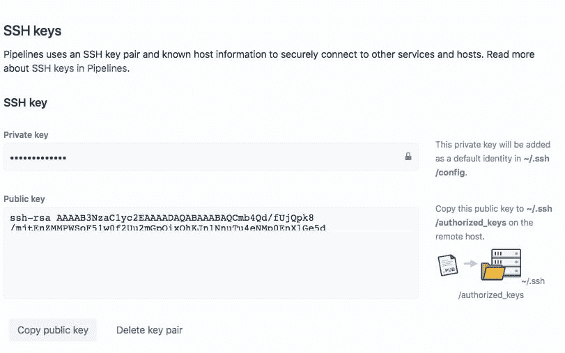
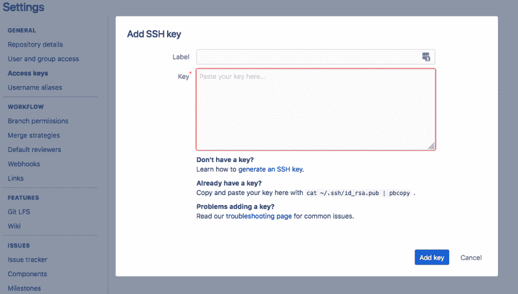

# 在项目中使用 Bitbucket 私有存储库

> 原文：<https://dev.to/minompi/using-a-bitbucket-private-repository-in-your-projects-24j9>

很多时候，您可能希望在另一个项目中使用您的个人私有库。例如，您可能有许多共享一个公共库的私有项目，而这个库不能为您的业务开源。你可以使用**的打包软件**并付费拥有一个私有库，或者你可以使用 Bitbucket 及其免费的私有库。

要通过 **Composer** 包含您的私有 **Bitbucket 存储库**，您需要将这一行添加到您的 composer.json:

```
"repositories":[
     {
         "type": "vcs",
         "url" : "git@bitbucket.org:yourName/yourRepository.git"
     }
 ] 
```

Enter fullscreen mode Exit fullscreen mode

**VCS** 代表版本控制系统。这包括版本系统，如 git、svn、fossil 或 hg。
Composer 有一个用于从这些系统安装软件包的存储库类型。

如果您现在启动

`composer install`

，您必须将一个消费者密钥放入您的 CLI(命令行界面)。

这不是问题，但是如果您有**持续集成**，或者您的部署系统启动 composer install 命令，您必须有一个自动系统能够插入消费者密钥或一些神奇的脚本来管理它。

因此，为了避免这个问题，您需要打开您的主存储库，例如从 Bitbucket，创建一个 ssh 密钥并复制**公钥**。

[T2】](https://res.cloudinary.com/practicaldev/image/fetch/s--f-AHdcoC--/c_limit%2Cf_auto%2Cfl_progressive%2Cq_auto%2Cw_880/https://alessandrominoccheri.github.io/img/generate-ssh-key.jpg)

之后，您需要从 Bitbucket 打开您的私有库，添加一个访问 ssh 密钥，并粘贴之前创建的公钥。

[T2】](https://res.cloudinary.com/practicaldev/image/fetch/s--dTKgcndC--/c_limit%2Cf_auto%2Cfl_progressive%2Cq_auto%2Cw_880/https://alessandrominoccheri.github.io/img/add-ssh-key.jpg)

现在，如果您启动

`composer install`

，任何请求都会出现在您的 CLI 中，您可以进行完美的自动部署。