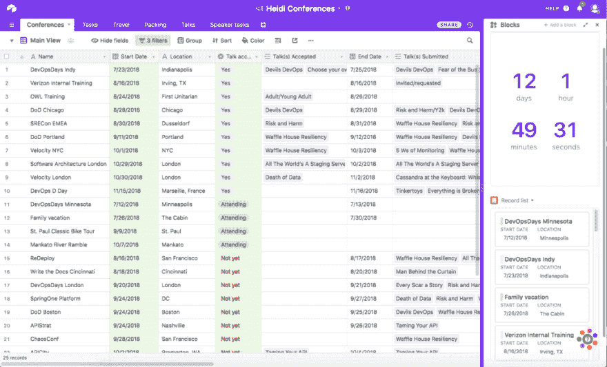
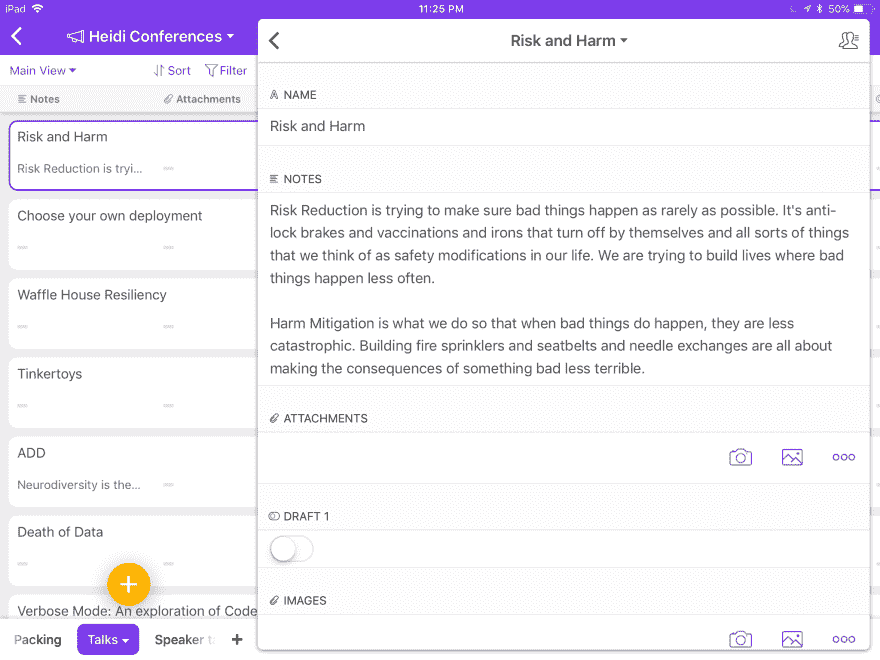
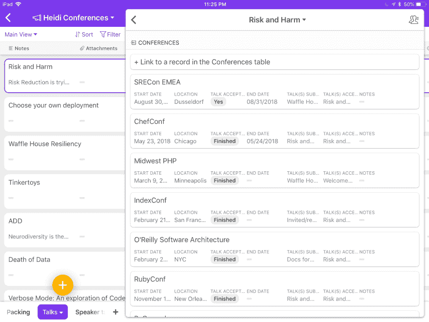
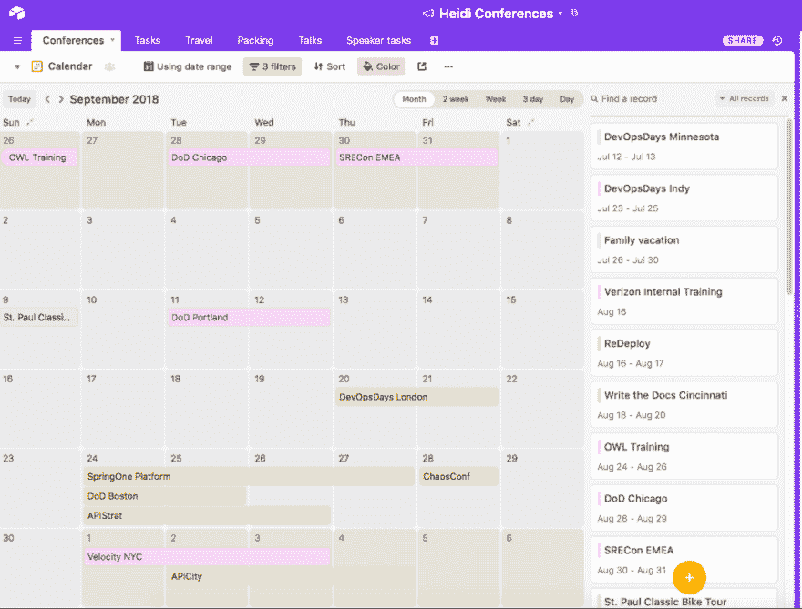

# 使用 air table 管理会议提交

> 原文：<https://dev.to/wiredferret/using-airtable-to-manage-conference-submissions-4pd>

我知道，这不是一个很吸引人的标题，但它是描述性的。我目前工作的很大一部分是在会议上发言，谈论功能标志、系统弹性，以及任何我能说服人们的东西。在会议上发言的一部分适用于很多很多的会议。但是你是如何跟踪这一切的呢？一开始我试着用谷歌日历，但是没用。我试过 Trello，但是没有足够的尺寸。我想追踪这些元素:

姓名
地点
开始日期
结束日期
会谈提交
提交/接受/拒绝/冲突
演讲人任务
剩余任务

太多了！我抱怨了这个问题，星期四布拉姆推荐了 Airtable，它是一个任务板和电子表格的漂亮混搭。从那以后，我向其他几个开发者关系人员推荐了它，我知道他们中的一些人正在使用它。我现在为完整版付费，它给了我日历视图，这是我的杀手锏。这对我现实地看待会议如何相互叠加和重叠很有帮助。

[T2】](https://res.cloudinary.com/practicaldev/image/fetch/s--8W7P-CK5--/c_limit%2Cf_auto%2Cfl_progressive%2Cq_auto%2Cw_880/http://www.heidiwaterhouse.com/wp-content/uploads/2018/06/airtable_main-view-1024x620.png)

空气表主视图

这是主要观点。我已经对它进行了分类，所以那些已经结束或者没有接受我的任何演讲的会议都不会显示出来，因为我真的只需要知道即将到来或者可能到来的事情。我先把它按接受谈话的维度分组，然后按日期分组。一眼就能看出我要做什么，我要做什么演讲。我计划增加的一个改进是记住输入演讲的长度，因为 30 分钟的演讲和 60 分钟的演讲之间的差别是 100%。

在右边，我有几个可飞行的积木，包括倒计时器，因为我现在正处于旅行间歇，我很高兴在那里看到一个非常大的数字。

# 卡片

 我可以深入到任何一个演讲的标题，找到一张包含一堆演讲信息的卡片。我经常会附上我在这里提交的提议，以及关于这个演讲在创作过程中进展如何的信息，这些都是由我配置的。我起草了吗？做了幻灯片？我自己练习还是在其他人面前练习？这张卡是由多个会议共享的，因为谈话是一个单一的事情。

这对于我的大脑处理演讲的方式非常有效——我写下它们，为我的第一次会议做好准备，并第一次在公众面前展示。下一次我要做同样的演讲时，我会把练习、调整和更新幻灯片作为会议准备的一部分，而不是演讲准备。

# 卡片，pt。2

 在演讲卡的下面，我可以看到我提交演讲的所有会议，以及它是否被接受。这给了我一个很好的概述，一个谈话是否“过时”或比另一种谈话更不容易被接受。这是有用的信息。所有这些功能都可以在。免费级别，对大多数人来说已经足够强大了，但是我有没有提到我申请了很多*T4 的会议？当然，比一年中的周数还要多。*

# 日历视图

[T2】](https://res.cloudinary.com/practicaldev/image/fetch/s--R1NNCQgS--/c_limit%2Cf_auto%2Cfl_progressive%2Cq_auto%2Cw_880/http://www.heidiwaterhouse.com/wp-content/uploads/2018/06/airtable_calendar-1024x778.png)

航空表日历视图

这里的景色值回我在 Airtable 上花的所有钱，我当然不是超级用户。但是它以一种我很难仅从日期上预测的方式告诉我冲突。(如果我们都善于从日期和时间预测冲突，我们就不会有 Outlook 会议日历，这就是我要说的)现在我可以提前告诉大家，我只能接受 24 日开始的三个会议中的一个，这使我成为一个更礼貌的演讲者。有时候可以看看这个，做更好的安排。例如，芝加哥 DevOpsDays 是一个很棒的活动，但它实际上是我需要去杜塞尔多夫的前一天。我可以提前几个月，现在就提出要求，在芝加哥感恩节的第一天和斯雷肯节即将结束时发言，而不是让自己或会议陷入混乱。这给了我一个天气/航班/等的误差预算。大多数会议组织者都乐于帮助我解决这些问题。

# 结论

Airtable 是一个非常有用的工具，当数据的某些部分是固定的，而某些部分发生变化时，它能够组织数据，并且您需要能够将关联保持在一起。当然，有更大、更重量级的数据库可以做到这一点，但这是该理论的一个漂亮、友好、可用的实现。