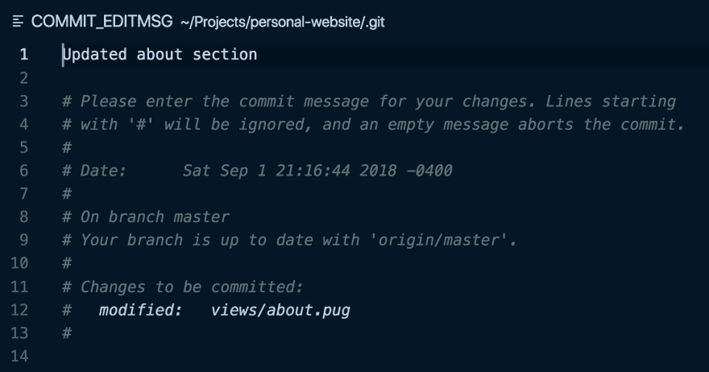
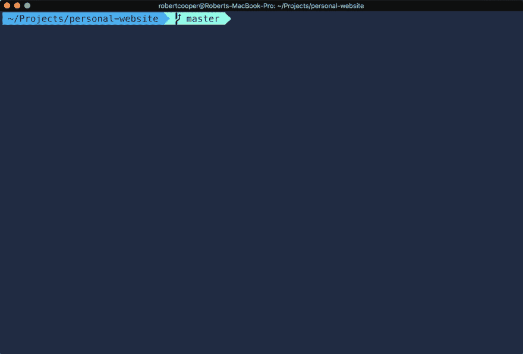

# 使用别名加速 Git 工作流

> 原文：<https://dev.to/robertcoopercode/using-aliases-to-speed-up-your-git-workflow-2f5a>

在使用 git 时利用别名可以帮助您更有效地使用流行的版本控制系统。下面列出了我在使用 git 的项目中最喜欢和最常用的一些别名。

应该注意的是，当我谈论别名时，我指的是 [bash/zsh 别名](http://tldp.org/LDP/abs/html/aliases.html)，而不是 [git 别名](https://git-scm.com/book/en/v2/Git-Basics-Git-Aliases)。

有什么区别？Bash/Zsh 别名设置在一个`.bashrc`或`.zshrc`文件中，允许您将一个命令分配给一个简写版本。例如，您可以将`git log`别名为`gl`，这将节省您键入的几个字符。Git 别名允许您类似地将 git 命令分配给速记版本，但是您仍然必须在速记之前键入`git`。例如，您可以将`git log`命令别名为`l`，然后通过键入`git l`来调用该命令。所有 git 别名都设置在一个`.gitconfig`文件中，该文件通常位于计算机的`HOME`目录中。

* * *

## 增加和修改提交

### **`gaa`T4】**

```
git add -A 
```

Enter fullscreen mode Exit fullscreen mode

将所有更改添加到暂存中。

### **`gcm`T4】**

```
git commit -m 
```

Enter fullscreen mode Exit fullscreen mode

使用所有暂存文件创建新的提交，并将给定消息用作提交的消息。

示例:

```
gcm "This is my commit message describing the changes" 
```

Enter fullscreen mode Exit fullscreen mode

### **`gcma`T4】**

```
git commit -a -m 
```

Enter fullscreen mode Exit fullscreen mode

将所有文件添加到登台，并使用给定消息作为提交消息进行提交。

示例:

```
gcam "This is another commit message!" 
```

Enter fullscreen mode Exit fullscreen mode

### **`gca`T4】**

```
git commit --amend --no-edit 
```

Enter fullscreen mode Exit fullscreen mode

将当前保存的文件移动到以前的提交消息中。将`--no-edit`标志传递给`git commit --amend`以保存之前的提交消息(通常是这种情况)。

如果之前的提交消息需要更改，我将`git commit --amend --no-edit`别名为`gcae`。它做的和`gca`一样，但是它打开 git 编辑器来编辑之前提交的消息。在我的例子中，我将`VS Code`设置为默认的 git 编辑器，因为我对 VIM 并不精通。

[T2】](https://res.cloudinary.com/practicaldev/image/fetch/s--zjESAkpS--/c_limit%2Cf_auto%2Cfl_progressive%2Cq_auto%2Cw_880/https://thepracticaldev.s3.amazonaws.com/i/5960x0vasabf2h9vhj7j.png)

### **`gcaa`T4】**

```
git add --all && git commit --amend --no-edit 
```

Enter fullscreen mode Exit fullscreen mode

如果已经进行的一些更改应该是先前提交的一部分，则使用此命令很有用。它会将所有新修改的文件添加到暂存区，然后将这些更改提交到之前的提交中。

### **`gnope`T4】**

```
git checkout . 
```

Enter fullscreen mode Exit fullscreen mode

删除 Git 检测到的所有更改。

### **`gwait`T4】**

```
git reset HEAD 
```

Enter fullscreen mode Exit fullscreen mode

解散一切。

### **`gundo`T4】**

```
git reset --soft HEAD^ 
```

Enter fullscreen mode Exit fullscreen mode

撤消上次提交，并将提交中的文件移至暂存。

## 阅读历史

### **`gl`T4】**

```
git log --graph --pretty='\''%Cred%h%Creset -%C(yellow)%d%Creset %s %Cgreen(%cr) %C(bold blue)<%an>%Creset'\'' --abbrev-commit 
```

Enter fullscreen mode Exit fullscreen mode

以简洁的方式记录以前的提交。传递给`--pretty`的参数定义了每次提交应该显示的信息(即提交散列、分支名称、提交消息、提交日期和作者)。绝对不想每次都把这个打出来！

### **`gco`T4】**

```
git checkout 
```

Enter fullscreen mode Exit fullscreen mode

允许在分支之间切换。

示例:

```
gco other-branch-name 
```

Enter fullscreen mode Exit fullscreen mode

## 推动&拉向/拉离遥控器

### **`gps`T4】**

```
git push 
```

Enter fullscreen mode Exit fullscreen mode

更新遥控器。

### **`gpsf`T4】**

```
git push --force-with-lease 
```

Enter fullscreen mode Exit fullscreen mode

如果没有其他人提交到远程，则用本地分支覆盖远程分支。这被认为是比使用`git push --force`更安全的方法。

### **`gpl`T4】**

```
git pull --rebase 
```

Enter fullscreen mode Exit fullscreen mode

从远程获取更新，并用上游分支重新设置本地分支的基础。这避免了使用`git pull`时可能发生的任何合并提交。

## 重置基础

### **`grb`T4】**

```
git rebase 
```

Enter fullscreen mode Exit fullscreen mode

用另一个分支重设当前分支的基础。

示例:

```
grb origin/master 
```

Enter fullscreen mode Exit fullscreen mode

### **`grn`** *(外壳命令)*

```
grn() { git rebase -i HEAD~"$1"; } 
```

Enter fullscreen mode Exit fullscreen mode

这实际上是一个 [shell 命令](http://zsh.sourceforge.net/Intro/intro_4.html)，它允许变量作为参数传入。`$1`是传递给`grn`函数的参数的占位符。该函数接受`N`作为参数，其中`N`是执行交互式 rebase 的提交次数。

示例:

[T2】](https://res.cloudinary.com/practicaldev/image/fetch/s--q05CeKAV--/c_limit%2Cf_auto%2Cfl_progressive%2Cq_66%2Cw_880/https://thepracticaldev.s3.amazonaws.com/i/pln0bo4jp1w2a8ih0mrl.gif)

### **`grbic`** *(外壳命令)*

```
grbic() { git rebase -i "$1" ; } 
```

Enter fullscreen mode Exit fullscreen mode

接受一个提交散列作为参数，并执行一个交互式的返回到传递的提交散列。

示例:

[T2】](https://res.cloudinary.com/practicaldev/image/fetch/s--cBNsN1t4--/c_limit%2Cf_auto%2Cfl_progressive%2Cq_66%2Cw_880/https://thepracticaldev.s3.amazonaws.com/i/75u5akmrjj2bbrfwht1q.gif)

### **`grba`T4】**

```
git rebase --abort 
```

Enter fullscreen mode Exit fullscreen mode

中止交互式重置，并将 git 状态恢复到运行`git rebase`命令时的状态。

### **`grbc`T4】**

```
git rebase --continue 
```

Enter fullscreen mode Exit fullscreen mode

在提交冲突得到解决后，继续进行交互式基础变更。

* * *

好吧，我知道有很多化名，很抱歉我说了这么多。我鼓励其他人更频繁地使用别名来加速他们的发展。让我知道这些是否有帮助，或者你是否有一些喜欢的别名想要分享。

* * *

如果你发现了这篇文章，可以考虑在 Twitter、T2、Github 或 T4 的 LinkedIn 上关注我。