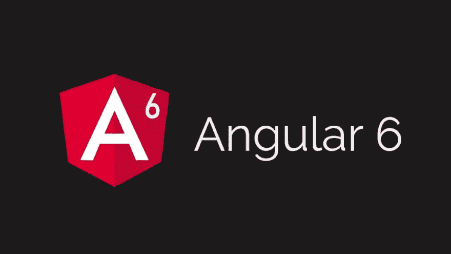
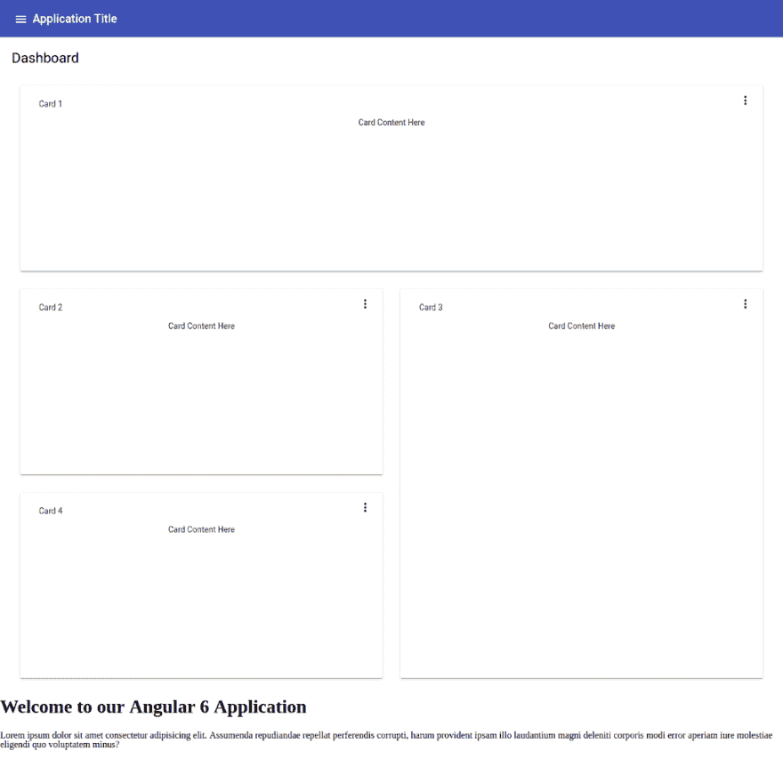

# 使用带 6°角的角形材料

> 原文：<https://dev.to/geeksamu/using-angular-material-with-angular-6-78p>

[T2】](https://res.cloudinary.com/practicaldev/image/fetch/s--xlfbTJ3i--/c_limit%2Cf_auto%2Cfl_progressive%2Cq_auto%2Cw_880/https://cdn-images-1.medium.com/max/1024/1%2AByAhY7BtpARVPzkgM6yV1Q.png)

这是关于 JavaScript 框架 Angular 6 的 n 部分[系列](https://blog.wb.gy/angular-6-article-series/)的第三部分。

在这一部分中，我们将回顾使用角形材料与角形 6 的应用。

这并不是一个完整的指南，而是一个基本的概述，让你开始运行，这样你就可以了解如何使用 Angular 材料，以及如何使用我们的 Angular 6 应用程序。

> *在我们开始之前，英语不是我的第一语言，所以如果你看到一些奇怪的东西，请冷静地在评论区指出来，或者* [*给我发邮件*](mailto:i@wb.gy) *，没必要使用暴力:)*

### 文章系列

1.  [棱角分明 6 篇系列文章](https://dev.to/geeksamu/angular-6-article-series-2n26-temp-slug-5101921)
2.  [建筑角 6 应用](https://dev.to/geeksamu/building-angular-6-application-bf9-temp-slug-3458718)
3.  使用有角的材料有角 6 ( **你在这里**
4.  [将 Angular 6 应用程序部署到 Netlify](https://medium.com/@geeksamu/deploy-angular-6-application-to-netlify-60b39b9df61c)
5.  创建角度为 6 的 PWA(**很快**
6.  动态主题在棱角分明的 6 个素材中(**即将**)
7.  棱角分明 6 与 GSAP ( **不久**)
8.  有角 6 带火基(**即将**)

首先，您必须阅读本系列的前一篇文章，以创建新的 Angular6 应用程序。

现在使用新的 ng add in Angular-CLI 让我们安装角形材料。在你的应用根目录下运行:

```
ng add @angular/material @angular/cdk 
```

它更新了 package.json 和 angular.json

添加了 BrowserAnimationsModule 到你的 app.module.ts 文件

添加了素材图标、Roboto 字体到 index.html

您可以生成一个包含工具栏和侧面导航的启动组件。

运行:

```
ng generate @angular/material:material-nav --name=navbar 
```

这将生成一个名为 navbar 的组件，并将一些材料组件添加到 app.module.ts 中。

让我们把我们的导航条添加到 app.component.html

Open/src/app/app . component . html，并添加导航条标签，你的代码应该看起来像

```
\<navbar\>\</navbar\>
\<router-outlet\>\</router-outlet\> 
```

如果您正在为我们的应用运行服务器，请检查您的浏览器或运行

```
ng serve --open 
```

看到我们所做的改变。

但是我认为我们的菜单有问题。我修复了它，并通过添加我们的主页和帖子路线改变了菜单的链接。

这里是/src/app/navbar/navbar . component . html
的最终代码

```
\<mat-sidenav-container class="sidenav-container"\>
 \<mat-sidenav
 #drawer
 class="sidenav"
 fixedInViewport="true"
 [attr.role]="isHandset ? 'dialog' : 'navigation'"
 [mode]="(isHandset | async)!.matches ? 'over' : 'side'"
 [opened]="!(isHandset | async)!.matches"\>
 \<mat-toolbar color="primary"\>Menu\</mat-toolbar\>
 \<mat-nav-list\>
 \<a mat-list-item routerLink="/"\>Home\</a\>
 \<a mat-list-item routerLink="posts"\>Posts\</a\>
 \</mat-nav-list\>
 \</mat-sidenav\>
 \<mat-sidenav-content\>
 \<mat-toolbar color="primary"\>
 \<button
 type="button"
 aria-label="Toggle sidenav"
 mat-icon-button
 (click)="drawer.toggle()"
 \>
 \<mat-icon aria-label="Side nav toggle icon"\>menu\</mat-icon\>
 \</button\>
 \<span\>Application Title\</span\>
 \</mat-toolbar\>
 \</mat-sidenav-content\>
\</mat-sidenav-container\> 
```

您还可以生成一个包含卡片动态网格列表的 starter dashboard 组件。

运行:

```
ng generate @angular/material:material-dashboard --name=dash 
```

您可以通过在您的 app.component.html

上添加 <dash></dash> 标签来查看结果。您的 final/src/app/app . component . html 应该类似于

```
\<navbar\>\</navbar\>
\<dash\>\</dash\>
\<router-outlet\>\</router-outlet\> 
```

[T2】](https://res.cloudinary.com/practicaldev/image/fetch/s--n-mQMT26--/c_limit%2Cf_auto%2Cfl_progressive%2Cq_auto%2Cw_880/https://cdn-images-1.medium.com/max/1024/0%2ALTWyNQpTYWCEsaWy.png)

您可以生成一个 starter 数据表组件，该组件预先配置了用于排序和分页的数据源。

运行:

```
ng generate @angular/material:material-table --name=data-table 
```

并像上一个那样添加它以查看结果。

Angular 6 的这个新功能很酷，但我更喜欢将所有的材质模块放在一个名为 material.module.ts 的单独文件中，并且我更喜欢一次导入大多数模块。我不喜欢一个一个的进口。我知道这不是最佳实践

所以让我们编辑我们的 app.module.ts:

```
import { BrowserModule } from '@angular/platform-browser';
import { NgModule } from '@angular/core';

import { AppRoutingModule } from './app-routing.module';
import { AppComponent } from './app.component';
import { HomeComponent } from './home/home.component';
import { PostsComponent } from './posts/posts.component';
import { BrowserAnimationsModule } from '@angular/platform-browser/animations';
import { MaterialModule } from './material.module';

import { NavbarComponent } from './navbar/navbar.component';
import { LayoutModule } from '@angular/cdk/layout';
import { DashComponent } from './dash/dash.component';
import { DataTableComponent } from './data-table/data-table.component';

@NgModule({
 declarations: [
 AppComponent,
 HomeComponent,
 PostsComponent,
 NavbarComponent,
 DashComponent,
 DataTableComponent
 ],
 imports: [
 BrowserModule,
 AppRoutingModule,
 BrowserAnimationsModule,
 MaterialModule,
 LayoutModule
 ],
 providers: [],
 bootstrap: [AppComponent]
})
export class AppModule { } 
```

并新建文件/src/app/material.module.ts 并添加以下代码:

```
import { NgModule } from '@angular/core';

import {
 MatButtonModule,
 MatMenuModule,
 MatToolbarModule,
 MatIconModule,
 MatCardModule,
 MatGridListModule,
 MatSidenavModule,
 MatSortModule,
 MatTableModule,
 MatInputModule,
 MatSelectModule,
 MatSliderModule,
 MatRadioModule,
 MatListModule,
 MatProgressSpinnerModule,
 MatChipsModule,
 MatTooltipModule,
 MatExpansionModule,
 MatDialogModule,
 MatAutocompleteModule,
 MatTabsModule,
 MatSlideToggleModule,
 MatPaginatorModule

} from '@angular/material';

@NgModule({
 imports: [
 MatButtonModule,
 MatMenuModule,
 MatToolbarModule,
 MatIconModule,
 MatCardModule,
 MatGridListModule,
 MatSidenavModule,
 MatSortModule,
 MatTableModule,
 MatInputModule,
 MatSelectModule,
 MatSliderModule,
 MatRadioModule,
 MatListModule,
 MatProgressSpinnerModule,
 MatChipsModule,
 MatTooltipModule,
 MatExpansionModule,
 MatDialogModule,
 MatAutocompleteModule,
 MatTabsModule,
 MatSlideToggleModule,
 MatPaginatorModule

],
 exports: [
 MatButtonModule,
 MatMenuModule,
 MatToolbarModule,
 MatIconModule,
 MatCardModule,
 MatGridListModule,
 MatSidenavModule,
 MatSortModule,
 MatTableModule,
 MatInputModule,
 MatSelectModule,
 MatSliderModule,
 MatRadioModule,
 MatListModule,
 MatProgressSpinnerModule,
 MatChipsModule,
 MatTooltipModule,
 MatExpansionModule,
 MatDialogModule,
 MatAutocompleteModule,
 MatTabsModule,
 MatSlideToggleModule,
 MatPaginatorModule

]
})
export class MaterialModule {} 
```

现在，我们需要包含*HammerJS 来支持手势。

在你的终端，输入:

```
npm install --save hammerjs 
```

我们必须包含它，open /src/main.ts

```
import { enableProdMode } from '@angular/core';
import { platformBrowserDynamic } from '@angular/platform-browser-dynamic';

import { AppModule } from './app/app.module';
import { environment } from './environments/environment';
import 'hammerjs';

if (environment.production) {
 enableProdMode();
}

platformBrowserDynamic().bootstrapModule(AppModule)
 .catch(err =\> console.log(err)); 
```

现在我不得不提到一些事情，因为我知道你在使用它的时候可能会遇到问题。

现在我们的应用程序中有 2 个模块(app.module.ts 和 material.module.ts)，所以如果你想创建新的组件或服务，你必须说明你想在哪里添加新的组件。

我们来看一个实际例子。如果我们想在您的终端运行中创建名为 test

的新组件(首先确保您在根目录中):

```
ng g component test --module app.module.ts 
```

这将创建名为 test 的新组件，并将其添加到 app.module.ts 中。

如果您忘记添加- module 参数，下次添加新组件时会出现错误。

目前就这些了

接下来:[将 Angular 6 应用程序部署到 Netlify](https://medium.com/@geeksamu/deploy-angular-6-application-to-netlify-60b39b9df61c)

### 如果你喜欢这篇文章，点击下面的按钮👏。查看我写的其他文章[在这里](https://blog.wb.gy)。如果你觉得这个故事有用。因为我不使用中型合作伙伴计划。考虑通过 [PayPal](http://paypal.me/geeksamu) 或 [*“给我买杯咖啡”*](https://ko-fi.com/geeksamu) :)进行捐赠

给艾哈迈德·阿卜杜勒萨拉姆买杯咖啡。ko-fi.com/geeksamu

如果你有任何问题，请在下面评论，或者你可以在 Twitter 上找到我

[艾哈迈德·⚯͛(@ geeks amu)|推特](https://twitter.com/geeksamu)