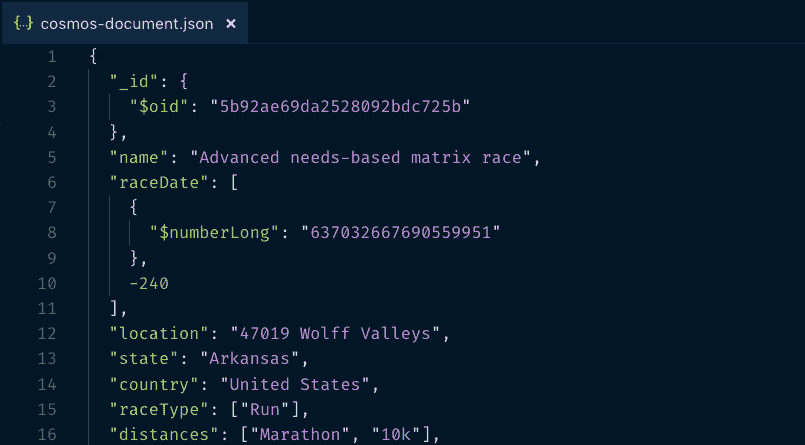
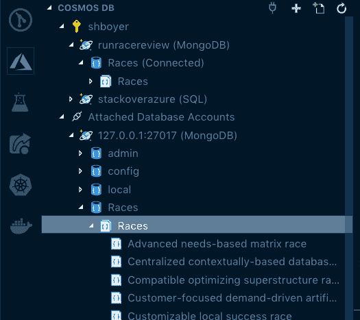
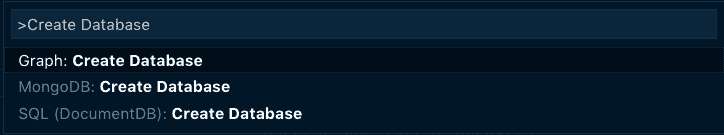
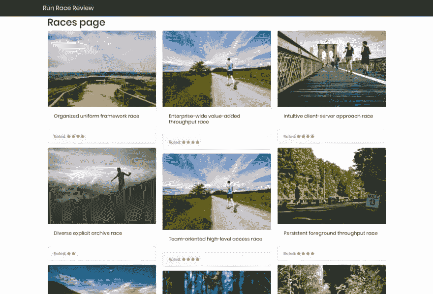

# 在容器中使用 ASP.NET 核心和 MongoDB 进行本地开发，使用 CosmosDB 进行生产

> 原文：<https://dev.to/azure/using-aspnet-core-with-mongodb-in-containers-for-local-dev-cosmosdb-for-production-5aj8>

[T2】](https://res.cloudinary.com/practicaldev/image/fetch/s--QqYyHmfI--/c_limit%2Cf_auto%2Cfl_progressive%2Cq_auto%2Cw_880/http://tattoocoder.com/conteimg/2018/10/Screen-Shot-2018-10-18-at-3.07.47-PM.png)

如果没有别的事情是真的，容器使得平台上的本地开发变得更加容易。如果您想使用 SQL Server 作为您的后端，只需`docker pull microsoft/mssql-server-linux`就可以用几个参数启动一个实例。

Azure CosmosDB 不能作为容器使用，但是，MongoDB 是可用的，并且恰好是我在以前的应用程序中使用过的数据库。 [MongoDB 是 CosmosDB 支持的众多 API 之一](https://docs.microsoft.com/en-us/azure/cosmos-db/mongodb-introduction?WT.mc_id=none-blog-shboyer)；在本地，我可以针对 Mongo 的一个实例进行开发，无论是在容器中还是在已安装的环境中，只需更改我的生产实例的连接字符串。

如果您现有的应用程序正在使用 Mongo，并且您正在寻找 CosmosDB 提供的全局可伸缩性和特性，那么能够使用 MongoDB 然后只需更改连接字符串来使用 CosmosDB 的灵活性是一个很好的功能。

> 如果您需要将数据从 MongoDB 应用程序迁移到 cosmos db(T2 ),步骤见本文档。

### 创建数据库

对于 MongoDB 本地来说，使用 Docker 超级简单。运行`docker pull mongo`，现在您可以在您的应用程序中使用它了。

```
docker run --name mongo mongo 
```

Enter fullscreen mode Exit fullscreen mode

Visual Studio 代码有一个 CosmosDB 扩展，作为 Azure 扩展包的一部分，它允许您与 Mongo 数据库以及 CosmosDB 实例进行交互。

[T2】](https://res.cloudinary.com/practicaldev/image/fetch/s--HtywiY-1--/c_limit%2Cf_auto%2Cfl_progressive%2Cq_auto%2Cw_880/http://tattoocoder.com/conteimg/2018/10/Screen-Shot-2018-10-18-at-2.38.22-PM.png)

这个扩展还允许你直接从 VS 代码中创建你的 CosmosDB 实例，或者你可以在 Azure 门户或者甚至使用 [Azure CLI](https://docs.microsoft.com/en-us/azure/cosmos-db/cli-samples?WT.mc_id=none-blog-shboyer) 来创建它。

[T2】](https://res.cloudinary.com/practicaldev/image/fetch/s--hIql3SWX--/c_limit%2Cf_auto%2Cfl_progressive%2Cq_auto%2Cw_880/http://tattoocoder.com/conteimg/2018/10/Screen-Shot-2018-10-18-at-2.41.22-PM.png)

无论您喜欢如何创建实例，都可以在同一个工具中完成，这对我来说太棒了。

### 局部发展

该应用程序是一个基本的[ASP.NET 核心剃刀页](https://docs.microsoft.com/en-us/aspnet/core/razor-pages/?view=aspnetcore-2.1&tabs=visual-studio-code&WT.mc_id=none-blog-shboyer)应用程序，其中列出了已经审查的“跑步比赛”。

[T2】](https://res.cloudinary.com/practicaldev/image/fetch/s--mecmLjU2--/c_limit%2Cf_auto%2Cfl_progressive%2Cq_auto%2Cw_880/http://tattoocoder.com/conteimg/2018/10/Screen-Shot-2018-10-18-at-1.58.52-PM.png)

应用程序和数据库都被设置为使用容器和 docker-compose 来编排它们。

**申请 Dockerfile**

```
FROM microsoft/dotnet:2.1.2-aspnetcore-runtime AS base  
WORKDIR /app  
EXPOSE 443

FROM microsoft/dotnet:2.1.403-sdk AS build  
WORKDIR /src  
COPY runracereview.csproj .  
RUN dotnet restore  
COPY . .  
WORKDIR /src  
RUN dotnet build -c Release -o /app

FROM build AS publish  
RUN dotnet publish -c Release -o /app

FROM base AS final  
WORKDIR /app  
COPY --from=publish /app .  
ENTRYPOINT ["dotnet", "runracereview.dll"] 
```

Enter fullscreen mode Exit fullscreen mode

**坞站-复合**

```
version: "3"  
services:  
  runracreview:
    container_name: runracereview
    restart: always
    build:
      context: ./runracereview
      dockerfile: Dockerfile
    environment:
      - ASPNETCORE_ENVIRONMENT=Development
      - ASPNETCORE_URLS=http://+:80
    ports:
      - "57270:80"
      - "44348:443"
    volumes:
      - ${HOME}/.microsoft/usersecrets/:/root/.microsoft/usersecrets
      - ${HOME}/.aspnet/https:/root/.aspnet/https/
    links:
      - mongo
  mongo:
    container_name: mongo
    image: mongo
    volumes:
      - ${WEBAPP_STORAGE_HOME}/site:/data/db
      #- ./data:/data/db
    ports:
      - "27017:27017" 
```

Enter fullscreen mode Exit fullscreen mode

请注意，在组合文件中， **mongo** 映像有一个映射到`${WEBAPP_STORAGE_HOME}/site:/data/db`的卷，这样做是为了在本地保存测试数据，以免每次容器启动时都重新加载数据。

> 查看微软学习课程:[用 Visual Studio 代码为 Azure Cosmos DB 构建一个. NET 核心应用](https://docs.microsoft.com/en-us/learn/modules/build-cosmos-db-app-with-vscode/?WT.mc_id=none-blog-shboyer) - **免费**

#### 设置 app

使用基于环境的配置设置来连接数据库。

在 **appsettings 中。Development.json** ，为 Mongo 添加配置，为了生产，CosmosDB 连接字符串在 **appsettings 中设置。Production.json** 。[配置生成器](https://docs.microsoft.com/en-us/aspnet/core/fundamentals/configuration/?view=aspnetcore-2.1&WT.mc_id=none-blog-shboyer)根据环境加载合适的文件。

```
 "MongoDB": {
    "ConnectionString": "mongodb://localhost:27017",
    "Container" : "mongodb://mongo:27017",
    "Database": "Races"
  }, 
```

Enter fullscreen mode Exit fullscreen mode

**Startup.cs** 配置**设置**选项。

```
 services.Configure<Settings>(
      options =>
      {
        options.ConnectionString = Configuration.GetSection("MongoDb:ConnectionString").Value;
        options.Database = Configuration.GetSection("MongoDb:Database").Value;
        options.Container = Configuration.GetSection("MongoDb:Container").Value;
        options.IsContained = Configuration["DOTNET_RUNNING_IN_CONTAINER"] != null;
      }); 
```

Enter fullscreen mode Exit fullscreen mode

> 如果你在跑步。你可以检查环境变量`DOTNET_RUNNING_IN_CONTAINER`来确定这是否是真的。

如果应用程序在容器中运行并且正在开发中，那么[设置类](https://github.com/spboyer/runracereview/blob/master/runracereview/Settings.cs#L13)返回容器的正确连接字符串。

### 简单却...

能够在本地工作并迭代一组简单的数据，而不必不断地触及生产数据，或者在尝试新事物时关注**呃哦**时刻是这种设置的优势。

这个应用程序的代码可以在 GitHub 上找到:[https://github.com/spboyer/runracereview](https://github.com/spboyer/runracereview)

[T2】](https://res.cloudinary.com/practicaldev/image/fetch/s--psxIZWak--/c_limit%2Cf_auto%2Cfl_progressive%2Cq_auto%2Cw_880/http://feeds.feedburner.com/%257Er/Tattoocoder/%257E4/zaxK7wIyvIc)