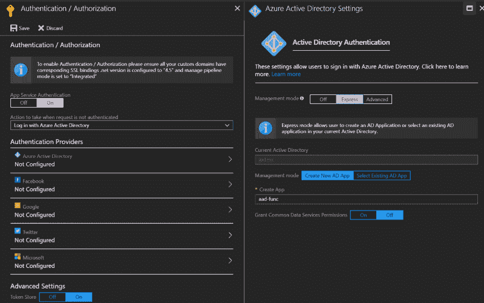
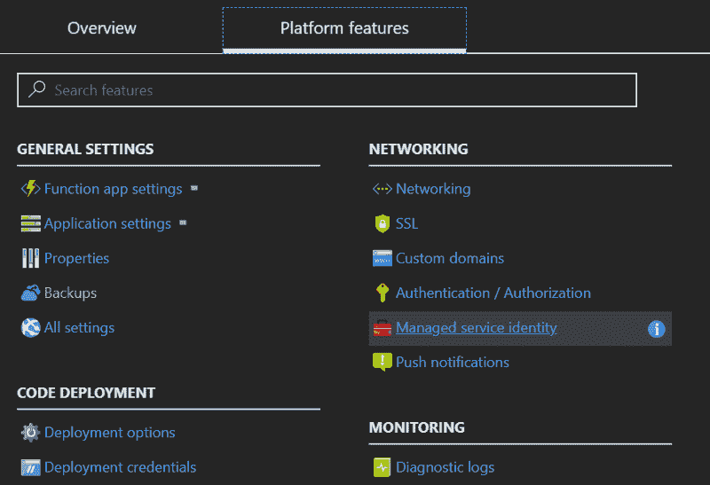

# 在你的应用中使用 Azure 托管服务标识

> 原文：<https://dev.to/jpda/using-azure-managed-service-identities-with-your-apps-37cl>

如果我们想从我们的应用程序中访问受保护的资源，我们通常必须在我们的应用程序中提供一个密钥和秘密。传统上，这意味着在 Azure AD 中注册一个应用程序/服务主体，获得一个 id + secret，然后在类似 Key Vault 的事情中向该主体授予权限。在运行时，我们的代码将使用 ID + secret 向 AAD 进行身份验证，并获得一个访问令牌来连接其他服务。

从操作上来说，这很不方便——现在我有需要管理的应用程序注册和秘密——特别是秘密生命周期。另外，我必须在 config 或 appsettings 中发布这些秘密，并在我运行的任何环境中尽力保护这些秘密。

这些文档涵盖了许多常见的用例——访问 [Azure 存储](https://docs.microsoft.com/en-us/azure/active-directory/managed-service-identity/tutorial-windows-vm-access-storage-sas)、 [SQL DB](https://docs.microsoft.com/en-us/azure/active-directory/managed-service-identity/tutorial-windows-vm-access-sql) 、[数据湖存储](https://docs.microsoft.com/en-us/azure/active-directory/managed-service-identity/tutorial-windows-vm-access-datalake)、[资源管理器](https://docs.microsoft.com/en-us/azure/active-directory/managed-service-identity/tutorial-windows-vm-access-arm)等，但没有说明如何在我们自己的应用中使用这些。随着我们继续沿着广泛的分布式服务套件的道路前进，所有这些服务都需要相互通信，由平台管理我的应用的身份，而不是依赖于编写更多的自动化、警报或人工流程，这具有巨大的优势。

我正在使用 Azure 函数，但这将在完整的应用服务中工作，以及 Azure 虚拟机和虚拟机规模集。这其实很简单。这是我们简单的景观:

*   功能应用 1: msi-func，支持 msi 的应用服务
*   功能 app 2: aad-func，Azure AD 注册应用

### aad-func

这代表了一个典型的 API——只是一个受 AAD 保护的服务。如果您将 App Service 的内置认证/授权功能用于您的功能，您将获得 App Service 为您验证`Authorization`标头的额外好处。

 通过功能 App 添加 Azure AD 平台功能→认证/授权

接下来，我们将在应用注册中创建一个`appRole`。这实际上是我们可以分配给 MSI 的应用范围。你会像往常一样在 AAD 中找到应用程序的注册，因为应用程序服务中的“快速”管理模式会自动为你创建一个应用程序注册。

 注`allowedMemberType of Application — this creates a scope assignable to an application`

现在我们给我们的函数一点代码——这里没有什么太激动人心的。

### msi-func

在我们的 MSI 函数中，我们希望首先启用 MSI。

 平台特性→托管服务身份→开启

接下来，我们将添加一些代码。比另一个多一点，但还是不多。

我们还需要添加 package.json，以引入处理向本地 MSI 端点请求令牌的神奇程序集:

[或者用`HttpClient`或您选择的语言手动呼叫端点](https://docs.microsoft.com/en-us/azure/app-service/app-service-managed-service-identity#rest-protocol-examples)。

### 将我们的 MSI 添加到 appRole

最后，让我们将应用程序添加到我们之前创建的 appRole 中。这是可选的，所以如果您在您的目录中没有权限，可以跳过。

破解 Azure AD Powershell v2

我们准备好了！回到您的 MSI 函数并单击 Run —您应该在响应中得到一组返回的声明。让我们来看看:

为了简洁起见，我删除了一些，但这里有一些重要的:

*   aud(ience):这是我们的 AAD 应用程序的 ID，所以这个令牌对我们的应用程序有效
*   iss(uer):这是由我们的 AAD 租户发布的，因此我们可以信任其来源
*   appid:这是请求令牌的应用程序的 id，在我们的例子中，它匹配我们的 MSI 的应用程序 ID(不是对象 ID)
*   身份提供商:也是我们的租户
*   角色:这是我们的角色——DoAll
*   name identifier:MSI 应用程序的对象 ID(不是应用程序 ID)
*   泰南提德:还是我们的房客，以防万一

所有这些都不需要在我们的代码中隐藏任何秘密！立即试用 MSI。