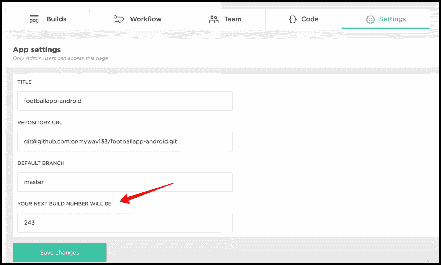

# 对 android 应用程序使用逐位 ci

> 原文：<https://dev.to/onmyway133/using-bitrise-ci-for-android-apps-5e3k>

[T2】](https://res.cloudinary.com/practicaldev/image/fetch/s--G67Vpsx8--/c_limit%2Cf_auto%2Cfl_progressive%2Cq_auto%2Cw_880/https://cdn-images-1.medium.com/max/1600/1%2AgoLDTJPdKbN2rR46dC3Xag%402x.jpeg)

CI 是持续集成的缩写，是一个快速自信地将代码集成到共享存储库中的良好实践。让拉请求被构建、测试和发布构建被分发给测试人员的能力允许团队验证自动化构建并快速识别问题。

我一直在 iOS 和 Android 应用程序上使用 BuddyBuild，我对此非常满意。创建新应用和部署 build 的体验棒极了。它运行得如此之好，以至于[苹果收购了它](https://www.buddybuild.com/blog/buddybuild-is-now-part-of-apple)，这导致了安卓应用程序不再受支持，新用户无法注册。

我们是那些寻找新替代品的 T2 人之一。我们一直在使用 TravisCI、CircleCI 和 Jenkins 来部署到 Fabric。还有[团队合作](https://www.jetbrains.com/teamcity/)也很有前途。但是通过对朋友和人的快速调查， [Bitrise](https://www.bitrise.io/) 是最值得推荐的。所以也许我应该试试。

我喜欢 Bitrise 的一点是它对工作流的广泛支持。它们只是执行某些动作的脚本，大部分都是[开源](https://github.com/bitrise-io/)。也有 yml 配置文件，但是所有的事情都可以使用 web 界面来完成，所以我不需要为了正确配置而查看大量的文档。

这篇文章不是对 Bitrise 的宣传，它只是关于尝试和适应新事物。科技中没有永恒的东西，事物来的快去的也快。以下是我使用 Bitrise 后学到的一些经验，希望你觉得有用。

## 变型构建

在默认的“主”工作流中没有 Android 构建步骤，因为主通常用于测试每次推送的代码。部署工作流中有一个 Android 构建步骤，通过运行该工作流来构建应用程序。然而，我喜欢在我的主要工作流程中有 Android 构建步骤，所以我把它添加在那里。

通常，我希望应用程序模块和 stagingRelease 构建变体，因为我们需要将阶段构建部署到内部测试人员。

[T2】](https://res.cloudinary.com/practicaldev/image/fetch/s--tkmAQ7O1--/c_limit%2Cf_auto%2Cfl_progressive%2Cq_auto%2Cw_880/https://cdn-images-1.medium.com/max/2882/1%2AuJGkaQ0EvmDIM_T3ZTmuZw.png)

如果转到 Bitrise.yml 选项卡，可以看到配置文件已经更新。这非常方便。我使用过一些其他的 CI 服务，我需要查找他们关于如何使用 yml 的文档。

[T2】](https://res.cloudinary.com/practicaldev/image/fetch/s--CGyjzqE8--/c_limit%2Cf_auto%2Cfl_progressive%2Cq_auto%2Cw_880/https://cdn-images-1.medium.com/max/2836/1%2Az9eotS_Dyetx4ubtjWsnjg.png)

## 自动撞版码

我以前用过一些其他 CI 服务，app 版本代码肯定不是从 0 开始的。因此，Bitrise 可以从当前的版本号自动删除版本代码是有道理的。工作流中有一些预定义的步骤，但它们不能满足我的需要

[T2】](https://res.cloudinary.com/practicaldev/image/fetch/s--nKXxxelG--/c_limit%2Cf_auto%2Cfl_progressive%2Cq_auto%2Cw_880/https://cdn-images-1.medium.com/max/2000/1%2AMsojdXPWw9WMzVa8SuOtDA.png)

对于设置 Android 清单版本代码和名称步骤，源代码是[这里是](https://github.com/jamesmontemagno/steps-set-android-manifest-versions/blob/master/step.sh)，所以我理解它做什么。它通过使用 sed 修改 AndroidManifest.xml 文件来工作。这条[调你的建号](https://blog.bitrise.io/adjust-your-build-numbers)不够清晰。

[T2】](https://res.cloudinary.com/practicaldev/image/fetch/s--c5rOQ95v--/c_limit%2Cf_auto%2Cfl_progressive%2Cq_auto%2Cw_880/https://cdn-images-1.medium.com/max/2076/1%2AWDmvpUHp23a-jBjWVfN00Q.png)

```
sed -i.bak “s/android:versionCode=”\”${VERSIONCODE}\””/android:versionCode=”\”${CONFIG_new_version_code}\””/” ${manifest_file} 
```

Enter fullscreen mode Exit fullscreen mode

在我们的项目中，versionCode 来自 Jenkins 中的一个环境变量 BUILD_NUMBER，所以我们需要在[可用环境变量](https://devcenter.bitrise.io/faq/available-environment-variables/)中查找相同的内容，它是 BITRISE_BUILD_NUMBER，这是 bitrise.io 上的构建的一个构建号。

这是版本代码在 build.gradle 中的样子

```
versionCode (System.*getenv*("BITRISE_BUILD_NUMBER") as Integer ?: System.*getenv*("BUILD_NUMBER") as Integer ?: 243) 
```

Enter fullscreen mode Exit fullscreen mode

243 是这个项目的当前版本代码，所以让我们转到应用程序的设置，并更改您的下一个版本号将是

[T2】](https://res.cloudinary.com/practicaldev/image/fetch/s--k5nhJeik--/c_limit%2Cf_auto%2Cfl_progressive%2Cq_auto%2Cw_880/https://cdn-images-1.medium.com/max/2254/1%2AxUOPh2zy6V6hMPPty_PMXg.png)

## 部署到结构

希望 Bitrise 有自己的崩溃报告工具。现在我在[面料](https://fabric.io/home)中使用 Crashlytics。尽管 Bitrise 可以将构建分发给测试人员，但由于历史原因，我仍然需要交叉部署到 Fabric。

只有脚本[步骤-fabric-crashlytics-beta-deploy](https://github.com/bitrise-io/steps-fabric-crashlytics-beta-deploy)为 iOS 应用部署 IPA 文件，所以我们需要为 Android 准备一些东西。幸运的是，我可以为 gradle 使用 Fabric 插件。

### 添加面料插件

按照[通过 Gradle](https://fabric.io/kits/android/crashlytics/install) 安装 Crashlytics 以添加 Fabric 插件。基本上，你需要将这些依赖项添加到你的应用程序的 build.gradle 中

```
buildscript {
    repositories {
        google()
        maven { url 'https://maven.fabric.io/public' }
    }

    dependencies {
        classpath 'io.fabric.tools:gradle:1.+'
    }
}

apply plugin: 'io.fabric'

dependencies {
    compile('com.crashlytics.sdk.android:crashlytics:2.9.4@aar') {
        transitive = true;
    }
} 
```

Enter fullscreen mode Exit fullscreen mode

清单文件中的 API 凭据

```
<meta-data
 android:name=”io.fabric.ApiKey”
 android:value=”67ffdb78ce9cd50af8404c244fa25df01ea2b5bc”
 /> 
```

Enter fullscreen mode Exit fullscreen mode

### 部署命令

现代 Android Studio 通常在项目的根目录下包含一个 gradlew 执行文件。快跑。/gradlew tasks 有关您的应用程序可以执行的任务列表，请查找以 assemble 开头的生成任务。阅读更多信息[从命令行构建您的应用](https://developer.android.com/studio/build/building-cmdline)

> 您可以使用 [Gradle wrapper](https://docs.gradle.org/current/userguide/gradle_wrapper.html) 命令行工具来执行 Android 项目可用的所有构建任务。它可以作为一个用于 Windows 的批处理文件(gradlew.bat)和一个用于 Linux 和 Mac 的 shell 脚本(gradlew.sh)获得，并且可以从您使用 Android Studio 创建的每个项目的根目录访问。

对我来说，我想部署分阶段发布构建变体，所以我运行。检查构建是否基于 Fabric。

```
./gradlew assembleStagingRelease crashlyticsUploadDistributionStagingRelease 
```

Enter fullscreen mode Exit fullscreen mode

### 管理测试人员组

转到 Fabric.io 上的应用程序，创建一组测试人员。请注意为该组生成别名

[T2】](https://res.cloudinary.com/practicaldev/image/fetch/s--3fbf2iP6--/c_limit%2Cf_auto%2Cfl_progressive%2Cq_auto%2Cw_880/https://cdn-images-1.medium.com/max/2000/1%2AHMeW8VGqC6OWRizl0cC5BQ.png)

转到您的应用程序的 build.gradle，将 ext . beta distribution group aliases = ' my-internal-testers '添加到您所需的产品风格或构建类型中。对我来说，我在 productFlavors 下添加了 staging

```
productFlavors {
   staging {
     // …
     ext.betaDistributionGroupAliases=’hyper-internal-testers-1'
   }
   production {
     // …
   }
} 
```

Enter fullscreen mode Exit fullscreen mode

现在命令已经正确运行，让我们将它添加到 Bitrise 中

### 梯度运行步

转到“工作流”选项卡，添加一个 Gradle 运行步骤，并将其放在“部署到 Bitrise.io 步骤”下面。

[T2】](https://res.cloudinary.com/practicaldev/image/fetch/s--9GQkgXJI--/c_limit%2Cf_auto%2Cfl_progressive%2Cq_auto%2Cw_880/https://cdn-images-1.medium.com/max/2782/1%2AoHUZoX-rdiqXjTV9SFFcKA.png)

展开“配置”,并将 assembleStagingRelease crashlyticsuploaddistributionstaginrelease 添加到要运行的 Gradle 任务。

现在，在 Bitrise 中手动启动一个新的构建，或者通过发出 pull 请求来触发新的构建，您可以看到每个构建的版本代码都会增加，交叉的构建会被部署到您定义的测试人员组的 Fabric 中。

或者，您也可以使用[Fabric/Crashlytics deployer](https://github.com/bitrise-io/steps-fabric-crashlytics-beta-deploy)，只需使用在[设置](https://fabric.io/settings)中找到的应用密钥和密码更新配置。

## 何去何从

希望那些提示对你有用。这里有更多的链接来帮助你进一步探索

*   [转换旧的 Android 工作流程，并基于 Bitrise 上的旧 Gradle 任务配置新步骤](https://medium.com/@bitrise/convert-old-android-workflows-and-configure-new-steps-based-on-the-old-gradle-tasks-on-bitrise-51a1adbfe78d)

*   [使用 Sed](https://stackoverflow.com/questions/11245144/replace-whole-line-containing-a-string-using-sed) 替换包含一个字符串的整行

*   [buddy build 的替代品？](https://github.com/GitHawkApp/GitHawk/issues/1330)

*   [通过 Crashlytics 的测试版简化 Android 应用分发](https://engineering.udacity.com/simplifying-app-distribution-with-beta-by-crashlytics-6c8c24f4ab02)

*   【Android Studio 的 Fabric 应用

*   [多口味 app 的 Crashlytics 分发](https://stackoverflow.com/questions/27383732/crashlytics-distribution-for-app-with-multiple-flavors)

*   [度插件](https://www.tutorialspoint.com/gradle/gradle_plugins.htm)

*   [在没有 IDE 插件的情况下在 Crashlytics 中设置新应用](https://blog.danlew.net/2015/02/20/setting-up-a-new-app-in-crashlytics-without-the-plugin/)

原帖[https://hacker noon . com/using-bit rise-ci-for-Android-apps-fa 9 c 48 e 301d 8](https://hackernoon.com/using-bitrise-ci-for-android-apps-fa9c48e301d8)