# 对 react 本机应用程序使用按位 ci

> 原文：<https://dev.to/onmyway133/using-bitrise-ci-for-react-native-apps-162m>

[T2】](https://res.cloudinary.com/practicaldev/image/fetch/s--oMms6kDj--/c_limit%2Cf_auto%2Cfl_progressive%2Cq_auto%2Cw_880/https://cdn-images-1.medium.com/max/2000/0%2AUEbB7ZaQV8TzfNQG.jpg)

在尝试了 Travis、 [CircleCI](https://medium.com/fantageek/using-circleci-2-0-in-ios-apps-7641424ba388) 和 [BuddyBuild](https://medium.com/fantageek/buddybuild-and-gradle-properties-in-android-apps-4590d17a2203) 之后，我现在选择 [Bitrise](https://hackernoon.com/using-bitrise-ci-for-android-apps-fa9c48e301d8) 作为我的移动应用。许多很酷的步骤和工作流使 Bitrise 成为一个理想的 CI 尝试。像任何其他配置项一样，学习步骤和配置一开始可能会令人生畏。在 CI 上本地工作的东西可能会失败，如何将标记为 git ignore 的东西发送到 CI 构建中使用是一个普遍的问题。

在这篇文章中，我将展示如何为 iOS 和 Android 部署 React 本地应用程序。要记住的关键事情是在 CI 上拥有与本地相同的设置。他们要确保软件包和工具的版本完全相同，要注意 gitignore 中的文件模式，因为这些更改不会出现在 CI 中，以及如何正确使用环境变量和安全文件。

这篇文章试图通过大量的截图来体现直观性。希望你能学到一些东西，避免像我一样浪费时间。

## 支持 React 原生

从最简单的意义上来说，React Native 只是原生 iOS 和 Android 项目的 Javascript 代码，Bitrise 对 React Native 有非常好的[支持](https://blog.bitrise.io/how-to-set-up-a-react-native-app-on-bitrise)。它扫描 ios 和 android 文件夹，并给出关于方案和构建变体的建议。

Bitrise 的另一个好处是它的各种有用的步骤和工作流程。不像其他配置项，我们必须花几天时间来编辑配置文件，Bitrise 有一个非常好的 UI 来添加和编辑步骤。步骤只是定制的脚本，我们可以写自己喜欢的东西。大多数预定义的步骤都是开源的。这里有一些

*   [证书和配置文件安装程序](https://github.com/bitrise-io/steps-certificate-and-profile-installer)

*   [安装 CocoaPods](https://github.com/bitrise-io/steps-cocoapods-install)

*   [时差信息](https://github.com/bitrise-io/steps-slack-message)

*   [Gradle Runner](https://github.com/bitrise-io/steps-gradle-runner)

## 为 iOS 构建

除非您使用带模拟器的分步构建，否则您将需要带有私钥的预置描述文件和证书，以便为设备构建。

### 安装 React Native

反应土著移动快，打破东西。如果您没有 React Native 的相同版本，您将很难弄清楚为什么构建在 CI 上总是失败。

目前我使用的是 reactor Native 0 . 57 . 0，所以我输入 install[reactor-Native @ 0 . 57 . 0](mailto:react-native@0.57.0)让 Bitrise 安装相同的版本

[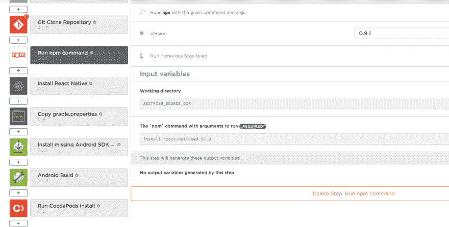T2】](https://res.cloudinary.com/practicaldev/image/fetch/s--6WRPMgFS--/c_limit%2Cf_auto%2Cfl_progressive%2Cq_auto%2Cw_880/https://cdn-images-1.medium.com/max/5148/1%2A7dalPt_TWrxQM1Fy0pVV6Q.png)

此外，我们需要确保我们有相同版本的 react-native-cli 和 Install React Native 步骤

[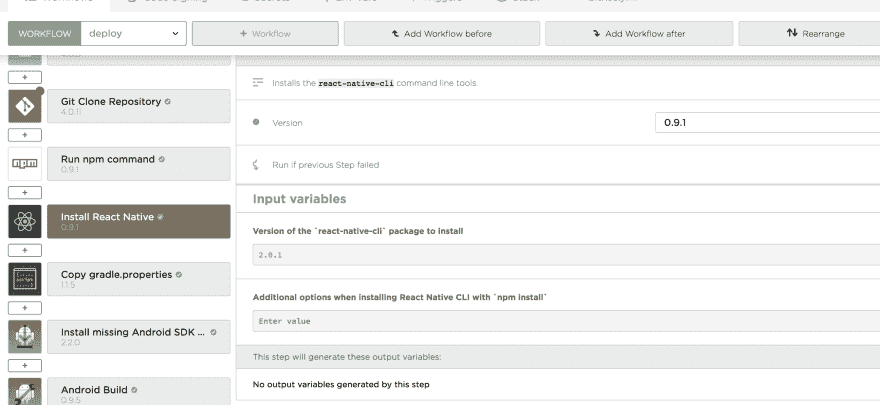T2】](https://res.cloudinary.com/practicaldev/image/fetch/s--JhEc5HFh--/c_limit%2Cf_auto%2Cfl_progressive%2Cq_auto%2Cw_880/https://cdn-images-1.medium.com/max/5376/1%2A0geJx4BeLCRigAZaWRRbhQ.png)

### 安装椰子脚架

拥有相同的 CocoaPods 版本是安全的。对于 Xcode 10，我们至少需要 CocoaPods 1.6.0.beta-1 来避免 bug [跳过代码签名，因为目标没有 Info.plist 文件](https://stackoverflow.com/questions/52332207/xcode-10-warning-skipping-code-signing-because-the-target-does-not-have-an-info)。请注意，我们的 Xcode 项目位于 ios 文件夹中，因此我们指定。Podfile 路径的/ios/Podfile

[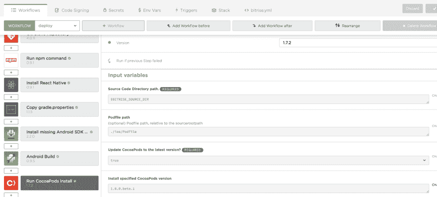T2】](https://res.cloudinary.com/practicaldev/image/fetch/s--6gWRtv7---/c_limit%2Cf_auto%2Cfl_progressive%2Cq_auto%2Cw_880/https://cdn-images-1.medium.com/max/6276/1%2A9igBlR1u4HkVIisVJ8n9jg.png)

### 代码签名

在工作流->代码签名下，我们可以上传配置文件和证书。

[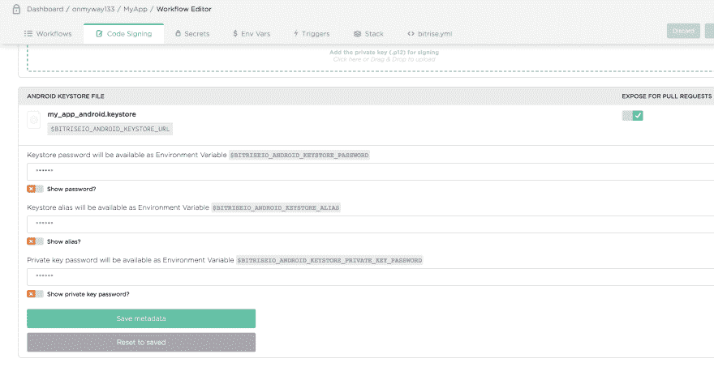T2】](https://res.cloudinary.com/practicaldev/image/fetch/s--BSxCK6Xs--/c_limit%2Cf_auto%2Cfl_progressive%2Cq_auto%2Cw_880/https://cdn-images-1.medium.com/max/6244/1%2A-U8eExDeUtiQIQr737JOXw.png)

然后，我们需要使用证书和配置文件安装步骤来使用我们上传的配置文件和证书。

[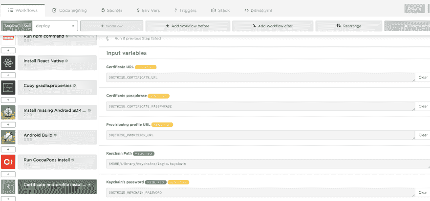T2】](https://res.cloudinary.com/practicaldev/image/fetch/s--lREUpfdH--/c_limit%2Cf_auto%2Cfl_progressive%2Cq_auto%2Cw_880/https://cdn-images-1.medium.com/max/6100/1%2AD87n4E2d-zst11qItGIF3w.png)

### iOS 自动配置

另一个选择是使用 [iOS 自动供应](https://blog.bitrise.io/ios-auto-provision-step)步骤，但它要求我们需要在团队中有一个已连接苹果开发者帐户的帐户。这样，Bitrise 可以为我们自动生成配置文件。

[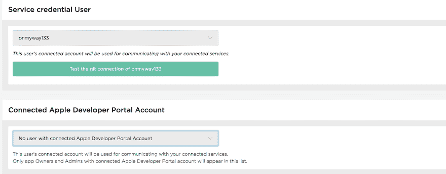T2】](https://res.cloudinary.com/practicaldev/image/fetch/s--Vrics8kW--/c_limit%2Cf_auto%2Cfl_progressive%2Cq_auto%2Cw_880/https://cdn-images-1.medium.com/max/4768/1%2AqvapzygIiXp8-Zi_K2CZ0A.png)

### 重新创建用户方案

Bitrise 可以通过[重新创建用户方案](https://github.com/bitrise-steplib/steps-recreate-user-schemes)步骤自动生成方案，但是最好在 Xcode 中将我们的方案标记为共享。这确保了本地和 CI 构建之间的一致性。

### 存档

为了归档项目，我们需要添加 Xcode 归档和导出。对于 React Native，ios 项目在 iOS 文件夹内，所以我们需要指定。项目路径的/ios/MyApp.xcworkspace。注意，我使用 xcworkspace 是因为我有 CocoaPods

[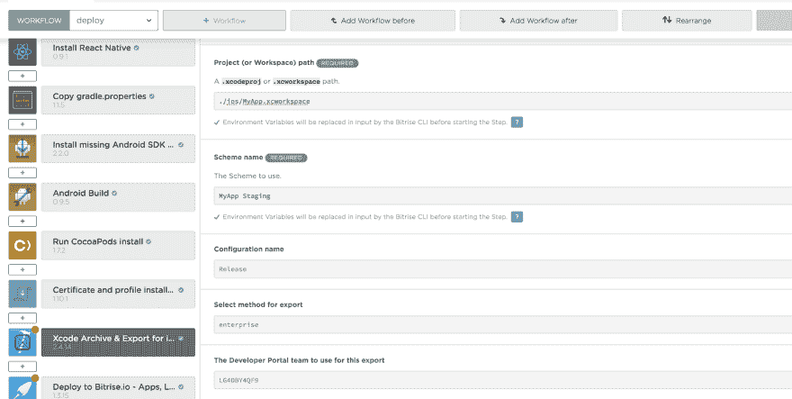T2】](https://res.cloudinary.com/practicaldev/image/fetch/s--iTeTDVP4--/c_limit%2Cf_auto%2Cfl_progressive%2Cq_auto%2Cw_880/https://cdn-images-1.medium.com/max/5760/1%2AXSKuNPL53OnlOwU3gKybeg.png)

目前，从 React Native 0.57.0 开始，它在运行 [Xcode 10](https://github.com/facebook/react-native/issues/21168) 中的新构建系统时出现了问题，因此快速解决方法是使用遗留构建系统。在 Xcode 归档&导出步骤下，有一些字段可以为 xcodebuild 调用添加额外的选项。Enter -UseModernBuildSystem=NO

[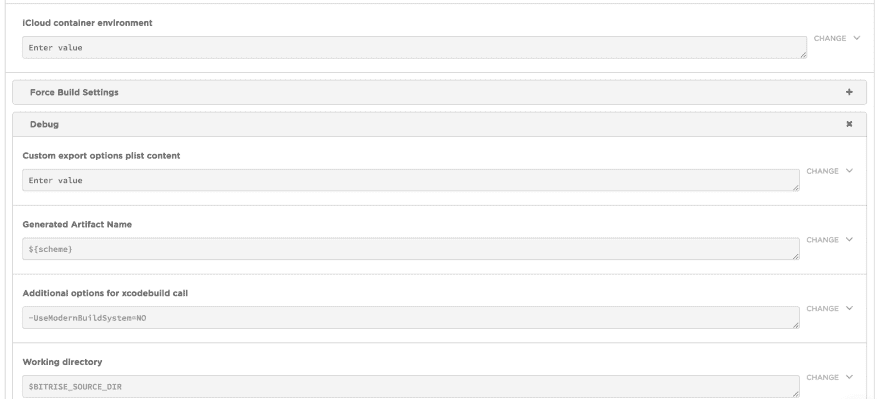T2】](https://res.cloudinary.com/practicaldev/image/fetch/s--M3zF5raw--/c_limit%2Cf_auto%2Cfl_progressive%2Cq_auto%2Cw_880/https://cdn-images-1.medium.com/max/5172/1%2AxB6yCWhHpJ0LCbwu7pDIOQ.png)

你可以阅读更多 Xcode 10 的[构建系统发行说明](https://developer.apple.com/documentation/xcode_release_notes/xcode_10_release_notes/build_system_release_notes_for_xcode_10)

> Xcode 10 使用了新的构建系统。新的构建系统提供了改进的可靠性和构建性能，并且它捕捉到了遗留构建系统所没有的项目配置问题。

## 为 Android 构建

对于 Android，最麻烦的任务是将密钥库文件交给 Bitrise，因为这是我们对 GitHub 保密的东西。Bitrise 允许我们上传密钥库文件，但是我们还需要指定密钥别名和密钥密码。一种解决方案是使用秘密和环境变量

[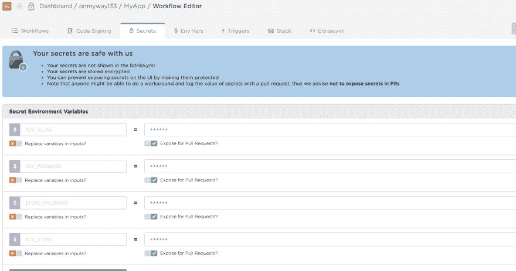T2】](https://res.cloudinary.com/practicaldev/image/fetch/s--FcToWOq---/c_limit%2Cf_auto%2Cfl_progressive%2Cq_auto%2Cw_880/https://cdn-images-1.medium.com/max/5800/1%2AmeeAqXnpIc04MntoW7OOPQ.png)

但是由于我们经常使用 gradle.properties 为 gradle 指定自定义变量，所以上传这个文件很方便。在 Workflow -> Code Signing 下，我们可以上传密钥库和安全文件

[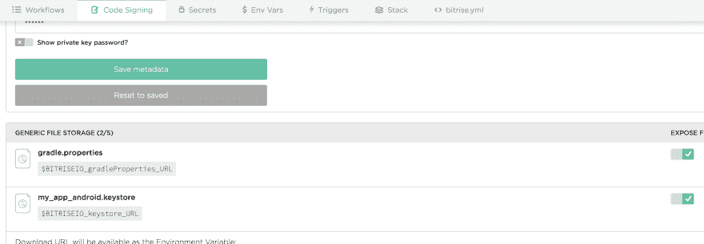T2】](https://res.cloudinary.com/practicaldev/image/fetch/s--6ml9rhQj--/c_limit%2Cf_auto%2Cfl_progressive%2Cq_auto%2Cw_880/https://cdn-images-1.medium.com/max/5588/1%2Aj1vER_HvSgJsrGjibT2hhg.png)

生成的 URL 变量是上传文件的路径。我们可以用 curl 下载它们。Bitrise 也有通用文件存储步骤来下载所有安全文件。

[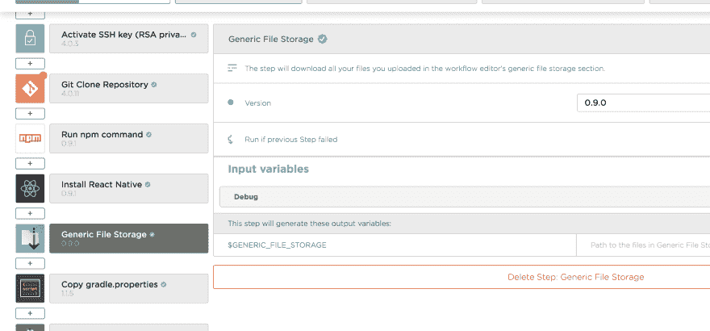T2】](https://res.cloudinary.com/practicaldev/image/fetch/s--ofIOUza_--/c_limit%2Cf_auto%2Cfl_progressive%2Cq_auto%2Cw_880/https://cdn-images-1.medium.com/max/5000/1%2AVG56m0wXDGA9lE9VPFMm2Q.png)

下载的文件位于 GENERIC_FILE_STORAGE，因此我们添加了另一个自定义脚本步骤来将这些文件复制到其中。/android 文件夹

[T2】](https://res.cloudinary.com/practicaldev/image/fetch/s--ryoBrneD--/c_limit%2Cf_auto%2Cfl_progressive%2Cq_auto%2Cw_880/https://cdn-images-1.medium.com/max/5692/1%2A8gkV4dl_jYmNYXmv-t8YNw.png)

```
#!/usr/bin/env bash

cp $GENERIC_FILE_STORAGE/gradle.properties ./android/gradle.properties
cp $GENERIC_FILE_STORAGE/my_app_android.keystore ./android/my_app_android.keystore 
```

请注意，文件的名称与我们上传时的名称相同，我们使用 cp 命令复制到文件夹中。

### Android Build

默认情况下，Bitrise 有两个工作流:主要用于快速启动，部署用于归档和部署。在部署工作流程中，有一个 Android 构建步骤。我们可以在这里覆盖模块并构建变体。

[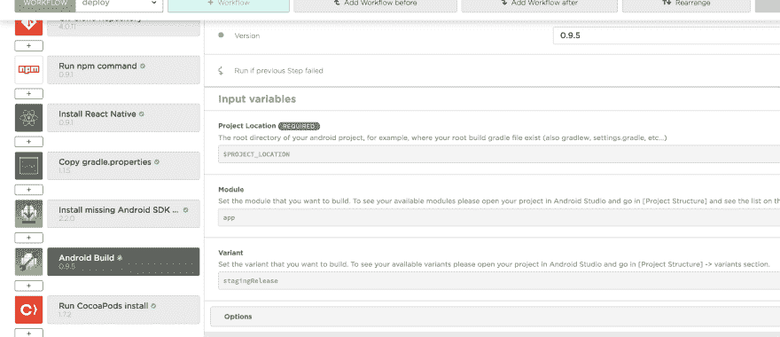T2】](https://res.cloudinary.com/practicaldev/image/fetch/s--6sBly7u5--/c_limit%2Cf_auto%2Cfl_progressive%2Cq_auto%2Cw_880/https://cdn-images-1.medium.com/max/5732/1%2AEIXwjn91bFYh-L6MCt0wzQ.png)

## 如果一切顺利

在 Bitrise 中，我们可以标记一个步骤来继续，而不管前一个步骤。我用这个来确保 iOS 独立于 Android 构建

[T2】](https://res.cloudinary.com/practicaldev/image/fetch/s--sDaUMyuh--/c_limit%2Cf_auto%2Cfl_progressive%2Cq_auto%2Cw_880/https://cdn-images-1.medium.com/max/6092/1%2Ay-Gl4Ggpd3D6aWHXl_b_lA.png)

如果 iOS 和 Android 构建都成功，我们应该会看到下面的摘要

[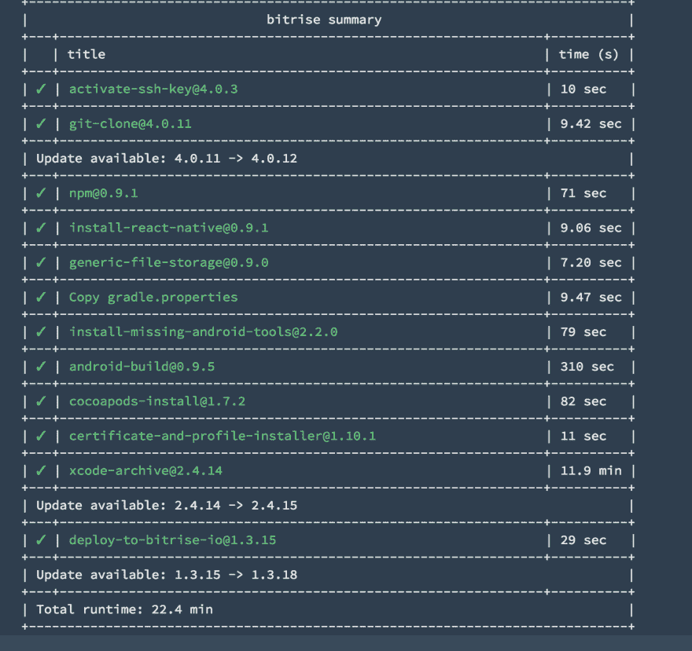T2】](https://res.cloudinary.com/practicaldev/image/fetch/s--pg11yuSh--/c_limit%2Cf_auto%2Cfl_progressive%2Cq_auto%2Cw_880/https://cdn-images-1.medium.com/max/3028/1%2AXLv8ga9NrNDxoOQbc4kzbQ.png)

虽然 Bitrise 有一个很好的 UI 来配置工作流和步骤，但我们可以精细地控制 bitrise.yml 文件中的每个参数。当我们熟悉所有的步骤时，在这里进行推理是很好的。

[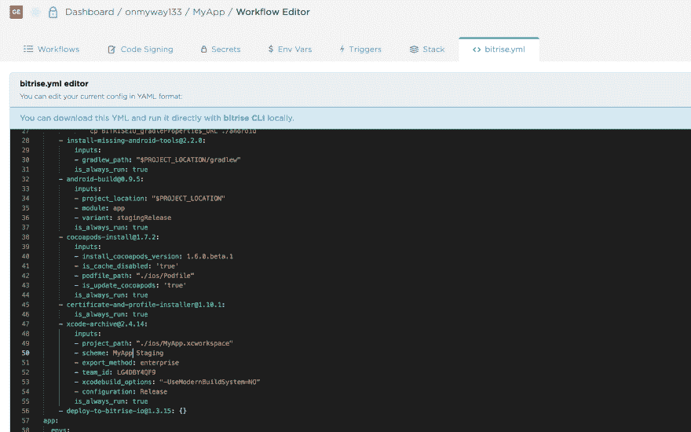T2】](https://res.cloudinary.com/practicaldev/image/fetch/s--aac9xtAM--/c_limit%2Cf_auto%2Cfl_progressive%2Cq_auto%2Cw_880/https://cdn-images-1.medium.com/max/5156/1%2A6PW6EVGZeDqKSMP9sHiziQ.png)

## 何去何从

我希望你能学到一些东西，并有一个愉快的部署。既然你在这里，下面的文章可能会让你感兴趣

*   [Android 应用中的 BuddyBuild 和 grad le . properties](https://medium.com/fantageek/buddybuild-and-gradle-properties-in-android-apps-4590d17a2203)

*   [将 React 本机部署到 Bitrise、Fabric、CircleCI](https://medium.com/react-native-training/fixing-react-native-issues-and-happy-deploy-to-bitrise-fabric-circleci-44da4ab1487b)

*   [处理 BuddyBuild 中更新的 pod](https://medium.com/hyperoslo/dealing-with-updated-pod-in-buddybuild-d6a128603e4f)

*   [在 iOS 应用中使用 circle ci 2.0](https://medium.com/fantageek/using-circleci-2-0-in-ios-apps-7641424ba388)

愿你的代码继续编译。

原帖[https://code burst . io/using-bit rise-ci-for-react-native-apps-b9e 7b 2722 Fe 5](https://codeburst.io/using-bitrise-ci-for-react-native-apps-b9e7b2722fe5)