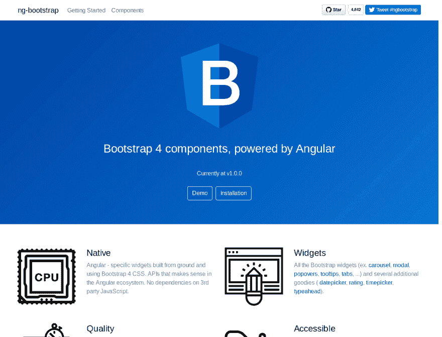
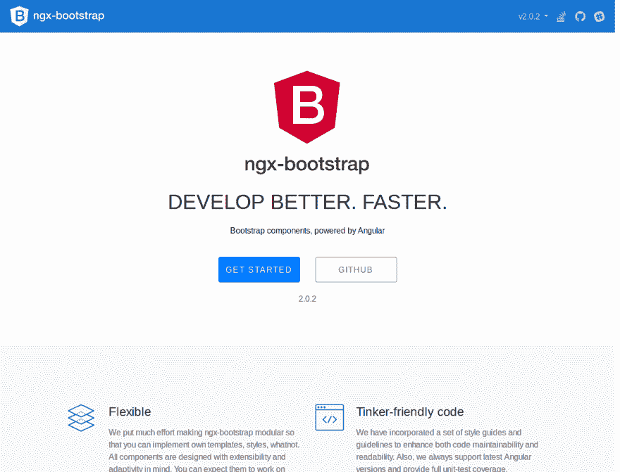

# 使用带角度 4|5 的自举 4

> 原文：<https://dev.to/techiediaries/using-bootstrap-4-with-angular-45-ea3>

Bootstrap 是最流行的 HTML 和 CSS 框架，用于轻松构建响应性布局，并且不需要对 CSS 有深入的了解(但是定制 CSS 是定制您的设计所必需的，并且使它不同于其他 Bootstrap 风格的网站，除非您使用的是专门为您开发的 BS 主题)。

Bootstrap 4 是 BS 的最新版本，它为框架带来了许多新的强大功能，最重要的是 Flexbox，它现在是 BS 网格布局的默认显示系统(BS 最重要的功能之一)。

在本教程中，我们将看到如何使用 Bootstrap 来设计使用 Angular 5 框架构建的网站。我们将看到如何使用`ng-bootstrap` vs. `ngx-bootstrap`包，并使用 Angular CLI 生成一个全新的项目，来轻松集成这两者。

因此，让我们从安装 [Angular CLI](https://cli.angular.io/) 开始，以防它尚未安装在您的系统上。

转到您的终端或命令提示符，然后运行以下命令来安装最新版本的 CLI

```
$ npm install -g @angular/cli@latest 
```

Enter fullscreen mode Exit fullscreen mode

这将全局安装 CLI，因此根据您的 *npm* 配置，您可能需要添加 *sudo* (用于管理员访问)。

安装完成后，您就可以使用 *ng* 实用程序了。让我们用它来生成一个新的 Angular 5 项目。

```
$ ng new ng5bootstrap4 
```

Enter fullscreen mode Exit fullscreen mode

这将为项目生成目录结构和必要的文件，并将安装依赖项。

接下来在新创建项目的根文件夹中导航

```
cd ng5bootstrap4 
```

Enter fullscreen mode Exit fullscreen mode

然后，您可以使用`ng serve`命令:
提供您的 Angular 5 应用程序

```
ng serve 
```

Enter fullscreen mode Exit fullscreen mode

您的应用将从`http://localhost:4200/`开始提供服务

现在回到你的终端，然后通过 npm 安装 Bootstrap 4

```
$ npm install --save bootstrap 
```

Enter fullscreen mode Exit fullscreen mode

这也将把*引导程序*添加到`package.json`。

Bootstrap 4 资产安装在`node_modules/bootstrap`文件夹中，所以你需要在你的应用程序主 HTML 文件的头部包含 CSS 文件，或者在`style.css`
中包含一个*@导入*

```
@import "~bootstrap/dist/css/bootstrap.css" 
```

Enter fullscreen mode Exit fullscreen mode

请注意，Bootstrap 4 依赖于 jQuery 和 Popper.js 库，因为我们没有包括它们，所以任何依赖于 JavaScript 的 Bootstrap 组件都不能工作。那么为什么不包括这些库呢？对于 Angular 来说，最好避免使用直接操作 DOM 的库(比如 jQuery ),让 Angular 来处理。

现在，如果您需要 Bootstrap 4 的完整功能，该怎么办呢？

你有不同的方法来包含 jQuery、`Popper.js`和`bootstrap.js`，不推荐，使用`.angular-cli.json`文件
中的脚本数组

```
"scripts": [
  "../node_modules/jquery/dist/jquery.js",
  "../node_modules/tether/dist/js/popper.js",
  "../node_modules/bootstrap/dist/js/bootstrap.js"
], 
```

Enter fullscreen mode Exit fullscreen mode

另一个更好的方法是使用组件库，这些组件库是为了让 Bootstrap 与 Angular 无缝工作而创建的，比如`ng-bootstrap`或`ngx-bootstrap`

[T2】](https://res.cloudinary.com/practicaldev/image/fetch/s--gnHzXHq2--/c_limit%2Cf_auto%2Cfl_progressive%2Cq_auto%2Cw_880/https://screenshotscdn.firefoxusercontent.cimg/de17d764-f3f2-41df-b3d4-3bdf838c306e.png)

> 我的项目应该添加 bootstrap.js 还是 bootstrap.min.js？不，ng-bootstrap 的目标是完全取代组件的 JavaScript 实现。也不应该包含其他依赖项，如 jQuery 或 popper.js。这是不必要的，可能会干扰 ng-bootstrap 代码[源](https://ng-bootstrap.github.io/#/getting-started)

所以首先您需要使用下面的命令从 npm 安装这个库:

```
npm install --save @ng-bootstrap/ng-bootstrap 
```

Enter fullscreen mode Exit fullscreen mode

完成安装后，您需要导入主模块。

```
import {NgbModule} from '@ng-bootstrap/ng-bootstrap'; 
```

Enter fullscreen mode Exit fullscreen mode

接下来你需要将你导入的模块添加到你的应用根模块

```
import {NgbModule} from '@ng-bootstrap/ng-bootstrap';

@NgModule({
  declarations: [/*...*/],
  imports: [/*...*/, NgbModule.forRoot()],
  /*...*/
})
export class AppModule {
} 
```

Enter fullscreen mode Exit fullscreen mode

请注意`ng-bootstrap`需要 Bootstrap 4 CSS 文件存在。

你可以像下面这样把它添加到`.angular-cli.json`文件的样式数组中:

```
"styles": [
  "styles.css",
  "../node_modules/bootstrap/dist/css/bootstrap.css"
], 
```

Enter fullscreen mode Exit fullscreen mode

现在，您可以在角度应用中使用 Bootstrap 4。

您可以通过这个[链接](https://ng-bootstrap.github.io/#/components/accordion/examples)找到所有可用的组件。

也可以使用`ngx-bootstrap`库 [](https://res.cloudinary.com/practicaldev/image/fetch/s--wIAccRb5--/c_limit%2Cf_auto%2Cfl_progressive%2Cq_auto%2Cw_880/https://screenshotscdn.firefoxusercontent.cimg/3d5b00ef-736b-4657-9fe6-39548985495a.png)

简单地回到你的终端，确保你在 Angular 项目中，然后运行下面的命令来安装`ngx-bootstrap`

```
npm install ngx-bootstrap --save 
```

Enter fullscreen mode Exit fullscreen mode

您还需要 Bootstrap 4 CSS 文件。在 Angular 应用程序的`<head>`中添加以下代码行，其中包括来自 CDN
的引导程序

```
<link href="https://maxcdn.bootstrapcdn.com/bootstrap/4.0.0/css/bootstrap.min.css" rel="stylesheet"> 
```

Enter fullscreen mode Exit fullscreen mode

您也可以从 npm 安装 bootstrap，并使用前面的方法来包含 CSS 文件(通过`angular-cli.json`文件中的样式数组)

```
"styles": [  
   "../node_modules/bootstrap/dist/css/bootstrap.min.css",  
   "styles.css"  
   ], 
```

Enter fullscreen mode Exit fullscreen mode

接下来打开`src/app/app.module.ts`并添加

```
import { BsDropdownModule} from 'ngx-bootstrap/dropdown';
import { AlertModule } from 'ngx-bootstrap';

/*...*/

@NgModule({
   /*...*/
   imports: [BsDropdownModule.forRoot(),AlertModule.forRoot(), /*...*/],
    /*...*/ 
}) 
```

Enter fullscreen mode Exit fullscreen mode

这是一个导入两个组件*bsdropdownmodel*和 *AlertModule* 的例子。

您需要以同样的方式为每个想要使用的组件导入模块。

`ngx-bootstrap`在每个自己的模块中提供每个 BS 组件，因此您只需导入您需要的组件。这样你的应用会更小，因为它只捆绑了你实际使用的组件。

您可以从[文档](https://valor-software.com/ngx-bootstrap/#/getting-started)中找到所有可用的组件

## 结论

在本文中，我们看到了在 Angular 5 应用程序中包含 Bootstrap 4 的不同方式:使用来自 npm 的原始 Bootstrap 4 资产，使用`ng-bootstrap`库，最后使用`ngx-library`。

如果你想比较`ng-bootstrap`和`ngx-library`，最重要的一点是`ngx-library`如何为组件使用单独的模块来减少最终的应用程序大小。