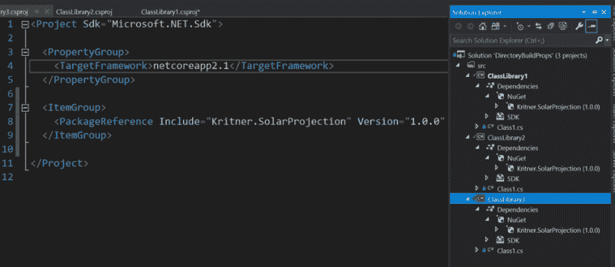

# 使用配置文件管理 NuGet 包版本(和其他东西！)

> 原文：<https://dev.to/kritner/using-configuration-files-to-manage-nuget-package-versions-and-other-stuff-ojp>

[](https://res.cloudinary.com/practicaldev/image/fetch/s--Cqj47Tnx--/c_limit%2Cf_auto%2Cfl_progressive%2Cq_auto%2Cw_880/https://cdn-images-1.medium.com/max/1024/1%2AYEroZmGevryq7HmzevaRWA.png)

<figcaption>NuGet.org，微软搜索结果</figcaption>

您是否曾经在一个解决方案中有许多项目，其中许多使用相同的 NuGet 包？管理软件包版本可能是一场噩梦！

一起工作。net core，这正是我要处理的问题。管理跨越 20 多个项目的 NuGet 包版本变得相当乏味，尤其是当。net core 是 1.0 之前的版本，那时你有时一天要用好几次新的包！如何管理所有这些包版本并使它们保持同步？

有一段时间，我真的不知道要搜索什么，我想我的问题是我在搜索词上太具体了。

答案，至少其中之一，就在解决方案的变量文件目录中。Build.props(文档[此处](https://docs.microsoft.com/en-us/visualstudio/msbuild/customize-your-build?view=vs-2017))。在这个文件中，你可以指定像变量这样的东西，以及其他应该出现在 csproj 文件中的“片段”。包含 Build.props 文件。此外，该文件在“更深”的目录中以“继承”的方式工作。Build.props 文件能够覆盖“更高”文件中设置的属性。

就 NuGet 包而言，这里有一个示例演示…

从一个包含三个“空”类库项目的项目开始:

[](https://res.cloudinary.com/practicaldev/image/fetch/s--L69ZwxSw--/c_limit%2Cf_auto%2Cfl_progressive%2Cq_auto%2Cw_880/https://cdn-images-1.medium.com/max/520/1%2AaLbbOOjL6uamWD8yotASPQ.png) 

<figcaption>解带 3 个“空”类库项目</figcaption>

出于演示目的，我们引入一个 NuGet 包，我将使用 Kritner。SolarProjection(更多信息[此处](https://medium.com/@kritner/my-first-nuget-package-kritner-solarestimate-79d7f4abfdc2))作为包带进来。可以通过 nuget 包管理器控制台、gui，或者通过向类库 1、2 和 3 的 csproj 文件添加以下内容，将包添加到所有三个项目中:

```
<ItemGroup>
  <PackageReference Include="Kritner.SolarProjection" Version="1.0.0" />
</ItemGroup> 
```

现在，解决方案应该是这样的:

[](https://res.cloudinary.com/practicaldev/image/fetch/s--AjEPe9qh--/c_limit%2Cf_auto%2Cfl_progressive%2Cq_auto%2Cw_880/https://cdn-images-1.medium.com/max/1024/1%2ALhQE-IHT2Bu6R7QLGHaRxw.png) 

<figcaption>解与 NuGet 包的依赖关系。</figcaption>

现在，假设我们有更多的项目正在进行，并且它们都依赖于 Kritner.SolarProject。另外，想象一下有新版本的软件包频繁发布——我们希望保持更新，因为为什么不；我们的项目有单元测试，集成测试，伟大的断言和令人敬畏的代码覆盖率！当我们的 NuGet 包出来时，我们会更新它们；至少是小修改。

如果我们有 3 个以上的项目，比如 20 个，那就意味着要为 Kritner 更新“1.0.0”版本。太多次了，希望我们不要错过任何一次！目录。建造。救援道具！

我想开始提到克里特纳的“版本”部分。作为变量的 solar projection—NuGet-krit ner-solar projection。

让我们创建目录。Build.props 文件并执行以下操作: