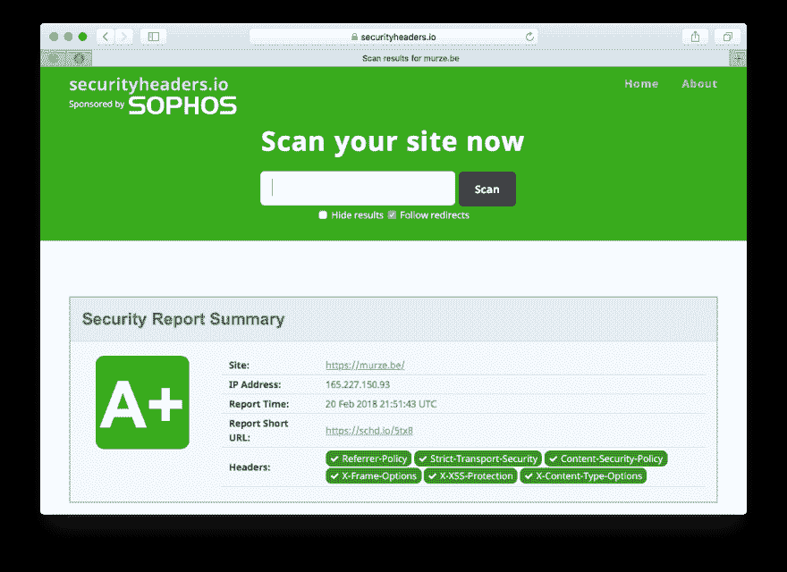

# ★在 Laravel 应用中使用内容安全策略头

> 原文：<https://dev.to/freekmurze/using-content-security-policy-headers-in-a-laravel-app-5e67>

默认情况下，网页上的所有脚本都可以向任何站点发送和获取数据。如果你仔细想想，这有点可怕。想象一下，您的一个 JavaScript 依赖项会将包括密码在内的所有击键发送到第三方网站。那就太糟糕了。

在这篇博文中，我想给出更多关于这个问题的背景，并以我们新发布的 laravel-csp 包的形式提出一个解决方案。

## CSP 简介

你可能会想，是的，我不会运行流氓 JavaScript。虽然您可能会使用众所周知的 JS 包，但是您真的确定它们的依赖关系(以及它们的依赖关系，等等)吗...)不包含不想要的代码？对于某些人来说，隐藏恶意行为实际上非常容易。要真正感受到这个问题，你应该读一下[大卫·吉尔伯森](https://twitter.com/D__Gilbertson)的这篇优秀的博客文章。剧透:你几乎不可能发现流氓 JavaScript(除非你手动阅读你网站上的所有 JavaScript 代码)。

幸运的是，这个问题有一个很好的解决方案。每个浏览器都支持安全内容策略。简而言之，它的工作方式如下:设置一个名为`Content-Security-Policy`的 http 头。它的值包含内容可能加载的所有来源的描述。所以它并不局限于 JavaScript，你也可以决定图片、风格等的来源...可以从加载。您甚至可以指定允许您站点上的表单发布到哪些主机。想了解更多关于 CSP 本身的信息，以及你可以在其中使用哪些指令，请前往 [Mozilla 关于 CSP 的优秀文档](https://developer.mozilla.org/en-US/docs/Web/HTTP/CSP)。

## 在 Laravel 应用中实施 CSP

为了轻松地将内容安全策略添加到 Laravel 应用程序中，我们在 [Spatie](https://spatie.be) 的团队为[创建了一个名为 laravel-csp](https://github.com/spatie/laravel-csp) 的新包。安装后，它允许您创建一个策略类。它可以是这样的:

```
namespace App\Services\Csp\Policies;

use Spatie\Csp\Directive;
use Spatie\Csp\Policies\Policy;

class MyCustomPolicy extends Policy
{
    public function configure()
    {
        parent::configure();

        $this->addDirective(Directive::SCRIPT, 'www.google.com');
    }
} 
```

这个策略将允许你从你自己的站点运行一切(这是在基本策略`Spatie\Csp\Profiles\Policy`中处理的),并且它允许从`www.google.com`域加载脚本。

在现实生活的网站上，策略可能会更大一点，因为在大多数网站上使用了很多第三方服务。这是你正在阅读的这一页上使用的政策:

```
namespace App\Services\Csp;

use Spatie\Csp\Directive;
use Spatie\Csp\Policies\Policy as BasePolicy;

class Policy extends BasePolicy
{
    public function configure()
    {
        $this
            ->addGeneralDirectives()
            ->addDirectivesForBootstrap()
            ->addDirectivesForCarbon()
            ->addDirectivesForGoogleFonts()
            ->addDirectivesForGoogleAnalytics()
            ->addDirectivesForGoogleTagManager()
            ->addDirectivesForTwitter()
            ->addDirectivesForYouTube();
    }

    protected function addGeneralDirectives(): self
    {
        return $this
            ->addDirective(Directive::BASE, 'self')
            ->addNonceForDirective(Directive::SCRIPT)
            ->addDirective(Directive::SCRIPT, [
                'murze.be',
                'murze.be.test',
            ])
            ->addDirective(Directive::STYLE, [
                'murze.be',
                'murze.be.test',
                'unsafe-inline',
            ])
            ->addDirective(Directive::FORM_ACTION, [
                'murze.be',
                'murze.be.test',
                'sendy.murze.be',
            ])
            ->addDirective(Directive::IMG, [
                '*',
                'unsafe-inline',
                'data:',
            ])
            ->addDirective(Directive::OBJECT, 'none');
    }

    protected function addDirectivesForBootstrap(): self
    {
        return $this
            ->addDirective(Directive::FONT, ['*.bootstrapcdn.com'])
            ->addDirective(Directive::SCRIPT, ['*.bootstrapcdn.com'])
            ->addDirective(Directive::STYLE, ['*.bootstrapcdn.com']);
    }

    protected function addDirectivesForCarbon(): self
    {
        return $this->addDirective(Directive::SCRIPT, [
            'srv.carbonads.net',
            'script.carbonads.com',
            'cdn.carbonads.com',
        ]);
    }

    protected function addDirectivesForGoogleFonts(): self
    {
        return $this
            ->addDirective(Directive::FONT, 'fonts.gstatic.com')
            ->addDirective(Directive::SCRIPT, 'fonts.googleapis.com')
            ->addDirective(Directive::STYLE, 'fonts.googleapis.com');
    }

    protected function addDirectivesForGoogleAnalytics(): self
    {
        return $this->addDirective(Directive::SCRIPT, '*.google-analytics.com');
    }

    protected function addDirectivesForGoogleTagManager(): self
    {
        return $this->addDirective(Directive::SCRIPT, '*.googletagmanager.com');
    }

    protected function addDirectivesForTwitter(): self
    {
        return $this
            ->addDirective(Directive::SCRIPT, [
                'platform.twitter.com',
                '*.twimg.com',
            ])
            ->addDirective(Directive::STYLE, [
                'platform.twitter.com',
            ])
            ->addDirective(Directive::FRAME, [
                'platform.twitter.com',
                'syndication.twitter.com',
            ])
            ->addDirective(Directive::FORM_ACTION, [
                'platform.twitter.com',
                'syndication.twitter.com',
            ]);
    }

    protected function addDirectivesForYouTube(): self
    {
        return $this->addDirective(Directive::FRAME, '*.youtube.com');
    }
} 
```

继续检查该页面的`Content-Security-Policy`标题，以查看上述策略的结果。

## 在关闭

这个包有更多的特性，包括支持[随机数](https://github.com/spatie/laravel-csp#using-inline-scripts-and-styles)，和[报告](https://github.com/spatie/laravel-csp#reporting-csp-errors)。要了解更多信息，请阅读 GitHub 上的包[的自述文件。请务必阅读前面提到的 CSP](https://github.com/spatie/laravel-csp) 上的 [Mozilla 文档。](https://developer.mozilla.org/en-US/docs/Web/HTTP/CSP)

要测试你网站的标题在安全方面有多可靠，请查看 https://securityheaders.io/，在那里你可以运行一个 a 测试。这个博客得了 A+的分数，我很自豪。

[T2】](https://res.cloudinary.com/practicaldev/image/fetch/s--KPIFNpXQ--/c_limit%2Cf_auto%2Cfl_progressive%2Cq_auto%2Cw_880/https://freek.dev/uploads/media/csp/aplus.png)

Laravel-csp 并不是我的团队做的第一个[包。在我们公司的网站上，你会发现我们以前制作的每个](https://spatie.be) [Laravel](https://spatie.be/en/opensource/laravel) 、 [PHP](https://spatie.be/en/opensource/php) 和 [JavaScript](https://spatie.be/en/opensource/javascript) 包的列表。我很确定你会找到对你下一个项目有用的东西。