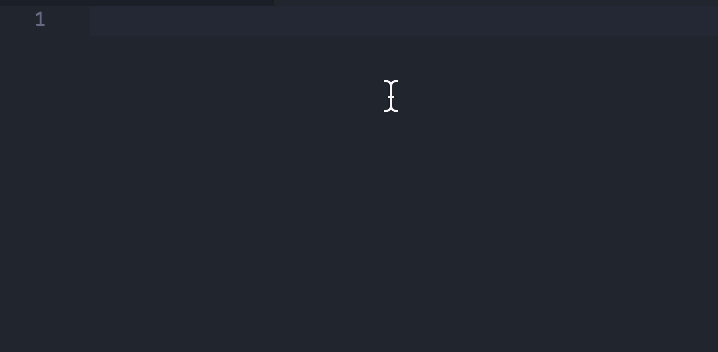

# 在 VS 代码片段中使用当前日期和时间

> 原文：<https://dev.to/chaseadamsio/using-current-date-and-time-in-vs-code-snippets-4gog>

以前，当生成新的博客文章时，向 Markdown frontmatter 添加日期是一个手动步骤，需要我:

*   确定日期
*   将我阅读的内容转换为我在 frontmatter 中使用的日期格式

从 [VS 代码版本 1.20](https://code.visualstudio.com/updates/v1_20#_more-snippet-variables) 开始，代码片段可以通过以下变量之一访问当前日期和时间:

*   `CURRENT_YEAR`
*   `CURRENT_YEAR_SHORT`
*   `CURRENT_MONTH`
*   `CURRENT_DATE`
*   `CURRENT_HOUR`
*   `CURRENT_MINUTE`
*   `CURRENT_SECOND`

现在，如果我想要当前年、月、日(`YYYY-MM-DD`)降价的 front matter“date”，我可以将下面的代码添加到我的代码片段中:

```
date: \"$CURRENT_YEAR-$CURRENT_MONTH-$CURRENT_DATE\" 
```

Enter fullscreen mode Exit fullscreen mode

使用这篇文章的发布日期，扩展的代码片段产生:

```
date: "2018-07-24" 
```

Enter fullscreen mode Exit fullscreen mode

[T2】](https://res.cloudinary.com/practicaldev/image/fetch/s--ELQH7PRb--/c_limit%2Cf_auto%2Cfl_progressive%2Cq_66%2Cw_880/https://www.chaseadams.io/img/vscode-current-date-time-in-snippets.gif)