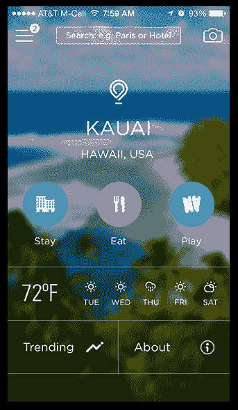
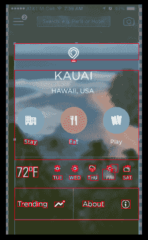
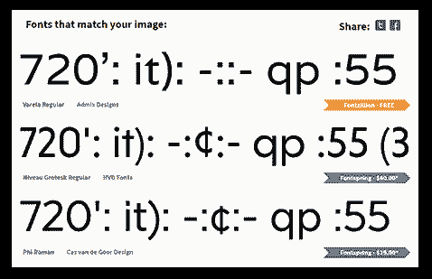
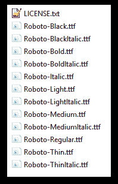
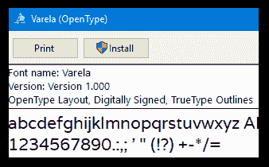
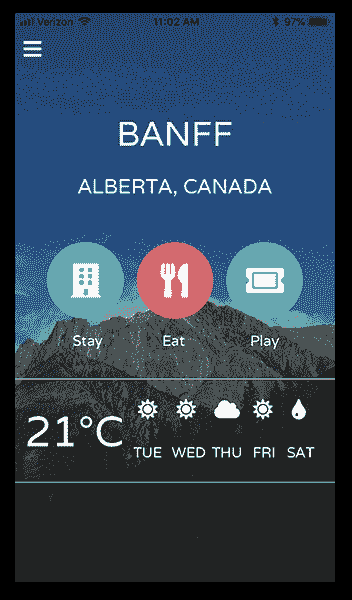
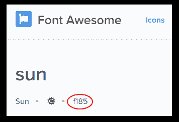
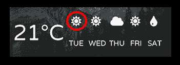

# 在 NativeScript 应用程序中使用自定义字体

> 原文：<https://dev.to/rdlauer/using-custom-fonts-in-a-nativescript-app-12ik>

经验丰富的网络和移动开发人员知道，给应用程序添加一些活力的简单方法是切换到自定义字体。见鬼，我已经活得够久了，还记得 90 年代末的 Verdana 文艺复兴！

[T2】](https://res.cloudinary.com/practicaldev/image/fetch/s--OwvN9H_X--/c_limit%2Cf_auto%2Cfl_progressive%2Cq_auto%2Cw_880/https://raw.githubusercontent.com/rdlauer/articles/master/nativescript/fonts/90s.png)

虽然 90 年代的波浪和蜡笔已经离我们远去(RIP！⚰️)，创造吸引人的用户界面的愿望没有改变。**所以让我们用 [NativeScript](https://www.nativescript.org/) 来实现这一点。**

关于*如何*使用自定义字体的问题大部分在[本地脚本文档](https://docs.nativescript.org/ui/styling#using-fonts)中处理。然而，有一些额外的提示，你可能需要帮助你顺利的漫画无荣耀之旅。

[T2】](https://res.cloudinary.com/practicaldev/image/fetch/s--uoXL4b-1--/c_limit%2Cf_auto%2Cfl_progressive%2Cq_auto%2Cw_880/https://raw.githubusercontent.com/rdlauer/articles/master/nativescript/fonts/comic-sans.png)

## 查找字体

> 你已经有了想要使用的字体了吗？如果是，跳到 [TTF，OTF，WTF？](#ttf)下面一节。其余的人，继续读下去！

如果你正在寻找一些手机友好字体的想法，你来对地方了。在决定下一款优秀的移动应用字体时，你有几个选择。

### 系统字体

iOS 和 Android 都预装了一套字体。问题是 iOS/Android 字体的维恩图重叠不多。因此，如果你选择一种系统字体，很可能你会对 iOS 和 Android 有不同的选择(更不用说 Android 的每个迭代都可能安装非常不同的字体)。

但是系统字体是一个很好的实验方式！没有可下载和复制到你的应用程序的内容。你只要选择一种字体，[就会更新你的 CSS](#css) 。

*   🍎在[iosfonts.com](http://iosfonts.com/)找到 iOS 系统字体列表；
*   🤖在[这个堆栈溢出](https://stackoverflow.com/questions/19691530/valid-values-for-androidfontfamily-and-what-they-map-to)的扩展线程中找到 Android 系统字体列表。

### 从图像中识别字体

我经常从现有的网络或移动用户界面中发现新的自定义字体。也许我不是一个有创造力的人，但当我看到我喜欢的东西时，我很擅长复制它😅。

对我来说幸运的是，我们在 Font Squirrel 的朋友提供了一个[字体匹配器](https://www.fontsquirrel.com/matcherator)服务，它通常可以完成从图像中识别字体的任务！

*让我们从下图开始:*

[T2】](https://res.cloudinary.com/practicaldev/image/fetch/s--7SWlLl51--/c_limit%2Cf_auto%2Cfl_progressive%2Cq_auto%2Cw_880/https://raw.githubusercontent.com/rdlauer/articles/master/nativescript/fonts/original.png)

我喜欢这种独特的字体。所以我转向了字体匹配器。

[T2】](https://res.cloudinary.com/practicaldev/image/fetch/s--3M8alH70--/c_limit%2Cf_auto%2Cfl_progressive%2Cq_auto%2Cw_880/https://raw.githubusercontent.com/rdlauer/articles/master/nativescript/fonts/matcherator.png)

...其中吐出了各种各样的建议(有免费的也有付费的):

[T2】](https://res.cloudinary.com/practicaldev/image/fetch/s--PtgbMuLU--/c_limit%2Cf_auto%2Cfl_progressive%2Cq_auto%2Cw_880/https://raw.githubusercontent.com/rdlauer/articles/master/nativescript/fonts/matcherator-results.png)

在这种情况下，我便宜地选择了 [Varela 字体](https://fonts.google.com/specimen/Varela)，因为它对我来说足够接近原始字体。

### 其他字体资源

借助谷歌的力量，你也许可以找到你想要的另一种免费(或付费)字体。我最喜欢的字体网站是[谷歌字体](https://fonts.google.com/)(因为那些都是免费的，我便宜！)和[字体松鼠](https://www.fontsquirrel.com/)(因为它们拥有其他一切，以备我真正愿意打开口袋书的时候💸).

## TTF, OTF, WTF?

好了，你已经找到了你想要的字体，你已经下载了，解压了。有时(例如 Roboto)你会得到这样的结果:

[T2】](https://res.cloudinary.com/practicaldev/image/fetch/s--VQJbkGO4--/c_limit%2Cf_auto%2Cfl_progressive%2Cq_auto%2Cw_880/https://raw.githubusercontent.com/rdlauer/articles/master/nativescript/fonts/roboto.png)

但是我只是想要机器人！

所以，有时需要一点挑选来确定你需要的*确切的*字体文件。如果你刚开始使用一种字体，最好是包含所有带有**的文件。ttf 或者。otf 文件扩展名**。对于 NativeScript 没有区别，所以只需选择一个文件扩展名，删除其他的。

现在我们只剩下。ttf(在这种情况下，我们可以通过*变体*进一步缩小我们需要的字体。例如，如果我*知道*我只需要一个`Regular`和`Bold`变体(而不是`Italics`，我只需要那些字体文件，在 Roboto 的情况下是:

*   `Roboto-Regular.ttf`
*   `Roboto-Bold.ttf`

**现在我已经限制了我需要的字体文件，它们可以简单地复制到我的 NativeScript 项目中的`app/fonts`目录。**

> 如果您使用的是 [NativeScript Playground](https://play.nativescript.org/) ，只需创建一个`fonts`目录，并使用`Upload resources`上下文菜单选项上传您的字体文件。

## 哪个字体系列？

所以让我们切换到我正在开发的应用程序。记得我为这个应用程序选择了`Varela`字体...但是*我到底该如何*使用字体呢？**当然是用 CSS 啦！**

```
.some-class {
    font-size: 40;
    font-family: "Varela";
    color: white;
    text-transform: uppercase;
} 
```

虽然这看起来很简单，但 iOS 和 Android 对`font-family`属性的期望有所不同:

**iOS 要求`font-family`是字体的*确切名称*。**我能做到这一点的唯一可靠方法是在 macOS 上使用**字体簿**应用程序，或者在 Windows 中双击字体:

[T2】](https://res.cloudinary.com/practicaldev/image/fetch/s--hYGIZqME--/c_limit%2Cf_auto%2Cfl_progressive%2Cq_auto%2Cw_880/https://raw.githubusercontent.com/rdlauer/articles/master/nativescript/fonts/font-windows.png)

您会注意到字体名称清楚地显示为 Varela。轻松点。

> 然而这并不总是那么简单，所以最好确保你总是做这一步。

对于 Android 来说，通常要简单一些。你可以指望 Android 来看字体的*文件名*。所以在这种情况下那就是`varela-regular`。

我们的 CSS 开始走到一起了！

```
font-family: "Varela", "varela-regular"; 
```

### 字体变体

但是我们的变种呢？啊，这就是我们发现的一个问题！对于 iOS，我们只需在 CSS 中指定变量，就像这样:

```
font-weight: bold; 
```

...但是如果你有一个单独的字体文件和一个单独的变体(就像我们上面提到的`Roboto-Bold.ttf`),对于 Android 你必须显式地引用字体文件的粗体变体，使得一个 iOS 和 Android 兼容的类像这样:

```
font-family: "Roboto", "Roboto-Bold";
font-weight: bold; 
```

现在在我的标记中，我可以简单地引用上面的类:

```
<Label text="" class="some-class" /> 
```

**搞定！**🎉

[T2】](https://res.cloudinary.com/practicaldev/image/fetch/s--fwW7acAc--/c_limit%2Cf_auto%2Cfl_progressive%2Cq_auto%2Cw_880/https://raw.githubusercontent.com/rdlauer/articles/master/nativescript/fonts/final.png)

> **提示:**你可以[在 NativeScript 游乐场试用这个应用](https://play.nativescript.org/?template=play-tsc&id=Y4fVGt&v=16)！

## 奖金指南:图标字体

自定义字体的另一个非常常见的用途是用于图标。那里最受欢迎的图像图标可能是[字体牛逼](https://fontawesome.com/)，但是还有更多你可以使用的。

**在图标字体的情况下，说明*与上面的*完全相同！**唯一的区别是文本输出。有几种方法可以解决这个问题:

*   使用一个 [NativeScript 插件](https://market.nativescript.org/plugins/nativescript-fonticon)来简化图标字体的使用。
*   或者，查找要显示的 unicode 值。

在字体 Awesome 的情况下，我们可以从[主列表](https://fontawesome.com/icons)中查找一个图标，并获取 unicode 值:

[T2】](https://res.cloudinary.com/practicaldev/image/fetch/s--JfwmWr_O--/c_limit%2Cf_auto%2Cfl_progressive%2Cq_auto%2Cw_880/https://raw.githubusercontent.com/rdlauer/articles/master/nativescript/fonts/font-awesome.png)

复制该值，并将其粘贴到 NativeScript UI 元素的`text`属性中，带有关联的 CSS 类名，如下所示:

```
.fa {
    font-family: "Font Awesome 5 Free", "fa-solid-900";
}

<Label text="&#xf185;" class="fa" /> 
```

...这将按照要求呈现一个漂亮的小图标:

[T2】](https://res.cloudinary.com/practicaldev/image/fetch/s--e6mb5TuW--/c_limit%2Cf_auto%2Cfl_progressive%2Cq_auto%2Cw_880/https://raw.githubusercontent.com/rdlauer/articles/master/nativescript/fonts/font-awesome-sun.png)

## 包扎

希望本指南对您在 NativeScript 中使用自定义字体有所帮助。如果你遇到任何麻烦，请务必[咨询我们的文档](https://docs.nativescript.org/ui/styling#using-fonts),或者在评论中说出你自己的任何建议！

祝圣诞快乐！😀