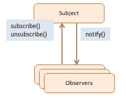

# 正确使用 Node.js 中的事件

> 原文：<https://dev.to/usamaashraf/using-events-in-nodejs-the-right-way-449b>

在事件驱动编程流行之前，应用程序不同部分之间的标准通信方式非常简单:一个组件想要向另一个组件发送消息，就显式调用该组件上的方法。但是事件驱动的代码是写给*反应*而不是被*调用*的。

## 多事之秋的好处

这种方法使得我们的组件更加解耦。基本上，当我们继续编写一个应用程序时，我们会在这个过程中识别事件，在适当的时候触发它们，并为每个事件附加一个或多个事件侦听器。扩展功能变得更加容易，因为我们可以在特定事件中添加更多的侦听器，而不需要修改现有的侦听器或应用程序中触发事件的部分。我们所说的本质上是观察者模式。

[](https://res.cloudinary.com/practicaldev/image/fetch/s--bNadgv50--/c_limit%2Cf_auto%2Cfl_progressive%2Cq_auto%2Cw_880/https://thepracticaldev.s3.amazonaws.com/i/5bzbzku826xotqoo7u6w.jpeg) 
<sub><sup>*来源:[https://www . do factory . com/JavaScript/observer-design-pattern](https://www.dofactory.com/javascript/observer-design-pattern)*</sup></sub>

## 设计事件驱动的架构

识别事件非常重要，因为我们不希望最终不得不从系统中删除/替换现有的事件，这可能会迫使我们删除/修改任何数量的附加到事件的侦听器。我使用的一般原则是*仅当一个业务逻辑单元完成执行*时才考虑触发事件。
假设你想在用户注册后发送一堆不同的电子邮件。现在，注册过程本身可能涉及许多复杂的步骤，查询等。但从商业角度来看，这是*一步*。每封要发出的电子邮件也是单独的步骤。因此，在注册完成后立即触发一个事件并为其附加多个侦听器是有意义的，每个侦听器负责发送一种类型的电子邮件。

Node 的异步、事件驱动的体系结构有某些称为“发射器”的对象，它们发射命名的事件，这些事件导致称为“监听器”的函数被调用。所有发出事件的对象都是 [EventEmitter](https://nodejs.org/api/events.html#events_class_eventemitter) 类的实例。使用它，我们可以创建自己的活动。

## 举个例子

让我们使用内置的[事件](https://nodejs.org/api/events.html)模块(我鼓励您详细查看)来访问`EventEmitter`。

```
// my_emitter.js

const EventEmitter = require('events');

const myEmitter = new EventEmitter();

module.exports = myEmitter; 
```

这是应用程序的一部分，其中我们的服务器接收一个 HTTP 请求，保存一个新用户并相应地发出一个事件:

```
// registration_handler.js

const myEmitter = require('./my_emitter');

// Perform the registration steps

// Pass the new user object as the message passed through by this event.
myEmitter.emit('user-registered', user); 
```

和一个单独的模块，我们在其中附加了一个监听器:

```
// listener.js

const myEmitter = require('./my_emitter');

myEmitter.on('user-registered', (user) => {
  // Send an email or whatever.
}); 
```

将政策与实施分开是一个很好的做法。在这种情况下，策略意味着哪些侦听器订阅了哪些事件，而实现意味着侦听器本身。

```
// subscriptions.js

const myEmitter = require('./my_emitter');
const sendEmailOnRegistration = require('./send_email_on_registration');
const someOtherListener = require('./some_other_listener');

myEmitter.on('user-registered', sendEmailOnRegistration);
myEmitter.on('user-registered', someOtherListener); 
```

```
// send_email_on_registration.js

module.exports = (user) => {
  // Send a welcome email or whatever.
} 
```

这种分离也允许侦听器变得可重用，即它可以附加到发出相同消息的其他事件(用户对象)。另外值得一提的是*当多个侦听器被附加到一个事件时，它们将被同步执行，并且按照它们被附加的顺序执行*。因此`someOtherListener`将在`sendEmailOnRegistration`完成执行后运行。
然而，如果你想让你的监听器异步运行，你可以简单地用`setImmediate`包装它们的实现，就像这样:

```
// send_email_on_registration.js

module.exports = (user) => {
  setImmediate(() => {
    // Send a welcome email or whatever.
  });
} 
```

## 保持你的听众干净

在写听众时坚持单一责任原则:一个听众应该只做一件事，并且做好。例如，避免在一个侦听器中编写太多的条件，这些条件根据事件传输的数据(消息)来决定要做什么。在这种情况下，使用不同的事件会更合适:

```
// registration_handler.js

const myEmitter = require('./my_emitter');

// Perform the registration steps

// The application should react differently if the new user has been activated instantly.
if (user.activated) {
  myEmitter.emit('user-registered:activated', user);

} else {
  myEmitter.emit('user-registered', user);
} 
```

```
// subscriptions.js

const myEmitter = require('./my_emitter');
const sendEmailOnRegistration = require('./send_email_on_registration');
const someOtherListener = require('./some_other_listener');
const doSomethingEntirelyDifferent = require('./do_something_entirely_different');

myEmitter.on('user-registered', sendEmailOnRegistration);
myEmitter.on('user-registered', someOtherListener);

myEmitter.on('user-registered:activated', doSomethingEntirelyDifferent); 
```

## 必要时明确分离侦听器

在前一个例子中，我们的侦听器是完全独立的函数。但是在侦听器与一个对象(它是一个方法)相关联的情况下，必须手动将其从它订阅的事件中分离出来。否则，对象将永远不会被垃圾收集，因为对象的一部分(侦听器)将继续被外部对象(发射器)引用。因此，内存泄漏的可能性。

例如，如果我们正在构建一个聊天应用程序，并且我们希望当一个新消息到达一个用户已经连接的聊天室时，显示通知的责任应该在那个用户对象本身，我们可以这样做:

```
// chat_user.js

class ChatUser {

  displayNewMessageNotification(newMessage) {
    // Push an alert message or something.
  }

  // `chatroom` is an instance of EventEmitter.
  connectToChatroom(chatroom) {
    chatroom.on('message-received', this.displayNewMessageNotification);
  }

  disconnectFromChatroom(chatroom) {
    chatroom.removeListener('message-received', this.displayNewMessageNotification);
  }
} 
```

当用户关闭他/她的标签页或暂时失去互联网连接时，我们自然会希望在服务器端发出一个回调，通知其他用户他们中的一个刚刚离线。当然，此时为离线用户调用`displayNewMessageNotification`没有任何意义，但是它将继续在新消息中被调用，除非我们显式删除它。如果我们不这样做，除了不必要的调用，用户对象也将无限期地留在内存中。所以一定要在服务器端回调中调用`disconnectFromChatroom`,只要用户离线，回调就会执行。

## 当心

如果我们不小心，事件驱动架构中的松散耦合也会导致复杂性增加。在我们的系统中，很难跟踪依赖关系，也就是说，哪些监听器最终执行了哪些事件。如果我们开始从侦听器中发出事件，我们的应用程序将变得特别容易出现这个问题，这可能会触发意外事件链。