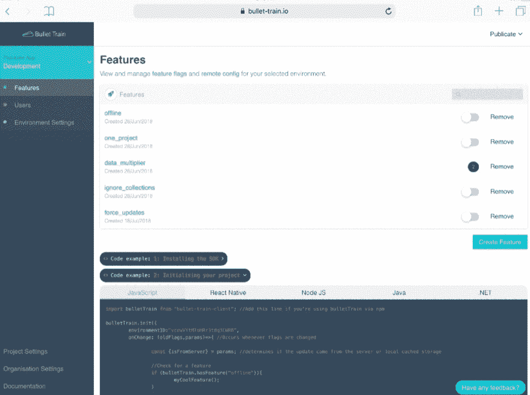

# 为客户端演示和模拟复杂场景使用功能标志

> 原文：<https://dev.to/kylessg/using-feature-flags-for-client-demos-and-simulating-complex-scenarios-1gih>

自从使用[子弹头列车](http://bullet-train.io)功能标志开发我们所有新的生产移动/网络应用程序以来，我意识到的最新好处之一是能够切换您的应用程序来模拟乏味和复杂的场景。

## 问题:浪费时间复制应用场景

我知道我自己是一个开发者，经常花费数小时来复制问题或开发一个新功能，这要求应用程序处于特定状态。例如，改进入职培训需要我用大约一百万封邮件注册我的网站。

这个痛点可能是我们在前端使用 [Nightwatch JS](http://nightwatchjs.org/) 进行端到端自动化测试的主要原因。

## 解决方案:首先开发你的应用程序“模拟”

开发新项目时考虑到特性标志改变了我对实现新特性的想法。现在，每当开发一个新功能时，我都必须使应用程序足够灵活，无论有没有它都能表现良好。有了子弹头列车，我就有了一个非常简单的方法来模拟功能的开启和关闭，或者改变设置。

[T2】](https://res.cloudinary.com/practicaldev/image/fetch/s--dEOG5sn_--/c_limit%2Cf_auto%2Cfl_progressive%2Cq_auto%2Cw_880/https://image.ibb.co/b4NXwU/download_4.png)

这个想法让我产生了疑问，如果我可以切换场景而不仅仅是功能，会怎么样？现在，除了一个特性之外，我还创建了模拟标志，当启用这些标志时，它们会编造数据和条件，迫使我的应用程序进入某种状态。

[T2】](https://res.cloudinary.com/practicaldev/image/fetch/s--Zt0VBETr--/c_limit%2Cf_auto%2Cfl_progressive%2Cq_auto%2Cw_880/https://preview.ibb.co/kkXXD9/download.png)

也许我最近看到的最大收获是在一次面向客户的会议上，我能够说出一些边缘情况，并准确地展示应用程序将如何反应。以前，这个过程会不太流畅，能够快速演示场景意味着客户能够立即看到并反馈，而不会失去思路。

## 实际例子

与其高谈阔论我有多喜欢这个想法，不如用一个端到端的例子来说明我是如何在我们最近的一个项目中增加模拟大量数据的能力的。这有助于我们测试 UI 性能以及它如何处理 UI 换行。

[T2】](https://res.cloudinary.com/practicaldev/image/fetch/s--rBNJq9nk--/c_limit%2Cf_auto%2Cfl_progressive%2Cq_66%2Cw_880/https://image.ibb.co/fmaimU/0_CBr_Mr_Gq_GC.gif)

这张 GIF 向我展示了远程更改“data_multiplier”特性的值，然后当我打开我的应用程序时，它会表现得好像 API 给了我 x 倍的项目数。

我是这样实现的:

## 步骤 1 -初始化子弹头列车

我在 [https://bullet-train.io](https://bullet-train.io) 创建了一个项目，复制粘贴了 JavaScript 片段。

```
npm i bullet-train-client  --save;  //or react-native-bullet-train in my case 
```

```
import bulletTrain from 'bullet-train-client'; //or react-native-bullet-train in my case

bulletTrain.init({
    environmentID: Project.bulletTrain,
    onChange: controller.loaded
}); 
```

## 步骤 2 -创建模拟特征

在我的项目中，我创建了一个名为“data_multiplier”的特性，并将其初始值设置为 0。每当我从移动应用程序的 API 中获得项目列表时，我都会检查这个标志，如果它有值，我就复制数据。

```
if (bulletTrain.getValue("data_multiplier")) {
    _.map(_.times(bulletTrain.getValue("data_multiplier") - 1), (i) => {
        projects = projects.concat(res.map((item) => {
            return Object.assign({}, item, {
                id: item.id + "" + i,
                key: item.key + i,
                name: item.name + " Copy " + i
            })
        }));
    });
} 
```

这个想法显然取决于你使用的框架，但是我发现最好在应用程序接收数据的时候实现这个想法。

## 用例

通过使您的应用程序真正灵活，这种开发方式主要节省了测试和未来开发的时间。在我看来，这应该在任何你觉得复制起来很麻烦的场景中实现，所以这显然取决于你的应用程序的业务逻辑。

说到这里，我已经开始在新项目中模拟一些常见的用例:

*   “新用户”登录时总是显示 onboarding
*   浏览器或设备离线
*   设备支持(例如，无 GPS)
*   启用/禁用广告

让我知道你是否在你的项目中采用了类似的方法，以及你发现它有多有用。

快乐发展！

 [
T4】](https://bullet-train.io)