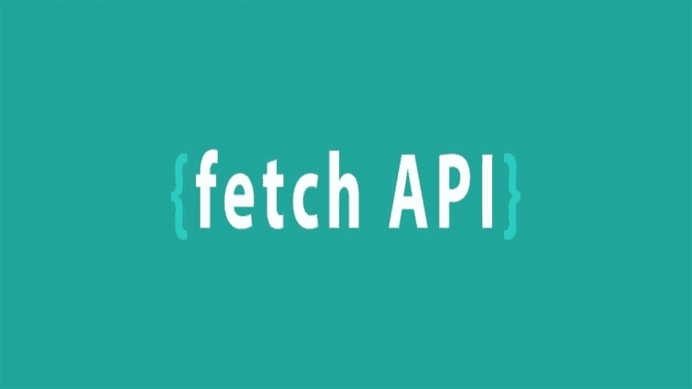

# 使用 Fetch API 获取和发布

> 原文：<https://dev.to/devamaz/using-fetch-api-to-get-and-post--1g7d>

[T2】](https://res.cloudinary.com/practicaldev/image/fetch/s--X8TZXn2g--/c_limit%2Cf_auto%2Cfl_progressive%2Cq_auto%2Cw_880/https://i.ytimg.com/vi/0bec1BmeY4c/maxresdefault.jpg)

在本文中，我将讨论如何使用 javascript fetch API 获取数据并将其发布到公共 API。

先决条件

*   文本编辑器(Notepad++，VSCode，Atom，Bracket，Sublime，您选择的任何文本编辑器)
*   浏览器(Chrome、Moxilla)
*   您可以选择任何服务器(WAMP、XAMP)，如果您使用 VScode，您也可以安装 live-server extension；如果您使用 atom，您也可以安装 Atom-live-server；如果您的计算机上安装了 node install，您也可以使用`npm install –g live-server`安装 npm live server。

## [T1】简介](#intro)

Fetch API 是一个内置的 Javascript ES6 [Promise](https://developer.mozilla.org/en-US/docs/Web/JavaScript/Reference/Global_Objects/Promise) ，用于使 XMLHttpRequest 更简单、更容易地异步获取或发布数据。有很多库可以用来使 XMLHttpRequest 更简单、更易读。最流行的是“jquery 的 ajax”，但是 fetch API 允许我们在不导入任何库的情况下，用原生 Javascript 制作 XMLHttpRequest。

下面是简单 fetch()回调
的语法

```
#fetch Syntax

         fetch(url)
            .then(function (res) {
                return res, json()
            })
            .then(function (data) {
                Console.log(data);
            }).catch(function (err) {
                console.log(err)
            }) 
```

### 如何使用 fetch API 从 API 中获取数据

1.  创建一个目录，你可以随意命名，我的名字是 fetchAPI。你可以用传统的方法创建一个目录，在文件夹里创建一个 index.html 文件，或者在你的终端里使用下面的代码。

```
//create directory
       mkdir fecthAPI
//enter the fecthAPI folder
       cd fetchAPI
//create  an index.html file
       touch index.html 
```

1.  让我们添加基本的 html 标记，两个 id 分别为 id="getData "和 id="getAPI "的按钮标记，以及一个 id='result '的段落标记。

```
<!DOCTYPE html>
<html lang="en">
<head>
    <meta charset="UTF-8">
    <meta name="viewport" content="width=device-width, initial-scale=1.0">
    <meta http-equiv="X-UA-Compatible" content="ie=edge">
    Fetch API
</head>
<body>
      <button id="getData">GET DATA FROM LOCAL</button>
          <button id="getData">GET DATA FROM API </button>
          <p id="result"></p>

</body>
</html> 
```

这些按钮将用于向本地 sampleUser.json 和公共 API 发送 GET 请求。你可以从很多公共 API 中获取数据，例如 [Github API](http://api.github.com/users) ，[随机用户 API](http://randomuser.me) 。但是在这个例子中，我们将使用 [JSONPlaceholder](https://jsonplaceholder.typicode.com) API。一个生成随机用户的 API。

1.  创建 javascript eventListener 来处理 index.html 文件中的 click 事件。

```
<script>
        document.getElementById('getData').addEventListener('click', getData);
        document.getElementById('getAPI').addEventListener('click', getAPI);

        function getData(){
            // code to execte
        }

        function getAPI(){
            // code to execte
        }

</script> 
```

1.  让我们使用 fetch API 从本地文件中获取数据，以便更好地理解如何使用本地文件。创建一个 JSON 演示“sampleUsers.json ”,尝试在其中获取数据。>注意:将 sampleUser.json 与 index.html 文件创建在同一个文件夹中，以便于访问。

```
[
    {
        "id": 1,
        "name": "Ahmad Abdul-Aziz",
        "email": "Ahmad.abdulaziz37@gmail.com"     
    },
    {
        "id": 2,
        "name": "Ahmad Habib Hussein",
        "email": "Ahmadhabibhussein@mail.com"     
    },
    {
        "id": 3,
        "name": "Abdullahi Aminu",
        "email": "Aminuawesome@mail.com"     
    },
    {
        "id": 4,
        "name": "Idris Muhammad",
        "email": "rismad@mail.com"     
    }
] 
```

很好，现在让我们编写 fetch()脚本，从您刚刚创建的 sampleUser.json 文件中获取数据，并将结果输出到 index.html

> 注意:在 getData()函数
> 中编写脚本

```
//getData function

//Using javascript ES5 function 

fetch('sampleUser.json')
    .then(function (res) {
        return res.json();
    })
    .then(function (data) {
        let result = `<h2> User Info From sampleUser.json </h2>`;
        data.forEach((user) => {
            const { id, name, email } = user
            result +=
            `<div>
                <h5> User ID: ${id} </h5>
                <ul class="w3-ul">
                    <li> User Name : ${name}</li>
                    <li> User Email: ${email} </li>
                </ul>
            </div>`;

            document.getElementById('result').innerHTML = result;
        });
       }) 
```

好了，我们可以走了。运行代码。简单快捷，对吗？我们将应用相同的方法从真实的 API 获取数据，但是这次提供 API 端点。

> 注意:在 getAPI()函数
> 中编写脚本

```
//sampleUser.json is replaced by an API endpoint.

//Using ES6 arrow function 

    fetch('https://jsonplaceholder.typicode.com/users')
        .then((res) => { return res.json() })
        .then((data) => {
            let result = `<h2> Random User Info From Jsonplaceholder API</h2>`;
            data.forEach((user) => {
                const { id, name, email, address: { city, street } } = user
                result +=
                    `<div>
                     <h5> User ID: ${id} </h5>
                         <ul class="w3-ul">
                             <li> User Full Name : ${name}</li>
                             <li> User Email : ${email} </li>
                             <li> User Address : ${city}, ${street} </li>
                         </ul>
                      </div>`;
                        document.getElementById('result').innerHTML = result;
                    });
                }) 
```

此时，我们可以从本地 sampleUser.json 和 Jsonplaceholder API 获取数据。放手去贴数据

### 如何使用 fetch API 向 API 发布数据

1.  在我们 index.html 文件中，让我们添加一个 id='postData '的表单，两个输入框和一个提交按钮。

```
<form  id="postData">
        <div>
            <input type="text" name="" id="tittle">
        </div>
        <div>
            <textarea name="" id="body" cols="20" rows="5"></textarea>
        </div>
        <input type="submit" value="SEND POST">
    </form> 
```

1.  添加一个 eventListener 来处理表单中的 submit 按钮。

```
document.getElementById('postData').addEventListener('submit', postData);

 function postData(event){
            event.preventDefault();

            let tittle = document.getElementById('tittle').value;
            let body = document.getElementById('body').value;

            fetch('https://jsonplaceholder.typicode.com/posts', {
                method: 'POST',
                headers : new Headers(),
                body:JSON.stringify({tittle:tittle, body:body})
            }).then((res) => res.json())
            .then((data) =>  console.log(data))
            .catch((err)=>console.log(err))
        } 
```

使用 preventDefault()方法停止或阻止浏览器执行默认操作。您可以随意处理您的响应，但在本例中，我们将把它输出到控制台。

## 结论

我们已经到了本教程的结尾。感谢您阅读到目前为止。

这个帖子只是简单介绍了如何用 fetch API 获取和发布数据。请随意探索更多信息:

你可以在我的 GitHub repo、 [Repo 链接](https://github.com/devamaz/fetchAPI)上使用 [w3schools CSS](https://www.w3schools.com/w3css/4/w3.css)
获取最终的源代码。以及上的[演示。别忘了开始回购](https://devamaz.github.io/fetchAPI/)

如果您想了解更多信息，请访问。Mozilla fetchAPI 。

在 twitter 上关注我 [@dev_amaz](http://twitter.com/dev_amaz) 如果你需要任何帮助，请随时联系我。你也可以在 Ahmad.abdulaziz37@gmail.com 的[给我发邮件。](mailto:Ahmad.abdulaziz37@gmail.com)