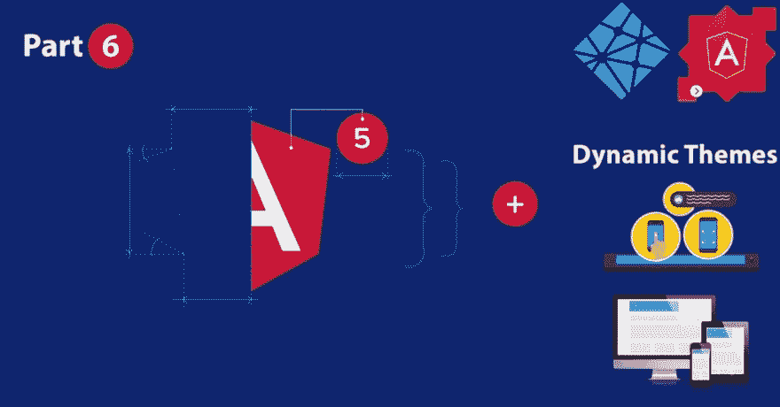

# 将 FlexLayout 与角度 5 配合使用

> 原文：<https://dev.to/geeksamu/using-flexlayout-with-angular-5-3i5l>

[](https://res.cloudinary.com/practicaldev/image/fetch/s--RbO0rbxC--/c_limit%2Cf_auto%2Cfl_progressive%2Cq_auto%2Cw_880/https://cdn-images-1.medium.com/max/1024/1%2ADNGtiMt4J3LVnejn5gJ2Fw.jpeg) 

<figcaption>Angular5，flexlayout(图片来源 topal)</figcaption>

这是关于 JavaScript 框架 Angular 5 的系列文章的第六部分。

在这一部分中，我们将向我们的应用程序添加 Flex-Layout，使其具有响应性。

这并不是一个完整的指南，而是一个基本的概述，帮助您了解 Flext-Layout 以及如何使用 Angular 5 材料。

> 在我们开始之前，英语不是我的第一语言，所以如果你看到一些奇怪的东西，请冷静地在评论区指出来或给我发电子邮件，没有必要使用暴力:)
> 
> *文章系列:*

1.  [使用 Angular-cli 创建 Angular 5 应用程序](https://medium.com/@geeksamu/creating-angular-5-application-with-angular-cli-e390ed710716)
2.  [用](https://medium.com/@geeksamu/using-angular-material-with-angular-5-6f12f75efa12) [有角材用](https://medium.com/@geeksamu/using-angular-material-with-angular-5-6f12f75efa12) [有角材用](https://medium.com/@geeksamu/using-angular-material-with-angular-5-6f12f75efa12)
3.  [将 Angular 5 应用程序部署到 Netlify](https://medium.com/@geeksamu/deploy-angular-5-application-to-netlify-35b8964bce99)
4.  [用 Angular 5 App 构建](https://medium.com/@geeksamu/build-pwa-with-angular-5-app-894499e2c55f)[PWA](https://medium.com/@geeksamu/build-pwa-with-angular-5-app-894499e2c55f)
5.  [为](https://medium.com/@geeksamu/build-dynamic-themes-for-angular-material-3b4ef118ba31) [棱角分明的素材](https://medium.com/@geeksamu/build-dynamic-themes-for-angular-material-3b4ef118ba31)构建动态主题
6.  使用具有角度 5 的 flex layout(**你在这里)**
7.  [大厦](https://medium.com/@geeksamu/building-news-app-using-angular-5-99a9e5fb4669) [新闻 App 使用](https://medium.com/@geeksamu/building-news-app-using-angular-5-99a9e5fb4669) [棱角 5](https://medium.com/@geeksamu/building-news-app-using-angular-5-99a9e5fb4669)

> *决赛* [*试玩这里*](https://angular-5-article-series.netlify.com/)

如果你想给你的 Angular 应用程序添加一个触摸样式，你必须使用一个 CSS 库，但是 Angular Material 是专门为 Angular 设计的。但是它没有网格系统，所以我们需要添加一个或者自己构建一个。

在 Angular Material 文章中，我使用 flex 创建了一个简单的网格，但是您可以使用 Flex-Layout 来实现更复杂的用途。有些人不喜欢 Flex 布局，他们更喜欢使用 css flex。这取决于你。

但在这篇文章中，我将谈论如何使用灵活布局的角度材料，我们将把我们以前的帖子变成网格使用灵活布局。

在我们的应用程序根运行中:

```
npm install @angular/flex-layout@latest --save 
```

现在我们必须将 FlexLayoutModule 导入到我们的 app.module.ts

这是我的 app.module.ts

```
import { BrowserModule } from '@angular/platform-browser';
import { NgModule } from '@angular/core';
import { BrowserAnimationsModule } from '@angular/platform-browser/animations';
import { MaterialModule } from './material.module';
import { FlexLayoutModule } from '@angular/flex-layout';

import { AppRoutingModule } from './app-routing.module';

import { ServiceWorkerModule } from '@angular/service-worker';
import { AppComponent } from './app.component';

import { environment } from '../environments/environment';
import { PostsComponent } from './posts/posts.component';
import { HomeComponent } from './home/home.component';
import { NavbarComponent } from './navbar/navbar.component';
import { ThemeService } from './services/theme.service';

@NgModule({
 declarations: [
 AppComponent,
 PostsComponent,
 HomeComponent,
 NavbarComponent
 ],
 imports: [
 BrowserModule,
 BrowserAnimationsModule,
 MaterialModule,
 FlexLayoutModule,
 AppRoutingModule,
 ServiceWorkerModule.register('/ngsw-worker.js', { enabled: environment.production })
 ],
 providers: [ThemeService],
 bootstrap: [AppComponent]
})
export class AppModule { } 
```

让我们对我们的主页帖子使用灵活布局。

我将使用下一个代码来创建我们的网格

```
\<div class="container" fxLayout="wrap row" fxLayout.xs="column" fxLayoutGap="0.5%" fxLayoutAlign="center"\>
 \<div fxFlex="20%"\>
 \<!-- our post code here --\>
 \</div\>
\</div\> 
```

为了在一行中创建 4 个帖子，我将设置 fxFlex= 20%。并且把你的帖子代码代替评论，这部分你想重复就重复。

打开 src/app/home/home . component . html

```
\<div class="container" fxLayout="wrap row" fxLayout.xs="column" fxLayoutGap="1%" fxLayoutAlign="center"\>
 \<div fxFlex="20%"\>
 \<mat-card class="example-card"\>
 \<mat-card-header\>
 \<div mat-card-avatar class="example-header-image"\>\</div\>
 \<mat-card-title\>Shiba Inu\</mat-card-title\>
 \<mat-card-subtitle\>Dog Breed\</mat-card-subtitle\>
 \</mat-card-header\>
 \
 \<mat-card-content\>
 \<p\>
 The Shiba Inu is the smallest of the six original and distinct spitz breeds of dog from Japan. A small, agile dog that copes
 very well with mountainous terrain, the Shiba Inu was originally bred for hunting.
 \</p\>
 \</mat-card-content\>
 \<mat-card-actions\>
 \<button mat-button\>LIKE\</button\>
 \<button mat-button\>SHARE\</button\>
 \</mat-card-actions\>
 \</mat-card\>
 \</div\>
\</div\> 
```

查看柔性布局[文档](https://github.com/angular/flex-layout/wiki/API-Documentation#containers)了解更复杂的用法。

现在，您可以删除 home.component.scss 中的 css 代码。

接下来:[大厦](https://medium.com/@geeksamu/building-news-app-using-angular-5-99a9e5fb4669) [新闻 App 使用](https://medium.com/@geeksamu/building-news-app-using-angular-5-99a9e5fb4669) [棱角 5](https://medium.com/@geeksamu/building-news-app-using-angular-5-99a9e5fb4669)

### 如果你喜欢这篇文章，点击下面的按钮👏。查看我写的其他文章[在这里](https://blog.wb.gy)。如果你觉得这个故事有用。因为我不使用中型合作伙伴计划。考虑通过 [PayPal](http://paypal.me/geeksamu) 或[“给我买杯咖啡”](https://ko-fi.com/geeksamu):)进行捐赠

给艾哈迈德·阿卜杜勒萨拉姆买杯咖啡。ko-fi.com/geeksamu

如果你有任何问题，请在下面评论，或者你可以在 Twitter 上找到我

[艾哈迈德·⚯͛(@ geeks amu)|推特](https://twitter.com/geeksamu)