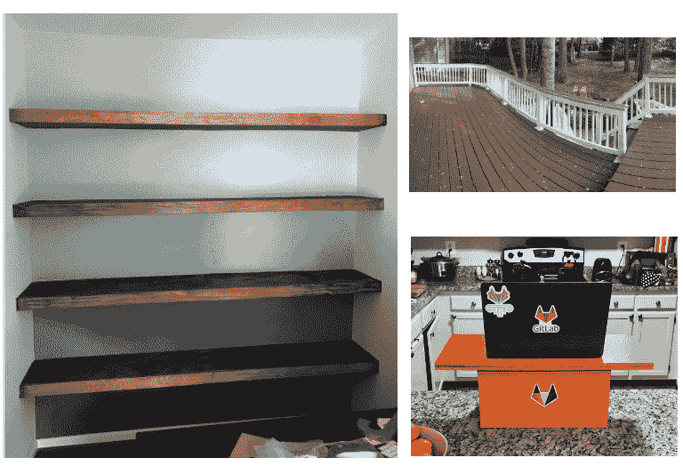
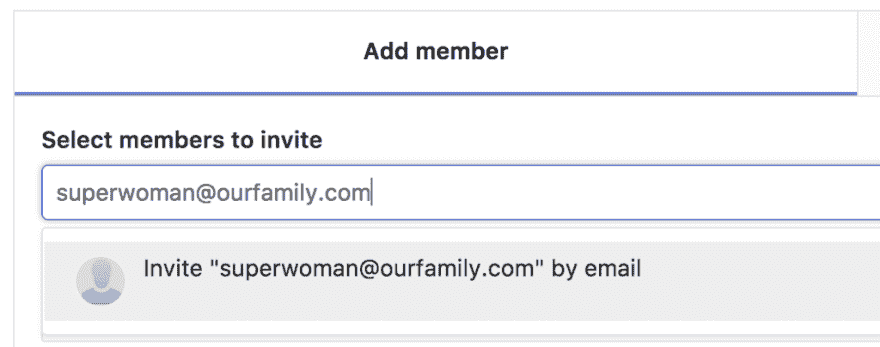
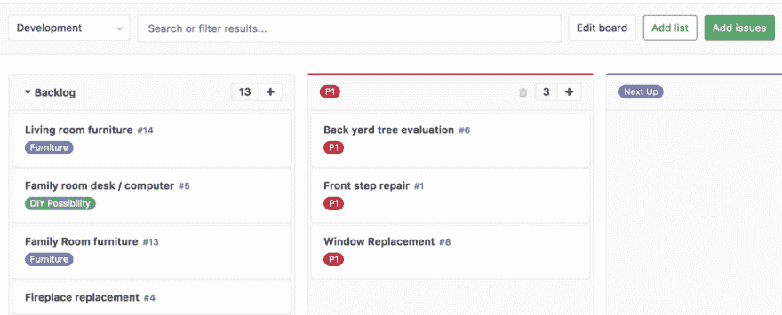

# 使用 GitLab 项目管理家庭装修优先级

> 原文：<https://dev.to/olearycrew/using-gitlab-to-project-manage-home-renovation-priorities-29n0>

去年夏天，我和妻子为我们不断壮大的家庭买了一栋新房子。在我们搬进去之前，我们做了一些改进——用木地板替换了主卧室里老化的地毯，一些需要进行结构上的调整。然而，当我们买下房子时，我们知道这些年来我们还想做更多的事情。然而，当涉及到将这些想法组织成需要尽快发生的事情和那些可以等待的事情时，我们发现自己在努力保持所有计划的有序。

### 努力变得有条理

自从我们搬进来后，我已经完成了几个其他的项目——但大多数都是小规模的。我妻子办公室的嵌入式搁板墙，油漆和染色新的甲板，当然还有一个 DIY 立式办公桌，可以在我的新办公室厨房(也是房子的厨房……[为了胜利，在家工作！](https://about.gitlab.com/culture/remote-only/))。这些项目很棒，但我们需要一种方法来组织和优先考虑更大的改造项目。

<figure> 

<figcaption>顺时针，左起:内置书架墙、彩绘卡座、DIY 站立书桌</figcaption>

</figure>

在成为 GitLab 会员之前，我已经是 git lab 的用户很多年了。自从 GitLab 免费提供[无限的私有库](https://about.gitlab.com/gitlab-com/)以来，我一直在 GitLab.com 托管我的副业代码。在我的“日常工作”中，对于项目管理，我已经使用了 GitLab 之外的许多其他工具，所以当我加入时，我第一次看到了 GitLab 在问题管理方面提供的全部内容。

在思考我过去使用的其他工具时，它们似乎不符合我所寻求的解决问题的全部标准。作为四个孩子的母亲，我的妻子总是忙忙碌碌……但我整天都在电脑前。所以我们需要能在平台间无缝工作的东西。我们还需要能够轻松地重新安排和重新确定项目的优先级。此外，我认为自己有点 DIY，所以我希望能够将一些项目标记为至少*可能*的项目，以便我可能完成自己的项目。所有这些要求让我想知道什么工具最适合我和妻子合作。

### 进入 GitLab 发行板

有了这些要求，以及我新发现的 GitLab 知识，我能够想出一个新颖的解决方案来解决我们的问题:为什么不使用一个 [GitLab 问题板](https://about.gitlab.com/features/issueboard/)来管理我们不断变化的家庭装修优先级呢？

有了发行板，我们将拥有一个适用于移动和桌面的出色解决方案(向 [GitLab UX 团队](https://docs.gitlab.com/ee/development/ux_guide/)大声喊出来！).有了[标签](https://docs.gitlab.com/ee/user/project/labels.html)，我可以按照我们想要的方式组织和分组问题。可定制的栏目将允许我们对各种问题和想法进行优先排序、跟踪和管理。

### 棋盘如何运作

首先，我在 GitLab.com 建立了一个新的小组，为我们家打理一切。我在那个小组里做了一个项目，叫做**优先事项**，作为收集我们所有革新想法的中心。在未来，我可能有一个具体的装修项目，管理采购和承包商等。

和每一个 GitLab 项目一样，问题和问题板都是与生俱来的。我马上开始添加问题——从那些最重要的问题开始，比如使用寿命即将结束的热水器、前门的维修以及窗户的更换。我的妻子还没有 GitLab.com 帐户，但很容易将她作为成员添加到项目中，只需在成员页面上输入她的电子邮件地址，允许她注册并一步到位地访问项目。

[T2】](https://res.cloudinary.com/practicaldev/image/fetch/s--7F3tlmga--/c_limit%2Cf_auto%2Cfl_progressive%2Cq_auto%2Cw_880/https://cdn-images-1.medium.com/max/1024/1%2Am8KRD9BwB85dms2j5e8U-g.png)

为了有条不紊，我创造了几个标签: **P1** 代表最优先的项目，**代表自己动手的可能性**代表那些我可能自己处理的项目，**代表那些需要装饰不同房间的家具**。标签将有助于过滤问题，这样如果我找到一个空闲的周末，我就可以搜索 **DIY 可能性**问题，也许可以开始着手。或者，如果我们去家具店，我们可以过滤到这些问题，以了解我们在那里的成本。

对于董事会专栏，我决定使用 **P1** 作为 Backlog 之后的第一个专栏来突出那些问题。从那以后，就要就优先组织达成一致了😃

[T2】](https://res.cloudinary.com/practicaldev/image/fetch/s--nb_DTjVV--/c_limit%2Cf_auto%2Cfl_progressive%2Cq_auto%2Cw_880/https://cdn-images-1.medium.com/max/1024/1%2AlTH7eLelG9cWUa5kM2izUA.png)

**下一步去哪里**

现在是执行的时候了！我们在第一次迭代中没有考虑的一件事是问题的范围。就时间和投资而言，有些事情是相对次要的。其他(比如把 27 个窗户全部换掉！)是我们需要预算的更大的项目。为此，我们将使用[问题权重](https://docs.gitlab.com/ee/workflow/issue_weight.html)来了解不同的项目如何与预算和时间投资保持一致以取得成功。

在开发空间之外使用 GitLab 发布板是一种令人兴奋的体验。我们也希望听到您对 GitLab 特性的“非标准”使用的看法。欢迎对这篇文章发表评论或发推特给我们。

本帖最初由 GitLab 发布[。](https://about.gitlab.com/2018/02/08/using-gitlab-to-manage-house-renovation-priorities/)