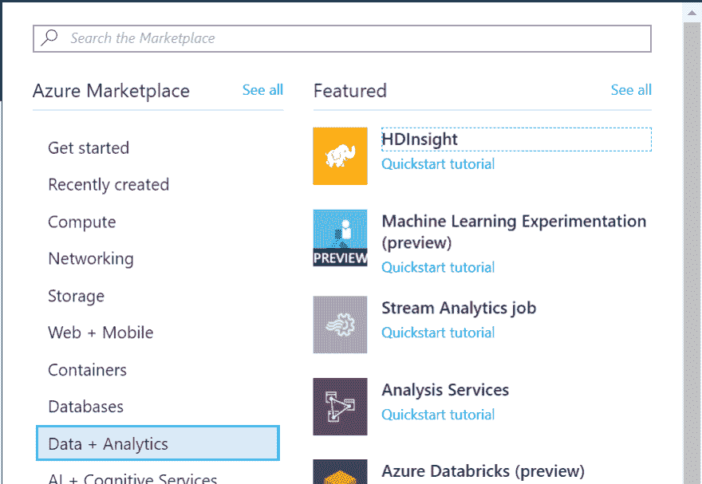
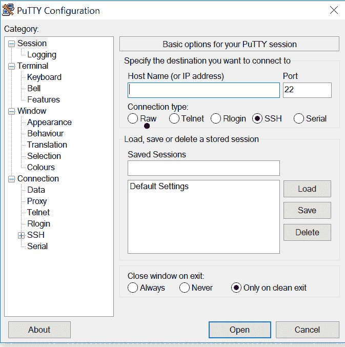
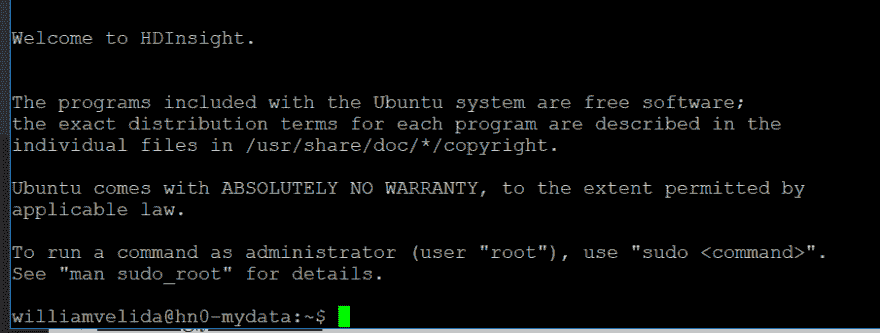
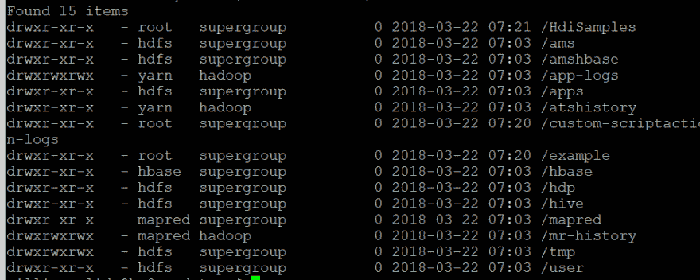
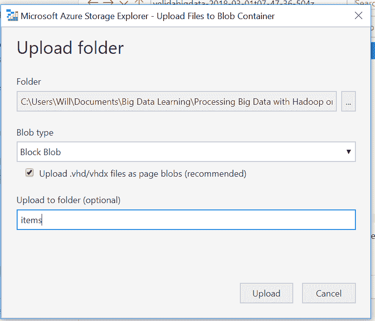

# 在 Azure HDInsight 中使用 Hadoop 处理大数据

> 原文：<https://dev.to/willvelida/using-hadoop-in-azure-hdinsight-to-process-big-data-131p>

Apache Hadoop 是一个用于存储和分析大量非结构化数据的开源解决方案。它可以处理杂乱的数据集，为最终用户提供一些关于其非结构化数据的有趣见解。

在本教程中，我将向您展示如何在 Azure 中创建 HDInsight 集群，如何连接并查看集群中的内容，以及如何对集群中的数据运行 MapReduce 作业。

完成本教程需要的内容:

1.  [微软 Azure 订阅](https://azure.microsoft.com/en-us/free/)。你可以注册试用，或者如果你有的话，使用 MSDN 订阅。
2.  [油灰](https://www.chiark.greenend.org.uk/~sgtatham/putty/latest.html)。HDInsight Hadoop 集群可以在 Azure 中配置为 Linux 虚拟机。我们可以使用远程 SSH 会话连接到 Hadoop 服务。
3.  [Azure 存储浏览器](https://azure.microsoft.com/en-us/features/storage-explorer/)。在本教程中，我们将使用 Azure Blob 存储。我们可以使用命令行，但是为了简单起见，这个图形工具就可以了。
4.  Windows OS(我用的是 Windows 10)。你可以在 Linux 或 Mac 上的教程中这样做，但我不使用这些操作系统，所以你必须在其他地方寻找指导。

调配和配置 HDInsight 集群

好了，理论到此为止！让我们试着在 Azure 中配置我们的 HDInsight 集群。让我们前往 Azure 并开始这一进程。

在您的门户中，单击新建>数据+分析> HDInsight。然后创建一个新的 HDInsight 集群，以创建一个新的集群:

[T2】](https://res.cloudinary.com/practicaldev/image/fetch/s--YR441RAD--/c_limit%2Cf_auto%2Cfl_progressive%2Cq_auto%2Cw_880/https://cdn-images-1.medium.com/max/881/0%2Aav2lbKyQRNP_4Gp1.png)

使用以下属性创建您的新集群:

*   集群名称:创建您自己的集群
*   订阅:选择您的 Azure 订阅
*   集群类型
*   集群类型:Hadoop
*   操作系统:Linux
*   版本:选择最新版本
*   集群层:标准
*   集群用户名:创建你的名字(确保你记住它！)
*   集群密码:创建您的密码(确保您记住它！)
*   SSH 用户名:(必须不同于您的集群用户名)
*   SSH 密码(与集群密码相同
*   资源组(如果没有，请创建一个新的)
*   地点:选择一个离你最近的
*   存储:
*   主存储类型:Azure 存储
*   选择方法:我的订阅
*   创建新的存储帐户
*   默认容器:输入先前指定的集群名
*   应用:无
*   集群大小
*   工作节点的数量:1
*   工作节点大小:可用的最小大小
*   头节点大小:可用的最小大小
*   高级设置:无

单击“创建”并等待它进行调配。这可能需要一段时间(20 分钟)，所以请喝点绿茶吧:)

[caption id = " attachment _ 511 " align = " align center " width = " 560 "]

[T2】](https://res.cloudinary.com/practicaldev/image/fetch/s--gh07B7DL--/c_limit%2Cf_auto%2Cfl_progressive%2Cq_auto%2Cw_880/https://cdn-images-1.medium.com/max/560/0%2AW_8z57TRXDo0jyTl.png)

很快…[/caption]

创建完成后，我们可以在门户中查看集群的配置。我们可以通过 HDInsight 集群刀片查看集群摘要。我们还可以扩展工作节点的数量，以满足不断增长的处理需求。

连接到 HDInsight 集群

厉害！我们有一个集群，并准备好连接到它！

在 Azure 门户中，导航到 HDInsight 集群的 HDInsight 集群刀片。单击安全外壳，然后在刀片中，记下您的集群的主机名(应该采用 yourclustername-ssh.azurehdinsight.net 的格式)

打开 PuTTY，在会话刀片中，在主机名文本框中输入主机名。然后在连接类型下，选择 SSH 并单击打开。(如果弹出安全警告，指出无法验证主机证书，请单击“是”继续)。

[T2】](https://res.cloudinary.com/practicaldev/image/fetch/s--B1ZUbVhG--/c_limit%2Cf_auto%2Cfl_progressive%2Cq_auto%2Cw_880/https://cdn-images-1.medium.com/max/673/0%2AM3yft65wM4GJsx93.png)

出现提示时，输入您之前指定的 SSH 用户名和密码(不是集群用户名！！).

浏览您的集群

Hadoop 使用一个名为 HDFS 的文件系统，它在 Azure HDInsight 集群中实现为 Azure Blob 存储。

在 SSH 控制台中，输入您的用户名和密码。如果成功，您应该会看到以下输出。

[T2】](https://res.cloudinary.com/practicaldev/image/fetch/s--ysWAlAa3--/c_limit%2Cf_auto%2Cfl_progressive%2Cq_auto%2Cw_880/https://cdn-images-1.medium.com/max/905/0%2ArtYAeMka5idHXVCg.png)

让我们从输入以下命令开始，查看我们的 HDFS 文件系统中根文件夹的内容:

hdfs dfs -ls /

我们应该看到以下项目:

[T2】](https://res.cloudinary.com/practicaldev/image/fetch/s--WGHGbYn---/c_limit%2Cf_auto%2Cfl_progressive%2Cq_auto%2Cw_880/https://cdn-images-1.medium.com/max/960/0%2AEtf44IsDEgzNo1U_.png)

让我们仔细看看我们的示例文件夹。其中包含示例应用程序、数据和 JAR 组件的子文件夹:

HDFS DFS-ls/示例

哦，看起来里面有几样东西！

[T2】](https://res.cloudinary.com/practicaldev/image/fetch/s--kyLJH_vT--/c_limit%2Cf_auto%2Cfl_progressive%2Cq_auto%2Cw_880/https://cdn-images-1.medium.com/max/887/0%2Ajfa7LgWYPGqyBoVs.png)

好了，让我们通过输入以下命令来查看数据文件夹:

HDFS DFS-ls/example/data/Gutenberg

[T2】](https://res.cloudinary.com/practicaldev/image/fetch/s--UbgXzFqt--/c_limit%2Cf_auto%2Cfl_progressive%2Cq_auto%2Cw_880/https://cdn-images-1.medium.com/max/986/0%2AOaGjmrwXXOSM_AZ3.png)

我们这里好像已经有几个 txt 文件了。让我们看看这些文件能做些什么。

运行 MapReduce 作业

Hadoop 中使用 MapReduce 来跨集群中的节点分布数据处理。每个作业都分为映射阶段和归约阶段，在映射阶段，一个或多个映射器将数据分成键/值对，在归约阶段，一个或多个归约器处理每个键的值。

输入以下命令查看存储在集群头节点中的示例 jar:

ls/usr/HDP/current/Hadoop-MapReduce-客户端

哇！好多罐子啊！让我们优化我们的命令，只列出 MapReduce 函数:

Hadoop jar/usr/HDP/current/Hadoop-MapReduce-client/Hadoop-MapReduce-examples . jar

好的，看起来我们缺少一个例子程序的参数。让我们看看是否可以获得 wordcount 函数的帮助。输入以下命令:

Hadoop jar/usr/HDP/current/Hadoop-MapReduce-client/Hadoop-MapReduce-examples . jar 字数

酷，看起来很简单。让我们在集群中已经存在的 davinci.txt 文件上运行它！

Hadoop jar/usr/HDP/current/Hadoop-MapReduce-client/Hadoop-MapReduce-examples . jar word count/example/data/Gutenberg/da Vinci . txt/example/results

等待 MapReduce 作业完成，然后通过输入以下命令查看输出:

HDFS DFS-ls/示例/结果

[T2】](https://res.cloudinary.com/practicaldev/image/fetch/s--ShyPomCV--/c_limit%2Cf_auto%2Cfl_progressive%2Cq_auto%2Cw_880/https://cdn-images-1.medium.com/max/971/0%2A3I8OT3aNDo5H5SIu.png)

看到作业已经创建了一个名为 part-r-00000 的文件。让我们通过输入最后一个命令来查看它的输出:

HDFS DFS-文本/示例/结果/零件-r-00000

很漂亮吧？我们已经将键/值分为单词和字数！最小化窗口。

上传和处理我们的文件

好了，现在我们已经使用了样本文件，让我们使用我们自己的文件，并将数据上传到 Azure blob 存储，以便用 Hadoop 处理它。

打开 Azure 存储资源管理器，如果您必须使用 Azure 订阅登录。

展开您的存储帐户和 blob 容器文件夹，然后双击 HDInsight 群集的 Blob 容器。

在“上传”下拉列表中，单击“文件夹”,然后将您作为 block blob 下载的文件夹上传到容器根目录中的新文件夹名称“项目”

[T2】](https://res.cloudinary.com/practicaldev/image/fetch/s--tsg6xZaC--/c_limit%2Cf_auto%2Cfl_progressive%2Cq_auto%2Cw_880/https://cdn-images-1.medium.com/max/766/0%2An7I4UuCb-RFj61Fu.png)

处理上传的数据

好了，让我们运行我们的 wordcount 函数来处理我们刚刚上传的 txt 文件，并将作业的结果存储在 items/results 文件夹中！在我们的 SSH 控制台中运行以下命令:

Hadoop har/usr/HDP/current/Hadoop-MapReduce-client/Hadoop-MapReduce-examples . jar word count/items/items/dogs . txt/items/results

一旦工作完成，我们可以像以前一样查看输出！

清理干净

既然我们已经完成了，我们需要清理一下。不幸的是，这不是免费的，我们希望将我们的 Azure 信用留作他用。让我们删除我们的集群资源。

在 Azure 门户中，单击资源组，然后单击包含 HDInsight 群集的资源组。然后在资源组刀片上，单击删除。键入资源组的名称，然后单击删除。

等待资源组被删除，然后单击所有资源。验证群集和随群集创建的存储帐户是否已删除。

结论

在本教程中，我们已经了解了 Hadoop 是什么，我们如何在 Azure 上创建一个集群，以及我们如何使用它来上传数据和对我们的数据运行 MapReduce 作业。

如果你喜欢这个教程或者你有任何反馈，请大声说出来！