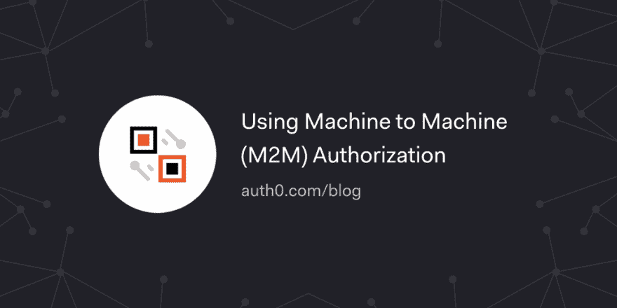

# 使用机器对机器(M2M)授权

> 原文：<https://dev.to/auth0/using-machine-to-machine-m2m-authorization-28gl>

很多时候，自治系统的不同部分之间需要一个安全的、授权的通信通道。想象两个来自不同公司的后端服务通过互联网进行通信。对于这些情况，OAuth 2.0 提供了客户端凭证授权流。

在本帖中，我们将了解 OAuth 2.0 中的客户端凭证授权如何与 Auth0 一起用于[机器对机器通信](https://auth0.com/docs/applications/machine-to-machine)。

[读下去📠🗣💻](https://auth0.com/blog/using-m2m-authorization?utm_source=twitter&utm_medium=sc&utm_campaign=m2m_auth)

[T2】](https://res.cloudinary.com/practicaldev/image/fetch/s--3Oe20kVr--/c_limit%2Cf_auto%2Cfl_progressive%2Cq_auto%2Cw_880/https://thepracticaldev.s3.amazonaws.com/i/xjkk9suzp3bymfx6j4cq.png)