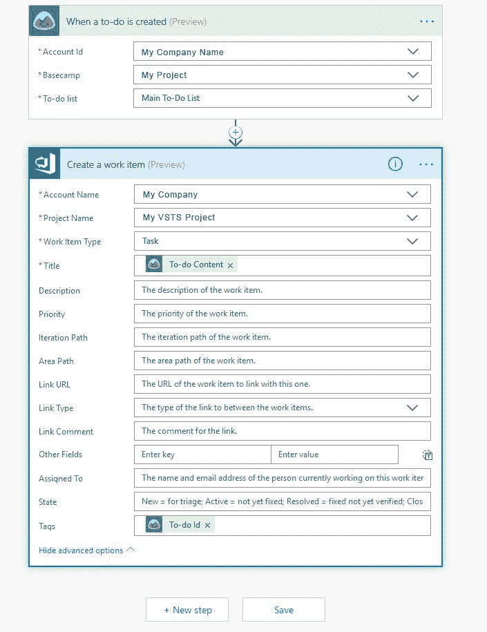
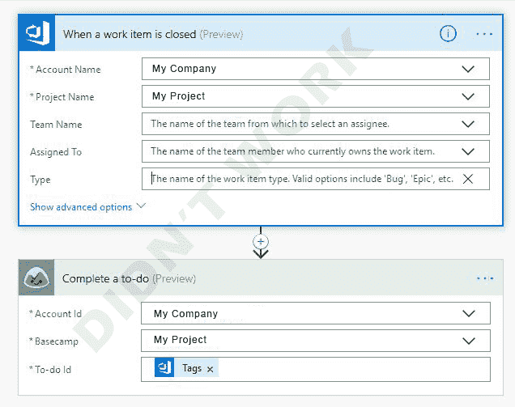
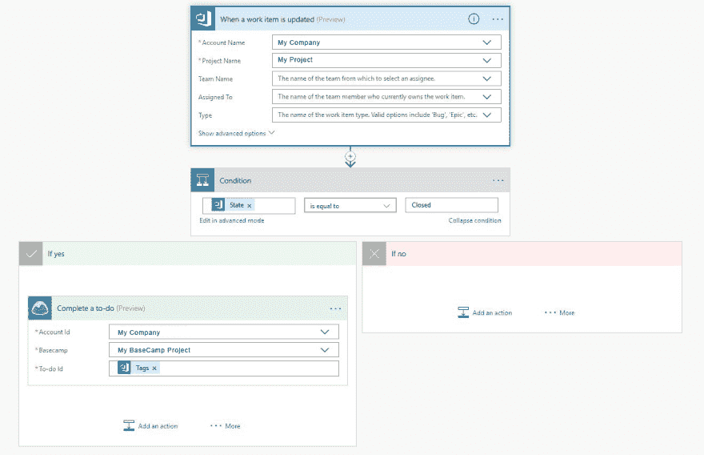

# 使用 Microsoft Flow 同步大本营和 VSTS(待办任务)

> 原文：<https://dev.to/catriname/using-microsoft-flow-to-sync-basecamp--vsts-to-do-to-tasks-5g3d>

多年来，我们一直努力让各个部门适应并坚持项目管理系统。在过去的一年中，BaseCamp 终于取得了一些成功，因为它被证明是足够用户友好的，越来越多的部门开始使用它。我们突然需要适应我们的用户。我们需要让 Visual Studio Team Services 与 BaseCamp 一起工作。

# 让大本营去做一个 VSTS 任务

事实证明，为 VSTS 的 BaseCamp 创建一个解决方案非常容易。我在 BaseCamp 中设置了一个项目，然后是一个“主要任务列表”。唯一的挑战是我需要传递 BaseCamp To-Do Id，这样当我关闭我的 VSTS 任务(工作项)时，它可以链接回 BaseCamp。为此，我选择将动态信息放在我的 VSTS 流的“标签”字段中。设置如下:

[T2】](http://www.catrina.me/wp-content/uploads/2018/06/ToVSTS.png)

## 为什么任务

如果您注意到，Visual Studio 团队服务流*要求*您选择一个“工作项”。我选择任务是因为它看起来很中性。我仍然能够将其更改为另一种类型(例如:bug)，并且同步仍然会按计划进行。这是因为流出仅通过“工作项目”、“状态”和“标签”(BaseCamp Id)链接，而不是工作项目的类型。

## 它去哪里了？

VSTS 将传入的待办事项作为任务放到工作项目中。从这里，我能够创建一个用户故事，将它添加到一个迭代中，像往常一样在我的看板板上移动它。我保留了所有相同的 VSTS 工作流程。

# 关闭 VSTS 任务完成大本营待办

当工作项(任何工作项:任务、bug 等)链接回 BaseCamp 并关闭 todo 时，Flow 确实有一个 Visual Studio 操作。这是我先走的路线。

## 电流问题

不幸的是*它不工作*。我是这样设置的:

[T2】](http://www.catrina.me/wp-content/uploads/2018/06/flow_doesnt_work.png)

**问题**甚至不是关于大本营或流程的想法，**而是 VSTS 的“工作项目关闭”流程就是不能触发**！我会做一个流程测试，关闭一个 VSTS 工作项，测试就会超时，永远不会收到触发！

## 四处工作

触发的*是“工作项更新”的流程。因此，我用“工作项目已更新”替换了上面的内容，并添加了一个条件，检查“已关闭”的状态，然后执行我的 BaseCamp 待办事项。以下是周围的工作:*

[T2】](http://www.catrina.me/wp-content/uploads/2018/06/vsts_to_basecamp.png)

## 柔韧性

再次注意，VSTS 到大本营的流程并不要求物品是“任务”。任何关闭的工作项都可以。这为你在 VSTS 继续以你喜欢的方式工作/组织留下了一些自由。