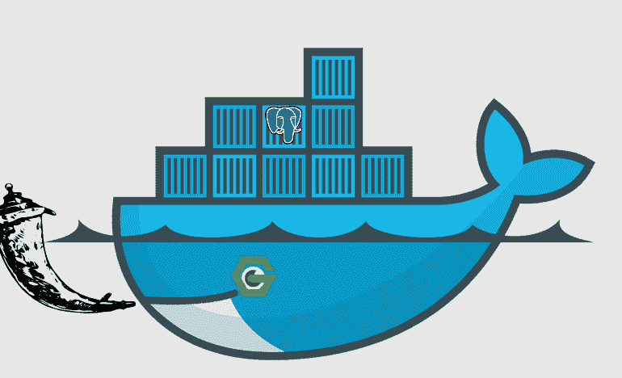
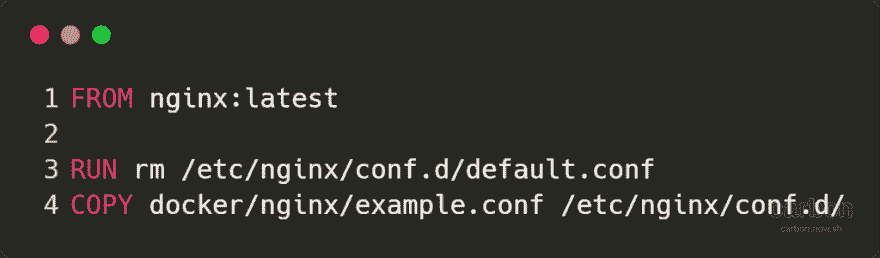
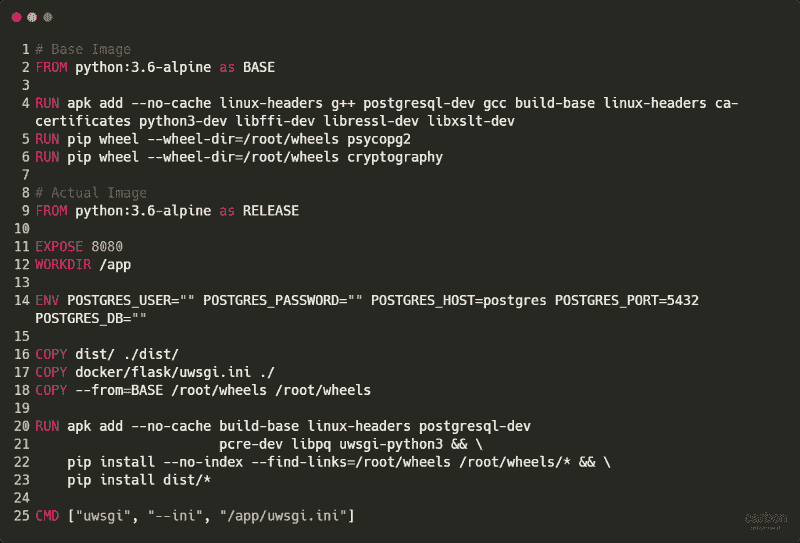
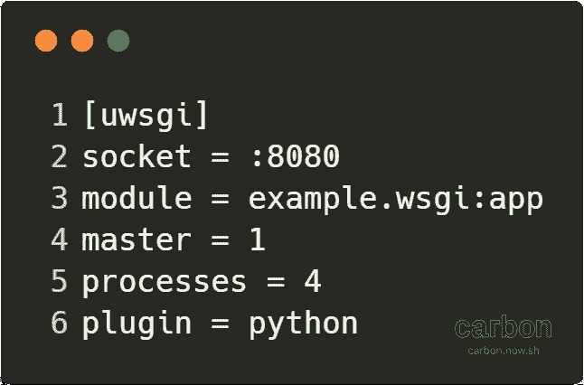
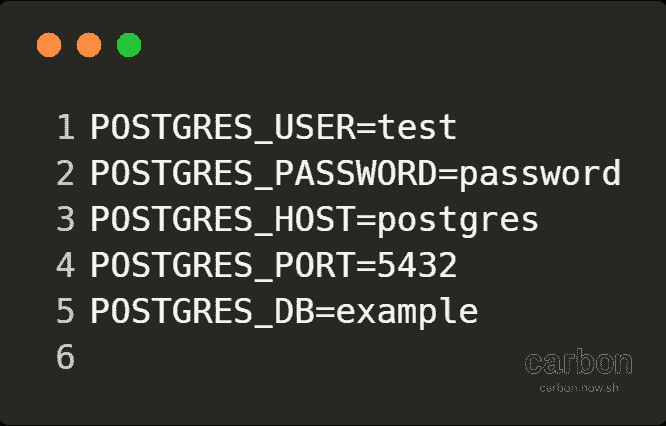
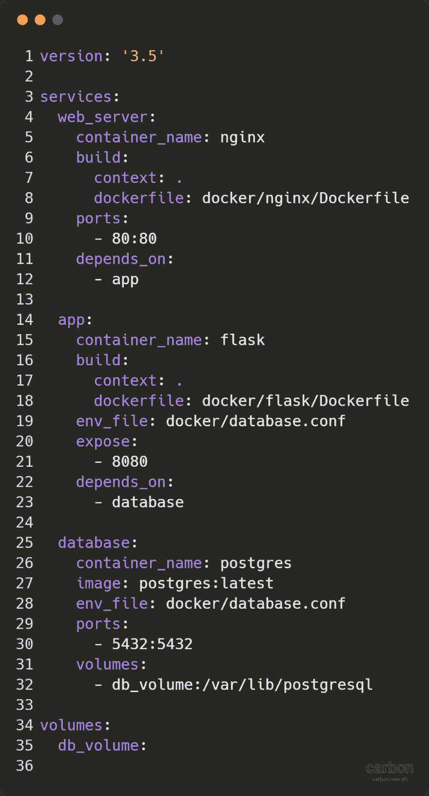

# 使用多个 Docker 容器设置 Nginx、Flask 和 Postgres

> 原文：<https://dev.to/ghost/using-multiple-docker-containers-to-setup-nginx-flask-and-postgres-2kch>

[](https://res.cloudinary.com/practicaldev/image/fetch/s--SB34bIRM--/c_limit%2Cf_auto%2Cfl_progressive%2Cq_auto%2Cw_880/https://cdn-images-1.medium.com/max/770/1%2ApIK7TbSe8lHn9PiWMOY6Lg.png) 

<figcaption>带 Nginx、烧瓶和 Postgres 的 Docker</figcaption>

#### 术语

*   Docker 映像:是一个用于在 Docker 容器中执行代码的文件，由一组指令构建而成。
*   Docker 容器:是正在执行或运行的 Docker 映像。

码头工人🐳是一项相对较新且令人兴奋的技术，Docker 是一种集装箱装箱工具。使用 Docker 的主要好处是您可以使用相同的环境进行开发、测试和生产。由于 Docker 环境是一致的，这意味着如果应用程序在测试环境中工作，它也将在生产环境中工作。

Docker 的另一大优势是，我不需要把所有的依赖项直接下载到自己的机器上。要构建一个完整的应用程序并运行它，我只需要一个 Docker 文件，所以如果我经常使用不同的机器，我可以通过使用 Docker 轻松地建立自己的开发环境。所有的 Docker 都执行一组指令，因为指令是相同的，Docker 创建的环境(Docker 容器)也是相同的。

在本教程中，我将向你展示如何建立一个 Python🐍使用多个 Docker 容器的应用程序。理论上，你可以有一个大的 Docker 容器，里面有 Nginx、Flask 和 Postgres，但是我更喜欢把应用程序分开。例如它的核心组件，web 服务器(Nginx)，应用程序(Flask)和数据库(Postgres)。这样做的主要优点是，可以更容易地替换应用程序所需的组件，并且如果出现错误，也更容易看到是哪个组件导致了错误。

**注**:本教程中的一切都已经在 Ubuntu Linux 上测试过了。

#### 先决条件

*   [安装对接器](https://docs.docker.com/install/)
*   (可选)安装坞站-复合

#### Nginx

第一个名为 Nginx 的 Docker 容器将是我们应用程序的主要网关，它将被用作代理服务器。它将接收 HTTP 请求，并将它们转发到我们的 Python 应用程序。

#### Dockerfile

[](https://res.cloudinary.com/practicaldev/image/fetch/s--_QJahJMl--/c_limit%2Cf_auto%2Cfl_progressive%2Cq_auto%2Cw_880/https://cdn-images-1.medium.com/max/1024/1%2A-MtBsrUXuDXaxR4AZYK-PQ.png) 

<figcaption>Dockerfile</figcaption>

这是一个非常简单的 docker 文件，使用最新的 Nginx docker 图像。然后，它删除默认配置并添加我们的配置。

#### example.conf

[T1](https://res.cloudinary.com/practicaldev/image/fetch/s--ybgjDnWI--/c_limit%2Cf_auto%2Cfl_progressive%2Cq_auto%2Cw_880/https://cdn-images-1.medium.com/max/870/1%2A-Sus706dxr5YdAQY7jh9Yw.png)T3】example . conf

这是一个简单的 Nginx 配置文件，用于监听端口 80 (HTTP)上的流量。然后，它将数据传递给 uWSGI(因此是 location /)。然后，我们将 HTTP 请求传递给端口 8080 上另一个名为 flask 的 Docker 容器。此配置不能用于 https。**警告**仅使用 https 发送安全数据。我们之所以将它命名为 flask 而不是 localhost，是因为这是 Docker 网络默认的工作方式(桥接网络),以允许容器到容器的通信。当连接 Flask 容器到 Postgres 容器时，我们做了一些事情。

#### 烧瓶

注意:链接到 source_code/src/example 中的 [Python app 源代码](https://github.com/hmajid2301/medium/tree/master/7.%20Multi%20Docker%20Container%20with%20Nginx,%20Flask%20and%C2%A0MySQ)这是在 dist 文件夹中变成 tar 的代码。

第二个 Docker 容器将包含运行在 uWSGI 服务器上的 Python 应用程序。uWSGI 服务器是一个基于 WSGI 规范的 web 应用服务器，允许 Python 与 web 服务器通信。在这种情况下，它本质上充当 Nginx 和 Flask 之间的中间件，在它们之间翻译请求。所以本质上 uWSGI 从 Nginx 接收一个 HTTP 请求，并翻译成 Flask 可以理解的东西。这个容器存储了这个简单 API 所需的所有核心 Python 代码。

#### Dockerfile

[](https://res.cloudinary.com/practicaldev/image/fetch/s--E3U7IGVI--/c_limit%2Cf_auto%2Cfl_progressive%2Cq_auto%2Cw_880/https://cdn-images-1.medium.com/max/800/1%2A8fouUS_-fHGdV3gcCJNeQw.png) 

<figcaption>Dockerfile</figcaption>

这个 Docker 文件使用了一个相对较新的 Docker 特性，称为多阶段构建。这里我们使用一个基础映像(Python3.6)来生成一些 Python wheel 文件。这些 wheel 文件需要特定的 Linux 依赖项，而我们在主 Docker 容器中实际上并不需要这些依赖项。然后，我们定义我们的实际图像，并复制我们的应用程序所需的车轮文件。这样做是为了帮助减少我们的 Docker 图像文件的大小，我们希望尽可能地制作图像(尽可能有意义)。在 dockerfile 文件的末尾，基本映像被销毁。

所以我们实际的 Docker 图像更有趣一些。它执行以下操作:

*   它公开了端口 8080，这实际上不做任何事情，只是为了文档的目的
*   然后它会创建一个默认目录/app/
*   我们定义了该容器所需的一些环境变量(都用于连接 Postgres)。**请注意**在生产环境中，您不希望将密码和用户名作为环境变量暴露在 docker 容器中，相反，您应该使用秘密存储，如 [HashiCorp Vault](https://www.vaultproject.io/) 。这些变量将在我们运行容器时定义
*   它将我们的 Python 包作为 tar 文件复制到 dist 文件夹中。如果您有一个 setup.py 文件并在与 setup.py 相同的文件夹中运行 python setup.py sdist，则可以生成此文件
*   它复制用于配置 uwsgi 服务器的 uwsgi.ini
*   它从基础映像复制所有的轮子文件夹，因此- from=BASE
*   然后我们在 dist 文件夹中安装轮子和我们的所有东西，我们的 Python 代码把它作为 tar
*   最后，当 Docker 映像运行时，它将执行 uwsgi - ini /app/uwsgi.ini

理论上，您可以简单地复制并安装 requirements.txt，并将所有源代码复制到/app 文件夹中。然而，我更喜欢生成并安装实际的 Python 包，我认为它更干净，你只需要复制一个单独的 tar 文件。但是，这确实需要您在尝试构建 Docker 映像之前运行命令来生成 dist 文件夹。

#### uwsgi.ini

[](https://res.cloudinary.com/practicaldev/image/fetch/s--CIUDWPOk--/c_limit%2Cf_auto%2Cfl_progressive%2Cq_auto%2Cw_880/https://cdn-images-1.medium.com/max/646/1%2AY0yzWPxoNB5uaDpD3_vP0w.png) 

<figcaption>uwsgi.ini</figcaption>

这是 uWSGI 服务器使用的配置文件。这是我们定义 uWSGI 在哪个端口上监听流量的地方，在本例中是 8080。**注意**因为我们已经定义了 socket，所以你不能直接访问 uWSGI 服务器，你需要在它前面有一个 web 服务器，如果你想只使用 uWSGI，你可以把这个选项改为 http。另一个导入选项是模块，我们将它指向我们安装的模块示例，然后是 wsgi 模块和 app 变量。因此 module=example.wsgi:app。在这个例子中，wsgi.py 模块调用 create_app()函数来创建 Flask 应用程序。

#### Postgres

Postgres 映像更简单，是来自 Docker hub 的最新 Postgres 映像，然后我们向它传递一些环境变量来配置它。

#### database.conf

[](https://res.cloudinary.com/practicaldev/image/fetch/s--ro9ROU3Y--/c_limit%2Cf_auto%2Cfl_progressive%2Cq_auto%2Cw_880/https://cdn-images-1.medium.com/max/666/1%2AHuLIgSd25nFTbcSIkotj_Q.png)T3】database . conf

传递的环境变量如下所示。**注意**你不需要把端口或者主机传递给 Postgres Docker 容器。这些由烧瓶容器使用。

#### 码头工-化合物. yml

我们已经定义了 Docker 文件和这些 Docker 文件使用的配置文件，但是我们如何实际使用 Docker 呢？我们使用 docker 的一种方法是使用 docker-compose 来定义它。在这里，我们定义了一组服务，Docker 将自动运行和构建这些服务，并为我们处理网络。我个人使用 docker-compose 进行开发，因为它节省了为每个 docker 映像/容器运行 docker 构建和 docker 运行命令的大量时间。

[](https://res.cloudinary.com/practicaldev/image/fetch/s--DTDz2tq6--/c_limit%2Cf_auto%2Cfl_progressive%2Cq_auto%2Cw_880/https://cdn-images-1.medium.com/max/974/1%2AQqpZqciQLUuc3M9MIP-UFg.png) 

<figcaption>码头工-化合物. yml</figcaption>

所以在文件的顶部我们定义了 docker-compose 的版本号，建议用户现在使用版本 3。然后我们定义我们的服务，一个服务等于一个 Docker 容器。每个服务都有一个名字，比如 web_server、app、database。

#### web_server

这项服务运行我们的 Nginx 服务器。出于显而易见的原因，我们将该容器称为 nginx。我们向它传递要构建的 dockerfile 文件的位置。生成上下文:。简单地说就是相对于当前的工作目录，所以当我们复制文件时，我们会相对于 docker-compose.yml 文件复制它们。我们要做的最后一件事是发布我们的端口，这样主机上端口 80 上的所有流量都会映射到端口 80 上的 Docker 容器。我们可以使用我们的客户机上的任何端口，比如我们使用 8001，然后我们可以通过访问 localhost:8001 来访问 web 服务器。最后一部分指定此容器依赖于应用程序容器，因此应用程序将在此容器之前运行。

#### app

这是一个相对简单的服务，我们再次将它指向我们的 flask dockerfile，并将构建上下文设置为当前文件夹。然后，我们将一些环境变量作为一个文件传递，这些变量取自这个文件(与上面定义的 database.conf 相同)。这些变量用于允许 Python 连接到数据库。最后，我们公开端口 8080，这也是出于文档目的，以便其他用户知道该容器需要端口 8080 上的流量。因为我们在设置应用程序时需要连接到数据库，所以我们首先依赖于正在运行的数据库容器。

#### 数据库

这项服务没有自己的 docker 文件，而是使用官方的 Postgres 映像。然后，它将一些环境变量作为一个文件传递，这个文件传递给 Flask 容器。我们实际上并不需要主机或端口变量，但是在这种情况下维护单个文件更容易。然后，我们将主机端口 5432 映射到访客 Docker 容器端口 5432。这是 Postgres 监听的端口。与 Nginx 一样，您可以将主机端口设置为您想要的任何值，但是要确保在 database.conf 中进行更改，并更新 POSTGRES_PORT 变量。最后，我们挂载一个卷，这样数据是持久的，如果没有这个，当数据库 Docker 容器被终止时，您将丢失所有数据。通过挂载 db_volume，即使您终止了容器，比如说更新 Postgres 映像，您的数据也将持久化。

#### Docker 构建构建/运行

要实际运行 docker-compose 文件(与 docker-compose.yml 在同一个文件夹中)，您可以像下面这样做。其中-d 表示它在后台运行。这将构建所有三个服务，一旦构建了我们的 Docker 映像，它将把这些 Docker 映像作为 Docker 容器运行。

```
docker-compose up --build -d 
```

#### Docker 构建/运行

需要注意的一件重要事情是，docker-compose 不应该真正用于生产，原因有几个，比如更新 docker 容器时的停机时间。如果您只部署到一台主机 docker-compose 应该没问题，但在现实中，大多数应用程序需要高可用性和零停机更新，在这种情况下，您应该使用一个容器编排工具，如 Kuberenetes。因此，另一种方法是自己构建并运行每个 Docker 容器，这个 docker-compose.yml 文件的等效命令是。

```
# Build our images first
docker build -f docker/nginx/Dockerfile -t nginx .
docker build -f docker/flask/Dockerfile -t flask .

# Run our containers
docker run -d --name nginx -p 80:80 nginx
docker run -d --name flask -p 8080 --env-file docker/database.conf flask
docker volume create --name db\_volume
docker run -d --name postgres -p 5432:5432 \
 --env-file docker/database.conf \
 -v db\_volume:/var/lib/postgresql postgres:latest 
```

**注意**:在你建立了自己的图像后，你可以把它们放到公共或私人的 Docker 注册表中，这样你或其他人就可以访问它们了。这是在 CI 流程中访问映像的常见方式。事实上，像 postgres:latest 这样的基础图片来自[官方 Docker 注册表](https://hub.docker.com/_/postgres/)。

#### 附录

*   [示例源代码](https://github.com/hmajid2301/medium/tree/master/7.%20Multi%20Docker%20Container%20with%20Nginx,%20Flask%20and%C2%A0MySQL)
*   [用碳制作的代码图像](https://carbon.now.sh)