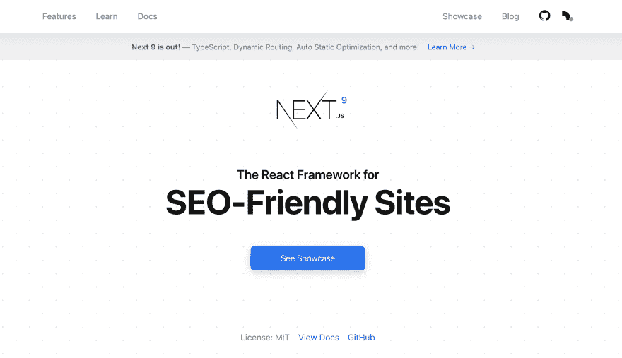

# 使用 Next.js 构建 SEO 友好的 React SPAs 现场演示]

> 原文：<https://dev.to/couellet/using-next-js-to-build-seo-friendly-react-spas-live-demo-1eb4>

[T2】](https://res.cloudinary.com/practicaldev/image/fetch/s--x9aTaTrQ--/c_limit%2Cf_auto%2Cfl_progressive%2Cq_auto%2Cw_880/https://snipcart.com/media/204694/next-seo-og.jpg)

我们经常提倡使用单页应用程序。

我们会继续这样做，因为他们很棒。我的意思是，它们速度快，提供令人难以置信的 UX，开发起来很有趣。

然而，当涉及到处理 spa 时，我们也总是非常清楚要小心的事情——关键的事情，比如搜索引擎优化(SEO)。

这并不是说你不能用 spa 获得很好的 SEO 结果，因为你可以。你只需要以正确的方式处理它，无论你是与 [Angular](https://snipcart.com/blog/angular-seo-universal-server-side-rendering) 、 [Vue](https://snipcart.com/blog/vue-js-seo-prerender-example#comment-4605723048) 一起工作还是做出反应。

在这篇文章中，我将介绍 Next.js，以及它如何帮助你创建 SEO 友好的 React SPAs。

所有这些，只需几个简单的步骤:

*   创建 Next.js 项目
*   生成组件
*   为 SEO 优化 Next.js 应用程序
    *   通过预渲染使其可抓取
    *   创建网站地图
    *   添加元数据
*   与 Netlify 一起主持水疗

在本教程结束时，您的项目应该在我们全能的上帝(又名 Google)的保佑下是安全的。

我们开始吧。

## next . js 是什么？

**简而言之，Next.js 是一个用于静态和服务器渲染的 React 应用程序的轻量级框架。**

[T2】](https://res.cloudinary.com/practicaldev/image/fetch/s--kBhQPHPa--/c_limit%2Cf_auto%2Cfl_progressive%2Cq_auto%2Cw_880/https://snipcart.com/media/204691/next-js-seo-tutorial.png)

→点击阅读全文