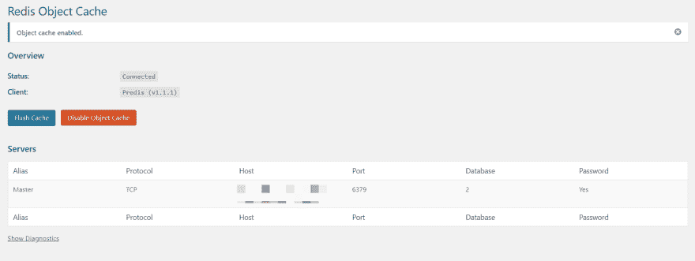

# 使用 Redis 对象缓存加速 WordPress 的安装

> 原文：<https://dev.to/scalegrid/using-redis-object-cache-to-speed-up-your-wordpress-installation-3hdl>

[T2】](https://res.cloudinary.com/practicaldev/image/fetch/s--YDblOXdA--/c_limit%2Cf_auto%2Cfl_progressive%2Cq_auto%2Cw_880/https://thepracticaldev.s3.amazonaws.com/i/7bhzge022zed5nu4hqsq.png)

[Redis](https://redis.io/ "Redis") 是一个开源的(BSD 许可的)、内存中的数据结构存储，用作数据库、缓存和消息代理。它可以与其他数据库如 [MySQL](https://www.mysql.com/ "MySQL") 结合，提供一种缓存查询的机制。

在本文中，我们将展示如何缓存渲染 WordPress 页面所需的 MySQL 查询。这将为我们提供显著的性能增益，尽管有一些警告。

## 介绍更好的 Wordpress 缓存

WordPress 使用 MySQL 数据库来缓存内部应用程序对象(面包屑、菜单项等)。)产生起来可能很昂贵。由于数据库还处理页面请求的查询，这可能是最常见的瓶颈，并经常导致加载时间增加。

Redis 提供了一种缓存机制，作为 MySQL 数据库的替代。如果用户访问 WordPress 页面，生成页面所需的 MySQL 查询通过 Redis 提供，Redis 缓存结果。与静态页面相比，这导致了极快的加载速度。

另一个流行的缓存选择是 [Memcached](https://memcached.org/) 。然而，Redis 几乎做了 Memcached 所做的一切，所以为了本教程，我们将使用 Redis。

## 【Redis 缓存是如何工作的？

当用户第一次请求 WordPress 页面时，服务器会执行 MySQL 查询。Redis 缓存这个查询，所以当另一个用户请求同一个 WordPress 页面时，结果从 Redis 提供，而不需要再次查询数据库。

如果查询没有缓存在 Redis 中，结果由 MySQL 提供，然后添加到 Redis 缓存中。

如果数据库中的某个值被更新，相应的 Redis 值就会失效，以防止向用户提供坏的缓存数据。

[T2】](https://scalegrid.io/blog/wp-content/uploads/2018/05/Capture2.png)

## 教程要求

下面是本文中使用的技术列表:

*   2 个 WordPress 安装(有和没有插件，用于基准测试)
*   重定向服务器
*   Redis WP 对象缓存插件

### WordPress 安装

你可以在这里下载 WordPress [的最新版本，并在像](https://wordpress.org/latest.zip) [Heroku](https://www.heroku.com/home "Heroku - Wordpress Installations") 或 [AWS](https://aws.amazon.com/ "AWS - WordPress Installations") 这样的主机上设置两个不同的安装。

### 重定向服务器

ScaleGrid 通过增强的安全特性为 Redis 独立集群和主/从集群提供世界一流的支持。我们将使用 ScaleGrid 上托管的独立 Redis 集群，采用 Allkeys-LRU 缓存策略，你可以注册 30 天免费试用我们的 [Redis hosting](https://console.scalegrid.io/users/register) 来帮助完成本教程。

[T2】](https://scalegrid.io/blog/wp-content/uploads/2018/05/Capture3.png)

### 重写 WP 对象缓存插件

这个插件被用作你的 WordPress 安装的插件，可以被配置成使用 Redis 主机。你可以在这里找到插件[。](https://wordpress.org/plugins/redis-cache/)

## 设置说明:WordPress 的 Redis 对象缓存

下面是在 WordPress 系统上安装 Redis 对象缓存插件的步骤。

### 步骤 1:安装 Redis 缓存插件

本教程假设你已经安装了两个新的 WordPress。在其中一个上，您需要安装 Redis 对象缓存插件。安装插件后，您可以从插件菜单中激活它。

[T2】](https://scalegrid.io/blog/wp-content/uploads/2018/05/image3.png)

### 第二步:在你的设置中找到 Redis

一旦插件被激活，Redis 选项将出现在设置菜单下。

[T2】](https://scalegrid.io/blog/wp-content/uploads/2018/05/image4.png)

### 第三步:添加 WordPress 配置

设置插件后，我们需要添加配置选项到 WordPress 配置文件中。至少，您需要设置以下选项:

```
define('WP_REDIS_HOST', '');
define('WP_REDIS_PASSWORD', '');

```

[T2】](https://scalegrid.io/blog/wp-content/uploads/2018/05/image5.png)

您可以在 ScaleGrid Redis 集群详细信息页面上找到上述选项。

保存配置并启用对象缓存。如果身份验证正确，您应该会看到以下屏幕:

[T2】](https://scalegrid.io/blog/wp-content/uploads/2018/05/image2.png)

至此，Redis 已经被配置为 WordPress 安装的缓存。

## 监控和调试 WordPress 查询

所有 Redis 集群都安装了 Redis 命令行界面(redis-cli)工具，您可以用它来监控来自 WordPress 的查询请求。这里有一个屏幕截图，显示了这种情况:

[T2】](https://scalegrid.io/blog/wp-content/uploads/2018/05/image1.png)

如果你在控制台上没有看到任何输出，去 WordPress 网站刷新。

## WordPress &重定向指标

这里要跟踪的主要指标是页面加载时间。这是我们用于全新安装的默认配置:

*   4.9.5
*   重定向:v.4.0.2
*   主题:2017 年

基于上述参数的全新安装，我们可以看到页面加载时间减少了近 50%:

*   **无**Redis 对象缓存= **~900ms**
*   **与**Redis 对象缓存= **~400ms**

## Redis 对象缓存缺点

在 WordPress 上使用 Redis 对象缓存方法有一些注意事项。如果你安装了很多插件和主题，缓存机制就不能很好地工作。这是因为他们的所有数据都需要用 Redis 缓存。

在我们之前的文章中，您还可以了解如何使用 Node.js、Redis 和 Socket.io 缓存 Tweets。

和往常一样，如果你做了一些很棒的东西，一定要发微博给我们。如果您需要 MongoDB 或 Redis 托管和管理方面的帮助，请通过 [support@scalegrid.io](mailto:support@scalegrid.io "Contact ScaleGrid Support") 联系我们。